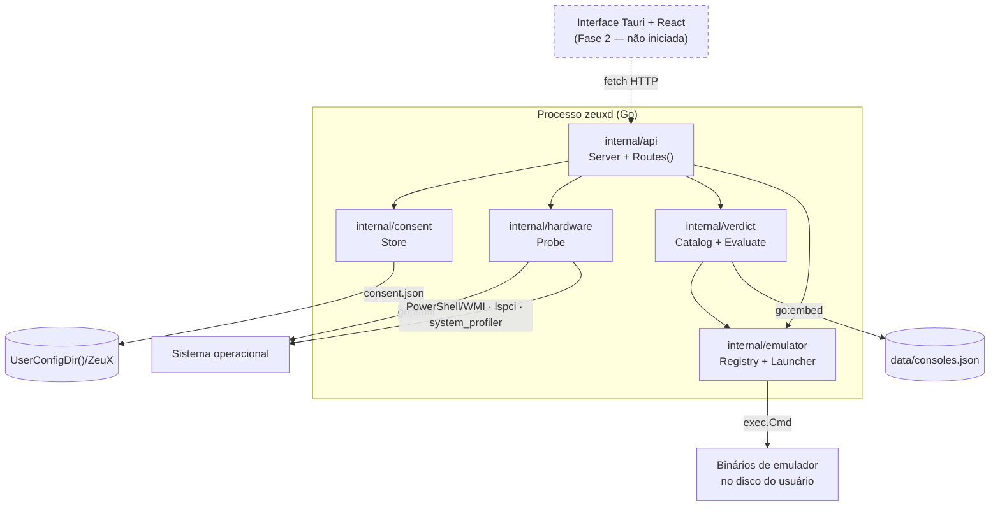

# Arquitetura do ZeuX

Documento de referência da arquitetura atual. Descreve o que **existe no código
hoje**, não o que está planejado. O que ainda não foi construído aparece
marcado como pendente.

Última verificação contra o código: 2026-08-01.

---

## 1. Visão geral

O ZeuX é um front-end de emulação multiplataforma para desktop. O diferencial
não é rodar jogos — emuladores já fazem isso — mas **eliminar a complexidade de
configuração**: o app lê o hardware da máquina, diz honestamente o que aquele
computador alcança em cada console, e monta a linha de comando do emulador já
configurada para o patamar que a máquina atende.

Hoje o projeto é composto de **um único processo**: o daemon `zeuxd`, escrito em
Go, que expõe uma API HTTP em `127.0.0.1:7777`. A interface gráfica
(Tauri + React) é a Fase 2 e **ainda não foi iniciada**.

### Componentes

| Pacote | Responsabilidade |
|---|---|
| `cmd/zeuxd` | Entrypoint. Flags, logger, montagem das dependências, shutdown limpo. |
| `internal/api` | Roteamento HTTP, decodificação de corpo, formato de erro estável. |
| `internal/consent` | Registro persistido do consentimento, versionado por política. |
| `internal/hardware` | Detecção de CPU, RAM (gopsutil) e GPU (por SO, com build tags). |
| `internal/verdict` | Catálogo de consoles embutido + motor que produz o parecer. |
| `internal/emulator` | Adapters de emulador, descoberta de binários, launcher e sessões. |

### Diagrama de componentes



Detalhes que o diagrama esconde e importam:

- **`verdict` depende de `emulator`, nunca o contrário.** O catálogo carrega
  `emulator.Options` diretamente no JSON de cada patamar, então o preset já sai
  do catálogo em forma aplicável. A dependência é unidirecional de propósito:
  os adapters não sabem que existe catálogo.
- **`api` guarda o último scan em memória** (`Server.lastScan`, protegido por
  `sync.RWMutex`). Nada de hardware é gravado em disco. Revogar o consentimento
  zera esse campo.
- **Só `consent` escreve em disco.** O catálogo é embutido no binário via
  `go:embed`; sessões vivem em memória.

---

## 2. Fluxo de dados do onboarding

```mermaid
sequenceDiagram
    participant U as Usuário
    participant UI as Interface
    participant API as zeuxd (api)
    participant C as consent.Store
    participant H as hardware.Probe
    participant V as verdict
    participant E as emulator

    UI->>API: GET /api/v1/consent
    API->>C: Load()
    C-->>API: Record{granted:false}
    API-->>UI: granted:false + policy_text + policy_version
    UI->>U: exibe o texto exato devolvido pelo servidor

    U->>UI: autoriza
    UI->>API: POST /api/v1/consent {"granted":true}
    API->>C: Grant() → grava consent.json (atômico)
    API-->>UI: granted:true + granted_at

    UI->>API: POST /api/v1/hardware/scan
    API->>C: Load() → IsValid()?
    Note over API: sem consentimento válido → 403 consent_required
    API->>H: Detect(ctx, timeout 30s)
    H-->>API: HardwareInfo + Warnings
    API-->>UI: HardwareInfo (também guardado em memória)

    UI->>API: GET /api/v1/consoles/verdicts
    API->>V: Evaluate(catalog, lastScan)
    V-->>API: Report{summary, verdicts[], precision, notes}
    API-->>UI: badge + frases + preset + Options por console

    UI->>API: GET /api/v1/emulators
    API->>E: Registry.Survey(ctx) → Locate() em cada adapter
    E-->>API: Status[] (installed true/false)

    UI->>API: POST /api/v1/games/preview {rom_path, console_id}
    Note over API: options ausente → puxa do veredito do console
    API->>E: Resolve() + BuildCommand()
    E-->>API: Command{argv, unapplied}
    API-->>UI: linha de comando exata + o que não coube nela

    UI->>API: POST /api/v1/games/launch
    API->>E: Launcher.Launch()
    E->>E: valida ROM, resolve adapter, monta argv, cmd.Start()
    E-->>API: Session (não bloqueia; goroutine supervisiona)
    API-->>UI: Session{id, started_at, unapplied}
```

### Autoconfiguração: onde ela acontece de fato

O ponto exato é `Server.toInput` em `internal/api/server.go`. A regra:

1. Se a requisição mandou `options`, ela é usada como veio. O usuário mandou,
   o usuário manda.
2. Se **não** mandou, o servidor roda `verdict.Evaluate` sobre o último scan,
   acha o veredito do `console_id` pedido e copia dali `Options`, `AdapterID`
   (se `emulator_id` veio vazio) e `Core` (se `core` veio vazio).
3. Sem scan na sessão → erro `no_scan_yet`. Console fora do catálogo →
   `unknown_console`.

Ou seja: **quem não escolhe nada recebe o preset adequado ao hardware**, em vez
de uma configuração genérica. É essa a promessa central do produto, e ela vive
em ~30 linhas de servidor.

### Como o veredito é calculado

`verdict.evaluateConsole` percorre os `tiers` do console **de cima para baixo**
(o catálogo os ordena do mais exigente para o menos exigente) e para no primeiro
cujos requisitos estejam todos atendidos.

- Atendeu um patamar que não é o primeiro → o motor reavalia o patamar
  imediatamente acima e devolve os requisitos não atendidos em
  `bottlenecks`, junto de `next_level`. É isso que produz frases como
  "Este patamar pede uma placa de vídeo dedicada; esta máquina usa gráficos
  integrados (AMD Radeon Graphics)."
- Não atendeu nenhum → `level: "improvavel"`, e `bottlenecks` vem preenchido
  com o que falta para o patamar **menos** exigente.
- Requisito que não pôde ser verificado (clock não reportado, VRAM zerada, GPU
  não identificada) **não conta como atendido nem como não atendido**: liga
  `uncertain`, e o parecer sai com `precision: "parcial"`.

Ordenação final: melhores níveis primeiro; empate desempata pelo console mais
recente (`Year` decrescente).

---

## 3. Decisões de design e o porquê

Cada decisão relevante tem um ADR próprio em [`docs/decisoes/`](decisoes/).
O resumo:

### 3.1 IPC via HTTP local em vez de sidecar stdin/stdout

O Tauri oferece um modelo de "sidecar" onde o binário Go conversaria com o
front-end por stdin/stdout. Foi descartado: com HTTP em `127.0.0.1:7777`
qualquer rota pode ser exercitada com `curl` ou `Invoke-RestMethod`, sem UI
nenhuma. Isso permitiu construir e testar toda a Fase 1 antes de existir uma
linha de React — que é exatamente o que aconteceu.

Custo aceito: uma porta local aberta. Mitigado pelo bind travado em `127.0.0.1`
por padrão (`cmd/zeuxd/main.go`). Ver [ADR 0001](decisoes/0001-ipc-http-local.md).

### 3.2 Consentimento verificado no servidor, não na interface

`handleScan` recarrega o registro do disco e chama `Record.IsValid()` antes de
qualquer detecção. Se a checagem vivesse na UI, bastaria chamar a rota direto
para contorná-la. O comentário no pacote resume: "uma permissão que só a tela
protege não é uma permissão."

O consentimento é **versionado** (`PolicyVersion = "1"`). Se o escopo do uso dos
dados mudar, a versão sobe e o "sim" anterior deixa de valer — `IsValid()` exige
que a versão gravada bata com a atual.

O texto da política (`PolicyText`) mora ao lado da versão e é devolvido pela
API, para que a interface nunca exiba um texto diferente do que o servidor
registra.

### 3.3 `BuildCommand` separado de `Launch`

`BuildCommand` é uma **função pura**: não toca o sistema de arquivos, não
executa nada, recebe `Installation` + `Request` e devolve `Command`. `Launch` é
o que de fato roda o processo.

Sem essa divisão, a única forma de testar a tradução de opções em argumentos
seria abrindo jogos de verdade — inviável numa máquina de dev sem emuladores
instalados. Com ela, `adapter_test.go` verifica 8 adapters sem nenhum binário
presente, e a rota `POST /api/v1/games/preview` existe de graça: ela é
`BuildCommand` sem o `Launch`. Ver [ADR 0005](decisoes/0005-buildcommand-separado-de-launch.md).

### 3.4 Campo `Unapplied` em vez de inventar flags

Os emuladores divergem muito no que aceitam por linha de comando. O Dolphin
sobrescreve qualquer chave de INI com `-C`; o Flycast standalone praticamente
não aceita nada além do caminho do jogo.

Inventar uma flag inexistente faz o emulador **recusar a abrir**. Então, quando
uma opção do preset não cabe na linha de comando, o adapter não a aplica e a
declara em `Command.Unapplied`, com uma frase pronta para o usuário
("A resolução interna precisa ser ajustada dentro do DuckStation."). O usuário
fica sabendo que aquele ajuste precisa ser feito no próprio emulador, em vez de
achar que o ZeuX aplicou e não funcionou.

O teste `TestUnsupportedOptionsAreReportedNotInvented` trava isso: nenhum
argumento pode conter `InternalResolution` ou `vulkan` nos adapters que não
suportam essas opções. Ver [ADR 0006](decisoes/0006-campo-unapplied.md).

### 3.5 Preset em duas formas: texto e `options`

Cada tier do catálogo carrega `preset` (prosa que o usuário lê) **e** `options`
(o mesmo preset em forma que o emulador obedece). Um preset que só existisse
como texto não configuraria nada — e autoconfiguração é a promessa central.

`TestEveryTierHasApplicableOptions` garante que todo tier tenha os dois, com
`fullscreen` e `exit_on_close` ligados: quem entra pelo ZeuX escolheu um jogo,
não um emulador. Ver [ADR 0007](decisoes/0007-options-estruturado-no-catalogo.md).

### 3.6 Catálogo embutido no binário

`//go:embed data/consoles.json`. Garante que o app funcione offline no primeiro
uso, sem depender de uma chamada de rede antes de dar o primeiro parecer. O
`schema_version` (hoje `2`) existe para permitir a atualização via nuvem
prevista no PRD substituir esse conteúdo em tempo de execução, sem quebrar
binários antigos.

### 3.7 Adapters standalone preferidos ao RetroArch

`Registry.ForConsole` ordena os candidatos com o RetroArch por último. Um
emulador dedicado costuma ter compatibilidade e desempenho melhores no seu
console do que o core equivalente. O RetroArch entra como alternativa, não como
primeira escolha.

### 3.8 Detecção de hardware tolerante a falhas

Falha ao ler CPU ou memória é fatal (sem isso não há veredito). Falha ao ler GPU
não é: vira um `warning` em linguagem de usuário e o parecer sai `parcial`. Um
veredito baseado só em CPU e RAM ainda é melhor que nenhum — desde que o usuário
saiba que é isso que está vendo.

A GPU é resolvida por arquivo de plataforma com build tags:

| SO | Fonte | Notas |
|---|---|---|
| Windows | PowerShell → `Get-CimInstance Win32_VideoController` + registro | Lê `HardwareInformation.qwMemorySize` do registro porque `AdapterRAM` é `uint32` e satura em 4 GiB — uma RTX 4090 apareceria com 4 GB. `Source: "wmi+registry"`. Invoca PowerShell em vez de falar COM diretamente, para manter o binário livre de CGO. |
| Linux | `nvidia-smi` + `lspci` + sysfs do amdgpu | Camadas independentes e todas opcionais. |
| macOS | `system_profiler SPDisplaysDataType -json` | Já vem no sistema. |

A classificação integrada/dedicada é heurística por palavra-chave no nome do
modelo (`classifyGPUVendor`), depois de remover marcas registradas — o Windows
reporta "AMD Radeon(TM) Graphics", e sem limpar o `(TM)` a busca por
"radeon graphics" não casaria e a integrada seria classificada como dedicada.

`PrimaryGPU()` prefere sempre a dedicada sobre a integrada, independente da VRAM
reportada: em notebook híbrido, avaliar pelo chip integrado daria um veredito
injustamente pessimista.

### 3.9 Banco de dados deliberadamente adiado

Não existe persistência além do `consent.json`. Sessões e tempo de jogo vivem em
memória e somem ao fechar o app. A prioridade definida foi layout, funcionalidade
de emuladores e facilidade de configuração **antes** de infraestrutura de dados.
Ver [ADR 0002](decisoes/0002-adiar-banco-de-dados.md).

### 3.10 Legal: nunca facilitar compartilhamento de ROMs

`Request.ROMPath` aponta para um arquivo que já está no disco do usuário. O ZeuX
nunca copia, distribui ou transfere esse arquivo. O que a camada social vai
compartilhar são save states, texture packs, perfis de controle e lobby de
netplay — nunca o jogo.

Nintendo Switch ficou **fora do catálogo de propósito**: Yuzu e Ryujinx foram
descontinuados após ação judicial. Ver [ADR 0008](decisoes/0008-excluir-switch-do-catalogo.md).

---

## 4. Ciclo de vida do processo

- `zeuxd` sobe com `ReadHeaderTimeout: 5s` e escuta em `127.0.0.1:7777`
  (`--addr` troca, `--debug` liga o log por requisição).
- `signal.NotifyContext` captura `os.Interrupt` e `SIGTERM`, e o shutdown tem
  5 s de janela. Isso importa porque a interface Tauri vai gerenciar o daemon
  como processo filho e precisa que ele morra sem deixar a porta presa.
- **O processo do emulador é desligado do contexto da requisição de propósito**
  (`command(context.Background(), ...)` em `session.go`). Amarrá-lo ao `ctx` do
  HTTP mataria o jogo segundos depois de a resposta ser enviada.
- `Launch` não bloqueia: devolve assim que o emulador sobe, e uma goroutine
  (`supervise`) espera o fim para fechar a sessão. Travar ali prenderia a
  requisição HTTP pelo tempo inteiro da partida.

---

## 5. O que ainda não existe

Registrado aqui para que ninguém leia este documento e presuma o contrário:

- Qualquer banco de dados (adiado deliberadamente, ver
  [ADR 0002](decisoes/0002-adiar-banco-de-dados.md)).
- Instalação de emuladores dentro da estrutura de jogos: a pasta gerenciada
  (`ManagedRoot()`) já recebe instalações 1-click de verdade, organizadas por
  console (ver [ADR 0010](decisoes/0010-estrutura-de-diretorios-por-console.md)).
  O que falta é a parte de jogos — cada pasta de console ainda não tem a
  subpasta `jogos/` (saves, capas, metadados), porque isso depende da Sprint D
  (banco de dados + varredura de biblioteca), que ainda não foi desenhada.
- Biblioteca de jogos, scraper de metadados, perfis sociais, netplay.
- `Installation.Version` nunca é preenchido: nenhum adapter tenta detectar
  versão hoje.
- Validação das flags dos adapters contra binários reais. Ver
  [roadmap.md](roadmap.md), item de primeira classe.
