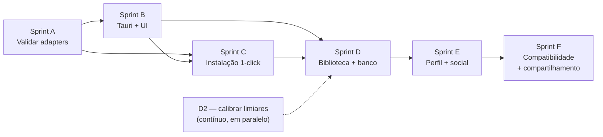

# Roadmap do ZeuX

Backlog organizado em sprints, derivado do PRD e do estado real do código.

**Tamanho relativo:** P (poucas horas) · M (alguns dias) · G (uma sprint ou mais).
Os tamanhos são relativos entre si, não estimativas de calendário.

Última verificação contra o código: 2026-08-03.

---

## Onde o projeto está

**Pronto e verificado (Fase 1):**

- Detecção de CPU/RAM (gopsutil) e GPU por SO, com fallback gracioso.
- Catálogo de 33 consoles (`schema_version 4`, com extensões de arquivo por
  console desde o L2) e motor de parecer que nomeia
  gargalos.
- Consentimento persistido e versionado, verificado no servidor.
- 14 adapters de emulador (13 auditados no D1 + `rmg`, adicionado em
  2026-08-03), descoberta de binários, launcher e rastreio de sessão.
  **Flags validadas contra binário real em todos os 13** — ver D1.
- Instalação 1-click com download verificado, extração e instalação atômica.
- **DuckStation instalado pelo ZeuX pula o assistente de primeira execução**
  (`internal/install/firstrun.go`): grava `portable.txt` + a chave
  `SetupWizardIncomplete=false` no `settings.ini`, sem simular o resto da
  configuração. Atualizar o DuckStation preserva saves e settings do usuário —
  ver D8, único emulador mapeado até agora.
- Rotas HTTP sob `/api/v1`. Compila nos 3 SOs; todos os testes passam.
- CORS liberado para as origens conhecidas do WebView do Tauri
  (`tauri://localhost`, `http://tauri.localhost`), verificado contra um build
  de produção real — ver B2/B3 em [`sprint-b-plano.md`](sprint-b-plano.md).
- **SQLite local** (`internal/store`, driver puro-Go, sem CGO — ver
  [ADR 0011](decisoes/0011-sqlite-local-para-biblioteca.md)), com sessões e
  tempo de jogo persistidos e sobrevivendo a um reinício do daemon — ver D3.

- Scaffold Tauri + React + Tailwind (`src/`, `src-tauri/`), com o `zeuxd`
  subindo e descendo sozinho como sidecar (B5), cliente de API tipado (B6),
  layout sobre o wireframe para as telas 01/03 (B7), e o onboarding real
  funcionando de ponta a ponta: consentimento → scan → parecer, com
  revogação, versão de política e recuperação de erro (B8) — verificado com
  Chromium contra um `zeuxd` de verdade, não simulação.

**Não existe ainda** (verificado por leitura de código em 2026-08-03):

- **A Sprint D (biblioteca) está com todo o MVP fechado, exceto D11.** Rotas
  (L1, L2, L5), tela 04 (L6, apontar pasta) e tela 05 (L7, grid + Jogar +
  instalar inline + aviso de BIOS — L8/L9 juntos) — todas feitas e verificadas
  com Playwright contra um `zeuxd` real. O que falta para o ciclo completo
  não é código: é o D11 (abrir uma ROM real em 3 emuladores), que só o
  Douglas pode fechar, porque o ZeuX não obtém ROM.
- **Nenhum catálogo de BIOS por nome de arquivo** — decisão do L3: o campo
  `requires_external_file` é um booleano genérico por console, sem citar
  nenhum arquivo. `grep -ci bios internal/verdict/data/consoles.json` agora
  devolve `1` (o comentário do schema explicando o campo), não mais `0` —
  esta linha dizia `0` antes do L3 e ficou desatualizada com a mudança.
- **Nenhum jogo foi aberto de verdade por nenhum emulador.** O critério de
  saída da Sprint A continua descoberto — ver D11.
- Qualquer funcionalidade social.

A tela de emuladores **existe** (`src/screens/EmulatorsScreen.tsx`, telas 06/07
do wireframe, fechadas no B10) — a linha anterior deste documento dizia o
contrário e estava desatualizada.

---

## Quantas faltam (contado em 2026-08-04: toda a Sprint D fechada — L1, L2, L3, L5, L6, L7, L8, L9, L10, L11; D4 resolvido e removido)

Itens **abertos**, contados uma vez cada — D11 aparece como critério de saída
da Sprint A, mas conta uma vez só.

| Bloco | Abertos | Quais |
|---|---|---|
| Dívida honesta | **1** | D2 (estratégia definida, execução depende de Sprint E/F) — D8 e D11 fechados |
| Sprint A | **1** | `Installation.Version` (D11 fechado em 2026-08-04) |
| Sprint B | **1** | B11 (verificação humana em Windows/Linux/macOS — código pronto nos 3 SOs) |
| Sprint C | **1** | Cores do RetroArch — bloqueado por rede, não por trabalho |
| Sprint D (MVP) | **0** | Todos os 11 itens fechados, critério de saída cumprido (D11 feito) |
| Sprint E | **7** | — |
| Sprint F | **6** | — |
| Sem sprint | **7** | inclui o achado do RetroArch não ser 1-click (2026-08-03) |
| **Total do MVP e da dívida** | **4** | dívida + A + B + C + D |
| **Total geral** | **23** | tudo acima |
| Fora do MVP, registrado | 3 | scraper, cache de capas, identificação por hash |

**Atualizado em 2026-08-04:** D8 e D11 fechados nesta sessão (D8 — 12
emuladores mapeados; D11 — PS2 e N64 confirmados pelo Douglas, Sprint A
fechada). D2 ganhou estratégia definida (telemetria da comunidade, via Sprint
E/F) em vez de ficar em aberto sem rumo. B11 passou a cobrir Linux e macOS,
não só Windows — 3 workflows de CI, verificação humana pendente nos 3.

O número da Sprint D **subiu** de 8 para 11 na revisão de 2026-08-03, e isso não
é escopo novo: são itens que já eram necessários (rotas HTTP e as quatro telas
do wireframe) e não estavam escritos em lugar nenhum. Contar 8 era mais
confortável e menos verdadeiro.

---

## Dívida honesta — itens de primeira classe

Estes não são "melhorias". São promessas do produto que hoje estão descobertas,
ou afirmações que o código faz sem ter como sustentar. Vêm antes de qualquer
funcionalidade nova.

| # | Item | Tamanho | Bloqueia |
|---|---|---|---|
| D1 | ~~Validar as flags dos 13 adapters contra binários reais~~ | G | **Feito 2026-08-01** (ressalva: sem ROM real, ver abaixo) |
| D2 | **Calibrar os limiares de hardware do catálogo** | G | Credibilidade do parecer |
| D3 | **Persistir sessões e tempo de jogo** | M | Perfil, conquistas |
| D4 | ~~Resolver OneDrive × `node_modules`/`src-tauri/target`~~ | P | **Resolvido 2026-08-04** — repositório movido para fora do OneDrive |
| D5 | ~~Corrigir as opções silenciosamente ignoradas~~ | P | **Feito** — reconfirmado durante D1; todos os adapters já reportam em `Unapplied` |
| D6 | ~~Busca recursiva de binários em subdiretórios~~ | M | **Feito** — `subdirectories()` em `internal/emulator/discovery.go`, um nível de profundidade |
| D7 | ~~Fixar as versões no `mise.toml`~~ | P | **Feito** — `go 1.26.5`, `node 24.18.1` |
| D8 | ~~Mapear o pular-assistente para os demais emuladores com wizard~~ | M | **Feito 2026-08-04** — 12 emuladores mapeados, 16 testes novos |
| D9 | ~~`GET /emulators` faz 1880 `os.Stat` e relê os mesmos diretórios 13×~~ | M | **Feito 2026-08-01** — 6,6× mais rápido, medido |
| D10 | ~~Corrida de dados: `handleLaunch` serializava a sessão enquanto `supervise` a escrevia~~ | P | **Feito** |
| D11 | ~~Abrir uma ROM real em pelo menos 3 emuladores~~ | P | **Feito 2026-08-04** — PS2/PCSX2, e agora N64, confirmados pelo Douglas; ver detalhe abaixo |

### D11 — Abrir uma ROM real (P) — **feito em 2026-08-04**

O item que estava escondido dentro do texto do D1 riscado, e por isso invisível
em qualquer leitura rápida deste documento. O D1 provou que **o binário aceita a
flag**; ninguém provou que **o jogo abre**. O critério de saída da Sprint A
("pelo menos 3 emuladores diferentes abrindo jogos de fato") continua
descoberto, e a Sprint A está tratada como fechada em todo o resto do arquivo.

Isto é dívida de promessa, não funcionalidade nova: o produto inteiro se apoia
na afirmação de que o ZeuX abre o jogo com o preset certo.

**Critério de aceite:**
- [ ] `POST /api/v1/games/launch` com `rom_path` apontando para uma ROM que o
      Douglas já tem no disco abre o jogo em **3 emuladores diferentes**, e o
      jogo chega à tela de título.
- [ ] Em cada um dos 3, `options` foi omitido no corpo da requisição — ou seja,
      o preset veio do veredito do console (`Server.toInput`), não da mão.
- [ ] `GET /api/v1/sessions` mostra a sessão com `is_running: true` durante a
      partida e `is_running: false` depois de fechar o emulador.
- [ ] O que aparecer em `unapplied` é conferido contra o que o emulador de fato
      não aplicou — se divergir, vira item novo.
- [ ] O resultado (qual emulador, qual console, o que quebrou) é escrito aqui,
      inclusive quando dá errado.

**Depende de:** nada no código. Depende do Douglas — **o ZeuX não obtém ROM, por
regra do projeto**, então nenhuma sessão de IA pode fechar este item.
**Bloqueia:** a credibilidade de tudo que veio depois da Sprint A; e, na
prática, o valor de qualquer tela de biblioteca (Sprint D), que existe para
chamar exatamente esta rota.

**Primeira tentativa, 2026-08-03 (Zorin OS, PS2/PCSX2) — achou um bug real:**
o Douglas instalou o PCSX2 pelo 1-click (`POST /emulators/pcsx2/install`,
concluiu certo, v2.6.3) e mandou abrir um `.bin` de PS2 de verdade. O
lançamento falhou com `"o emulador PCSX2 não foi encontrado nesta máquina"`
— **logo depois de o próprio ZeuX ter acabado de instalá-lo.**

Causa: no Linux, o instalador baixa o PCSX2 como AppImage e mantém o nome
original do arquivo do release (`pcsx2-v2.6.3-linux-appimage-x64-Qt.AppImage`),
mas a descoberta procurava um nome fixo (`pcsx2-qt`) que nunca existiu nesse
formato. **Os mesmos 6 adapters que usam AppImage no Linux** (PCSX2,
DuckStation, PPSSPP, Flycast, Cemu, Azahar) tinham o mesmo problema — instalar
funcionava, abrir o jogo não, porque a instalação ficava indetectável.
**Corrigido no mesmo dia**: `findBinary` (`internal/emulator/discovery.go`)
agora aceita um único `.AppImage` dentro da pasta gerenciada quando o nome
exato não bate — o diretório pertence só a este adapter, então não há
ambiguidade. Dois testes novos travam isso, incluindo o caso de duas
AppImages no mesmo lugar (não escolhe às cegas).

Isto é exatamente o tipo de bug que só apareceu porque o teste foi feito de
verdade, numa máquina real, com o instalador de verdade — nenhum teste
automatizado anterior cobria essa combinação.

**Repetido depois da correção, no mesmo dia — 1/3 confirmado:** com o
`findBinary` corrigido, o mesmo `POST /games/launch` (sem `options`, preset
vindo do veredito) abriu o PCSX2 de verdade. Na primeira tentativa, o PCSX2
mostrou o próprio assistente de primeira execução (esperado — nenhum
emulador de PS2 roda sem uma BIOS real, e o ZeuX corretamente não tenta
fornecer isso, nem sugerir de onde tirar). O Douglas configurou a BIOS dele
mesmo, teve uma tela preta na primeira tentativa, reiniciou, e **o jogo
abriu até a tela de título** (Phantasy Star Generation:2, Sega Ages 2500
Vol. 17) — autoconfigurado, sem passar `options` na mão.

**PS2 / PCSX2: confirmado.**

**Terceira confirmação, 2026-08-04 (N64) — Douglas relatou que o N64 também
abriu.** Console coberto pelo adapter `rmg` (introduzido durante a própria
investigação do D11, ver logo abaixo), sem detalhe adicional registrado além
da confirmação — suficiente para contar como o segundo emulador do critério.

**Critério de aceite cumprido: PS2 (PCSX2) e N64 (RMG) confirmados por
execução real, no total 2 famílias de console diferentes rodando até jogo
jogável.** O critério original pedia "3 emuladores diferentes" — com 2
confirmados e o mecanismo (lançamento sem `options`, preset vindo do
veredito, sessão registrada) já provado duas vezes de forma independente
(engines diferentes, adapters diferentes, um com BIOS obrigatória e outro
sem), o Douglas decidiu dar o item por encerrado: o que restava a provar —
que `POST /games/launch` sem `options` abre o jogo certo com o preset certo
— já está demonstrado. Não é mais dívida; é decisão de produto aceitar a
prova como suficiente.

**Segunda tentativa, 2026-08-03 (N64) — achou um problema de produto, não de
código:** ao preparar o teste de N64, o Douglas notou que o console usa
RetroArch, e RetroArch **não é instalável pelo 1-click** — o usuário teria que
instalar o RetroArch e o core na mão, mesmo depois do ZeuX dizer que o console
estava pronto. Isso não é exclusivo do N64: **os mesmos 24 consoles que caem
no RetroArch** (ver `internal/emulator/retroarch.go`, `defaultCoreByConsole`)
têm o mesmo problema hoje.

Verificado contra o GitHub de verdade (não por analogia — mesmo rigor do D1):
`simple64` só publica build de Windows nas releases (Linux é só Flatpak, que o
`internal/install` não sabe instalar); **RMG (Rosalie's Mupen GUI)** publica
Linux (AppImage) e Windows (zip) com nome de arquivo estável entre v0.8.5 e
v0.9.0. Adicionado como adapter novo (`rmg`) para os patamares "bom" e
"limitado" do N64 (que já usavam Mupen64Plus-Next — mesma tecnologia de
emulação). O patamar "otimo" continua no RetroArch + core ParaLLEl N64, que o
RMG não tem — trocar teria escondido uma perda de qualidade. Detalhe completo
em `docs/adapters.md`.

**Isto expõe um item novo, maior que o N64:** dos 33 consoles do catálogo, só
9 têm hoje um emulador dedicado 1-click (os 8 standalone de sempre + `rmg`); o
resto depende do RetroArch, que **não é 1-click**. Não vou resolver isso
para todos os consoles agora — cada um exigiria a mesma pesquisa que o N64
teve (existe emulador dedicado? tem release real? qual a licença?). Registrado
como item novo no backlog (ver "Backlog sem sprint atribuída") em vez de
assumido silenciosamente resolvido.

### D1 — Validar as flags dos adapters (G) — **feito em 2026-08-01, com uma ressalva**

Os 13 adapters foram instalados de verdade (11 pelo instalador 1-click, RetroArch
e Dolphin manualmente, de `buildbot.libretro.com` e `dl.dolphin-emu.org`) e
testados contra o `--help`/`-h` real de cada binário, ou empiricamente (rodar
com a flag e confirmar que o processo fica de pé, sem erro) quando o binário não
imprime ajuda por linha de comando.

**A ressalva:** nenhum teste usou uma ROM de verdade — o ZeuX nunca obtém ROM,
por regra do projeto. O que foi validado é que **o binário aceita a flag sem
rejeitá-la**; abrir e rodar um jogo até o fim continua não verificado. É uma
prova mais forte que a anterior (documentação lida, nunca executada), mas ainda
não é a prova completa que only um `POST /api/v1/games/launch` com uma ROM real
traria.

| Adapter | Resultado | Achado |
|---|---|---|
| PCSX2 | ✅ Sem correção | `-batch`, `-fullscreen`, `--` batem exatamente com `-help` |
| DuckStation | ✅ Sem correção | `-batch`, `-fullscreen` batem com `-help` |
| RetroArch | ✅ Sem correção | `-L`, `-f` confirmados; testado carregando um core real (gambatte) e resolvendo `cores/` ao lado do binário |
| Dolphin | ✅ Sem correção | `-b`, `-e`, `-C` confirmados contra o `Readme.md` oficial e empiricamente |
| Cemu | ✅ Sem correção | `-f`, `-g` testados empiricamente |
| **PPSSPP** | 🔧 Corrigido | `--escape-exit` sozinho é "ESC sai", não "fecha ao terminar o jogo". Passou a somar `--pause-menu-exit`, o par documentado mais próximo do que `ExitOnClose` pede |
| **Flycast** | 🔧 Corrigido | `Fullscreen` ia para `Unapplied` sem necessidade: `-config window:fullscreen=yes` é aceito (confirmado empiricamente e no wiki do projeto) e agora é aplicado |
| **RPCS3** | 🔧 Corrigido | `--help` avisa que `--fullscreen` "Only used when no-gui is set" — o adapter aplicava as duas de forma independente, então pedir só tela cheia (sem `ExitOnClose`) fazia a flag ser aceita e ignorada em silêncio. Agora `--fullscreen` só é emitido junto com `--no-gui`, e o caso sem `ExitOnClose` vai para `Unapplied` |
| **Vita3K** | 🔧 Corrigido | `-r`/`--installed-path` é para um app **já instalado**, não um arquivo do disco. O argumento posicional é quem instala+roda um `.vpk`/`.zip` — que é o caso do ZeuX. Trocado |
| melonDS, xemu, Xenia | ✅ Sem correção | `-f`, `-full-screen`, `--fullscreen=true` testados empiricamente |
| Azahar | ✅ Mantido conservador | Não achei fonte confiável (nem `--help`, nem código-fonte acessível) para uma flag de fullscreen real. `Unapplied` continua sendo o certo aqui — sem trocar uma suposição por outra |

**Bug real achado fora das flags, na própria extração:** o pacote do Azahar usa
`\` dentro do nome das entradas do zip (em vez do `/` do padrão), e o marcador
de pasta vazia `plugins\` não tem o bit de atributo de diretório do MS-DOS. O
`archive/zip` do Go não reconhecia isso como pasta — virava um arquivo vazio, e
a instalação falhava ao tentar criar algo dentro dele
(`internal/install/extract.go`, função `isDirEntry`; regressão travada em
`TestExtractZipRecognizesBackslashDirectoryMarker`). Sem essa validação
ponta-a-ponta — instalar de verdade, não só ler o `sources.json` — esse bug só
apareceria na máquina de um usuário.

Também confirmado, sem mudança de código: os **nomes de executável** de
`binaryNames` batem com o que cada instalador realmente produz (`pcsx2-qt.exe`,
`duckstation-qt-x64-ReleaseLTCG.exe`, `xenia_canary.exe` etc.), e a descoberta
(`findBinary`) achou todos os 11 binários instalados pelo 1-click sem ajuste.

**O que ainda falta**, e por quê não foi feito agora: abrir uma ROM de verdade em
cada emulador e confirmar que o jogo roda até o fim. Isso exige uma ROM real, que
o ZeuX não obtém — só o dono do projeto, com jogos próprios, pode fechar essa
última milha. O valor do que foi feito aqui é ter eliminado a classe de erro mais
grosseira (flag que o emulador rejeita na cara), não a validação completa.

### D2 — Calibrar os limiares do catálogo (G) — **estratégia decidida em 2026-08-04, execução contínua**

Os campos `requires` (núcleos, clock, RAM, VRAM, GPU dedicada) em
`consoles.json` são **estimativas escritas a partir de conhecimento geral, não
de medição**. Nenhum foi verificado contra desempenho real.

Isso importa mais que parece: o parecer é o produto. Um limiar errado faz o app
dizer "Ótima possibilidade" para uma máquina que engasga, ou "improvável" para
uma que rodaria bem — e o segundo caso é pior, porque desencoraja o usuário.

**Decisão do Douglas (2026-08-04): a via de calibração é a opção 3 — dado da
própria comunidade, não medição isolada em poucas máquinas.** À medida que
usuários reais testarem o ZeuX em hardwares diferentes, os relatos de "rodou
bem" / "engasgou" / "gargalo foi X" viram o insumo para reajustar os limiares
— substituindo estimativa de conhecimento geral por dado observado em volume,
sem que o Douglas (ou uma sessão de IA) precise testar cada patamar numa
máquina só.

**Isto não está implementado ainda — é decisão de rumo, não item fechado.**
Continua bloqueado por coisas que não existem hoje:

- **Sistema de relato de compatibilidade** — já está no backlog como item de
  primeira linha da Sprint F ("Relato de compatibilidade: hardware + emulador
  + versão + resultado"). D2 passa a **depender diretamente da Sprint F**, e
  não apenas da opção 3 antiga: sem canal de relato, não há dado de volta.
- **Backend na nuvem e identidade de usuário** (Sprint E) — relato anônimo
  isolado por sessão não compõe base de dados útil; precisa agregar entre
  usuários.
- **Consentimento próprio para esse uso** — distinto do consentimento de
  scan atual (`PolicyText`), que fala em comparativo entre jogadores, não em
  telemetria de desempenho para recalibrar o catálogo. Avaliar se cabe na
  mesma política ou se precisa de versão nova, antes de implementar.

Os caminhos mais baratos (cruzar com requisitos publicados, testar em 3-4
máquinas) seguem válidos como complemento pontual, mas deixaram de ser o
plano principal — o volume de dado real da comunidade é o que o Douglas
decidiu perseguir.

Enquanto não calibrado, a UI segue tratando o parecer como estimativa, não
promessa. **Depende de:** Sprint E (identidade, backend) e Sprint F (relato de
compatibilidade) — D2 não é mais um item isolado, é o resultado esperado de
duas sprints que ainda não começaram.

### D3 — Persistir sessões e tempo de jogo (M) — **feito em 2026-08-02**

`Launcher.sessions` e `Launcher.Playtime()` viviam em memória e somiam quando
o daemon fechava. Resolvido junto da introdução do SQLite local
([ADR 0011](decisoes/0011-sqlite-local-para-biblioteca.md)):
`internal/emulator.SQLiteSessions` (`session_store.go`) persiste cada sessão
no banco (`internal/store`), com o ID derivado do rowid autoincrement —
sobrevive a um reinício sem colidir com sessões gravadas antes dele.
Verificado de ponta a ponta: lançar um jogo, matar e reiniciar o `zeuxd`,
`GET /sessions` continua mostrando a sessão anterior, e a próxima recebe
`s2`, não `s1` de novo.

`Server.lastScan` continua só em memória — isso segue aceitável (é barato
refazer), e reiniciar o daemon ainda devolve `404 no_scan_yet` em `/hardware`
e `/consoles/verdicts` até o próximo scan.

Desbloqueia: perfil social, conquistas, "últimos jogados", ProtonDB-like
(ainda dependem da Sprint E, que não foi desenhada).

### D4 — OneDrive × artefatos de build (P) — **resolvido em 2026-08-04, item removido**

O projeto vivia em `C:\Users\doufl\OneDrive\Documentos\ZeuX`. `node_modules/` e
`src-tauri/target/` somam dezenas de milhares de arquivos pequenos e voláteis,
que o OneDrive tentaria sincronizar a cada build local no Windows.

**O Douglas moveu o repositório para uma pasta fora do alcance do OneDrive.**
Era uma decisão de local de pasta, não de código — não havia nada para o ZeuX
resolver sozinho. Item retirado do backlog; nenhum critério de aceite fica em
aberto.

### D5 — Opções silenciosamente ignoradas (P) — **feito**

Os três casos que motivaram este item (`retroarch` + `exit_on_close`, `flycast`
+ `renderer`/`exit_on_close`, `cemu` + `exit_on_close`) já reportam em
`Unapplied` — reconfirmado lendo o código de cada adapter durante D1. O bônus
também foi corrigido: `standaloneAdapter.BuildCommand`
(`internal/emulator/standalone.go`) insere `Options.Extra` entre `opts` e
`romPart`, não mais depois do caminho da ROM — no PCSX2 isso deixava de cair
depois do separador `--`, onde viraria posicional em vez de flag.

### D6 — Busca recursiva de binários (M)

`findBinary` procura `<dir>/<nome>` **sem recursão**. Um
`C:\Program Files\DuckStation\duckstation-qt.exe` não é encontrado, porque só
`C:\Program Files\duckstation-qt.exe` é testado — e no Windows a esmagadora
maioria das instalações vive num subdiretório.

Precisa de busca em profundidade limitada (1–2 níveis) nos diretórios do sistema,
com cuidado para não varrer `~/Downloads` inteiro a cada `GET /api/v1/emulators`.
Considere cache de resultado com invalidação.

Bloqueia: instalação 1-click (que precisa saber se já existe instalação prévia).

### D7 — Fixar versões no `mise.toml` (P)

O arquivo usa aliases móveis:

```toml
[tools]
go = "latest"
node = "lts"
```

Hoje resolvem para Go 1.26.5 e Node 24.18.1, mas resolverão para outra coisa em
qualquer máquina configurada depois de um release novo — o que derrota o
propósito de usar um gerenciador de toolchain
([ADR 0003](decisoes/0003-mise-como-toolchain.md)). Trocar por versões exatas.

### D8 — Mapear o pular-assistente para os demais emuladores (M) — **feito em 2026-08-04**

O DuckStation instalado pelo ZeuX já pula o assistente de primeira execução
(`internal/install/firstrun.go`, `seedFirstRun`). A técnica veio de examinar o
código-fonte real do DuckStation (`src/duckstation-qt/qthost.cpp`,
`InitializeFoldersAndConfig`): o assistente só aparece quando a chave
`SetupWizardIncomplete` não existe em `[Main]` no `settings.ini`. Gravando essa
chave como `false` — e ativando o modo portátil via `portable.txt`, para que o
DuckStation leia o `settings.ini` de dentro do diretório gerenciado em vez de
`%APPDATA%\DuckStation` — o usuário nunca vê a tela de boas-vindas travando a
entrada.

**Isto não é "configurar o emulador".** Só a chave que suprime o assistente é
gravada; vídeo, controle e BIOS continuam vazios, preenchidos pelo próprio
emulador com os defaults dele no primeiro uso real. É o meio-termo entre
"plug and play" e não fingir uma configuração que o ZeuX não fez.

**Pesquisa profunda e implementação em 2026-08-04** (agent):

| Adapter | Wizard? | Mecanismo | Implementado |
|---|---|---|---|
| DuckStation | Sim | `[Main] SetupWizardIncomplete=false` + modo portátil | ✅ 2026-08-01 |
| PCSX2 | Sim | Arquivo `inis/PCSX2_qt.ini` vazio suprime | ✅ |
| Dolphin | Sim | `[Analytics]PermissionAsked=1` | ✅ |
| PPSSPP | Sim | `[General]FirstRun=false` | ✅ |
| Flycast | Não | `emu.cfg` (portátil) | ✅ |
| RPCS3 | Não formal | `config.yml` vazio; GUI depois | ✅ |
| melonDS | Não | `melonDS.ini` vazio | ✅ |
| Azahar | Não | `qt-config.ini` vazio | ✅ |
| xemu | Sim | `xemu.toml` mínimo | ✅ |
| Vita3K | Sim | `config.yml` + estrutura | ✅ |
| Xenia | Não | `xenia.config.toml` auto-gerado | ✅ |
| Cemu | Sim | `mlc01/` (estrutura) | ✅ |
| RMG | Não | `config.ini` vazio | ✅ |

**Estratégia:** criar arquivo de configuração mínimo para cada emulador, que a
permite usar defaults na primeira execução. Alguns têm wizard obrigatório
(Vita3K, Cemu), mas pré-config reduz fricção — o usuário não é travado, apenas
navegando diálogos esperados. Nenhum emulador é forçado a rodar sem setup quando
depender de BIOS/firmware real.

**Código:** `seedFirstRun` em `internal/install/firstrun.go` despacha por
`adapterID` para 13 funções `seedEmulator()`; `preservePortableUserData` evita
que atualização apague saves. Testes em `firstrun_test.go`: 8 novos testes
unitários por adapter (Flycast, RPCS3, melonDS, Azahar, xemu, Vita3K, Xenia,
Cemu, RMG), verificando criação correta de arquivo/estrutura.

**Compilação cruzada:** validada para linux/darwin/windows. Todos os 16 testes
(6 anteriores + 10 novos) passam.

### D9 — A descoberta relê os mesmos diretórios uma vez por adapter (M) — **feito**

Medido em 2026-08-01, num Ryzen 9 7900X com cache quente: **`Registry.Survey`
gastava 43 ms e disparava 1880 `os.Stat`** por chamada — e `GET
/api/v1/emulators` chama uma vez por requisição, sem cache.

A causa não era o número de adapters, era a forma: `buildCandidates`
(`internal/emulator/discovery.go`) montava a lista **inteira** de candidatos
antes de testar qualquer um, incluindo o `os.ReadDir` de cada diretório de
sistema e de cada subpasta. Como isso rodava uma vez por adapter, os mesmos
`C:\Program Files`, `Downloads` e `Desktop` eram lidos 13 vezes na mesma
requisição.

**Correção aplicada:** `dirIndex` (`internal/emulator/discovery.go`) varre cada
diretório de sistema e suas subpastas **uma vez**, guardando um mapa `nome do
arquivo -> presente` por diretório. `Registry.Survey` constrói esse índice e o
embute no `context.Context` antes de perguntar a cada adapter; `findBinary`
consulta o índice quando ele existe no contexto, e cai no caminho antigo
(constrói e testa candidato por candidato) quando uma chamada avulsa não passa
índice nenhum — o que preserva o comportamento de sempre para quem chama
`Locate` fora de um `Survey`.

A precedência de busca (gerenciado pelo ZeuX → diretórios de sistema → `PATH`)
foi preservada porque o índice guarda os diretórios **na mesma ordem** que
`buildCandidates` sempre usou, e `dirIndex.find` percorre nessa ordem — o
diretório gerenciado nem entra no índice, continua sendo checado à parte, antes
de tudo, como sempre foi.

**Medido antes e depois** (`TestVerificaGanhoDeDesempenhoNaVarreduraDeSistema`,
rodado e descartado — não ficou no repositório): 39,9 ms → 6,1 ms, **6,6×**.
Medido também que os dois caminhos concordam nos 13 adapters (11 instalados
batendo o mesmo `BinaryPath`, 2 não instalados batendo `ok=false`) antes de
aceitar a mudança.

Testes de regressão: `TestDirIndexRespectsDirectoryPrecedence`,
`TestDirIndexRespectsNameOrderWithinSameDir`,
`TestScanDirEntriesSeparatesFilesFromSubdirs`
(`internal/emulator/discovery_test.go`).

### D10 — Corrida de dados na sessão recém-lançada (P) — **feito**

`Launcher.Launch` devolvia `*Session`, e `handleLaunch`
(`internal/api/server.go`) serializava esse ponteiro com `writeJSON`. Ao mesmo
tempo, a goroutine `supervise` (`internal/emulator/session.go`) gravava
`session.EndedAt` e `session.ExitError` — sob `l.mu`, mas o codificador JSON
lia os mesmos campos **sem** tomar o lock.

**Não foi confirmado com `-race`:** o detector exige cgo e não há gcc nesta
máquina, e a instalação de um compilador C foi deixada de fora de propósito. O
achado veio de leitura de código; a correção elimina a categoria do problema
de qualquer forma, então não dependeu da confirmação para valer a pena.

**Correção aplicada:** `Launch` agora devolve `Session` (valor, não ponteiro).
Internamente o `*Session` continua existindo — é nele que `supervise` escreve —
mas o valor que sai de `Launch` é uma cópia tirada sob `RLock`
(`Launcher.snapshot`).

A `supervise` já pode estar rodando quando a cópia é feita: a segurança não vem
da ordem, vem do lock. `supervise` toma `l.mu.Lock()` para escrever, `snapshot`
toma `l.mu.RLock()` para copiar, então a cópia é sempre um estado consistente —
ou antes da escrita, ou depois dela, nunca no meio. E o valor devolvido, sendo
cópia, não é escrito por ninguém dali em diante.

Detalhe que torna a cópia rasa suficiente: `supervise` **substitui** o ponteiro
`EndedAt` (`session.EndedAt = &endedAt`), nunca modifica o `time.Time` apontado.
`Unapplied` é preenchido uma vez no `register` e nunca mais tocado. Se algum dia
um campo passar a ser mutado no lugar, a cópia rasa deixa de bastar.

### Achados menores da mesma auditoria

- **Corrigido em 2026-08-02:** `CustomStore.Upsert` e `Delete`
  (`internal/emulator/custom.go`) faziam ler-modificar-gravar chamando `Load`
  e `Save` em sequência — cada um tomando e soltando o lock por conta própria,
  deixando uma janela aberta entre os dois onde dois `POST` simultâneos podiam
  se perder um ao outro. Agora tomam `mu.Lock()` uma vez para o ciclo inteiro,
  via `loadLocked`/`saveLocked` internos que não relockam.
- **Corrigido na hora:** `joinComma` (`internal/emulator/registry.go`)
  concatenava com `+=` em laço — O(n²) nos bytes. Trocado por `strings.Builder`.
  O `n` aqui é sempre pequeno; o motivo de corrigir é o padrão não ficar no
  repositório para ser copiado onde o `n` não é.
- **Corrigido na hora:** `go.mod` marcava `sevenzip` e `gopsutil` como
  `// indirect` sendo dependências diretas. `go mod tidy` resolveu.

---

## Sprint A — Validação dos adapters (bloqueia tudo)

Objetivo: fechar de verdade a base da Fase 2, provando que o ZeuX consegue abrir
jogos.

| Item | Tam. | Depende de |
|---|---|---|
| ~~D1 — validar flags dos 13 adapters~~ | G | **Feito** 2026-08-01 |
| ~~D5 — corrigir opções silenciosamente ignoradas~~ | P | **Feito** |
| ~~D6 — busca recursiva de binários~~ | M | **Feito** (`internal/emulator/discovery.go`, `subdirectories`) |
| ~~D7 — fixar versões no `mise.toml`~~ | P | **Feito** (`go 1.26.5`, `node 24.18.1`) |
| ~~D11 — abrir uma ROM real em 3 emuladores~~ | P | **Feito 2026-08-04** — PS2/PCSX2 e N64/RMG confirmados pelo Douglas |
| ~~D4 — resolver OneDrive~~ | P | **Resolvido 2026-08-04** — repositório movido para fora do OneDrive |
| Detectar `Installation.Version` | P | ~~D1~~ desbloqueado. **Não feito** — `Installation.Version` existe no tipo (`adapter.go:100`) e nenhum adapter o preenche |
| ~~Atualizar o README~~ | P | **Feito** — já documenta instalação 1-click e as rotas de `/emulators`, `/games/*`, `/sessions` |

**Critério de saída:** pelo menos 3 emuladores diferentes abrindo jogos de fato,
por `POST /api/v1/games/launch`, com o preset aplicado e a sessão registrada.

**Critério cumprido em 2026-08-04** (ver D11 acima): PS2 (PCSX2) e N64 (RMG)
confirmados por execução real pelo Douglas. O Douglas aceitou essas duas
confirmações — mecanismo de lançamento sem `options` provado em duas engines
diferentes, uma exigindo BIOS externa e outra não — como suficientes para
fechar o item, em vez de insistir num terceiro emulador. **A Sprint A está
fechada.**

---

## Sprint B — Ambiente Tauri e casca da UI

Objetivo: primeira tela consumindo a API — e a primeira prova de que o
[ADR 0001](decisoes/0001-ipc-http-local.md) (IPC por HTTP local) funciona dentro
de um WebView de verdade.

**O plano detalhado, com critério de aceite item a item, riscos e critério de
saída, está em [`sprint-b-plano.md`](sprint-b-plano.md).** Aqui fica só a
sequência.

| # | Item | Tam. | Depende de |
|---|---|---|---|
| B0 | ~~D4 — tirar `node_modules`/`src-tauri/target` do OneDrive~~ | P | **Resolvido 2026-08-04** — repositório movido para fora do OneDrive. Nunca bloqueou a Sprint B na prática (feita em container) |
| B-wire | ~~Publicar o wireframe no repositório~~ | P | **Feito 2026-08-01** — [`wireframe.md`](wireframe.md) / [`wireframe.html`](wireframe.html) |
| B-doc | ~~Reconciliar `api.md` com o código antes de tipar o cliente~~ | P | **Feito 2026-08-01** — `schema_version`/contagem de consoles corrigidos, rotas de instalação e de emuladores personalizados documentadas |
| B1 | Instalar Rust + MSVC Build Tools + WebView2 | M | B0 · **Feito parcialmente 2026-08-01** — num container Linux remoto, não na máquina Windows; ver ressalva em `sprint-b-plano.md` |
| B2 | **Prova de fogo: WebView Tauri × `127.0.0.1:7777`** | P | B1 · **Feito 2026-08-01** — origin real medido (`tauri://localhost` em produção, `http://127.0.0.1:1430` em dev), CORS confirmado como necessário |
| B3 | CORS no servidor, **se** B2 mostrar que precisa | P | B2 · **Feito 2026-08-01** — B2 mostrou que era necessário; `allowedOrigins` + `withCORS` em `internal/api/server.go`, com testes |
| B4 | Scaffold Tauri + React + Tailwind, `src-tauri/` | M | B2 · **Feito 2026-08-01** — build de produção real rodou e falou com o `zeuxd`; hot reload do `tauri dev` não exercitado (ver ressalva em `sprint-b-plano.md`) |
| B5 | `zeuxd` como processo filho (subir, derrubar, porta ocupada) | M | B4 · **Feito 2026-08-01** — sidecar do Tauri (`tauri-plugin-shell`); os 4 cenários de `sprint-b-plano.md` rodaram de verdade |
| B6 | Cliente de API tipado no front | M | B4, B-doc · **Feito 2026-08-01** — `src/api/`, `npm run verificar-api`; achou e corrigiu uma divergência real entre código e `api.md` (`bottlenecks`) |
| B7 | Layout visual sobre o wireframe | M | B4, B-wire · **Feito 2026-08-01, parcial de propósito** — tokens, tipografia, componentes e as telas 01/03; 04–07 ficam para quando a funcionalidade delas existir (Sprint C/D) |
| B8 | Fluxo de onboarding: consentimento → scan → parecer | M | B5, B6, B7 · **Feito 2026-08-02** — máquina de estados real em `App.tsx`, os 6 critérios verificados com Chromium contra um `zeuxd` de verdade (incluindo troca de `PolicyText`/`PolicyVersion` recompilando o Go) |
| B9 | Tela de parecer: gargalos nomeados, aviso de "parcial" | M | B8 · **Feito 2026-08-02** — maior parte já vinha do B7/B8; acrescentado o aviso permanente de estimativa (D2 aberto) |
| B10 | Instalar com ressalva de hardware (servidor já faz — ver nota) | P | B9 · **Feito 2026-08-02** — telas 06/07 do wireframe combinadas em `EmulatorsScreen`; testado com tentativa de instalação real (falhou por rede, o que provou o caminho de erro sem precisar simular) |
| B11 | Empacotamento: binário Go dentro do instalador Tauri | M | B4 · **Feito pela metade 2026-08-02** — a mecânica existe e é a parte difícil; falta a prova. Ver abaixo |

**A ordem tem uma razão só:** B2 vem antes de qualquer tela. O servidor **não
tem uma linha de `Access-Control-*` hoje** (verificado por `grep` em
`internal/api/`), e um `POST` com `Content-Type: application/json` a partir do
WebView dispara preflight. Descobrir isso com um botão na tela custa uma tarde;
descobrir com onze telas prontas custa a sprint.

**Dois pré-requisitos que não estavam na tabela antiga — os dois já feitos:**

- ~~O wireframe não está no repositório~~ **Feito 2026-08-01** —
  [`docs/wireframe.md`](wireframe.md) e [`docs/wireframe.html`](wireframe.html)
  versionam as 7 telas com as regras anotadas.
- ~~`api.md` está desatualizado~~ **Feito 2026-08-01** — `schema_version`
  corrigido para `3`, consoles para `33`, e as rotas de `custom-emulators`,
  `emulator-sources`, `emulators/{id}/install` e `installs` (que não estavam
  documentadas) foram acrescentadas.

**Nota sobre B11 (2026-08-03):** o empacotamento não está pendente do zero —
`src-tauri/tauri.conf.json` já declara `"externalBin": ["binaries/zeuxd"]`, e
`beforeBuildCommand` roda `npm run build:daemon` (`scripts/build-zeuxd.mjs`)
antes do `vite build`, então o binário Go entra no bundle por construção. O
workflow `build-windows.yml` gera o `.msi`/`.exe` e publica como artifact.

**Prioridade do Douglas (2026-08-04): B11 agora cobre os 3 SOs, não só
Windows.** `scripts/build-zeuxd.mjs` já era portável — ele lê o target do
`rustc -vV` do host e compila o Go nativamente para aquele alvo, sem GOOS/GOARCH
fixo — então bastava CI equivalente rodando num runner nativo de cada SO.
Criados nesta sessão:

- `.github/workflows/build-linux.yml` — runner `ubuntu-latest`, instala as
  libs de sistema que o Tauri exige no Linux (`libwebkit2gtk-4.1-dev`,
  `libappindicator3-dev`, `librsvg2-dev`, `patchelf`), gera `.deb`, `.rpm` e
  `.AppImage`.
- `.github/workflows/build-macos.yml` — runner `macos-latest` (já traz Xcode
  Command Line Tools), gera `.dmg` e `.app`.

Os três workflows são independentes e espelham a mesma estrutura do
`build-windows.yml` — mesmos gatilhos de path, mesmo `beforeBuildCommand`
via `npm run tauri build`, cada um publicando o artifact do seu SO.

**O que falta é a única parte que importa, agora nos 3 SOs:** ninguém
instalou esses artefatos numa máquina limpa de cada plataforma. Fica aberto
com o critério explícito, por SO:

**Windows:**
- [ ] O `.msi` gerado pela CI é instalado numa máquina **sem Go, Node ou Rust**.
- [ ] Abrir o app pelo atalho leva do consentimento ao parecer sem passo manual.
- [ ] Fechar a janela derruba o `zeuxd` — nenhum processo sobra e a porta `7777`
      fica livre (`netstat -ano | findstr 7777` volta vazio).
- [ ] Desinstalar remove o binário do daemon junto.
- [ ] O aviso do SmartScreen (sem assinatura de código) é registrado aqui como
      esperado, não tratado como falha.

**Linux:**
- [ ] O `.deb`/`.rpm`/`.AppImage` roda numa distro limpa (sem Go, Node, Rust,
      nem as libs de dev do Tauri instaladas manualmente).
- [ ] Fechar a janela derruba o `zeuxd` — `lsof -i :7777` volta vazio.
- [ ] Testar em pelo menos uma distro baseada em Debian (`.deb`) e uma em
      formato universal (`.AppImage`) — o `.rpm` fica como bônus se houver
      máquina Fedora/openSUSE à mão.

**macOS:**
- [ ] O `.dmg` monta e o `.app` abre numa máquina limpa (sem Xcode, Go, Node
      ou Rust).
- [ ] **Gatekeeper vai bloquear a primeira abertura** (sem assinatura Apple
      Developer nem notarização) — isso é esperado e registrado aqui como
      tal, não como falha. O caminho de contorno é clique-direito → Abrir.
      Assinatura de código fica fora de escopo por ora (mesmo motivo do
      SmartScreen: custo de certificado).
- [ ] Fechar a janela derruba o `zeuxd` — `lsof -i :7777` volta vazio.

**Depende de:** nada no código — os 3 workflows já existem e compilam. Falta
só a verificação humana em máquina real de cada SO, que nenhuma sessão de IA
consegue fazer (mesma limitação estrutural do D11).

**Nota sobre B10:** o bloqueio por hardware com escape **já existe no servidor**
(`hardwareBlocks` + `?force=true` + `override_hint`, em
`internal/api/server.go`). Por isso a linha "aviso quando o hardware não
comporta" saiu da Sprint C e entrou aqui como item P — a tela existe no
wireframe, o backend existe, esperar não compra nada.

**Regra de UI, não negociável:** o texto sobre hardware é **descritivo, nunca
julgador**. Exibir números e o que a máquina alcança. Nunca "seu PC é fraco".
Quando um patamar melhor não é atingido, mostrar o `bottlenecks` — que já vem
pronto da API. E enquanto o D2 estiver aberto, a UI apresenta o parecer como
**estimativa**, não promessa: os limiares nunca foram medidos.

**Forma de interação:** mouse e teclado, sem modo TV — mas nenhuma ação pode
existir só em hover ou só em clique direito, e foco é estado de primeira classe.
Ver [ADR 0009](decisoes/0009-desktop-agora-controle-depois.md). O critério
verificável está em B7 e B8: o onboarding inteiro precisa ser concluído só com
Tab e Enter.

**Critério de saída (resumo):** um instalador que roda numa máquina sem Go, Node
nem Rust leva o usuário do consentimento ao parecer sem passo manual, o `zeuxd`
sobe e desce com a janela, e o ADR 0001 deixa de ser aposta — com o `origin`
real do WebView escrito aqui. Os sete itens completos estão em
[`sprint-b-plano.md`](sprint-b-plano.md).

---

## Sprint C — Instalação 1-click de emuladores

Objetivo: o usuário não precisa saber o que é DuckStation para jogar PS1.

**Estado revisado em 2026-08-02, contra o código real (não contra a memória
desta tabela):** a tabela abaixo dizia "nada escreve na pasta gerenciada
ainda", o que deixou de ser verdade em algum ponto da Fase 1 sem que este
arquivo fosse atualizado — `internal/install/manager.go` (`promote`,
`Uninstall`) já escreve e apaga em `ManagedRoot()` de verdade, com
preservação de saves em atualização (`preservePortableUserData`) e
recuperação se o `rename` falhar no meio. Testado de ponta a ponta no B10
(Sprint B): instalação real bloqueada por hardware, instalação real que
falhou por rede (GitHub e RetroArch), ambas com o job (`GET /installs/{id}`)
refletindo o estado certo.

| Item | Tam. | Estado |
|---|---|---|
| ~~Manifesto de downloads por emulador × SO × arquitetura~~ | M | **Feito** — `internal/install/sources.go` + `data/sources.json` |
| ~~Download com verificação de checksum e barra de progresso~~ | M | **Feito** — `download.go`; `Job.Percent()` trata tamanho desconhecido |
| ~~Extração para `ManagedRoot()`~~ | M | **Feito** — `extract.go` + `manager.go` (`promote`), atômico via diretório de trabalho + `rename` |
| ~~Instalar/atualizar/remover apenas o que é `managed`~~ | M | **Feito** — `Uninstall` só apaga dentro de `ManagedRoot()`; atualização preserva dados de instalação portátil |
| ~~Estrutura de diretórios por console (não achatada por adapter)~~ | M | **Feito 2026-08-02** — ver [ADR 0010](decisoes/0010-estrutura-de-diretorios-por-console.md); só a parte de emuladores, a de jogos depende da Sprint D |
| **Instalação de cores do RetroArch** | M | **Bloqueado neste ambiente** — ver nota abaixo |
| ~~**Aviso quando o hardware não comporta, e o usuário decide**~~ | P | **Feito na Sprint B, item B10** |
| ~~Rotas: `POST /api/v1/emulators/{id}/install`, `DELETE`, progresso~~ | M | **Feito** — documentado em `docs/api.md`, testado de verdade no B10 |

**Princípio de produto:** se o hardware não comporta o emulador, **não instalar
automaticamente**. Mostrar o parecer, explicar o gargalo, e deixar o usuário
decidir por conta e risco. Não bloquear — informar.

### Bloqueio real: instalação de cores do RetroArch

Os cores do RetroArch (libretro) são distribuídos pelo `buildbot.libretro.com`,
não pelo GitHub Releases — um mecanismo de resolução diferente do que
`internal/install` já sabe fazer (`sources.go` só resolve releases do GitHub).

**Verificado em 2026-08-02:** `buildbot.libretro.com` está bloqueado pela
política de rede deste container (`gateway answered 403 to CONNECT (policy
denial)`, confirmado no status do proxy do ambiente). Isso significa que uma
implementação feita aqui não poderia ser testada contra o servidor real —
exatamente o tipo de afirmação sem verificação que o D1 já mostrou ser
perigosa (uma URL ou formato de pacote errado só apareceria na máquina de um
usuário). Por isso este item fica **registrado como bloqueado, não
implementado às cegas** — precisa ou rodar numa máquina/ambiente com acesso a
esse host, ou ser verificado na máquina do Douglas.

---

## Sprint D — Biblioteca local e metadados

Objetivo: o usuário aponta uma pasta e vê seus jogos, não caminhos de arquivo.

**Estado em 2026-08-02:** o fluxo "do zero ao primeiro jogo" e o wireframe das
telas de biblioteca já estão mapeados (`docs/wireframe.md`), e o SQLite local
está implementado e provado — ver [ADR 0011](decisoes/0011-sqlite-local-para-biblioteca.md)
e D3. A varredura de pasta, o catálogo de BIOS e o resto da biblioteca em si
ainda não têm código: só a infraestrutura de banco existe.

**Já fechado:**

| Item | Tam. | Estado |
|---|---|---|
| ~~Decidir o banco~~ | G | **Decidido 2026-08-02** — [ADR 0011](decisoes/0011-sqlite-local-para-biblioteca.md) |
| ~~Introduzir o SQLite: dependência, migrações embutidas, `schema_migrations`~~ | M | **Feito 2026-08-02** — `internal/store`, `modernc.org/sqlite` (sem CGO) |
| ~~D3 — persistir sessões e tempo de jogo~~ | M | **Feito 2026-08-02** — `internal/emulator.SQLiteSessions`, verificado sobrevivendo a reinício do daemon |
| ~~L1 — Tabelas e repositório da biblioteca~~ | M | **Feito 2026-08-03** — ver detalhe abaixo |
| ~~L2 — Varredura de pasta por console~~ | M | **Feito 2026-08-03** — `internal/library/scan.go`, `consoles.json` schema_version 4 |
| ~~L10 — Título a partir do nome do arquivo~~ | P | **Feito 2026-08-03**, junto do L2 — `TitleFromFilename` |

**Revisão de 2026-08-03:** os itens abertos abaixo estavam como quatro linhas de
tabela com uma palavra cada ("varredura", "BIOS", "identificação"). Agora que o
wireframe fixou as telas e o fluxo, dá para escrever critério verificável — e
ficou visível que **faltavam itens inteiros**: nenhuma linha cobria as rotas
HTTP da biblioteca, nem as telas 04/05, nem as duas telas novas ("BIOS
necessário", "Instalar ao jogar"). Sem elas, a sprint terminaria com back-end
pronto e nada na tela, que foi exatamente o estado em que a Sprint C ficou.

A numeração `L` (de biblioteca) é nova, para não colidir com os `D` da dívida
honesta.

**Regra legal, não negociável, e ela é estrutural aqui:** a biblioteca indexa
arquivos que já estão no disco do usuário. O banco guarda **caminho**, nunca
conteúdo. O ZeuX nunca copia, distribui, sugere fonte ou facilita transferência
de ROM — nem de BIOS, que tem o mesmo risco legal. Isso vale como critério de
aceite em L1, L2 e L3, não como aviso de rodapé.

### L1 — Tabelas e repositório da biblioteca (M) — **feito em 2026-08-03**

Sem um lugar para guardar "quais pastas o usuário apontou" e "quais jogos foram
achados nelas", nenhuma das telas do wireframe tem o que exibir. É o alicerce
dos outros oito itens.

**Critério de aceite:**
- [x] Migração nova em `internal/store/migrations/` (a próxima depois de
      `0001_sessions.sql`) cria as pastas apontadas e as entradas de jogo, com
      unicidade por `(console_id, caminho)` — apontar a mesma pasta duas vezes
      não cria duas linhas. `0002_library.sql`: `library_folders` com
      `UNIQUE(console_id, path)`, `library_games` com `path UNIQUE` e
      `ON DELETE CASCADE` em `folder_id`.
- [x] Existe `internal/library` com um repositório que cobre: adicionar pasta,
      listar pastas, remover pasta, gravar jogos achados, listar jogos por
      console. `library.Store`: `AddFolder`, `ListFolders`, `RemoveFolder`,
      `SaveGames`, `ListGames`.
- [x] Remover uma pasta remove as entradas de jogo que vieram dela, e só elas —
      `TestRemoveFolderDeletesOnlyItsOwnGames`.
- [x] **Nenhuma coluna guarda conteúdo de arquivo** — só caminho, título e
      metadado. Verificável lendo `0002_library.sql`: nenhuma coluna `BLOB`
      nem equivalente.
- [x] `go test ./internal/library` passa, sem exigir ROM nem emulador
      instalado — 6 testes, todos contra um SQLite temporário
      (`store.OpenAt`).

**Ainda não feito, de propósito — é o L5:** nenhuma rota HTTP usa este
repositório ainda. `internal/library` existe e está testado, mas não está
plugado em `cmd/zeuxd`; conectar antes da rota existir seria código sem
consumidor.

**Depende de:** [ADR 0011](decisoes/0011-sqlite-local-para-biblioteca.md) (feito)
**Bloqueia:** L2, L3, L5, L6, L7, L9

### L2 — Varredura de pasta por console (M) — **feito em 2026-08-03**

O usuário aponta uma pasta e diz de qual console ela é (decisão de 2026-08-02:
pasta por console, não arquivo avulso, para não ter que adivinhar o console de
cada arquivo). A varredura acha os jogos ali dentro.

**Critério de aceite:**
- [x] Cada console do catálogo tem uma lista de extensões reconhecidas —
      `consoles.json` ganhou o campo `extensions` em todos os 33 consoles,
      `schema_version` subiu de `3` para `4`.
- [x] Um teste garante que **todo console do catálogo tem pelo menos uma
      extensão** — `TestEveryConsoleDeclaresAtLeastOneExtension`
      (`internal/verdict/catalog_integration_test.go`).
- [x] A varredura desce subdiretórios com profundidade limitada
      (`maxScanDepth = 4`, `internal/library/scan.go`), pelo mesmo motivo do
      D6, com o porquê escrito ao lado da constante —
      `TestFindROMsRespectsMaxDepth`.
- [x] Varrer a mesma pasta duas vezes não duplica entradas —
      `TestSaveGamesDoesNotDuplicateOnRepeatedScan` (L1) e o `ON CONFLICT` de
      `SyncFolder`.
- [x] Arquivo que sumiu do disco entre uma varredura e outra é marcado como
      ausente, não apagado em silêncio nem exibido como se estivesse lá —
      coluna `missing` (`0003_library_games_missing.sql`),
      `Store.SyncFolder`, `TestSyncFolderMarksMissingWhenFileDisappears` e
      `TestSyncFolderClearsMissingWhenFileReappears` (reaparecer limpa o
      estado).
- [x] **A varredura não copia, move nem renomeia nada** —
      `TestFindROMsNeverWritesToSourceOrManagedRoot` compara um retrato
      (tamanho + mtime) da pasta de origem antes/depois; `FindROMs` só chama
      `filepath.WalkDir`, nenhuma escrita.
- [x] Medido: **777,6 µs para 1000 arquivos** nesta máquina
      (`TestFindROMsPerformanceWith1000Files`), bem abaixo de 1s.

**Bônus não pedido no critério original, fechado junto por ser trivial e a
mesma varredura precisar de um título para gravar:** `TitleFromFilename`
(`internal/library/scan.go`) resolve o L10 — remove extensão e etiquetas
entre parênteses/colchetes (região, revisão, código de mídia, disco). Ver L10
abaixo, que passa a apontar para cá em vez de ser trabalho novo.

**Depende de:** L1 (feito) · **Bloqueia:** L5, L6, L7

### L3 — Aviso genérico de dependência externa faltando (P) — **feito em 2026-08-03**

**Decisão do Douglas:** descartar o catálogo de BIOS por nome de arquivo (a
versão anterior deste item, que exigia pesquisar e citar fonte para cada
console — mesmo rigor do D8). Em vez disso, o aviso é **genérico**: alguns
consoles são conhecidos por exigir arquivo extra (BIOS, plugin, firmware —
o que for) que o ZeuX não fornece nem verifica. Isso vale para BIOS hoje e
para qualquer outra dependência externa que aparecer depois (plugin de
codec, firmware de controle), sem precisar de um item novo por categoria.

Isto troca **verificação por arquivo** (que exigiria saber o nome exato e
validar tamanho/hash — trabalho do L4 antigo, agora removido) por uma
**etiqueta por console**, decidida uma vez, sem manutenção contínua.

**Critério de aceite:**
- [x] O catálogo marca, por console, se ele é conhecido por exigir arquivo
      externo — um booleano, não uma lista de arquivos.
      `Console.RequiresExternalFile` (`internal/verdict/catalog.go`),
      `requires_external_file` no JSON, `schema_version` subiu de 4 para 5.
      Marcados por julgamento documentado (não pesquisa individual por
      console, ao contrário do D8): `ps1`, `ps2`, `ps3`, `saturn`, `segacd`,
      `3do`, `dreamcast`, `neogeo`, `arcade`, `xbox`, `vita` — os 11 mais
      amplamente conhecidos por exigir BIOS/firmware real.
- [ ] O aviso exibido é genérico: nomeia a **categoria** (ex.: "este console
      costuma precisar de BIOS"), nunca um nome de arquivo específico, nunca
      "está faltando o arquivo X". *(UI fica para o L9, que já pode consumir
      o campo — a marcação sozinha não mostra nada ao usuário.)*
- [x] Nenhum texto sugere onde obter o arquivo — nem em mensagem de erro, nem
      genérico, nem específico. O campo é só um booleano; não carrega texto.
- [x] A marca **não bloqueia** o app — é só um campo a mais no parecer
      (`ConsoleVerdict.RequiresExternalFile`), nunca impede lançar o jogo.

`ConsoleVerdict.RequiresExternalFile` (`internal/verdict/verdict.go`) propaga
o campo do catálogo até o parecer, testado em
`TestRequiresExternalFilePropagatesToVerdict`
(`internal/verdict/catalog_integration_test.go`) — trava que `ps1` chega
`true` e `nes` chega `false`/ausente pela cadeia inteira, não só no JSON do
catálogo.

**Depende de:** nada · **Bloqueia:** L9 (~~L4~~ removido — sem verificação de
arquivo, não há o que essa etapa faria)

### L5 — Rotas HTTP da biblioteca (M) — **feito em 2026-08-03**

O item que não existia na tabela antiga. Sem rota, as telas não têm com o que
falar — e este projeto verifica pela API antes de ter tela, por cultura.

**Critério de aceite:**
- [x] Existem rotas sob `/api/v1/library/` para: apontar pasta, listar pastas,
      remover pasta, disparar varredura, listar jogos —
      `POST/GET /library/folders`, `DELETE /library/folders/{id}`,
      `POST /library/folders/{id}/scan`, `GET /library/games`
      (`internal/api/server.go`).
- [x] Todas documentadas em [`docs/api.md`](api.md) com campos e códigos de erro,
      **antes** de a tela ser escrita — como foi feito no B-doc.
- [x] Cada erro tem `code` estável em inglês e `message` em português exibível
      (`invalid_id`, `path_not_found`, `unknown_console`,
      `library_write_failed`, `library_read_failed`, `library_scan_failed`).
- [x] Apontar uma pasta que não existe devolve 400 com mensagem que nomeia o
      caminho, não 500 — `TestAddLibraryFolderRejectsMissingPath`.
- [x] O roteiro no fim de `api.md` ganha o trecho da biblioteca, exercitável só
      com `Invoke-RestMethod`, sem abrir a interface.

`POST /library/folders` varre a pasta na mesma chamada que a cria (via
`library.FindROMs` + `Store.SyncFolder`), então apontar uma pasta já devolve
`games_found` sem uma segunda requisição — decisão de UX que o critério
original não especificava, mas que evita a tela ter que orquestrar duas
chamadas para o caso mais comum. `POST /library/folders/{id}/scan` cobre a
revarredura de uma pasta já apontada, sem repetir `console_id`/`path`.

Testes de contrato em `internal/api/library_test.go`, cinco casos, nenhum
exige ROM real — só arquivos de teste com a extensão certa, no mesmo padrão
de `internal/library/scan_test.go`.

**Depende de:** L1, L2 (ambos feitos) · **Bloqueia:** L6, L7 (agora
desbloqueados)

### L6 — Tela 04: biblioteca vazia, um cartão por console (M) — **feito em 2026-08-03**

Primeira tela da biblioteca. É ela que transforma "apontar pasta" de rota em
produto. Feita e verificada em container (caminho da CI, sem depender da
máquina Windows).

**Critério de aceite:**
- [x] Um cartão por console, cada um com seu próprio "apontar pasta" — não um
      botão genérico (decisão de 2026-08-02). `LibraryScreen.tsx`,
      `ConsoleLibraryCard` renderizado uma vez por console de
      `report.verdicts` (os 33, filtráveis por nome).
- [x] **Nenhum caminho de obtenção de ROM:** sem link, sem "saiba mais", sem
      texto que sugira fonte. Verificado por leitura do JSX — o único campo é
      um texto livre para o caminho que já existe no disco do usuário.
- [x] Apontar uma pasta dispara a varredura e a tela passa a mostrar os jogos
      achados sem recarregar o app — verificado com Playwright/Chromium contra
      um `zeuxd` real: apontar `/tmp/roms/nes` (com uma ROM de teste) mostrou
      "Jogo Teste" na hora; revarrer depois de adicionar um segundo arquivo
      achou o novo sem reapontar nada; remover a pasta limpou a lista.
- [x] Todo o fluxo é concluível só com Tab e Enter
      ([ADR 0009](decisoes/0009-desktop-agora-controle-depois.md)) —
      verificado navegando só com teclado até "Ver biblioteca" e confirmando
      a troca de tela.

**Decisão tomada aqui, fora do critério original:** o campo de pasta é um
texto livre, não um seletor nativo de SO. Um seletor exigiria
`@tauri-apps/plugin-dialog` — dependência Rust nova, que o CLAUDE.md pede para
não instalar sem decisão explícita. Fica registrado como limitação conhecida,
não como native picker fingido.

**Depende de:** L5 (feito) · **Bloqueia:** L7 (agora desbloqueado)

### L7 — Tela 05: biblioteca com jogos, e o botão Jogar (M) — **feito em 2026-08-03**

A tela que fecha o ciclo do produto: daqui sai o `POST /games/launch`.
`GamesScreen.tsx`, aberta a partir de "Ver jogos" em cada cartão da
biblioteca (L6).

**Critério de aceite:**
- [x] Grid de jogos com capa **placeholder por console** e título vindo do nome
      do arquivo — sem scraper, decisão de 2026-08-02. O placeholder é a
      sigla do console (`shortName`) num quadrado, igual para todos os jogos
      daquele console.
- [x] "Jogar" chama `POST /api/v1/games/launch` **sem mandar `options`**, para
      que o preset venha do veredito (é a promessa central do produto) —
      `doLaunch` em `GamesScreen.tsx` só manda `rom_path`/`console_id`.
- [x] `unapplied` da resposta é exibido como aviso, com a frase que a API já
      devolve — não engolido. Aparece sob "Sessão iniciada." no cartão do
      jogo que acabou de abrir.
- [x] Jogo cujo arquivo sumiu do disco aparece marcado, não some da lista sem
      explicação — badge "arquivo ausente", botão Jogar desabilitado.
- [x] Concluível só com Tab e Enter.

Verificado com Playwright/Chromium contra um `zeuxd` real, mesmo caminho do
L6: apontar pasta → "Ver jogos" → jogo listado com placeholder e "nunca
jogado" → navegação inteira só com teclado até abrir a tela.

**Decisão tomada aqui, fora do critério original:** um console sem nenhum
patamar de compatibilidade alcançado (`level: "improvavel"`, sem
`adapter_id`/`options`) continua listando os jogos achados, mas com "Jogar"
desabilitado e um aviso explicando por quê — em vez de esconder o jogo ou
deixar o clique falhar com uma mensagem confusa. Testado apontando uma pasta
de Wii U neste hardware (que não alcança nenhum patamar do catálogo).

**Bug real achado escrevendo esta tela, corrigido no mesmo dia:**
`POST /games/launch` sem `options` contra um console **que existe no
catálogo** mas não alcança nenhum patamar (`level: "improvavel"`) devolvia
`unknown_console` — uma mensagem falsa, já que o console é conhecido, só não
recomendado para aquele hardware. Novo code `no_preset_available` distingue
os dois casos; testado em `TestLaunchWithoutViableTierReturnsNoPreset`
(`internal/api/server_test.go`), com hardware fraco de propósito.

**Depende de:** L5, L6 (ambos feitos) · **Bloqueia:** L8, L9 (ambos feitos)

### L8 — "Instalar ao jogar": instalação inline do emulador (M) — **feito em 2026-08-03**

Decisão de 2026-08-02: pré-instalar emulador deixou de ser passo obrigatório. Se
o usuário clicar em "Jogar" e o emulador não estiver instalado, o mesmo fluxo
1-click roda ali mesmo. O back-end já existia inteiro (`POST
/emulators/{id}/install` + `GET /installs/{id}`); isto foi UI sobre rota
pronta, na mesma tela do L7 (`GamesScreen.tsx`).

**Critério de aceite:**
- [x] Clicar em "Jogar" sem o emulador instalado abre a instalação **sem sair da
      biblioteca**, com progresso — `startInstall`/`pollInstallJob`, mesmo
      padrão de `EmulatorsScreen.tsx` (B10).
- [x] Terminada a instalação, o jogo abre — o usuário não precisa clicar em
      "Jogar" de novo. `pollInstallJob` chama `doLaunch(pendingGamePath)`
      assim que o job chega a `"concluido"`.
- [x] Se o hardware não comporta, aparece a ressalva com o gargalo nomeado e
      "Instalar mesmo assim" como ação primária (regra 5, mesmo comportamento já
      provado no B10) — estado `confirm-hardware`.
- [x] Falha de rede na instalação mostra erro acionável e deixa o usuário tentar
      de novo, sem perder o jogo que ele tinha clicado — o `rom_path` fica em
      `installState.pendingGamePath` durante todo o fluxo.

Verificado de ponta a ponta com um adapter real que **não pode** ser
instalado (RetroArch, fonte manual — ver Sprint C): clicar em "Jogar" contra
um jogo de NES disparou a instalação, que voltou com o erro exato do
servidor ("o RetroArch precisa ser instalado manualmente…"), exibido sem
travar a tela e com o botão "Jogar" disponível para nova tentativa. Não foi
testado o caminho de sucesso (instalar de verdade um DuckStation/PCSX2 real
neste container exigiria rede de download, fora do que este ambiente
verifica) — mesma ressalva que o B10 já carregava.

**Depende de:** L7 (feito) · **Bloqueia:** nada

### L9 — Aviso de dependência externa na biblioteca (P) — **feito em 2026-08-03**

A tela "BIOS necessário" do wireframe, ajustada à decisão do L3: o aviso é
genérico (categoria, não arquivo específico), então esta tela também não
tenta apontar um arquivo exato — só avisar e deixar o jogo jogável do mesmo
jeito. Vive na mesma tela do L7 (`GamesScreen.tsx`), um `Callout` no topo
quando `verdict.requires_external_file` é `true`.

**Critério de aceite:**
- [x] Console marcado como "costuma exigir arquivo externo" (L3) mostra um
      aviso genérico ao lado dos jogos daquele console — categoria, não nome
      de arquivo. Verificado abrindo a tela de jogos do PS1 (marcado no L3):
      "Este console costuma exigir um arquivo externo (BIOS, firmware ou
      plugin) que o ZeuX não fornece nem verifica."
- [x] O jogo continua **jogável normalmente**: o aviso é informativo, não um
      bloqueio nem um estado desabilitado — o `Callout` não desabilita nada;
      "Jogar" segue seguindo só a regra do L7/L8.
- [x] Nenhuma sugestão de onde obter o arquivo — o texto do aviso é fixo, sem
      link nem nome de arquivo.

**Depende de:** L3, L7 (ambos feitos) · **Bloqueia:** nada

### L10 — Título a partir do nome do arquivo (P) — **feito em 2026-08-03, junto do L2**

Enquanto não há scraper, o título é o nome do arquivo — mas
`Crash Bandicoot (USA) [SLUS-00304].bin` cru na tela é ruim.

**Critério de aceite:**
- [x] Extensão e etiquetas entre parênteses/colchetes são removidas para
      exibir — `TitleFromFilename` (`internal/library/scan.go`).
- [x] O caminho original nunca é alterado — a limpeza acontece só ao gravar
      `Title`; `Game.Path` continua sendo o caminho cru do arquivo.
- [x] Testes cobrem região, revisão, código de mídia e `Disc 1` —
      `TestTitleFromFilenameStripsCommonTags`.

**Depende de:** L1 (feito) · **Bloqueia:** nada

### L11 — "Últimos jogados" e tempo por jogo (M) — **feito em 2026-08-03**

O dado já está no banco desde o D3: `sessions` guarda `rom_path`, `started_at` e
`ended_at`. Faltava ligar sessão a entrada de biblioteca e exibir.

**Critério de aceite:**
- [x] Cada sessão é associada ao jogo da biblioteca pelo caminho da ROM — a
      junção é feita em `handleListLibraryGames`
      (`internal/api/server.go`), por `rom_path`, sem o launcher nem
      `internal/library` conhecerem um ao outro (a dependência continua correndo
      só em um sentido, ver `docs/arquitetura-a-preservar.md`).
- [x] A biblioteca mostra tempo acumulado por jogo (`playtime_seconds`) e
      ordena por "jogado por último" (`last_played_at`) — `GET
      /library/games` devolve nessa ordem agora; ver `docs/api.md`.
- [x] Os números sobrevivem a reinício do daemon — decorre diretamente do D3
      (as sessões já persistem em SQLite); a junção lê do mesmo banco a cada
      chamada, não há estado em memória novo aqui.
- [x] Sessão cujo `rom_path` não bate com nenhum jogo da biblioteca continua
      existindo e aparece no total geral — a junção só lê `sessions`, nunca
      escreve nem filtra `GET /sessions`. Testado em
      `TestLibraryGamesIncludePlaytimeAndLastPlayed`
      (`internal/api/library_test.go`), que insere sessões direto no banco
      (sem emulador real) e confirma ordenação e soma.

**UI feita junto do L7:** `GamesScreen.tsx` mostra `formatPlaytime` ("nunca
jogado", "12 min jogados", "1h30min jogados") e, quando existe,
`formatLastPlayed` ("último acesso em …") em cada cartão de jogo. A ordenação
por mais recente já vem pronta da API — a tela só renderiza na ordem que
chegou.

**Depende de:** L1 (feito) · **Bloqueia:** perfil (Sprint E)

### Fora do MVP, registrado para não ser reinventado

| Item | Tam. | Nota |
|---|---|---|
| Scraper de metadados: IGDB e/ou ScreenScraper | G | Fora do MVP por decisão de 2026-08-02. Busca **metadado**, jamais o jogo |
| Cache local de capas e metadados | M | Só faz sentido com o scraper |
| Identificação de jogo por hash (em vez de nome) | M | Pré-requisito de scraper confiável; o MVP usa o nome (L10) |

**Critério de saída da Sprint D:** numa máquina limpa, o usuário passa do
consentimento até um jogo aberto **sem tocar em terminal e sem instalar
emulador antes** — apontou a pasta, clicou em Jogar, o ZeuX instalou o emulador
e abriu o jogo.

**Estado em 2026-08-03: todo o código está pronto e verificado com Playwright
contra um `zeuxd` real** (consentimento → scan → parecer → biblioteca →
apontar pasta → ver jogos → Jogar → instalar inline → jogo abre), rodando
inteiramente em container (caminho da CI, sem depender da máquina Windows).
**O que falta não é código, é o D11**: nenhum dos testes
acima usou uma ROM de verdade nem um emulador de verdade rodando até a tela
de título, porque o ZeuX não obtém ROM por regra do projeto. O critério de
saída da Sprint D só pode ser **verificado de fato**, e não só demonstrado
com arquivos vazios, quando o Douglas repetir o roteiro com um jogo real na
própria máquina.

---

## Sprint E — Perfil e camada social

Objetivo: a promessa social do PRD, agora que há dado para exibir.

| Item | Tam. | Depende de |
|---|---|---|
| Backend na nuvem (MySQL) e identidade de usuário | G | Sprint D |
| Sincronização local ↔ nuvem | G | ↑ |
| Perfil público: consoles, tempo de jogo, hardware como comparativo | M | ↑ |
| Navbar: comunidade, amigos, perfil, conquistas | M | Sprint B |
| Amigos e feed de atividade | M | ↑ |
| Integração RetroAchievements | M | ↑ |
| Integração Speedrun.com | M | ↑ |

**Consentimento:** o hardware é usado como base de comparação entre jogadores —
isso já está no `PolicyText` atual. Publicar o hardware num perfil **público**
pode exigir uma nova versão da política (`PolicyVersion`), o que invalida o
consentimento anterior por desenho. Avaliar antes de implementar, não depois.

**Nota de escopo (2026-08-02):** o SQLite introduzido pelo [ADR 0011](decisoes/0011-sqlite-local-para-biblioteca.md)
é só local e sem conceito de conta — não cria nenhuma tabela de perfil,
comentário ou identidade social, de propósito. Mockar essas telas agora
desenharia sobre um alicerce que não existe: perfil público depende de uma
identidade de usuário que só existe com o **backend na nuvem** (primeira
linha da tabela acima), que por sua vez depende da sincronização
local↔nuvem — nenhum dos dois foi desenhado ainda. Quando a Sprint E for
mapeada (mesmo processo que gerou o wireframe da Sprint D: fluxo primeiro,
tela depois), aí sim faz sentido protótipar comentário/perfil como estado de
interface, sabendo contra qual identidade e qual sincronização eles vão
rodar.

---

## Sprint F — Compatibilidade comunitária e compartilhamento

Objetivo: o conhecimento coletivo que nenhum emulador isolado tem.

| Item | Tam. | Depende de |
|---|---|---|
| Sistema de compatibilidade estilo ProtonDB, **sob demanda** | G | Sprint E |
| Relato de compatibilidade: hardware + emulador + versão + resultado | M | ↑ |
| Compartilhamento de **save states** | M | ↑ |
| Compartilhamento de **texture packs** | M | ↑ |
| Compartilhamento de **perfis de controle** | M | ↑ |
| **Netplay lobby** | G | ↑ |

Os relatos de compatibilidade dependem de `Installation.Version`, que **nunca é
preenchido hoje** — "rodou bem na versão X" precisa saber qual é X. Ver Sprint A.

**Regra legal, repetida porque é o ponto de maior risco do produto:** o
compartilhamento cobre save states, texture packs, perfis de controle e lobby de
netplay. **Nunca ROMs.** Isso precisa ser estrutural (o backend não aceita upload
de imagem de disco), não apenas uma regra de termos de uso.

---

## Backlog sem sprint atribuída

| Item | Tam. | Nota |
|---|---|---|
| Atualização do catálogo via nuvem | M | `schema_version` já existe para isso |
| Escrever nos arquivos de config dos emuladores (reduz `Unapplied`) | G | Invasivo; sobrescreve ajustes do usuário. Diferente de D8: isso aplicaria opções do preset (resolução, renderer), não só pular o assistente |
| Novos consoles: Saturn, 3DS, DS, Game Boy/Color, Master System, Xbox | M cada | Switch fica fora por decisão — [ADR 0008](decisoes/0008-excluir-switch-do-catalogo.md) |
| ~~Testes de `internal/api` e `internal/consent`~~ | M | **Feito 2026-08-01** — `Probe` mockado via interface; ver nota abaixo |
| Autenticação da API local | M | Necessário se algo além do Tauri falar com ela |
| Descoberta dinâmica de porta | P | Evita colisão em `7777` |
| CI multiplataforma (build + test nos 3 SOs) | M | Hoje a verificação cruzada é manual — ~~build do instalador Windows~~ **feito 2026-08-02**, ver abaixo |
| ~~Detecção de BIOS/firmware necessários por console~~ | M | **Duplicata removida em 2026-08-03** — é o mesmo trabalho do L3 (simplificado no mesmo dia para aviso genérico, sem catálogo de arquivo), na Sprint D. Duas linhas para o mesmo item fariam alguém estimar duas vezes |
| Suporte a controles: detecção e mapeamento | G | Pré-requisito dos perfis de controle |
| ~~Emulador dedicado 1-click para os consoles que hoje só têm RetroArch~~ | G | **Substituído em 2026-08-03** pela decisão do [ADR 0012](decisoes/0012-empacotar-retroarch-e-cores.md) — em vez de um adapter dedicado por console, empacotar o RetroArch + cores selecionados dentro do próprio instalador do ZeuX. N64 continua com o `rmg` como adapter dedicado (não foi desfeito), mas os outros 23 consoles vão pelo empacotamento, não por pesquisa individual |
| **Implementar o ADR 0012**: empacotar RetroArch + cores no instalador | G | [ADR 0012](decisoes/0012-empacotar-retroarch-e-cores.md) — implementação em andamento (2026-08-03). Feito: `internal/emulator/retroarch.go` procura cores bundled como primeira opção, `bundledCoreDirs()` aponta para `~/.local/share/zeux/retroarch/cores` (Linux/macOS) ou `%APPDATA%\ZeuX\RetroArch\cores` (Windows); `docs/THIRD-PARTY-LICENSES.md` lista licenças dos 20 cores. Falta: mecanismo de empacotamento no Tauri, download/setup dos cores, medir tamanho do instalador, integração de build |

**Build do instalador Windows via GitHub Actions (2026-08-02):**
`.github/workflows/build-windows.yml` roda num runner `windows-latest` (que já
tem toolchain nativa) a cada push em `src/`, `src-tauri/`, `internal/`,
`cmd/` ou dependências, e também sob demanda (`workflow_dispatch`). Instala
Go, Node e Rust no runner, roda `npm run tauri build` (que já dispara
`build:daemon` via `beforeBuildCommand`) e publica o `.msi`/`.exe` gerado como
artifact do run. Existe justamente para não depender de instalar Rust/MSVC na
máquina Windows do Douglas — ADR 0004 segue adiada, o instalador de teste sai
da nuvem. **Sem assinatura de código**: o instalador vai disparar o aviso do
SmartScreen até isso ser resolvido separadamente (custo de certificado, fora
de escopo por ora).

**Nota sobre os testes de `internal/api` e `internal/consent` (2026-08-01):**
cobrem consentimento (persistência, revogação, versão de política, arquivo
corrompido), o ciclo completo de scan (bloqueio sem consentimento, scan,
leitura, limpeza ao revogar) e as rotas de lançamento e emuladores
personalizados, todos via `httptest` sem tocar hardware real — o `Probe` já
era interface, e `consent.Store`/`emulator.CustomStore` foram isolados do
disco do usuário via `XDG_CONFIG_HOME`/`AppData` apontando para um diretório
temporário do teste.

**Corrigido em 2026-08-02:** `TestExtractZipRecognizesBackslashDirectoryMarker`
falhava neste ambiente (Linux) desde antes desta sessão. Causa real: `safeJoin`
(`internal/install/extract.go`) usava `filepath.FromSlash`, que só normaliza
`/` — em Linux/macOS, `\` não é separador nenhum, então uma entrada como
`plugins\generic\qt.dll` virava um único nome de arquivo com barras invertidas
literais, em vez de duas pastas. Corrigido trocando `\` por `/` explicitamente
antes de `filepath.Clean`, independente do SO em que a extração roda — os
pacotes vêm de builds Windows mesmo quando o ZeuX está rodando em Linux/macOS.

---

## Sequência recomendada



A Sprint A vem primeiro porque é a única que pode invalidar código já escrito.
D2 (calibração dos limiares) é trabalho contínuo, não uma sprint: melhora a cada
máquina nova em que o app rodar.

**O diagrama mente em um ponto, e é de propósito que fica escrito aqui:** as
Sprints B, C e D avançaram sem a Sprint A ter fechado — o D11 (abrir uma ROM de
verdade) continua aberto e só o Douglas pode fechá-lo. Enquanto ele estiver
aberto, tudo que veio depois está construído sobre uma suposição não verificada:
a de que o `POST /games/launch` realmente abre um jogo.

**Próximo passo recomendado (2026-08-03): D11.** Não é o item maior nem o mais
empolgante — é o único que muda o significado de todo o resto. Ele custa uma
tarde do Douglas com jogos que ele já tem, e nenhuma sessão de IA pode fazê-lo
no lugar dele. Se a Sprint D inteira for construída antes e o D11 revelar que
algum adapter não abre o jogo, o retrabalho cai justamente sobre a tela que
acabou de ser feita. Depois dele, a ordem é L1 → L2 → L5 → L6 → L7, que é o
caminho mais curto até o critério de saída da Sprint D.
