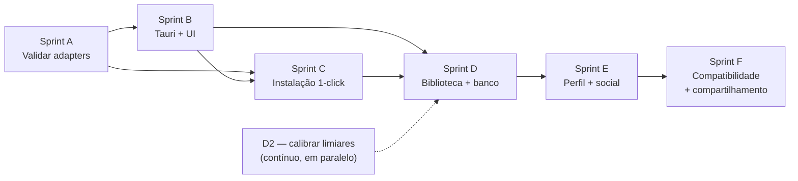

# Roadmap do ZeuX

Backlog organizado em sprints, derivado do PRD e do estado real do código.

**Tamanho relativo:** P (poucas horas) · M (alguns dias) · G (uma sprint ou mais).
Os tamanhos são relativos entre si, não estimativas de calendário.

Última verificação contra o código: 2026-08-01.

---

## Onde o projeto está

**Pronto e verificado (Fase 1):**

- Detecção de CPU/RAM (gopsutil) e GPU por SO, com fallback gracioso.
- Catálogo de 33 consoles (`schema_version 3`) e motor de parecer que nomeia
  gargalos.
- Consentimento persistido e versionado, verificado no servidor.
- 13 adapters de emulador, descoberta de binários, launcher e rastreio de sessão.
  **Flags validadas contra binário real em todos os 13** — ver D1.
- Instalação 1-click com download verificado, extração e instalação atômica.
- **DuckStation instalado pelo ZeuX pula o assistente de primeira execução**
  (`internal/install/firstrun.go`): grava `portable.txt` + a chave
  `SetupWizardIncomplete=false` no `settings.ini`, sem simular o resto da
  configuração. Atualizar o DuckStation preserva saves e settings do usuário —
  ver D8, único emulador mapeado até agora.
- Rotas HTTP sob `/api/v1`. Compila nos 3 SOs; todos os testes passam.
- CORS liberado para as origens conhecidas do WebView do Tauri
  (`tauri://localhost`, `http://tauri.localhost`), verificado contra um build
  de produção real — ver B2/B3 em [`sprint-b-plano.md`](sprint-b-plano.md).

- Scaffold Tauri + React + Tailwind (`src/`, `src-tauri/`), com o `zeuxd`
  subindo e descendo sozinho como sidecar (B5), cliente de API tipado (B6),
  layout sobre o wireframe para as telas 01/03 (B7), e o onboarding real
  funcionando de ponta a ponta: consentimento → scan → parecer, com
  revogação, versão de política e recuperação de erro (B8) — verificado com
  Chromium contra um `zeuxd` de verdade, não simulação.

**Não existe ainda:** as telas de biblioteca e emuladores (Sprint C/D — por
isso "recusar consentimento" hoje só leva a uma tela que explica a situação,
não a um app completo sem hardware), banco de dados, qualquer funcionalidade
social.

---

## Dívida honesta — itens de primeira classe

Estes não são "melhorias". São promessas do produto que hoje estão descobertas,
ou afirmações que o código faz sem ter como sustentar. Vêm antes de qualquer
funcionalidade nova.

| # | Item | Tamanho | Bloqueia |
|---|---|---|---|
| D1 | ~~Validar as flags dos 13 adapters contra binários reais~~ | G | **Feito 2026-08-01** (ressalva: sem ROM real, ver abaixo) |
| D2 | **Calibrar os limiares de hardware do catálogo** | G | Credibilidade do parecer |
| D3 | **Persistir sessões e tempo de jogo** | M | Perfil, conquistas |
| D4 | **Resolver OneDrive × `node_modules`/`src-tauri/target`** | P | **A Sprint B inteira** — é o item B0 |
| D5 | ~~Corrigir as opções silenciosamente ignoradas~~ | P | **Feito** — reconfirmado durante D1; todos os adapters já reportam em `Unapplied` |
| D6 | Busca recursiva de binários em subdiretórios | M | Instalação 1-click |
| D7 | Fixar as versões no `mise.toml` | P | Reprodutibilidade |
| D8 | **Mapear o pular-assistente para os demais emuladores com wizard** | M | "Plug and play" real |
| D9 | ~~`GET /emulators` faz 1880 `os.Stat` e relê os mesmos diretórios 13×~~ | M | **Feito 2026-08-01** — 6,6× mais rápido, medido |
| D10 | ~~Corrida de dados: `handleLaunch` serializava a sessão enquanto `supervise` a escrevia~~ | P | **Feito** |

### D1 — Validar as flags dos adapters (G) — **feito em 2026-08-01, com uma ressalva**

Os 13 adapters foram instalados de verdade (11 pelo instalador 1-click, RetroArch
e Dolphin manualmente, de `buildbot.libretro.com` e `dl.dolphin-emu.org`) e
testados contra o `--help`/`-h` real de cada binário, ou empiricamente (rodar
com a flag e confirmar que o processo fica de pé, sem erro) quando o binário não
imprime ajuda por linha de comando.

**A ressalva:** nenhum teste usou uma ROM de verdade — o ZeuX nunca obtém ROM,
por regra do projeto. O que foi validado é que **o binário aceita a flag sem
rejeitá-la**; abrir e rodar um jogo até o fim continua não verificado. É uma
prova mais forte que a anterior (documentação lida, nunca executada), mas ainda
não é a prova completa que only um `POST /api/v1/games/launch` com uma ROM real
traria.

| Adapter | Resultado | Achado |
|---|---|---|
| PCSX2 | ✅ Sem correção | `-batch`, `-fullscreen`, `--` batem exatamente com `-help` |
| DuckStation | ✅ Sem correção | `-batch`, `-fullscreen` batem com `-help` |
| RetroArch | ✅ Sem correção | `-L`, `-f` confirmados; testado carregando um core real (gambatte) e resolvendo `cores/` ao lado do binário |
| Dolphin | ✅ Sem correção | `-b`, `-e`, `-C` confirmados contra o `Readme.md` oficial e empiricamente |
| Cemu | ✅ Sem correção | `-f`, `-g` testados empiricamente |
| **PPSSPP** | 🔧 Corrigido | `--escape-exit` sozinho é "ESC sai", não "fecha ao terminar o jogo". Passou a somar `--pause-menu-exit`, o par documentado mais próximo do que `ExitOnClose` pede |
| **Flycast** | 🔧 Corrigido | `Fullscreen` ia para `Unapplied` sem necessidade: `-config window:fullscreen=yes` é aceito (confirmado empiricamente e no wiki do projeto) e agora é aplicado |
| **RPCS3** | 🔧 Corrigido | `--help` avisa que `--fullscreen` "Only used when no-gui is set" — o adapter aplicava as duas de forma independente, então pedir só tela cheia (sem `ExitOnClose`) fazia a flag ser aceita e ignorada em silêncio. Agora `--fullscreen` só é emitido junto com `--no-gui`, e o caso sem `ExitOnClose` vai para `Unapplied` |
| **Vita3K** | 🔧 Corrigido | `-r`/`--installed-path` é para um app **já instalado**, não um arquivo do disco. O argumento posicional é quem instala+roda um `.vpk`/`.zip` — que é o caso do ZeuX. Trocado |
| melonDS, xemu, Xenia | ✅ Sem correção | `-f`, `-full-screen`, `--fullscreen=true` testados empiricamente |
| Azahar | ✅ Mantido conservador | Não achei fonte confiável (nem `--help`, nem código-fonte acessível) para uma flag de fullscreen real. `Unapplied` continua sendo o certo aqui — sem trocar uma suposição por outra |

**Bug real achado fora das flags, na própria extração:** o pacote do Azahar usa
`\` dentro do nome das entradas do zip (em vez do `/` do padrão), e o marcador
de pasta vazia `plugins\` não tem o bit de atributo de diretório do MS-DOS. O
`archive/zip` do Go não reconhecia isso como pasta — virava um arquivo vazio, e
a instalação falhava ao tentar criar algo dentro dele
(`internal/install/extract.go`, função `isDirEntry`; regressão travada em
`TestExtractZipRecognizesBackslashDirectoryMarker`). Sem essa validação
ponta-a-ponta — instalar de verdade, não só ler o `sources.json` — esse bug só
apareceria na máquina de um usuário.

Também confirmado, sem mudança de código: os **nomes de executável** de
`binaryNames` batem com o que cada instalador realmente produz (`pcsx2-qt.exe`,
`duckstation-qt-x64-ReleaseLTCG.exe`, `xenia_canary.exe` etc.), e a descoberta
(`findBinary`) achou todos os 11 binários instalados pelo 1-click sem ajuste.

**O que ainda falta**, e por quê não foi feito agora: abrir uma ROM de verdade em
cada emulador e confirmar que o jogo roda até o fim. Isso exige uma ROM real, que
o ZeuX não obtém — só o dono do projeto, com jogos próprios, pode fechar essa
última milha. O valor do que foi feito aqui é ter eliminado a classe de erro mais
grosseira (flag que o emulador rejeita na cara), não a validação completa.

### D2 — Calibrar os limiares do catálogo (G)

Os campos `requires` (núcleos, clock, RAM, VRAM, GPU dedicada) em
`consoles.json` são **estimativas escritas a partir de conhecimento geral, não
de medição**. Nenhum foi verificado contra desempenho real.

Isso importa mais que parece: o parecer é o produto. Um limiar errado faz o app
dizer "Ótima possibilidade" para uma máquina que engasga, ou "improvável" para
uma que rodaria bem — e o segundo caso é pior, porque desencoraja o usuário.

Caminhos possíveis, do mais barato ao mais caro:

1. Cruzar com requisitos publicados pelos próprios projetos de emulador (P).
2. Testar em 3–4 máquinas de perfis diferentes (M).
3. Telemetria opt-in: correlacionar hardware com desempenho observado (G) —
   depende de banco e de consentimento próprio, distinto do consentimento de
   scan.

Enquanto não calibrado, a UI deve tratar o parecer como estimativa, não
promessa. Depende de: D3 (para a opção 3).

### D3 — Persistir sessões e tempo de jogo (M)

`Launcher.sessions` e `Launcher.Playtime()` vivem em memória e **somem quando o
daemon fecha**. O PRD promete "tempo total de jogo" no perfil — promessa hoje
descoberta.

Também some o `Server.lastScan`, o que é aceitável (é barato refazer), mas
significa que reiniciar o daemon devolve `404 no_scan_yet` em `/hardware` e
`/consoles/verdicts`.

Depende de: decisão de banco ([ADR 0002](decisoes/0002-adiar-banco-de-dados.md)).
Bloqueia: perfil social, conquistas, "últimos jogados", ProtonDB-like.

### D4 — OneDrive × artefatos de build (P)

O projeto vive em `C:\Users\doufl\OneDrive\Documentos\ZeuX`. Hoje isso é
inofensivo — Go guarda cache fora da árvore. **Deixa de ser no primeiro
`npm install`**: `node_modules/` e `src-tauri/target/` somam dezenas de milhares
de arquivos pequenos e voláteis, que o OneDrive tentará sincronizar a cada
build.

O `.gitignore` já os exclui do Git, mas o `.gitignore` não diz nada ao OneDrive.

Opções: marcar as pastas como "Sempre manter neste dispositivo" desligado não
resolve (elas são geradas localmente); o caminho real é **excluir as pastas da
sincronização** nas configurações do OneDrive, ou mover o repositório para fora
do OneDrive e manter o backup por Git.

**Fazer antes do primeiro `npm install`, não depois.**

**Estado em 2026-08-01: não resolvido.** Verificado: o repositório continua em
`C:\Users\doufl\OneDrive\Documentos\ZeuX`, e não existe junction,
`CARGO_TARGET_DIR` nem exclusão registrada em lugar nenhum. Como nada de
front-end foi criado ainda (`node_modules/`, `src-tauri/` e `package.json` não
existem), o custo de resolver agora é o menor que vai ser.

**Recomendação:** mover o repositório para fora do OneDrive (`C:\dev\ZeuX`), com
o remoto do GitHub (`DougCristiano/ZeuX`, já configurado) cumprindo o papel de
backup. É a solução menor — uma decisão, uma vez, sem mecanismo para manter. A
alternativa por junctions funciona, mas cria um passo de setup que some em
qualquer clone novo. Detalhe e critério de aceite em
[`sprint-b-plano.md`](sprint-b-plano.md), item B0.

Se o repositório for movido, os caminhos absolutos em `CLAUDE.md` e em
`.claude/settings.local.json` deixam de valer — decidir junto, não depois.

### D5 — Opções silenciosamente ignoradas (P) — **feito**

Os três casos que motivaram este item (`retroarch` + `exit_on_close`, `flycast`
+ `renderer`/`exit_on_close`, `cemu` + `exit_on_close`) já reportam em
`Unapplied` — reconfirmado lendo o código de cada adapter durante D1. O bônus
também foi corrigido: `standaloneAdapter.BuildCommand`
(`internal/emulator/standalone.go`) insere `Options.Extra` entre `opts` e
`romPart`, não mais depois do caminho da ROM — no PCSX2 isso deixava de cair
depois do separador `--`, onde viraria posicional em vez de flag.

### D6 — Busca recursiva de binários (M)

`findBinary` procura `<dir>/<nome>` **sem recursão**. Um
`C:\Program Files\DuckStation\duckstation-qt.exe` não é encontrado, porque só
`C:\Program Files\duckstation-qt.exe` é testado — e no Windows a esmagadora
maioria das instalações vive num subdiretório.

Precisa de busca em profundidade limitada (1–2 níveis) nos diretórios do sistema,
com cuidado para não varrer `~/Downloads` inteiro a cada `GET /api/v1/emulators`.
Considere cache de resultado com invalidação.

Bloqueia: instalação 1-click (que precisa saber se já existe instalação prévia).

### D7 — Fixar versões no `mise.toml` (P)

O arquivo usa aliases móveis:

```toml
[tools]
go = "latest"
node = "lts"
```

Hoje resolvem para Go 1.26.5 e Node 24.18.1, mas resolverão para outra coisa em
qualquer máquina configurada depois de um release novo — o que derrota o
propósito de usar um gerenciador de toolchain
([ADR 0003](decisoes/0003-mise-como-toolchain.md)). Trocar por versões exatas.

### D8 — Mapear o pular-assistente para os demais emuladores (M)

O DuckStation instalado pelo ZeuX já pula o assistente de primeira execução
(`internal/install/firstrun.go`, `seedFirstRun`). A técnica veio de examinar o
código-fonte real do DuckStation (`src/duckstation-qt/qthost.cpp`,
`InitializeFoldersAndConfig`): o assistente só aparece quando a chave
`SetupWizardIncomplete` não existe em `[Main]` no `settings.ini`. Gravando essa
chave como `false` — e ativando o modo portátil via `portable.txt`, para que o
DuckStation leia o `settings.ini` de dentro do diretório gerenciado em vez de
`%APPDATA%\DuckStation` — o usuário nunca vê a tela de boas-vindas travando a
entrada.

**Isto não é "configurar o emulador".** Só a chave que suprime o assistente é
gravada; vídeo, controle e BIOS continuam vazios, preenchidos pelo próprio
DuckStation com os defaults dele no primeiro uso real. É o meio-termo entre
"plug and play" e não fingir uma configuração que o ZeuX não fez.

**Nenhuma outra frontend de referência faz isso.** Playnite, LaunchBox,
EmulationStation e Pegasus só resolvem argumentos de linha de comando — não
escrevem no arquivo de configuração do emulador. A técnica de seed mínimo veio
de examinar como a RetroDECK (distro Linux que empacota emuladores
pré-configurados) contorna o mesmo problema.

**Falta pesquisar, emulador por emulador, com o mesmo rigor** (ler o código-fonte
real, não assumir por analogia):

| Adapter | Tem wizard de 1ª execução? | Mecanismo de supressão | Status |
|---|---|---|---|
| DuckStation | Sim | `[Main] SetupWizardIncomplete=false` + modo portátil | **Feito** |
| PCSX2 | Sim (assistente de BIOS/pastas) | Desconhecido | Não pesquisado |
| Dolphin | Sim (primeira execução configura caminhos) | Desconhecido | Não pesquisado |
| PPSSPP | A confirmar | — | Não pesquisado |
| Cemu | Sim (assistente de configuração inicial) | Desconhecido | Não pesquisado |
| RPCS3 | Sim (aviso de compilação de firmware) | Provavelmente não suprimível — depende de firmware real | Não pesquisado |
| Demais adapters | A confirmar caso a caso | — | Não pesquisado |

Cada emulador guarda esse estado em formato e lugar diferentes (`.ini`, `.xml`,
`.json`, registro do SO em alguns casos no Windows). **Não generalizar a partir
do caso do DuckStation** — cada um exige a mesma investigação de código-fonte
antes de escrever a chave certa. Uma chave errada, na melhor hipótese, não faz
nada; na pior, é interpretada como uma configuração inválida pelo emulador.

Ao implementar cada um, seguir o padrão já criado: `seedFirstRun` em
`internal/install/firstrun.go` despacha por `adapterID`, e
`preservePortableUserData` em `promote()` evita que uma atualização apague
saves de um emulador em modo portátil. Adicionar o `case` correspondente e, se
o emulador também usar modo portátil, testar a preservação como
`firstrun_test.go` já faz para o DuckStation.

### D9 — A descoberta relê os mesmos diretórios uma vez por adapter (M) — **feito**

Medido em 2026-08-01, num Ryzen 9 7900X com cache quente: **`Registry.Survey`
gastava 43 ms e disparava 1880 `os.Stat`** por chamada — e `GET
/api/v1/emulators` chama uma vez por requisição, sem cache.

A causa não era o número de adapters, era a forma: `buildCandidates`
(`internal/emulator/discovery.go`) montava a lista **inteira** de candidatos
antes de testar qualquer um, incluindo o `os.ReadDir` de cada diretório de
sistema e de cada subpasta. Como isso rodava uma vez por adapter, os mesmos
`C:\Program Files`, `Downloads` e `Desktop` eram lidos 13 vezes na mesma
requisição.

**Correção aplicada:** `dirIndex` (`internal/emulator/discovery.go`) varre cada
diretório de sistema e suas subpastas **uma vez**, guardando um mapa `nome do
arquivo -> presente` por diretório. `Registry.Survey` constrói esse índice e o
embute no `context.Context` antes de perguntar a cada adapter; `findBinary`
consulta o índice quando ele existe no contexto, e cai no caminho antigo
(constrói e testa candidato por candidato) quando uma chamada avulsa não passa
índice nenhum — o que preserva o comportamento de sempre para quem chama
`Locate` fora de um `Survey`.

A precedência de busca (gerenciado pelo ZeuX → diretórios de sistema → `PATH`)
foi preservada porque o índice guarda os diretórios **na mesma ordem** que
`buildCandidates` sempre usou, e `dirIndex.find` percorre nessa ordem — o
diretório gerenciado nem entra no índice, continua sendo checado à parte, antes
de tudo, como sempre foi.

**Medido antes e depois** (`TestVerificaGanhoDeDesempenhoNaVarreduraDeSistema`,
rodado e descartado — não ficou no repositório): 39,9 ms → 6,1 ms, **6,6×**.
Medido também que os dois caminhos concordam nos 13 adapters (11 instalados
batendo o mesmo `BinaryPath`, 2 não instalados batendo `ok=false`) antes de
aceitar a mudança.

Testes de regressão: `TestDirIndexRespectsDirectoryPrecedence`,
`TestDirIndexRespectsNameOrderWithinSameDir`,
`TestScanDirEntriesSeparatesFilesFromSubdirs`
(`internal/emulator/discovery_test.go`).

### D10 — Corrida de dados na sessão recém-lançada (P) — **feito**

`Launcher.Launch` devolvia `*Session`, e `handleLaunch`
(`internal/api/server.go`) serializava esse ponteiro com `writeJSON`. Ao mesmo
tempo, a goroutine `supervise` (`internal/emulator/session.go`) gravava
`session.EndedAt` e `session.ExitError` — sob `l.mu`, mas o codificador JSON
lia os mesmos campos **sem** tomar o lock.

**Não foi confirmado com `-race`:** o detector exige cgo e não há gcc nesta
máquina, e a instalação de um compilador C foi deixada de fora de propósito. O
achado veio de leitura de código; a correção elimina a categoria do problema
de qualquer forma, então não dependeu da confirmação para valer a pena.

**Correção aplicada:** `Launch` agora devolve `Session` (valor, não ponteiro).
Internamente o `*Session` continua existindo — é nele que `supervise` escreve —
mas o valor que sai de `Launch` é uma cópia tirada sob `RLock`
(`Launcher.snapshot`).

A `supervise` já pode estar rodando quando a cópia é feita: a segurança não vem
da ordem, vem do lock. `supervise` toma `l.mu.Lock()` para escrever, `snapshot`
toma `l.mu.RLock()` para copiar, então a cópia é sempre um estado consistente —
ou antes da escrita, ou depois dela, nunca no meio. E o valor devolvido, sendo
cópia, não é escrito por ninguém dali em diante.

Detalhe que torna a cópia rasa suficiente: `supervise` **substitui** o ponteiro
`EndedAt` (`session.EndedAt = &endedAt`), nunca modifica o `time.Time` apontado.
`Unapplied` é preenchido uma vez no `register` e nunca mais tocado. Se algum dia
um campo passar a ser mutado no lugar, a cópia rasa deixa de bastar.

### Achados menores da mesma auditoria

- `CustomStore.Upsert` e `Delete` (`internal/emulator/custom.go`) fazem
  ler-modificar-gravar com `RLock` na leitura e `Lock` na escrita, mas sem
  segurar o lock pelo conjunto. Dois `POST` simultâneos podem perder uma
  definição. Impacto baixo (app local, um usuário), conserto simples.
- **Corrigido na hora:** `joinComma` (`internal/emulator/registry.go`)
  concatenava com `+=` em laço — O(n²) nos bytes. Trocado por `strings.Builder`.
  O `n` aqui é sempre pequeno; o motivo de corrigir é o padrão não ficar no
  repositório para ser copiado onde o `n` não é.
- **Corrigido na hora:** `go.mod` marcava `sevenzip` e `gopsutil` como
  `// indirect` sendo dependências diretas. `go mod tidy` resolveu.

---

## Sprint A — Validação dos adapters (bloqueia tudo)

Objetivo: fechar de verdade a base da Fase 2, provando que o ZeuX consegue abrir
jogos.

| Item | Tam. | Depende de |
|---|---|---|
| ~~D1 — validar flags dos 13 adapters~~ | G | **Feito** 2026-08-01 |
| ~~D5 — corrigir opções silenciosamente ignoradas~~ | P | **Feito** |
| ~~D6 — busca recursiva de binários~~ | M | **Feito** (`internal/emulator/discovery.go`, `subdirectories`) |
| ~~D7 — fixar versões no `mise.toml`~~ | P | **Feito** (`go 1.26.5`, `node 24.18.1`) |
| **D4 — resolver OneDrive antes da Sprint B** | P | — · **Não feito** (verificado 2026-08-01). Migrou para a Sprint B como item B0, porque bloqueia tudo lá |
| Detectar `Installation.Version` | P | ~~D1~~ desbloqueado |
| ~~Atualizar o README~~ | P | **Feito** — já documenta instalação 1-click e as rotas de `/emulators`, `/games/*`, `/sessions` |

**Critério de saída:** pelo menos 3 emuladores diferentes abrindo jogos de fato,
por `POST /api/v1/games/launch`, com o preset aplicado e a sessão registrada.

---

## Sprint B — Ambiente Tauri e casca da UI

Objetivo: primeira tela consumindo a API — e a primeira prova de que o
[ADR 0001](decisoes/0001-ipc-http-local.md) (IPC por HTTP local) funciona dentro
de um WebView de verdade.

**O plano detalhado, com critério de aceite item a item, riscos e critério de
saída, está em [`sprint-b-plano.md`](sprint-b-plano.md).** Aqui fica só a
sequência.

| # | Item | Tam. | Depende de |
|---|---|---|---|
| B0 | **D4 — tirar `node_modules`/`src-tauri/target` do OneDrive** | P | — · **Tentado 2026-08-01, bloqueado**: mover a pasta falha com "arquivo em uso" — o próprio VS Code (várias janelas abertas) e/ou a sessão do Claude Code, ambos ancorados neste caminho, seguram um handle. Precisa ser feito com os dois fechados; ver nota em `sprint-b-plano.md` |
| B-wire | ~~Publicar o wireframe no repositório~~ | P | **Feito 2026-08-01** — [`wireframe.md`](wireframe.md) / [`wireframe.html`](wireframe.html) |
| B-doc | ~~Reconciliar `api.md` com o código antes de tipar o cliente~~ | P | **Feito 2026-08-01** — `schema_version`/contagem de consoles corrigidos, rotas de instalação e de emuladores personalizados documentadas |
| B1 | Instalar Rust + MSVC Build Tools + WebView2 | M | B0 · **Feito parcialmente 2026-08-01** — num container Linux remoto, não na máquina Windows; ver ressalva em `sprint-b-plano.md` |
| B2 | **Prova de fogo: WebView Tauri × `127.0.0.1:7777`** | P | B1 · **Feito 2026-08-01** — origin real medido (`tauri://localhost` em produção, `http://127.0.0.1:1430` em dev), CORS confirmado como necessário |
| B3 | CORS no servidor, **se** B2 mostrar que precisa | P | B2 · **Feito 2026-08-01** — B2 mostrou que era necessário; `allowedOrigins` + `withCORS` em `internal/api/server.go`, com testes |
| B4 | Scaffold Tauri + React + Tailwind, `src-tauri/` | M | B2 · **Feito 2026-08-01** — build de produção real rodou e falou com o `zeuxd`; hot reload do `tauri dev` não exercitado (ver ressalva em `sprint-b-plano.md`) |
| B5 | `zeuxd` como processo filho (subir, derrubar, porta ocupada) | M | B4 · **Feito 2026-08-01** — sidecar do Tauri (`tauri-plugin-shell`); os 4 cenários de `sprint-b-plano.md` rodaram de verdade |
| B6 | Cliente de API tipado no front | M | B4, B-doc · **Feito 2026-08-01** — `src/api/`, `npm run verificar-api`; achou e corrigiu uma divergência real entre código e `api.md` (`bottlenecks`) |
| B7 | Layout visual sobre o wireframe | M | B4, B-wire · **Feito 2026-08-01, parcial de propósito** — tokens, tipografia, componentes e as telas 01/03; 04–07 ficam para quando a funcionalidade delas existir (Sprint C/D) |
| B8 | Fluxo de onboarding: consentimento → scan → parecer | M | B5, B6, B7 · **Feito 2026-08-02** — máquina de estados real em `App.tsx`, os 6 critérios verificados com Chromium contra um `zeuxd` de verdade (incluindo troca de `PolicyText`/`PolicyVersion` recompilando o Go) |
| B9 | Tela de parecer: gargalos nomeados, aviso de "parcial" | M | B8 · **Feito 2026-08-02** — maior parte já vinha do B7/B8; acrescentado o aviso permanente de estimativa (D2 aberto) |
| B10 | Instalar com ressalva de hardware (servidor já faz — ver nota) | P | B9 |
| B11 | Empacotamento: binário Go dentro do instalador Tauri | M | B4 |

**A ordem tem uma razão só:** B2 vem antes de qualquer tela. O servidor **não
tem uma linha de `Access-Control-*` hoje** (verificado por `grep` em
`internal/api/`), e um `POST` com `Content-Type: application/json` a partir do
WebView dispara preflight. Descobrir isso com um botão na tela custa uma tarde;
descobrir com onze telas prontas custa a sprint.

**Dois pré-requisitos que não estavam na tabela antiga — os dois já feitos:**

- ~~O wireframe não está no repositório~~ **Feito 2026-08-01** —
  [`docs/wireframe.md`](wireframe.md) e [`docs/wireframe.html`](wireframe.html)
  versionam as 7 telas com as regras anotadas.
- ~~`api.md` está desatualizado~~ **Feito 2026-08-01** — `schema_version`
  corrigido para `3`, consoles para `33`, e as rotas de `custom-emulators`,
  `emulator-sources`, `emulators/{id}/install` e `installs` (que não estavam
  documentadas) foram acrescentadas.

**Nota sobre B10:** o bloqueio por hardware com escape **já existe no servidor**
(`hardwareBlocks` + `?force=true` + `override_hint`, em
`internal/api/server.go`). Por isso a linha "aviso quando o hardware não
comporta" saiu da Sprint C e entrou aqui como item P — a tela existe no
wireframe, o backend existe, esperar não compra nada.

**Regra de UI, não negociável:** o texto sobre hardware é **descritivo, nunca
julgador**. Exibir números e o que a máquina alcança. Nunca "seu PC é fraco".
Quando um patamar melhor não é atingido, mostrar o `bottlenecks` — que já vem
pronto da API. E enquanto o D2 estiver aberto, a UI apresenta o parecer como
**estimativa**, não promessa: os limiares nunca foram medidos.

**Forma de interação:** mouse e teclado, sem modo TV — mas nenhuma ação pode
existir só em hover ou só em clique direito, e foco é estado de primeira classe.
Ver [ADR 0009](decisoes/0009-desktop-agora-controle-depois.md). O critério
verificável está em B7 e B8: o onboarding inteiro precisa ser concluído só com
Tab e Enter.

**Critério de saída (resumo):** um instalador que roda numa máquina sem Go, Node
nem Rust leva o usuário do consentimento ao parecer sem passo manual, o `zeuxd`
sobe e desce com a janela, e o ADR 0001 deixa de ser aposta — com o `origin`
real do WebView escrito aqui. Os sete itens completos estão em
[`sprint-b-plano.md`](sprint-b-plano.md).

---

## Sprint C — Instalação 1-click de emuladores

Objetivo: o usuário não precisa saber o que é DuckStation para jogar PS1.

| Item | Tam. | Depende de |
|---|---|---|
| Manifesto de downloads por emulador × SO × arquitetura | M | D1 |
| Download com verificação de checksum e barra de progresso | M | ↑ |
| Extração para `ManagedRoot()` (`UserConfigDir()/ZeuX/emulators/<id>/`) | M | ↑ |
| Instalar/atualizar/remover apenas o que é `managed` | M | ↑ |
| Instalação de cores do RetroArch | M | ↑ |
| ~~**Aviso quando o hardware não comporta, e o usuário decide**~~ | P | **Migrou para a Sprint B, item B10** — o servidor já bloqueia com `?force=true`; falta só a tela |
| Rotas: `POST /api/v1/emulators/{id}/install`, `DELETE`, progresso | M | ↑ |

`ManagedRoot()` e `Installation.Managed` já existem no código e a busca já
prioriza a pasta gerenciada — **nada escreve nela ainda**. A infraestrutura de
leitura está pronta; falta a de escrita.

**Princípio de produto:** se o hardware não comporta o emulador, **não instalar
automaticamente**. Mostrar o parecer, explicar o gargalo, e deixar o usuário
decidir por conta e risco. Não bloquear — informar.

---

## Sprint D — Biblioteca local e metadados

Objetivo: o usuário aponta uma pasta e vê seus jogos, não caminhos de arquivo.

| Item | Tam. | Depende de |
|---|---|---|
| **Decidir e introduzir o banco (SQLite local)** | G | ADR 0002 |
| Camada de repositório: extrair estado de `Launcher` e `Server` | M | ↑ |
| D3 — persistir sessões e tempo de jogo | M | ↑ |
| Varredura de pastas de ROM, por console, com detecção de extensão | M | ↑ |
| Identificação de jogo (hash/nome de arquivo) | M | ↑ |
| Scraper de metadados: IGDB e/ou ScreenScraper | G | ↑ |
| Cache local de capas e metadados | M | ↑ |
| Dashboard com grid moderno de capas | G | Sprint B |
| "Últimos jogados" e tempo por jogo | M | D3 |

**Regra legal, não negociável:** a biblioteca indexa arquivos que já estão no
disco do usuário. O ZeuX **nunca** copia, distribui, sugere fonte ou facilita
transferência de ROMs. O scraper busca **metadados**, jamais o jogo.

---

## Sprint E — Perfil e camada social

Objetivo: a promessa social do PRD, agora que há dado para exibir.

| Item | Tam. | Depende de |
|---|---|---|
| Backend na nuvem (MySQL) e identidade de usuário | G | Sprint D |
| Sincronização local ↔ nuvem | G | ↑ |
| Perfil público: consoles, tempo de jogo, hardware como comparativo | M | ↑ |
| Navbar: comunidade, amigos, perfil, conquistas | M | Sprint B |
| Amigos e feed de atividade | M | ↑ |
| Integração RetroAchievements | M | ↑ |
| Integração Speedrun.com | M | ↑ |

**Consentimento:** o hardware é usado como base de comparação entre jogadores —
isso já está no `PolicyText` atual. Publicar o hardware num perfil **público**
pode exigir uma nova versão da política (`PolicyVersion`), o que invalida o
consentimento anterior por desenho. Avaliar antes de implementar, não depois.

---

## Sprint F — Compatibilidade comunitária e compartilhamento

Objetivo: o conhecimento coletivo que nenhum emulador isolado tem.

| Item | Tam. | Depende de |
|---|---|---|
| Sistema de compatibilidade estilo ProtonDB, **sob demanda** | G | Sprint E |
| Relato de compatibilidade: hardware + emulador + versão + resultado | M | ↑ |
| Compartilhamento de **save states** | M | ↑ |
| Compartilhamento de **texture packs** | M | ↑ |
| Compartilhamento de **perfis de controle** | M | ↑ |
| **Netplay lobby** | G | ↑ |

Os relatos de compatibilidade dependem de `Installation.Version`, que **nunca é
preenchido hoje** — "rodou bem na versão X" precisa saber qual é X. Ver Sprint A.

**Regra legal, repetida porque é o ponto de maior risco do produto:** o
compartilhamento cobre save states, texture packs, perfis de controle e lobby de
netplay. **Nunca ROMs.** Isso precisa ser estrutural (o backend não aceita upload
de imagem de disco), não apenas uma regra de termos de uso.

---

## Backlog sem sprint atribuída

| Item | Tam. | Nota |
|---|---|---|
| Atualização do catálogo via nuvem | M | `schema_version` já existe para isso |
| Escrever nos arquivos de config dos emuladores (reduz `Unapplied`) | G | Invasivo; sobrescreve ajustes do usuário. Diferente de D8: isso aplicaria opções do preset (resolução, renderer), não só pular o assistente |
| Novos consoles: Saturn, 3DS, DS, Game Boy/Color, Master System, Xbox | M cada | Switch fica fora por decisão — [ADR 0008](decisoes/0008-excluir-switch-do-catalogo.md) |
| ~~Testes de `internal/api` e `internal/consent`~~ | M | **Feito 2026-08-01** — `Probe` mockado via interface; ver nota abaixo |
| Autenticação da API local | M | Necessário se algo além do Tauri falar com ela |
| Descoberta dinâmica de porta | P | Evita colisão em `7777` |
| CI multiplataforma (build + test nos 3 SOs) | M | Hoje a verificação cruzada é manual |
| Detecção de BIOS/firmware necessários por console | M | PS1, PS2, Dreamcast, Wii U precisam |
| Suporte a controles: detecção e mapeamento | G | Pré-requisito dos perfis de controle |

**Nota sobre os testes de `internal/api` e `internal/consent` (2026-08-01):**
cobrem consentimento (persistência, revogação, versão de política, arquivo
corrompido), o ciclo completo de scan (bloqueio sem consentimento, scan,
leitura, limpeza ao revogar) e as rotas de lançamento e emuladores
personalizados, todos via `httptest` sem tocar hardware real — o `Probe` já
era interface, e `consent.Store`/`emulator.CustomStore` foram isolados do
disco do usuário via `XDG_CONFIG_HOME`/`AppData` apontando para um diretório
temporário do teste.

Rodando `go test ./...` neste ambiente (Linux) foi achado
**`TestExtractZipRecognizesBackslashDirectoryMarker` falhando em
`internal/install`**, sem relação com os testes novos — confirmado que a
falha é preexistente (o teste já estava assim no commit inicial, antes desta
sessão). Não foi investigado nem corrigido aqui, por estar fora do escopo
deste item; fica registrado para checagem separada.

---

## Sequência recomendada



A Sprint A vem primeiro porque é a única que pode invalidar código já escrito.
D2 (calibração dos limiares) é trabalho contínuo, não uma sprint: melhora a cada
máquina nova em que o app rodar.
