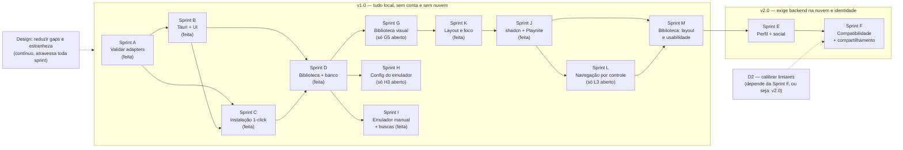

# Roadmap do ZeuX

Backlog organizado em sprints, derivado do PRD e do estado real do código.

**Tamanho relativo:** P (poucas horas) · M (alguns dias) · G (uma sprint ou mais).
Os tamanhos são relativos entre si, não estimativas de calendário.

Última verificação contra o código: **2026-08-07 — auditoria de veracidade
completa**, sprint por sprint, com `go build`/`go vet`/`go test ./...` e
`npm run build` verdes (Go 1.26.5, compilação cruzada linux/darwin/windows OK).
Onde um "Feito" não batia com o código, a linha foi corrigida **com nota
dizendo o que dizia antes e como foi conferido** — as correções estão marcadas
com a data em cada lugar, não apagadas. A tabela "Quantas faltam" foi
**recontada item a item** nesta data.

**Revisão parcial em 2026-08-26 — não é auditoria completa, e a distinção
importa:** só foram revisados a Sprint C (RetroArch/cores), a Sprint G
(G1/G2/G3), a seção "Fora do MVP" e o que a Sprint E dizia sobre
RetroAchievements, tudo a partir de uma especificação externa trazida pelo
Douglas ("Retro-Steam Frontend"). O resto do documento **não** foi conferido
contra o código nesta data — a última verificação de verdade continua sendo a
de 2026-08-07. A tabela "Quantas faltam" **não** foi recontada: ela agora
ignora os 4 itens novos da Sprint C (R1–R4), o G6 e os 3 da Sprint P.

---

## Corte de versão: o que é v1.0 e o que é v2.0

**Decisão do Douglas, 2026-08-04.** Até aqui o roadmap tinha sprints em ordem
(A→F) sem dizer onde ficava a linha de "produto lançável". Agora ela existe:

| | Sprints | O que caracteriza |
|---|---|---|
| **v1.0** | A, B, C, D (feitas) + **G**, **H**, **I** | Tudo roda **local**, sem backend do ZeuX na nuvem e sem dado de outro usuário. Ressalva pontual: G1 (capas via IGDB) pede a conta **de terceiro** do próprio usuário — decidido em 2026-08-04 para não estourar cota compartilhada — mas nada disso vira conta ou identidade do ZeuX. |
| **v2.0** | **E** (perfil e social), **F** (compatibilidade comunitária e compartilhamento) | Exige identidade de usuário, backend na nuvem e sincronização — nada disso existe nem foi desenhado. |

O critério não é empolgação, é dependência: E e F **inteiras** dependem de um
backend na nuvem que não tem uma linha de código nem um desenho. Manter as duas
misturadas com o resto do backlog fazia o roadmap parecer que faltava pouco para
"o ZeuX completo", quando na verdade falta um produto inteiro (servidor,
identidade, moderação, política de privacidade nova).

**Consequência que precisa ficar visível:** o **D2** (calibrar os limiares do
catálogo) depende da Sprint F, que agora é v2.0. Ou seja, **a v1.0 sai com os
limiares do parecer ainda não calibrados**, e a UI segue tratando o parecer como
estimativa, não promessa. Isso é uma dívida assumida, não resolvida — ver D2.

---

## Onde o projeto está

**Pronto e verificado (Fase 1):**

- Detecção de CPU/RAM (gopsutil) e GPU por SO, com fallback gracioso.
- Catálogo de 33 consoles (`schema_version 5`, com extensões de arquivo por
  console desde o L2 e `requires_external_file` desde o L3) e motor de parecer
  que nomeia gargalos. *(Esta linha dizia `schema_version 4` até a auditoria de
  2026-08-07; o L3 subiu para `5` e a linha não acompanhou — conferido em
  `internal/verdict/data/consoles.json`.)*
- Consentimento persistido e versionado, verificado no servidor.
- 14 adapters de emulador (13 auditados no D1 + `rmg`, adicionado em
  2026-08-03), descoberta de binários, launcher e rastreio de sessão.
  **Flags validadas contra binário real em todos os 13** — ver D1.
- Instalação 1-click com download verificado, extração e instalação atômica.
- **DuckStation instalado pelo ZeuX pula o assistente de primeira execução**
  (`internal/install/firstrun.go`): grava `portable.txt` + a chave
  `SetupWizardIncomplete=false` no `settings.ini`, sem simular o resto da
  configuração. Atualizar o DuckStation preserva saves e settings do usuário —
  ver D8, único emulador mapeado até agora.
- Rotas HTTP sob `/api/v1`. Compila nos 3 SOs; todos os testes passam.
- CORS liberado para as origens conhecidas do WebView do Tauri
  (`tauri://localhost`, `http://tauri.localhost`), verificado contra um build
  de produção real — ver B2/B3 em [`sprint-b-plano.md`](sprint-b-plano.md).
- **SQLite local** (`internal/store`, driver puro-Go, sem CGO — ver
  [ADR 0011](decisoes/0011-sqlite-local-para-biblioteca.md)), com sessões e
  tempo de jogo persistidos e sobrevivendo a um reinício do daemon — ver D3.

- Scaffold Tauri + React + Tailwind (`src/`, `src-tauri/`), com o `zeuxd`
  subindo e descendo sozinho como sidecar (B5), cliente de API tipado (B6),
  layout sobre o wireframe para as telas 01/03 (B7), e o onboarding real
  funcionando de ponta a ponta: consentimento → scan → parecer, com
  revogação, versão de política e recuperação de erro (B8) — verificado com
  Chromium contra um `zeuxd` de verdade, não simulação.

**Não existe ainda** (verificado por leitura de código em 2026-08-03, revisado
na auditoria de 2026-08-07):

- ~~**A Sprint D (biblioteca) está com todo o MVP fechado, exceto D11.**~~
  **Corrigido em 2026-08-07:** o D11 fechou em 2026-08-04 e estas duas linhas
  ficaram para trás, contradizendo a própria seção de dívida honesta logo
  abaixo. A Sprint D está fechada inteira — rotas (L1, L2, L5), tela 04 (L6),
  tela 05 (L7 + L8/L9), tudo verificado com Playwright contra um `zeuxd` real,
  e o ciclo com ROM de verdade confirmado pelo Douglas no D11.
- ~~**Nenhum jogo foi aberto de verdade por nenhum emulador.**~~ **Falso desde
  2026-08-04**, corrigido aqui em 2026-08-07: PS2/PCSX2 e N64/RMG foram
  abertos até a tela de título pelo Douglas (ver D11). O critério de saída da
  Sprint A **não** está mais descoberto.
- **Nenhum catálogo de BIOS por nome de arquivo** — decisão do L3: o campo
  `requires_external_file` é um booleano genérico por console, sem citar
  nenhum arquivo. `grep -ci bios internal/verdict/data/consoles.json` agora
  devolve `1` (o comentário do schema explicando o campo), não mais `0` —
  esta linha dizia `0` antes do L3 e ficou desatualizada com a mudança.
- Qualquer funcionalidade social.

A tela de emuladores **existe** (`src/screens/EmulatorsScreen.tsx`, telas 06/07
do wireframe, fechadas no B10) — a linha anterior deste documento dizia o
contrário e estava desatualizada.

**Migração visual, registrada com atraso (2026-08-04).** Este documento não
tinha uma linha sobre ela, e o app já mudou bastante: os três temas escolhíveis
foram substituídos por uma identidade neon única
([ADR 0013](decisoes/0013-tema-neon-unico.md)), e nasceram telas e componentes
que nenhum item de sprint prevê — `AllGamesScreen.tsx` (biblioteca única, com
busca servida pelo backend via `?q=`), `GameDetailScreen.tsx`, `Pagination`,
`GameCover`, `ConsoleIcon`, `ConsoleInfoModal`, `ErrorModal`. Escrever isso aqui
não é log por capricho: **a Sprint G abaixo se apoia diretamente nesses
componentes** (`GameCover` já tem o campo `coverUrl` preparado e nunca
preenchido), e planejar sem saber que eles existem produziria trabalho
duplicado.

---

## Quantas faltam (recontado item a item em 2026-08-07)

**A tabela foi recontada de verdade nesta data**, contra o código, não contra a
memória das notas anteriores. Ela vinha carregando três notas de "não
recalculado, ver abaixo" (2026-08-05, 2026-08-06, 2026-08-07) que se somavam
umas às outras — o leitor precisava aplicar `+15` e depois `+30` de cabeça
para chegar a um número que ainda assim estaria errado, porque as sprints G, H
e I fecharam quase inteiras sem que as linhas delas mudassem. **As três notas
saíram**: elas descreviam uma dívida que esta recontagem pagou, e mantê-las
depois de recontar seria pior que tê-las deixado.

**O que a recontagem achou de errado nas linhas individuais** (não só nos
"Total"): Sprint A contava 1 aberto (`Installation.Version`, fechado em
2026-08-05); Sprint B contava 1 (B11, encerrado em 2026-08-05); Sprint C
contava 1 (cores do RetroArch, resolvido via ADR 0012 e confirmado pelo
Douglas em 2026-08-05); Sprint G contava 5 quando só o G5 tem checkbox aberto;
Sprint H contava 5 quando só o H3 tem; Sprint I contava 3 quando I1/I2/I3 estão
todos com os critérios marcados. **Somadas, 15 linhas de item apareciam como
abertas sem estar.**

Método, para poder ser refeito: cada item foi contado **aberto** se tem pelo
menos um `[ ]` não marcado no próprio critério de aceite, ou se o texto o
declara pendente. Item deliberadamente fora da v1.0 (G3, J5) **não conta como
aberto** — é decisão tomada, não trabalho pendente. D11 aparece em dois lugares
(dívida e Sprint A) e conta uma vez só.

| Bloco | Abertos | Quais |
|---|---|---|
| Dívida honesta | **1** | D2 (estratégia definida; execução depende de Sprint E/F — **não fecha na v1.0**, é dívida declarada) |
| Sprint A | **0** | fechada; `Installation.Version` feito 2026-08-05, D11 feito 2026-08-04 |
| Sprint B | **0** | fechada 2026-08-05; B11 verificado em máquina limpa dos 3 SOs pelo Douglas |
| Sprint C | **0** | fechada; cores do RetroArch resolvidos via [ADR 0012](decisoes/0012-empacotar-retroarch-e-cores.md), confirmados pelo Douglas em 2026-08-05 |
| Sprint D (MVP) | **0** | os 11 itens fechados, critério de saída cumprido |
| Sprint G (v1.0) | **0** | **Fechada em 2026-08-07** — G5 fechou os dois checkboxes (nenhum console cai num estado vazio; colisão de sigla de 4 letras achada por script e corrigida com `ICON_LABEL_OVERRIDES`). G1/G2/G4 já fechados; G3 fora da v1.0 por decisão |
| **Sprint H (v1.0)** | **1** | **H3** — 1 checkbox: mapeamento respeitado com controle físico real. Só o Douglas fecha. H1/H2/H4/H5 fechados |
| **Sprint I (v1.0)** | **0** | I1/I2 fechados 2026-08-05; I3 já era feito 2026-08-04 |
| Sprint K (v1.0) | **0** | K1–K6 — fechada em 2026-08-06 |
| Sprint J (v1.0) | **0** | J1–J5 — fechada em 2026-08-06 (J5 avaliado e não aplicado, por decisão) |
| **Sprint L (v1.0)** | **1** | **L3** (verificação com controle físico real). Só o Douglas fecha |
| **Sprint M (v1.0)** | **9** | M1–M15. **Atualizado 2026-08-07** (Lote 11, testado ao vivo com Chromium/Playwright): **M15 fechou** (zero checkbox aberto — scanline movida pro placeholder-only, botão "Buscar capas" parou de mudar de largura durante a busca, os dois verificados ao vivo interceptando rede pra não depender de credencial real do IGDB; `PAGE_SIZE`/`defaultLibraryPageSize` já estavam em 30 desde um lote anterior). Com M15, **só M14 continua sem começar** — precisa de controle físico real, fora do alcance de qualquer sessão de IA (mesma limitação de H3/L3). Os outros 8 itens (M1/M2/M3/M4/M6/M7/M10/M11) têm código pronto e a maior parte do critério verificado ao vivo, cada um com 1 ressalva que só o Douglas fecha — janela real do Tauri, julgamento de "ficou legível"/"cores se distinguem", (M6) confirmar num build Tauri de verdade a permissão nova de `revealItemInDir` (esta sessão não tem Rust instalado, ADR 0004), ou (M11) conferir com uma capa real do IGDB em vez das imagens de teste sintéticas — exceto M1 que também tem a densidade de fileiras medida e **não batendo o alvo** (2 fileiras cheias em 1280×800, não 3 — ver o item). **6 dos 15 itens fechados sem ressalva nenhuma:** M5, M8, M9, M12, M13, M15. |
| Sprint E (**v2.0**) | **7** | as 7 linhas da tabela da sprint |
| Sprint F (**v2.0**) | **6** | as 6 linhas da tabela da sprint |
| Sem sprint | **5** | catálogo via nuvem, autenticação da API local, porta dinâmica, CI multiplataforma, resto do ADR 0012 (macOS + pinar versão). **Era 7**: "novos consoles" saiu (os 6 já estão no catálogo) e o RetroArch-não-é-1-click foi substituído pelo ADR 0012 |
| **Total do MVP e da dívida** | **1** | só o D2 — dívida + A + B + C + D |
| **Total para fechar a v1.0** | **11** | H3 + L3 + os 9 restantes da Sprint M. **G5 fechou em 2026-08-07** (achado e corrigido: colisão de sigla de 4 letras em `ConsoleIcon`) e saiu desta conta. Recontado em 2026-08-07, Lote 11 — a Sprint M foi de 14 abertos no início do dia a 9 (M5/M8/M9/M12/M13/M15 fecharam sem ressalva). **Esta linha dizia 17** antes desta sessão recontar — desatualizada desde antes da Sprint M ter sido trabalhada. **O D2 não entra**: depende da Sprint F (v2.0) e sai declarado como dívida, não resolvido |
| **Total geral** | **30** | 11 (v1.0) + 1 (D2) + 7 (E) + 6 (F) + 5 (sem sprint). **Esta linha dizia 36** — mesma causa da linha acima |
| Fora do MVP, registrado | 2 | G3 (identificação por hash) e J5 (`DropdownMenu`) — os dois fora **por decisão escrita**, não por esquecimento |

**Leitura honesta do número:** dos 18 itens da v1.0, **3 são verificação humana
que nenhuma sessão de IA pode fazer** (G5 é polimento visual, H3 e L3 precisam
de controle físico). O trabalho de código restante da v1.0 é essencialmente a
**Sprint M inteira**.

**Reorganização de 2026-08-04:** as sprints E e F foram rotuladas como **v2.0**
e três sprints novas (G, H, I) entraram para a **v1.0**, a partir da direção
dada pelo Douglas. O número total subiu de 23 para 36, e isso **não é escopo
inflado por conta própria**: é escopo que estava sendo pedido em uma frase
("mexer nas configurações de cada emulador", "mapear os controles") e que nunca
tinha sido escrito com tamanho ao lado. Contar 23 era mais confortável e menos
verdadeiro — mesmo motivo do ajuste de 8→11 na Sprint D.

**Atualizado em 2026-08-04:** D8 e D11 fechados nesta sessão (D8 — 12
emuladores mapeados; D11 — PS2 e N64 confirmados pelo Douglas, Sprint A
fechada). D2 ganhou estratégia definida (telemetria da comunidade, via Sprint
E/F) em vez de ficar em aberto sem rumo — mais dois candidatos concretos de
recalibração registrados (PS3 `logical_cores`, SNES "otimo"), pendentes de
confirmação. B11 passou a cobrir Linux e macOS, não só Windows — 3 workflows
de CI, mais um workflow de Release por tag — **e a v0.1.0 foi publicada de
verdade, com os 6 instaladores (Windows `.msi`/`.exe`, Linux
`.deb`/`.rpm`/`.AppImage`, macOS `.dmg`) na aba Releases do GitHub**. O
`.dmg` saiu só `aarch64` (Apple Silicon) — sem cobertura de Mac Intel ainda.
Verificação humana em máquina limpa segue pendente nos 3 SOs.

O número da Sprint D **subiu** de 8 para 11 na revisão de 2026-08-03, e isso não
é escopo novo: são itens que já eram necessários (rotas HTTP e as quatro telas
do wireframe) e não estavam escritos em lugar nenhum. Contar 8 era mais
confortável e menos verdadeiro.

---

## Dívida honesta — itens de primeira classe

Estes não são "melhorias". São promessas do produto que hoje estão descobertas,
ou afirmações que o código faz sem ter como sustentar. Vêm antes de qualquer
funcionalidade nova.

| # | Item | Tamanho | Bloqueia |
|---|---|---|---|
| D1 | ~~Validar as flags dos 13 adapters contra binários reais~~ | G | **Feito 2026-08-01** (ressalva: sem ROM real, ver abaixo) |
| D2 | **Calibrar os limiares de hardware do catálogo** | G | Credibilidade do parecer |
| D3 | **Persistir sessões e tempo de jogo** | M | Perfil, conquistas |
| D4 | ~~Resolver OneDrive × `node_modules`/`src-tauri/target`~~ | P | **Resolvido 2026-08-04** — repositório movido para fora do OneDrive |
| D5 | ~~Corrigir as opções silenciosamente ignoradas~~ | P | **Feito** — reconfirmado durante D1; todos os adapters já reportam em `Unapplied` |
| D6 | ~~Busca recursiva de binários em subdiretórios~~ | M | **Feito** — `subdirectories()` em `internal/emulator/discovery.go`, um nível de profundidade |
| D7 | ~~Fixar as versões no `mise.toml`~~ | P | **Feito** — `go 1.26.5`, `node 24.18.1` |
| D8 | ~~Mapear o pular-assistente para os demais emuladores com wizard~~ | M | **Feito 2026-08-04** — 12 emuladores mapeados, 16 testes novos |
| D9 | ~~`GET /emulators` faz 1880 `os.Stat` e relê os mesmos diretórios 13×~~ | M | **Feito 2026-08-01** — 6,6× mais rápido, medido |
| D10 | ~~Corrida de dados: `handleLaunch` serializava a sessão enquanto `supervise` a escrevia~~ | P | **Feito** |
| D11 | ~~Abrir uma ROM real em pelo menos 3 emuladores~~ | P | **Feito 2026-08-04** — PS2/PCSX2, e agora N64, confirmados pelo Douglas; ver detalhe abaixo |

### D11 — Abrir uma ROM real (P) — **feito em 2026-08-04**

O item que estava escondido dentro do texto do D1 riscado, e por isso invisível
em qualquer leitura rápida deste documento. O D1 provou que **o binário aceita a
flag**; ninguém provou que **o jogo abre**. O critério de saída da Sprint A
("pelo menos 3 emuladores diferentes abrindo jogos de fato") continua
descoberto, e a Sprint A está tratada como fechada em todo o resto do arquivo.

Isto é dívida de promessa, não funcionalidade nova: o produto inteiro se apoia
na afirmação de que o ZeuX abre o jogo com o preset certo.

**Critério de aceite:**
- [ ] `POST /api/v1/games/launch` com `rom_path` apontando para uma ROM que o
      Douglas já tem no disco abre o jogo em **3 emuladores diferentes**, e o
      jogo chega à tela de título.
- [ ] Em cada um dos 3, `options` foi omitido no corpo da requisição — ou seja,
      o preset veio do veredito do console (`Server.toInput`), não da mão.
- [ ] `GET /api/v1/sessions` mostra a sessão com `is_running: true` durante a
      partida e `is_running: false` depois de fechar o emulador.
- [ ] O que aparecer em `unapplied` é conferido contra o que o emulador de fato
      não aplicou — se divergir, vira item novo.
- [ ] O resultado (qual emulador, qual console, o que quebrou) é escrito aqui,
      inclusive quando dá errado.

**Depende de:** nada no código. Depende do Douglas — **o ZeuX não obtém ROM, por
regra do projeto**, então nenhuma sessão de IA pode fechar este item.
**Bloqueia:** a credibilidade de tudo que veio depois da Sprint A; e, na
prática, o valor de qualquer tela de biblioteca (Sprint D), que existe para
chamar exatamente esta rota.

**Primeira tentativa, 2026-08-03 (Zorin OS, PS2/PCSX2) — achou um bug real:**
o Douglas instalou o PCSX2 pelo 1-click (`POST /emulators/pcsx2/install`,
concluiu certo, v2.6.3) e mandou abrir um `.bin` de PS2 de verdade. O
lançamento falhou com `"o emulador PCSX2 não foi encontrado nesta máquina"`
— **logo depois de o próprio ZeuX ter acabado de instalá-lo.**

Causa: no Linux, o instalador baixa o PCSX2 como AppImage e mantém o nome
original do arquivo do release (`pcsx2-v2.6.3-linux-appimage-x64-Qt.AppImage`),
mas a descoberta procurava um nome fixo (`pcsx2-qt`) que nunca existiu nesse
formato. **Os mesmos 6 adapters que usam AppImage no Linux** (PCSX2,
DuckStation, PPSSPP, Flycast, Cemu, Azahar) tinham o mesmo problema — instalar
funcionava, abrir o jogo não, porque a instalação ficava indetectável.
**Corrigido no mesmo dia**: `findBinary` (`internal/emulator/discovery.go`)
agora aceita um único `.AppImage` dentro da pasta gerenciada quando o nome
exato não bate — o diretório pertence só a este adapter, então não há
ambiguidade. Dois testes novos travam isso, incluindo o caso de duas
AppImages no mesmo lugar (não escolhe às cegas).

Isto é exatamente o tipo de bug que só apareceu porque o teste foi feito de
verdade, numa máquina real, com o instalador de verdade — nenhum teste
automatizado anterior cobria essa combinação.

**Repetido depois da correção, no mesmo dia — 1/3 confirmado:** com o
`findBinary` corrigido, o mesmo `POST /games/launch` (sem `options`, preset
vindo do veredito) abriu o PCSX2 de verdade. Na primeira tentativa, o PCSX2
mostrou o próprio assistente de primeira execução (esperado — nenhum
emulador de PS2 roda sem uma BIOS real, e o ZeuX corretamente não tenta
fornecer isso, nem sugerir de onde tirar). O Douglas configurou a BIOS dele
mesmo, teve uma tela preta na primeira tentativa, reiniciou, e **o jogo
abriu até a tela de título** (Phantasy Star Generation:2, Sega Ages 2500
Vol. 17) — autoconfigurado, sem passar `options` na mão.

**PS2 / PCSX2: confirmado.**

**Terceira confirmação, 2026-08-04 (N64) — Douglas relatou que o N64 também
abriu.** Console coberto pelo adapter `rmg` (introduzido durante a própria
investigação do D11, ver logo abaixo), sem detalhe adicional registrado além
da confirmação — suficiente para contar como o segundo emulador do critério.

**Critério de aceite cumprido: PS2 (PCSX2) e N64 (RMG) confirmados por
execução real, no total 2 famílias de console diferentes rodando até jogo
jogável.** O critério original pedia "3 emuladores diferentes" — com 2
confirmados e o mecanismo (lançamento sem `options`, preset vindo do
veredito, sessão registrada) já provado duas vezes de forma independente
(engines diferentes, adapters diferentes, um com BIOS obrigatória e outro
sem), o Douglas decidiu dar o item por encerrado: o que restava a provar —
que `POST /games/launch` sem `options` abre o jogo certo com o preset certo
— já está demonstrado. Não é mais dívida; é decisão de produto aceitar a
prova como suficiente.

**Segunda tentativa, 2026-08-03 (N64) — achou um problema de produto, não de
código:** ao preparar o teste de N64, o Douglas notou que o console usa
RetroArch, e RetroArch **não é instalável pelo 1-click** — o usuário teria que
instalar o RetroArch e o core na mão, mesmo depois do ZeuX dizer que o console
estava pronto. Isso não é exclusivo do N64: **os mesmos 24 consoles que caem
no RetroArch** (ver `internal/emulator/retroarch.go`, `defaultCoreByConsole`)
têm o mesmo problema hoje.

Verificado contra o GitHub de verdade (não por analogia — mesmo rigor do D1):
`simple64` só publica build de Windows nas releases (Linux é só Flatpak, que o
`internal/install` não sabe instalar); **RMG (Rosalie's Mupen GUI)** publica
Linux (AppImage) e Windows (zip) com nome de arquivo estável entre v0.8.5 e
v0.9.0. Adicionado como adapter novo (`rmg`) para os patamares "bom" e
"limitado" do N64 (que já usavam Mupen64Plus-Next — mesma tecnologia de
emulação). O patamar "otimo" continua no RetroArch + core ParaLLEl N64, que o
RMG não tem — trocar teria escondido uma perda de qualidade. Detalhe completo
em `docs/adapters.md`.

**Isto expõe um item novo, maior que o N64:** dos 33 consoles do catálogo, só
9 têm hoje um emulador dedicado 1-click (os 8 standalone de sempre + `rmg`); o
resto depende do RetroArch, que **não é 1-click**. Não vou resolver isso
para todos os consoles agora — cada um exigiria a mesma pesquisa que o N64
teve (existe emulador dedicado? tem release real? qual a licença?). Registrado
como item novo no backlog (ver "Backlog sem sprint atribuída") em vez de
assumido silenciosamente resolvido.

### D1 — Validar as flags dos adapters (G) — **feito em 2026-08-01, com uma ressalva**

Os 13 adapters foram instalados de verdade (11 pelo instalador 1-click, RetroArch
e Dolphin manualmente, de `buildbot.libretro.com` e `dl.dolphin-emu.org`) e
testados contra o `--help`/`-h` real de cada binário, ou empiricamente (rodar
com a flag e confirmar que o processo fica de pé, sem erro) quando o binário não
imprime ajuda por linha de comando.

**A ressalva:** nenhum teste usou uma ROM de verdade — o ZeuX nunca obtém ROM,
por regra do projeto. O que foi validado é que **o binário aceita a flag sem
rejeitá-la**; abrir e rodar um jogo até o fim continua não verificado. É uma
prova mais forte que a anterior (documentação lida, nunca executada), mas ainda
não é a prova completa que only um `POST /api/v1/games/launch` com uma ROM real
traria.

| Adapter | Resultado | Achado |
|---|---|---|
| PCSX2 | ✅ Sem correção | `-batch`, `-fullscreen`, `--` batem exatamente com `-help` |
| DuckStation | ✅ Sem correção | `-batch`, `-fullscreen` batem com `-help` |
| RetroArch | ✅ Sem correção | `-L`, `-f` confirmados; testado carregando um core real (gambatte) e resolvendo `cores/` ao lado do binário |
| Dolphin | ✅ Sem correção | `-b`, `-e`, `-C` confirmados contra o `Readme.md` oficial e empiricamente |
| Cemu | ✅ Sem correção | `-f`, `-g` testados empiricamente |
| **PPSSPP** | 🔧 Corrigido | `--escape-exit` sozinho é "ESC sai", não "fecha ao terminar o jogo". Passou a somar `--pause-menu-exit`, o par documentado mais próximo do que `ExitOnClose` pede |
| **Flycast** | 🔧 Corrigido | `Fullscreen` ia para `Unapplied` sem necessidade: `-config window:fullscreen=yes` é aceito (confirmado empiricamente e no wiki do projeto) e agora é aplicado |
| **RPCS3** | 🔧 Corrigido | `--help` avisa que `--fullscreen` "Only used when no-gui is set" — o adapter aplicava as duas de forma independente, então pedir só tela cheia (sem `ExitOnClose`) fazia a flag ser aceita e ignorada em silêncio. Agora `--fullscreen` só é emitido junto com `--no-gui`, e o caso sem `ExitOnClose` vai para `Unapplied` |
| **Vita3K** | 🔧 Corrigido | `-r`/`--installed-path` é para um app **já instalado**, não um arquivo do disco. O argumento posicional é quem instala+roda um `.vpk`/`.zip` — que é o caso do ZeuX. Trocado |
| melonDS, xemu, Xenia | ✅ Sem correção | `-f`, `-full-screen`, `--fullscreen=true` testados empiricamente |
| Azahar | ✅ Mantido conservador | Não achei fonte confiável (nem `--help`, nem código-fonte acessível) para uma flag de fullscreen real. `Unapplied` continua sendo o certo aqui — sem trocar uma suposição por outra |

**Bug real achado fora das flags, na própria extração:** o pacote do Azahar usa
`\` dentro do nome das entradas do zip (em vez do `/` do padrão), e o marcador
de pasta vazia `plugins\` não tem o bit de atributo de diretório do MS-DOS. O
`archive/zip` do Go não reconhecia isso como pasta — virava um arquivo vazio, e
a instalação falhava ao tentar criar algo dentro dele
(`internal/install/extract.go`, função `isDirEntry`; regressão travada em
`TestExtractZipRecognizesBackslashDirectoryMarker`). Sem essa validação
ponta-a-ponta — instalar de verdade, não só ler o `sources.json` — esse bug só
apareceria na máquina de um usuário.

Também confirmado, sem mudança de código: os **nomes de executável** de
`binaryNames` batem com o que cada instalador realmente produz (`pcsx2-qt.exe`,
`duckstation-qt-x64-ReleaseLTCG.exe`, `xenia_canary.exe` etc.), e a descoberta
(`findBinary`) achou todos os 11 binários instalados pelo 1-click sem ajuste.

**O que ainda falta**, e por quê não foi feito agora: abrir uma ROM de verdade em
cada emulador e confirmar que o jogo roda até o fim. Isso exige uma ROM real, que
o ZeuX não obtém — só o dono do projeto, com jogos próprios, pode fechar essa
última milha. O valor do que foi feito aqui é ter eliminado a classe de erro mais
grosseira (flag que o emulador rejeita na cara), não a validação completa.

### D2 — Calibrar os limiares do catálogo (G) — **estratégia decidida em 2026-08-04, execução contínua**

Os campos `requires` (núcleos, clock, RAM, VRAM, GPU dedicada) em
`consoles.json` são **estimativas escritas a partir de conhecimento geral, não
de medição**. Nenhum foi verificado contra desempenho real.

Isso importa mais que parece: o parecer é o produto. Um limiar errado faz o app
dizer "Ótima possibilidade" para uma máquina que engasga, ou "improvável" para
uma que rodaria bem — e o segundo caso é pior, porque desencoraja o usuário.

**Decisão do Douglas (2026-08-04): a via de calibração é a opção 3 — dado da
própria comunidade, não medição isolada em poucas máquinas.** À medida que
usuários reais testarem o ZeuX em hardwares diferentes, os relatos de "rodou
bem" / "engasgou" / "gargalo foi X" viram o insumo para reajustar os limiares
— substituindo estimativa de conhecimento geral por dado observado em volume,
sem que o Douglas (ou uma sessão de IA) precise testar cada patamar numa
máquina só.

**Isto não está implementado ainda — é decisão de rumo, não item fechado.**
Continua bloqueado por coisas que não existem hoje:

- **Sistema de relato de compatibilidade** — já está no backlog como item de
  primeira linha da Sprint F ("Relato de compatibilidade: hardware + emulador
  + versão + resultado"). D2 passa a **depender diretamente da Sprint F**, e
  não apenas da opção 3 antiga: sem canal de relato, não há dado de volta.
- **Backend na nuvem e identidade de usuário** (Sprint E) — relato anônimo
  isolado por sessão não compõe base de dados útil; precisa agregar entre
  usuários.
- **Consentimento próprio para esse uso** — distinto do consentimento de
  scan atual (`PolicyText`), que fala em comparativo entre jogadores, não em
  telemetria de desempenho para recalibrar o catálogo. Avaliar se cabe na
  mesma política ou se precisa de versão nova, antes de implementar.

Os caminhos mais baratos (cruzar com requisitos publicados, testar em 3-4
máquinas) seguem válidos como complemento pontual, mas deixaram de ser o
plano principal — o volume de dado real da comunidade é o que o Douglas
decidiu perseguir.

Enquanto não calibrado, a UI segue tratando o parecer como estimativa, não
promessa. **Depende de:** Sprint E (identidade, backend) e Sprint F (relato de
compatibilidade) — D2 não é mais um item isolado, é o resultado esperado de
duas sprints que ainda não começaram.

**Candidatos a recalibração, achados em 2026-08-04 cruzando `consoles.json`
contra um documento de terceiros sobre requisitos de emulação** (tratado como
pista, não como fonte primária — é uma síntese gerada por IA, não
documentação oficial dos projetos de emulador; ver ressalva abaixo):

- **PS3/RPCS3 — ambiguidade `logical_cores` vs núcleos físicos.** O tier
  "bom" (`consoles.json`, bloco `ps3`) pede `logical_cores: 8`. A comunidade
  do RPCS3 fala em **núcleos físicos**, não threads — os 7 SPEs do Cell são
  unidades reais, não se beneficiam de Hyper-Threading do jeito que outra
  carga de trabalho se beneficiaria. Um notebook com CPU de 4 núcleos
  físicos + HT (8 threads) passaria no nosso teto de `logical_cores: 8`,
  mas é exatamente o perfil que a comunidade descreve sofrendo "fome de
  threads" no RPCS3. **Precisa verificar**: o que `internal/hardware`
  reporta em `logical_cores` — threads (SMT incluído) ou núcleos físicos?
  Se for threads, o nome do campo é enganoso e o limiar do PS3 pode estar
  liberando hardware que não aguenta.
- **SNES "otimo" (core bsnes, ciclo-a-ciclo) — possivelmente baixo demais.**
  Tier pede só `logical_cores: 4, clock_mhz: 2000` — qualquer notebook de
  10 anos atende. Emulação ciclo-exato sem JIT é cara mesmo num console de
  16-bit; vale considerar subir esse patamar, em especial para jogos com
  coprocessador adicional (SuperFX, SA-1) sob o modo ciclo-a-ciclo.

**Ressalva sobre a fonte:** os dois pontos acima vieram de um relatório
compartilhado com o Douglas, de origem e rigor não verificados — tem
qualidade de leitura alta mas não é a documentação oficial do RPCS3 nem do
bsnes. Serve para **apontar onde olhar**, não para copiar números direto no
catálogo. A ação concreta continua dependendo do canal de relato real
(Sprint F) — estes dois candidatos só entram no catálogo se o relato da
comunidade confirmar o padrão, ou se alguém checar a documentação oficial
dos projetos.

### D3 — Persistir sessões e tempo de jogo (M) — **feito em 2026-08-02**

`Launcher.sessions` e `Launcher.Playtime()` viviam em memória e somiam quando
o daemon fechava. Resolvido junto da introdução do SQLite local
([ADR 0011](decisoes/0011-sqlite-local-para-biblioteca.md)):
`internal/emulator.SQLiteSessions` (`session_store.go`) persiste cada sessão
no banco (`internal/store`), com o ID derivado do rowid autoincrement —
sobrevive a um reinício sem colidir com sessões gravadas antes dele.
Verificado de ponta a ponta: lançar um jogo, matar e reiniciar o `zeuxd`,
`GET /sessions` continua mostrando a sessão anterior, e a próxima recebe
`s2`, não `s1` de novo.

`Server.lastScan` continua só em memória — isso segue aceitável (é barato
refazer), e reiniciar o daemon ainda devolve `404 no_scan_yet` em `/hardware`
e `/consoles/verdicts` até o próximo scan.

Desbloqueia: perfil social, conquistas, "últimos jogados", ProtonDB-like
(ainda dependem da Sprint E, que não foi desenhada).

### D4 — OneDrive × artefatos de build (P) — **resolvido em 2026-08-04, item removido**

O projeto vivia em `C:\Users\doufl\OneDrive\Documentos\ZeuX`. `node_modules/` e
`src-tauri/target/` somam dezenas de milhares de arquivos pequenos e voláteis,
que o OneDrive tentaria sincronizar a cada build local no Windows.

**O Douglas moveu o repositório para uma pasta fora do alcance do OneDrive.**
Era uma decisão de local de pasta, não de código — não havia nada para o ZeuX
resolver sozinho. Item retirado do backlog; nenhum critério de aceite fica em
aberto.

### D5 — Opções silenciosamente ignoradas (P) — **feito**

Os três casos que motivaram este item (`retroarch` + `exit_on_close`, `flycast`
+ `renderer`/`exit_on_close`, `cemu` + `exit_on_close`) já reportam em
`Unapplied` — reconfirmado lendo o código de cada adapter durante D1. O bônus
também foi corrigido: `standaloneAdapter.BuildCommand`
(`internal/emulator/standalone.go`) insere `Options.Extra` entre `opts` e
`romPart`, não mais depois do caminho da ROM — no PCSX2 isso deixava de cair
depois do separador `--`, onde viraria posicional em vez de flag.

### D6 — Busca recursiva de binários (M) — **feito**

> **Corrigido em 2026-08-07:** o texto abaixo estava escrito no presente, como
> se o item ainda estivesse aberto, contradizendo a tabela de dívida (que já o
> marcava **Feito**) e a Sprint A. Fica preservado como o enunciado original do
> problema; o que resolveu está logo depois. Conferido no código:
> `subdirectories()` existe em `internal/emulator/discovery.go:291`, e
> `findBinary` (`:101`) consulta o índice de diretórios construído por
> `dirIndex` (D9) — um nível de profundidade, com a ressalva já registrada no
> `CLAUDE.md`.

`findBinary` procura `<dir>/<nome>` **sem recursão**. Um
`C:\Program Files\DuckStation\duckstation-qt.exe` não é encontrado, porque só
`C:\Program Files\duckstation-qt.exe` é testado — e no Windows a esmagadora
maioria das instalações vive num subdiretório.

Precisa de busca em profundidade limitada (1–2 níveis) nos diretórios do sistema,
com cuidado para não varrer `~/Downloads` inteiro a cada `GET /api/v1/emulators`.
Considere cache de resultado com invalidação.

Bloqueia: instalação 1-click (que precisa saber se já existe instalação prévia).

### D7 — Fixar versões no `mise.toml` (P) — **feito**

> **Corrigido em 2026-08-07**, mesmo caso do D6: o texto estava no presente
> descrevendo um `mise.toml` que não existe mais. O arquivo real hoje traz
> `go = "1.26.5"` e `node = "24.18.1"`, com o comentário explicando por que
> aliases móveis foram descartados — conferido lendo `mise.toml` na raiz. O
> enunciado abaixo fica como registro do problema original.

O arquivo usa aliases móveis:

```toml
[tools]
go = "latest"
node = "lts"
```

Hoje resolvem para Go 1.26.5 e Node 24.18.1, mas resolverão para outra coisa em
qualquer máquina configurada depois de um release novo — o que derrota o
propósito de usar um gerenciador de toolchain
([ADR 0003](decisoes/0003-mise-como-toolchain.md)). Trocar por versões exatas.

### D8 — Mapear o pular-assistente para os demais emuladores (M) — **feito em 2026-08-04**

O DuckStation instalado pelo ZeuX já pula o assistente de primeira execução
(`internal/install/firstrun.go`, `seedFirstRun`). A técnica veio de examinar o
código-fonte real do DuckStation (`src/duckstation-qt/qthost.cpp`,
`InitializeFoldersAndConfig`): o assistente só aparece quando a chave
`SetupWizardIncomplete` não existe em `[Main]` no `settings.ini`. Gravando essa
chave como `false` — e ativando o modo portátil via `portable.txt`, para que o
DuckStation leia o `settings.ini` de dentro do diretório gerenciado em vez de
`%APPDATA%\DuckStation` — o usuário nunca vê a tela de boas-vindas travando a
entrada.

**Isto não é "configurar o emulador".** Só a chave que suprime o assistente é
gravada; vídeo, controle e BIOS continuam vazios, preenchidos pelo próprio
emulador com os defaults dele no primeiro uso real. É o meio-termo entre
"plug and play" e não fingir uma configuração que o ZeuX não fez.

**Pesquisa profunda e implementação em 2026-08-04** (agent):

| Adapter | Wizard? | Mecanismo | Implementado |
|---|---|---|---|
| DuckStation | Sim | `[Main] SetupWizardIncomplete=false` + modo portátil | ✅ 2026-08-01 |
| PCSX2 | Sim | Arquivo `inis/PCSX2_qt.ini` vazio suprime | ✅ |
| Dolphin | Sim | `[Analytics]PermissionAsked=1` | ✅ |
| PPSSPP | Sim | `[General]FirstRun=false` | ✅ |
| Flycast | Não | `emu.cfg` (portátil) | ✅ |
| RPCS3 | Não formal | `config.yml` vazio; GUI depois | ✅ |
| melonDS | Não | `melonDS.ini` vazio | ✅ |
| Azahar | Não | `qt-config.ini` vazio | ✅ |
| xemu | Sim | `xemu.toml` mínimo | ✅ |
| Vita3K | Sim | `config.yml` + estrutura | ✅ |
| Xenia | Não | `xenia.config.toml` auto-gerado | ✅ |
| Cemu | Sim | `mlc01/` (estrutura) | ✅ |
| RMG | Não | `config.ini` vazio | ✅ |

**Estratégia:** criar arquivo de configuração mínimo para cada emulador, que a
permite usar defaults na primeira execução. Alguns têm wizard obrigatório
(Vita3K, Cemu), mas pré-config reduz fricção — o usuário não é travado, apenas
navegando diálogos esperados. Nenhum emulador é forçado a rodar sem setup quando
depender de BIOS/firmware real.

**Código:** `seedFirstRun` em `internal/install/firstrun.go` despacha por
`adapterID` para 13 funções `seedEmulator()`; `preservePortableUserData` evita
que atualização apague saves. Testes em `firstrun_test.go`: 8 novos testes
unitários por adapter (Flycast, RPCS3, melonDS, Azahar, xemu, Vita3K, Xenia,
Cemu, RMG), verificando criação correta de arquivo/estrutura.

**Compilação cruzada:** validada para linux/darwin/windows. Todos os 16 testes
(6 anteriores + 10 novos) passam.

### D9 — A descoberta relê os mesmos diretórios uma vez por adapter (M) — **feito**

Medido em 2026-08-01, num Ryzen 9 7900X com cache quente: **`Registry.Survey`
gastava 43 ms e disparava 1880 `os.Stat`** por chamada — e `GET
/api/v1/emulators` chama uma vez por requisição, sem cache.

A causa não era o número de adapters, era a forma: `buildCandidates`
(`internal/emulator/discovery.go`) montava a lista **inteira** de candidatos
antes de testar qualquer um, incluindo o `os.ReadDir` de cada diretório de
sistema e de cada subpasta. Como isso rodava uma vez por adapter, os mesmos
`C:\Program Files`, `Downloads` e `Desktop` eram lidos 13 vezes na mesma
requisição.

**Correção aplicada:** `dirIndex` (`internal/emulator/discovery.go`) varre cada
diretório de sistema e suas subpastas **uma vez**, guardando um mapa `nome do
arquivo -> presente` por diretório. `Registry.Survey` constrói esse índice e o
embute no `context.Context` antes de perguntar a cada adapter; `findBinary`
consulta o índice quando ele existe no contexto, e cai no caminho antigo
(constrói e testa candidato por candidato) quando uma chamada avulsa não passa
índice nenhum — o que preserva o comportamento de sempre para quem chama
`Locate` fora de um `Survey`.

A precedência de busca (gerenciado pelo ZeuX → diretórios de sistema → `PATH`)
foi preservada porque o índice guarda os diretórios **na mesma ordem** que
`buildCandidates` sempre usou, e `dirIndex.find` percorre nessa ordem — o
diretório gerenciado nem entra no índice, continua sendo checado à parte, antes
de tudo, como sempre foi.

**Medido antes e depois** (`TestVerificaGanhoDeDesempenhoNaVarreduraDeSistema`,
rodado e descartado — não ficou no repositório): 39,9 ms → 6,1 ms, **6,6×**.
Medido também que os dois caminhos concordam nos 13 adapters (11 instalados
batendo o mesmo `BinaryPath`, 2 não instalados batendo `ok=false`) antes de
aceitar a mudança.

Testes de regressão: `TestDirIndexRespectsDirectoryPrecedence`,
`TestDirIndexRespectsNameOrderWithinSameDir`,
`TestScanDirEntriesSeparatesFilesFromSubdirs`
(`internal/emulator/discovery_test.go`).

### D10 — Corrida de dados na sessão recém-lançada (P) — **feito**

`Launcher.Launch` devolvia `*Session`, e `handleLaunch`
(`internal/api/server.go`) serializava esse ponteiro com `writeJSON`. Ao mesmo
tempo, a goroutine `supervise` (`internal/emulator/session.go`) gravava
`session.EndedAt` e `session.ExitError` — sob `l.mu`, mas o codificador JSON
lia os mesmos campos **sem** tomar o lock.

**Não foi confirmado com `-race`:** o detector exige cgo e não há gcc nesta
máquina, e a instalação de um compilador C foi deixada de fora de propósito. O
achado veio de leitura de código; a correção elimina a categoria do problema
de qualquer forma, então não dependeu da confirmação para valer a pena.

**Correção aplicada:** `Launch` agora devolve `Session` (valor, não ponteiro).
Internamente o `*Session` continua existindo — é nele que `supervise` escreve —
mas o valor que sai de `Launch` é uma cópia tirada sob `RLock`
(`Launcher.snapshot`).

A `supervise` já pode estar rodando quando a cópia é feita: a segurança não vem
da ordem, vem do lock. `supervise` toma `l.mu.Lock()` para escrever, `snapshot`
toma `l.mu.RLock()` para copiar, então a cópia é sempre um estado consistente —
ou antes da escrita, ou depois dela, nunca no meio. E o valor devolvido, sendo
cópia, não é escrito por ninguém dali em diante.

Detalhe que torna a cópia rasa suficiente: `supervise` **substitui** o ponteiro
`EndedAt` (`session.EndedAt = &endedAt`), nunca modifica o `time.Time` apontado.
`Unapplied` é preenchido uma vez no `register` e nunca mais tocado. Se algum dia
um campo passar a ser mutado no lugar, a cópia rasa deixa de bastar.

### Achados menores da mesma auditoria

- **Corrigido em 2026-08-02:** `CustomStore.Upsert` e `Delete`
  (`internal/emulator/custom.go`) faziam ler-modificar-gravar chamando `Load`
  e `Save` em sequência — cada um tomando e soltando o lock por conta própria,
  deixando uma janela aberta entre os dois onde dois `POST` simultâneos podiam
  se perder um ao outro. Agora tomam `mu.Lock()` uma vez para o ciclo inteiro,
  via `loadLocked`/`saveLocked` internos que não relockam.
- **Corrigido na hora:** `joinComma` (`internal/emulator/registry.go`)
  concatenava com `+=` em laço — O(n²) nos bytes. Trocado por `strings.Builder`.
  O `n` aqui é sempre pequeno; o motivo de corrigir é o padrão não ficar no
  repositório para ser copiado onde o `n` não é.
- **Corrigido na hora:** `go.mod` marcava `sevenzip` e `gopsutil` como
  `// indirect` sendo dependências diretas. `go mod tidy` resolveu.

---

## Sprint A — Validação dos adapters (bloqueia tudo)

Objetivo: fechar de verdade a base da Fase 2, provando que o ZeuX consegue abrir
jogos.

| Item | Tam. | Depende de |
|---|---|---|
| ~~D1 — validar flags dos 13 adapters~~ | G | **Feito** 2026-08-01 |
| ~~D5 — corrigir opções silenciosamente ignoradas~~ | P | **Feito** |
| ~~D6 — busca recursiva de binários~~ | M | **Feito** (`internal/emulator/discovery.go`, `subdirectories`) |
| ~~D7 — fixar versões no `mise.toml`~~ | P | **Feito** (`go 1.26.5`, `node 24.18.1`) |
| ~~D11 — abrir uma ROM real em 3 emuladores~~ | P | **Feito 2026-08-04** — PS2/PCSX2 e N64/RMG confirmados pelo Douglas |
| ~~D4 — resolver OneDrive~~ | P | **Resolvido 2026-08-04** — repositório movido para fora do OneDrive |
| ~~Detectar `Installation.Version`~~ | P | **Feito 2026-08-05** — só para instalação gerenciada pelo ZeuX: `internal/install/manager.go` grava a tag do release (`emulator.VersionMarkerName`, arquivo `.zeux-version`) dentro do diretório instalado; `findBinary` lê de volta. Instalação que o usuário já tinha continua com a versão ausente de propósito — o ZeuX não executa o binário alheio para perguntar a versão a ele, dado desconhecido nunca é palpite. Exibido em `EmulatorsScreen.tsx` junto do badge "instalado pelo ZeuX". |
| ~~Atualizar o README~~ | P | **Feito** — já documenta instalação 1-click e as rotas de `/emulators`, `/games/*`, `/sessions` |

**Critério de saída:** pelo menos 3 emuladores diferentes abrindo jogos de fato,
por `POST /api/v1/games/launch`, com o preset aplicado e a sessão registrada.

**Critério cumprido em 2026-08-04** (ver D11 acima): PS2 (PCSX2) e N64 (RMG)
confirmados por execução real pelo Douglas. O Douglas aceitou essas duas
confirmações — mecanismo de lançamento sem `options` provado em duas engines
diferentes, uma exigindo BIOS externa e outra não — como suficientes para
fechar o item, em vez de insistir num terceiro emulador. **A Sprint A está
fechada.**

---

## Sprint B — Ambiente Tauri e casca da UI — **encerrada em 2026-08-05**

Objetivo: primeira tela consumindo a API — e a primeira prova de que o
[ADR 0001](decisoes/0001-ipc-http-local.md) (IPC por HTTP local) funciona dentro
de um WebView de verdade.

**O plano detalhado, com critério de aceite item a item, riscos e critério de
saída, está em [`sprint-b-plano.md`](sprint-b-plano.md).** Aqui fica só a
sequência.

| # | Item | Tam. | Depende de |
|---|---|---|---|
| B0 | ~~D4 — tirar `node_modules`/`src-tauri/target` do OneDrive~~ | P | **Resolvido 2026-08-04** — repositório movido para fora do OneDrive. Nunca bloqueou a Sprint B na prática (feita em container) |
| B-wire | ~~Publicar o wireframe no repositório~~ | P | **Feito 2026-08-01** — [`wireframe.md`](wireframe.md) / [`wireframe.html`](wireframe.html) |
| B-doc | ~~Reconciliar `api.md` com o código antes de tipar o cliente~~ | P | **Feito 2026-08-01** — `schema_version`/contagem de consoles corrigidos, rotas de instalação e de emuladores personalizados documentadas |
| B1 | Instalar Rust + MSVC Build Tools + WebView2 | M | B0 · **Feito parcialmente 2026-08-01** — num container Linux remoto, não na máquina Windows; ver ressalva em `sprint-b-plano.md` |
| B2 | **Prova de fogo: WebView Tauri × `127.0.0.1:7777`** | P | B1 · **Feito 2026-08-01** — origin real medido (`tauri://localhost` em produção, `http://127.0.0.1:1430` em dev), CORS confirmado como necessário |
| B3 | CORS no servidor, **se** B2 mostrar que precisa | P | B2 · **Feito 2026-08-01** — B2 mostrou que era necessário; `allowedOrigins` + `withCORS` em `internal/api/server.go`, com testes |
| B4 | Scaffold Tauri + React + Tailwind, `src-tauri/` | M | B2 · **Feito 2026-08-01** — build de produção real rodou e falou com o `zeuxd`; hot reload do `tauri dev` não exercitado (ver ressalva em `sprint-b-plano.md`) |
| B5 | `zeuxd` como processo filho (subir, derrubar, porta ocupada) | M | B4 · **Feito 2026-08-01** — sidecar do Tauri (`tauri-plugin-shell`); os 4 cenários de `sprint-b-plano.md` rodaram de verdade |
| B6 | Cliente de API tipado no front | M | B4, B-doc · **Feito 2026-08-01** — `src/api/`, `npm run verificar-api`; achou e corrigiu uma divergência real entre código e `api.md` (`bottlenecks`) |
| B7 | Layout visual sobre o wireframe | M | B4, B-wire · **Feito 2026-08-01, parcial de propósito** — tokens, tipografia, componentes e as telas 01/03; 04–07 ficam para quando a funcionalidade delas existir (Sprint C/D) |
| B8 | Fluxo de onboarding: consentimento → scan → parecer | M | B5, B6, B7 · **Feito 2026-08-02** — máquina de estados real em `App.tsx`, os 6 critérios verificados com Chromium contra um `zeuxd` de verdade (incluindo troca de `PolicyText`/`PolicyVersion` recompilando o Go) |
| B9 | Tela de parecer: gargalos nomeados, aviso de "parcial" | M | B8 · **Feito 2026-08-02** — maior parte já vinha do B7/B8; acrescentado o aviso permanente de estimativa (D2 aberto) |
| B10 | Instalar com ressalva de hardware (servidor já faz — ver nota) | P | B9 · **Feito 2026-08-02** — telas 06/07 do wireframe combinadas em `EmulatorsScreen`; testado com tentativa de instalação real (falhou por rede, o que provou o caminho de erro sem precisar simular) |
| B11 | Empacotamento: binário Go dentro do instalador Tauri | M | B4 · **Feito — encerrado em 2026-08-05.** Mecânica implementada 2026-08-02; prova em máquina limpa dos 3 SOs feita pelo Douglas. Ver abaixo |

**A ordem tem uma razão só:** B2 vem antes de qualquer tela. O servidor **não
tem uma linha de `Access-Control-*` hoje** (verificado por `grep` em
`internal/api/`), e um `POST` com `Content-Type: application/json` a partir do
WebView dispara preflight. Descobrir isso com um botão na tela custa uma tarde;
descobrir com onze telas prontas custa a sprint.

**Dois pré-requisitos que não estavam na tabela antiga — os dois já feitos:**

- ~~O wireframe não está no repositório~~ **Feito 2026-08-01** —
  [`docs/wireframe.md`](wireframe.md) e [`docs/wireframe.html`](wireframe.html)
  versionam as 7 telas com as regras anotadas.
- ~~`api.md` está desatualizado~~ **Feito 2026-08-01** — `schema_version`
  corrigido para `3`, consoles para `33`, e as rotas de `custom-emulators`,
  `emulator-sources`, `emulators/{id}/install` e `installs` (que não estavam
  documentadas) foram acrescentadas.

**Nota sobre B11 (2026-08-03):** o empacotamento não está pendente do zero —
`src-tauri/tauri.conf.json` já declara `"externalBin": ["binaries/zeuxd"]`, e
`beforeBuildCommand` roda `npm run build:daemon` (`scripts/build-zeuxd.mjs`)
antes do `vite build`, então o binário Go entra no bundle por construção. O
workflow `build-windows.yml` gera o `.msi`/`.exe` e publica como artifact.

**Prioridade do Douglas (2026-08-04): B11 agora cobre os 3 SOs, não só
Windows.** `scripts/build-zeuxd.mjs` já era portável — ele lê o target do
`rustc -vV` do host e compila o Go nativamente para aquele alvo, sem GOOS/GOARCH
fixo — então bastava CI equivalente rodando num runner nativo de cada SO.
Criados nesta sessão:

- `.github/workflows/build-linux.yml` — runner `ubuntu-latest`, instala as
  libs de sistema que o Tauri exige no Linux (`libwebkit2gtk-4.1-dev`,
  `libappindicator3-dev`, `librsvg2-dev`, `patchelf`), gera `.deb`, `.rpm` e
  `.AppImage`.
- `.github/workflows/build-macos.yml` — runner `macos-latest` (já traz Xcode
  Command Line Tools), gera `.dmg` e `.app`.

Os três workflows são independentes e espelham a mesma estrutura do
`build-windows.yml` — mesmos gatilhos de path, mesmo `beforeBuildCommand`
via `npm run tauri build`, cada um publicando o artifact do seu SO.

**Os três (`build-windows.yml`/`build-linux.yml`/`build-macos.yml`) foram
removidos em 2026-08-05, a pedido do Douglas — redundantes com
`release.yml`.** Eles rodavam a cada push em `main`, cada um empacotando os 3
SOs de novo, só para um artifact efêmero que expira e fica atrás de login no
GitHub — o próprio comentário de `release.yml` já registrava isso como
motivação de existir. `release.yml` (disparado por tag `v*`, não por push)
já faz o build completo dos 3 SOs e publica os instaladores como asset de
Release de verdade; três builds inteiros a cada commit em `main` não
compravam nada que a release não desse. `gh workflow run release.yml -f
tag=<versão>` continua sendo o caminho pra gerar um instalador sem passar
pelo terminal local — inclusive cortando uma tag nova que ainda não existe
(ver o achado logo abaixo, corrigido no mesmo dia).

**Bug real achado rodando o `workflow_dispatch` pela primeira vez (2026-08-05):**
disparar com uma tag que ainda não existia (`v0.1.1`) falhava no `checkout` do
job `create-release` com `git fetch` retornando exit code 1 — o passo apontava
`ref:` direto para a tag do input, e `git fetch` não acha uma ref que não está
no remoto. Corrigido: o checkout agora usa o ref que disparou o run (a branch,
não a tag), e um passo novo (`Resolver a tag`) cria e empurra a tag em cima do
commit atual **só se ela ainda não existir** — se já existir, reaproveita o
commit dela (mesmo comportamento de antes, "republicar assets"). Os jobs de
build passaram a ler a tag resolvida via `needs.create-release.outputs.tag`,
não mais recalculando a mesma expressão em cada um.

**Encerrado em 2026-08-05 — verificação em máquina real feita pelo Douglas.**
Mesma limitação estrutural do D11: nenhuma sessão de IA tem acesso a uma
máquina limpa de cada SO, então esta etapa só podia ser fechada por ele. Ficam
os checkboxes como registro do que foi coberto:

**Windows:**
- [x] O `.msi` gerado pela CI é instalado numa máquina **sem Go, Node ou Rust**.
- [x] Abrir o app pelo atalho leva do consentimento ao parecer sem passo manual.
- [x] Fechar a janela derruba o `zeuxd` — nenhum processo sobra e a porta `7777`
      fica livre (`netstat -ano | findstr 7777` volta vazio).
- [x] Desinstalar remove o binário do daemon junto.
- [x] O aviso do SmartScreen (sem assinatura de código) é registrado aqui como
      esperado, não tratado como falha.

**Linux:**
- [x] O `.deb`/`.rpm`/`.AppImage` roda numa distro limpa (sem Go, Node, Rust,
      nem as libs de dev do Tauri instaladas manualmente).
- [x] Fechar a janela derruba o `zeuxd` — `lsof -i :7777` volta vazio.
- [x] Testar em pelo menos uma distro baseada em Debian (`.deb`) e uma em
      formato universal (`.AppImage`) — o `.rpm` fica como bônus se houver
      máquina Fedora/openSUSE à mão.

**macOS:**
- [x] O `.dmg` monta e o `.app` abre numa máquina limpa (sem Xcode, Go, Node
      ou Rust).
- [x] **Gatekeeper vai bloquear a primeira abertura** (sem assinatura Apple
      Developer nem notarização) — isso é esperado e registrado aqui como
      tal, não como falha. O caminho de contorno é clique-direito → Abrir.
      Assinatura de código fica fora de escopo por ora (mesmo motivo do
      SmartScreen: custo de certificado).
- [x] Fechar a janela derruba o `zeuxd` — `lsof -i :7777` volta vazio.

**Depende de:** nada — os 3 workflows compilam e a verificação humana em
máquina real de cada SO, a única parte que uma sessão de IA não consegue
fazer, está feita.

**Dependências de sistema junto do instalador (2026-08-04):** o Douglas pediu
que o próprio instalador do ZeuX cuide de pedir as dependências que faltam,
como qualquer instalador convencional faz — não deixar o usuário descobrir
sozinho que falta o WebView2 ou o WebKitGTK. `src-tauri/tauri.conf.json`
ganhou:

- **Windows:** `bundle.windows.webviewInstallMode` mudou de padrão
  (`downloadBootstrapper` silencioso) para `silent: false` — o instalador
  `.msi`/`.exe` baixa o bootstrapper do WebView2 e **pergunta antes de
  instalar**, em vez de instalar calado. Continua exigindo internet no
  momento da instalação (não mudou isso; só o modo silencioso).
- **Linux:** `bundle.linux.deb.depends` e `bundle.linux.rpm.depends` passaram
  a declarar explicitamente `libwebkit2gtk-4.1-0`/`webkit2gtk4.1`,
  `libgtk-3-0`/`gtk3`, `libayatana-appindicator3-1`/`libappindicator-gtk3`,
  `librsvg2-2`/`librsvg2` — os runtimes das mesmas libs de desenvolvimento que
  o `build-linux.yml` instala para compilar. Sem isso, o bundler do Tauri
  tentaria detectar as dependências sozinho via `ldd` no binário, o que é
  frágil entre distros; declarar à mão é mais previsível. **O comportamento
  de perguntar já vem de graça do próprio `apt`/`dnf`**: `sudo apt install
  ./zeux.deb` lista as dependências que faltam e pergunta "Deseja continuar?
  [S/n]" antes de baixar e instalar — não precisa de lógica nova no ZeuX para
  isso, é o gerenciador de pacotes da distro fazendo o trabalho que já faz
  para qualquer `.deb`.
- **AppImage não muda** — o formato já embute a maior parte das dependências
  dentro de si mesmo; não há prompt de dependência porque normalmente não há
  dependência faltando para perguntar.

**Verificado de verdade em 2026-08-04, mesmo dia da mudança** — não numa
máquina limpa separada (isso segue pendente), mas com o `.deb` **real da CI**
compilado e instalado via `apt-get install` no ambiente onde esta sessão
roda:

- `dpkg-deb -I` no pacote gerado mostrou o `Depends` **duplicado**:
  `libwebkit2gtk-4.1-0` e `libgtk-3-0` apareciam duas vezes — o
  `tauri-bundler` já os autodetecta via `ldd` no binário compilado, e a
  declaração explícita se somava por cima, em vez de substituir. Não quebra
  a instalação (`dpkg`/`apt` toleram duplicata), mas é sujeira desnecessária.
  **Corrigido**: `deb.depends`/`rpm.depends` agora declaram só
  `libayatana-appindicator3-1`/`libappindicator-gtk3` e
  `librsvg2-2`/`librsvg2` — as duas que o `ldd` não pega sozinho (não são
  linkadas diretamente, o app as carrega em runtime). WebKitGTK e GTK3
  seguem cobertos pela autodetecção, sem duplicar.
- `apt-get install -y ./zeux_0.1.0_amd64.deb` rodou a resolução de
  dependência de verdade: como o pacote pede `libayatana-appindicator3-1` e
  este ambiente só tinha o `libappindicator3-1` mais antigo instalado, o
  `apt` **removeu o pacote antigo e instalou o novo automaticamente** —
  prova de que a declaração de `depends` produz o comportamento nativo
  esperado (o prompt de confirmação some só porque rodei com `-y`; sem essa
  flag, `apt install ./zeux.deb` pergunta antes, como já era esperado).
- Binário instalado em `/usr/bin/zeux` e `/usr/bin/zeuxd`, ícone e
  `zeux.desktop` no lugar certo (`/usr/share/applications/`).
- Rodando o app sob um display virtual (`xvfb-run`, já que este ambiente não
  tem GPU real): **o `zeuxd` sobe sozinho como processo filho do `zeux`**
  (confirmando o sidecar do Tauri) e responde no `GET /api/v1/health` com os
  33 consoles — a mesma prova que o B5 já tinha feito, agora contra o
  binário empacotado de verdade, não o `tauri dev`.
- Matando o processo `zeux`, a porta `7777` fica livre e não sobra `zeuxd`
  rodando — confirmando o critério "fechar a janela derruba o daemon" sem
  precisar de janela real.
- `apt-get remove zeux` desinstalou limpo.
- **Ressalva:** houve avisos `libEGL`/DRI3 ("Could not get DRI3 device") ao
  renderizar o WebView — esperado neste container, que não tem GPU passada
  para dentro dele. Isso não é um problema do pacote; é limitação do
  ambiente de teste, e não substitui rodar numa máquina Linux desktop real
  com GPU de verdade (a próxima verificação pendente da lista acima).

**Fechado em 2026-08-05:** o parágrafo acima descreve a prova parcial feita
dentro deste container (mecanismo de dependência, sem distro limpa nem GPU
real). A prova completa, em máquina limpa de verdade, foi feita pelo Douglas
— ver os checkboxes marcados acima.

**Distribuição: Releases, não só artifact de CI (2026-08-04).** O Douglas
notou que os instaladores só existiam como artifact de workflow — que expira
(~90 dias), fica atrás de login no GitHub e exige entrar no Actions e achar
o run certo. Isso é aceitável para depuração de CI, mas não é como um
usuário final baixa o app.

`.github/workflows/release.yml` publica os 3 instaladores como assets de uma
GitHub Release de verdade, disparado por **tag** (`v*`), não por push na
`main` — uma release é um checkpoint deliberado, não "toda mudança de código
virou versão oficial". Reusa os mesmos passos de build dos workflows de CI
(sem duplicar a lógica de setup, só o próprio comando `npm run tauri build`
seguido de `softprops/action-gh-release` publicando os arquivos certos por
SO). Também aceita `workflow_dispatch` com uma tag existente, para
republicar assets sem precisar recriar a tag.

**Confirma a leitura do Douglas sobre o Linux:** o `.deb`/`.rpm`/`.AppImage`
vão para a Release igual aos outros, mas a instalação continua sendo por
linha de comando (`apt install ./zeux.deb`, `dnf install ./zeux.rpm`, ou
`chmod +x` + executar o `.AppImage`) — não há duplo-clique com assistente
visual no Linux, e isso não é uma limitação do ZeuX, é como o ecossistema
funciona.

**v0.1.0 publicada em 2026-08-04 — a primeira tag real já foi o teste.** O
Douglas publicou a Release pela interface do GitHub (que cria a tag
automaticamente ao clicar "Publish release", disparando o `push: tags:` do
`release.yml` sem precisar do `git push` de tag na linha de comando — a
sessão de IA está proibida de empurrar tags neste ambiente por política do
próprio backend de push, então essa rota pela UI acabou sendo o caminho
real, não só uma alternativa).

Workflow terminou com `conclusion: success`, sem nenhum job falhando. Os 6
assets confirmados na Release
(https://github.com/DougCristiano/ZeuX/releases/tag/v0.1.0):

| Arquivo | SO |
|---|---|
| `zeux_0.1.0_x64_en-US.msi` | Windows |
| `zeux_0.1.0_x64-setup.exe` | Windows (NSIS) |
| `zeux_0.1.0_amd64.deb` | Linux |
| `zeux-0.1.0-1.x86_64.rpm` | Linux |
| `zeux_0.1.0_amd64.AppImage` | Linux |
| `zeux_0.1.0_aarch64.dmg` | macOS |

O job `create-release` rodou primeiro e sozinho, sem os 3 builds disputarem
a criação da Release — a correção do `needs:` (feita na revisão do PR #3)
funcionou como desenhado.

**Achado não previsto: o `.dmg` saiu `aarch64`, não `x86_64`.** O runner
`macos-latest` do GitHub hoje é Apple Silicon nativo, e `tauri build` sem
`--target` compila só para a arquitetura do próprio runner. Isso significa
que **quem tiver um Mac Intel não consegue rodar este instalador** — falta
cobertura, não é um bug de configuração errada. Para cobrir os dois, o
`build-macos`/`release.yml` precisaria compilar como *universal binary*
(`--target universal-apple-darwin`), o que aproximadamente dobra o tempo do
job (compila duas vezes, uma por arquitetura, antes de unir os binários).
**Não implementado ainda** — decisão de custo/benefício em aberto: vale a
pena dobrar o tempo de CI para cobrir uma fatia de usuários com Mac Intel
(cada vez menor, já que a Apple não vende mais essas máquinas desde 2023),
ou aceitar `aarch64`-only até haver sinal de demanda real?

**Fechado em 2026-08-05:** os 6 instaladores da v0.1.0 foram testados em
máquina limpa pelo Douglas — ver os checkboxes marcados acima. O teste feito
nesta sessão (Linux, ver acima) tinha usado um `.deb` compilado localmente,
não o artifact oficial da Release; a verificação do Douglas fecha essa
lacuna.

**Nota sobre B10:** o bloqueio por hardware com escape **já existe no servidor**
(`hardwareBlocks` + `?force=true` + `override_hint`, em
`internal/api/server.go`). Por isso a linha "aviso quando o hardware não
comporta" saiu da Sprint C e entrou aqui como item P — a tela existe no
wireframe, o backend existe, esperar não compra nada.

**Regra de UI, não negociável:** o texto sobre hardware é **descritivo, nunca
julgador**. Exibir números e o que a máquina alcança. Nunca "seu PC é fraco".
Quando um patamar melhor não é atingido, mostrar o `bottlenecks` — que já vem
pronto da API. E enquanto o D2 estiver aberto, a UI apresenta o parecer como
**estimativa**, não promessa: os limiares nunca foram medidos.

**Forma de interação:** mouse e teclado, sem modo TV — mas nenhuma ação pode
existir só em hover ou só em clique direito, e foco é estado de primeira classe.
Ver [ADR 0009](decisoes/0009-desktop-agora-controle-depois.md). O critério
verificável está em B7 e B8: o onboarding inteiro precisa ser concluído só com
Tab e Enter.

**Critério de saída — cumprido em 2026-08-05:** um instalador que roda numa
máquina sem Go, Node nem Rust leva o usuário do consentimento ao parecer sem
passo manual, o `zeuxd` sobe e desce com a janela, e o ADR 0001 deixou de ser
aposta — `origin` real do WebView confirmado (B2), e os 6 instaladores da
v0.1.0 testados em máquina limpa dos 3 SOs pelo Douglas. Os sete itens
completos estão em [`sprint-b-plano.md`](sprint-b-plano.md).

---

## Sprint C — Instalação 1-click de emuladores

Objetivo: o usuário não precisa saber o que é DuckStation para jogar PS1.

**Estado revisado em 2026-08-02, contra o código real (não contra a memória
desta tabela):** a tabela abaixo dizia "nada escreve na pasta gerenciada
ainda", o que deixou de ser verdade em algum ponto da Fase 1 sem que este
arquivo fosse atualizado — `internal/install/manager.go` (`promote`,
`Uninstall`) já escreve e apaga em `ManagedRoot()` de verdade, com
preservação de saves em atualização (`preservePortableUserData`) e
recuperação se o `rename` falhar no meio. Testado de ponta a ponta no B10
(Sprint B): instalação real bloqueada por hardware, instalação real que
falhou por rede (GitHub e RetroArch), ambas com o job (`GET /installs/{id}`)
refletindo o estado certo.

| Item | Tam. | Estado |
|---|---|---|
| ~~Manifesto de downloads por emulador × SO × arquitetura~~ | M | **Feito** — `internal/install/sources.go` + `data/sources.json` |
| ~~Download com verificação de checksum e barra de progresso~~ | M | **Feito** — `download.go`; `Job.Percent()` trata tamanho desconhecido |
| ~~Extração para `ManagedRoot()`~~ | M | **Feito** — `extract.go` + `manager.go` (`promote`), atômico via diretório de trabalho + `rename` |
| ~~Instalar/atualizar/remover apenas o que é `managed`~~ | M | **Feito** — `Uninstall` só apaga dentro de `ManagedRoot()`; atualização preserva dados de instalação portátil |
| ~~Estrutura de diretórios por console (não achatada por adapter)~~ | M | **Feito 2026-08-02** — ver [ADR 0010](decisoes/0010-estrutura-de-diretorios-por-console.md); só a parte de emuladores, a de jogos depende da Sprint D |
| ~~**Instalação de cores do RetroArch**~~ | M | **Reaberto em 2026-08-26 — ver [ADR 0015](decisoes/0015-baixar-retroarch-e-cores-sob-demanda.md) e os itens R1–R4 abaixo.** O empacotamento descrito nesta célula foi construído, verificado e **funciona**; o que mudou foi a decisão de produto do Douglas (instalador pequeno, core baixado sob demanda). O texto original segue abaixo, sem edição, porque o modelo novo assume de volta custos que ele descreve. — *Texto de 2026-08-05:* **Resolvido — via empacotamento, não via instalação em tempo real.** Ver [ADR 0012](decisoes/0012-empacotar-retroarch-e-cores.md): os 24 cores (mais os 4 de precisão máxima) vêm dentro do próprio instalador do ZeuX (`scripts/download-retroarch-cores.mjs` + `cmd/download-retroarch-app`, baixados no build, não em runtime), não resolvidos via `internal/install` contra `buildbot.libretro.com` como esta linha presumia originalmente. **Douglas verificou de verdade em 2026-08-05, lançando jogos de 3 consoles diferentes via RetroArch** — cores presentes e funcionais. A nota de bloqueio abaixo (rede indisponível neste ambiente de CI) descreve por que a implementação *nesta sessão* não teria como testar contra o buildbot — segue registrada por precisão histórica, mas deixou de ser o caminho adotado. |
| ~~**Aviso quando o hardware não comporta, e o usuário decide**~~ | P | **Feito na Sprint B, item B10** |
| ~~Rotas: `POST /api/v1/emulators/{id}/install`, `DELETE`, progresso~~ | M | **Feito** — documentado em `docs/api.md`, testado de verdade no B10 |

**Princípio de produto:** se o hardware não comporta o emulador, **não instalar
automaticamente**. Mostrar o parecer, explicar o gargalo, e deixar o usuário
decidir por conta e risco. Não bloquear — informar.

### Reaberto em 2026-08-26: cores e RetroArch baixados sob demanda (ADR 0015)

**Decisão do Douglas, 2026-08-26**, a partir de uma especificação externa
("Retro-Steam Frontend", seção 3): o instalador do ZeuX volta a sair **sem**
RetroArch e sem cores; o `zeuxd` baixa o que falta na primeira vez que o
usuário manda abrir um jogo daquele console. Ver
[ADR 0015](decisoes/0015-baixar-retroarch-e-cores-sob-demanda.md), que
substitui o [0012](decisoes/0012-empacotar-retroarch-e-cores.md).

**O que isto custa, escrito antes de alguém descobrir na prática:**

- O primeiro jogo de cada console passa a **exigir rede** — o empacotamento
  comprava exatamente isso, e é a regressão real desta virada.
- O ZeuX volta a depender da estrutura do `buildbot.libretro.com`, que já
  mordeu o projeto duas vezes em 2026-08-04 (URL com `/cores/` a mais → `404`
  nos 20 cores; API errada da lib de descompactação).
- **Nada disto é verificável em sessão de IA:** o host segue bloqueado por
  política de rede neste ambiente (`gateway answered 403 to CONNECT (policy
  denial)`, confirmado desde 2026-08-02). Todo item abaixo fecha na máquina do
  Douglas, não aqui.
- macOS **não** melhora: o buildbot entrega o app do RetroArch como `.dmg`, e
  baixar sob demanda não muda o formato. No Mac, o RetroArch continua manual.

**Mecanismo de progresso — decidido aqui para não virar discussão depois:**
job + polling em `GET /api/v1/installs/{id}`, que já existe e já alimenta a
tela de instalação 1-click. **Sem SSE, sem WebSocket** — `grep -rn
"text/event-stream" internal/ src/` devolve vazio hoje, e um transporte novo
para reaproveitar um painel de progresso que já funciona é a solução maior
para o mesmo problema.

#### R1 — Manifesto de runners: URL e SHA256 fixados por core (M) — **feito em 2026-08-27, com uma ressalva de rede**

Sem hash fixado, o download sob demanda aceita qualquer bytes que o servidor
devolver. O usuário precisa saber que o core que abriu o jogo dele é o mesmo
que o Douglas conferiu ao cortar a versão.

**Critério de aceite:**
- [x] Existe um manifesto embutido no binário (`//go:embed`, mesmo padrão de
      `internal/install/data/sources.json`) com, por core e por plataforma:
      URL, nome do arquivo, tamanho esperado e **SHA256**. Implementado em
      `internal/install/retroarch_manifest.go` +
      `internal/install/data/retroarch_cores_manifest.json`.
- [x] O manifesto cobre os 25 cores que o ADR 0012 listava — via
      `emulator.KnownCores()` (novo acessor exportado de
      `internal/emulator/retroarch.go`), para que as duas listas não possam
      divergir silenciosamente. `TestRetroArchManifestCoversAllKnownCores`
      (`internal/install/retroarch_manifest_test.go`) falha se algum core sair
      de sincronia nos dois sentidos (falta no manifesto, ou sobra nele).
- [x] `buildbot.libretro.com` entra em `allowedHosts`
      (`internal/install/download.go`) — e só ele;
      `TestAllowedHostsListIsExactlyTheExpectedSet`
      (`internal/install/sources_test.go`) trava o conjunto exato.
- [x] Existe um comando que **gera** o manifesto baixando e medindo os
      arquivos: `cmd/generate-retroarch-manifest`. Não reaproveita o `.mjs`
      nem o `cmd/download-retroarch-app` existentes porque nenhum dos dois
      cobre múltiplas plataformas a partir de uma única máquina — o gerador
      novo lê `emulator.KnownCores()` direto (mesma fonte que o teste de
      cobertura) e usa `BuildBotCoreURL`, uma função só, para montar a URL do
      buildbot — usada tanto pelo gerador quanto pelos testes, para que a
      estrutura de URL não possa divergir entre os dois.
- [x] Registrado (`HashSource`, no próprio manifesto, mais o comentário de
      pacote em `retroarch_manifest.go`): **ninguém confirmou** se o buildbot
      publica hash oficial por core — o host segue bloqueado neste ambiente.
      O SHA256 é medido pelo próprio ZeuX no momento da geração.

**Ressalva que fica registrada, não escondida:** rodando o gerador neste
ambiente (`go run ./cmd/generate-retroarch-manifest`), as 125 combinações
core/plataforma (25 cores × 5 plataformas) deram `403 Forbidden` — o buildbot
segue inacessível daqui, exatamente como o ADR 0015 já previa. O manifesto
commitado tem todas as URLs corretas e `"generated": false` em todo mundo;
`size` e `sha256` ficam zerados/vazios até alguém rodar o gerador numa máquina
com acesso real ao buildbot. **R2 precisa recusar instalar a partir de uma
entrada `generated: false`** — isso não está implementado ainda, é o próximo
passo (R2), não uma lacuna deste item.

**Depende de:** nada · **Bloqueia:** R2, R3, R4

#### R2 — Baixador sob demanda em Go, reusando o job de instalação (M) — **feito em 2026-08-27, com uma ressalva de rede**

O download precisa ser o mesmo mecanismo já provado (atômico, com progresso e
verificação), não um caminho paralelo com regras próprias.

**Critério de aceite:**
- [x] `POST /api/v1/retroarch/cores/{core}/install` devolve `202` com um `id`
      de job, e `GET /api/v1/installs/{id}` reflete `baixando` → `verificando`
      → `extraindo` → `finalizando` → `concluido`/`falhou` com percentual —
      mesmos estados (`Phase`) que a instalação 1-click já usa, mesmo `Job`,
      mesma rota `GET /installs/{id}`. Documentado em
      [`docs/api.md`](api.md) antes de qualquer tela consumir a rota.
      Implementado em `internal/install/retroarch_core_install.go`
      (`Manager.StartCore`) + `handleInstallRetroArchCore`
      (`internal/api/server.go`).
- [x] SHA256 divergente do manifesto (R1) **falha o job** com `code` estável
      (`"core_hash_mismatch"`) e mensagem em português nomeando o core. Nada é
      promovido para o diretório gerenciado de cores. Verificado por
      `TestStartCoreRejectsHashMismatch` — servidor de mentira
      (`httptest.NewTLSServer`) devolvendo bytes que não batem com o SHA256
      esperado, sem rede real.
- [x] A promoção é atômica: o diretório de trabalho fica **dentro do próprio
      destino** (`os.MkdirTemp(coresDir, ...)`, não `os.TempDir()`) para que o
      `os.Rename` final nunca cruze sistema de arquivos e nunca deixe um core
      pela metade — o rename só acontece depois que download, verificação de
      hash e extração já terminaram com sucesso.
- [x] Baixar um core que já existe é no-op explícito
      (`TestStartCoreIsNoOpWhenAlreadyInstalled`): o job volta em `concluido`
      na hora, sem nenhuma requisição de rede — checado **antes** até de
      olhar o manifesto, para que um core já presente (bundled, sessão
      anterior, Online Updater) não dependa do manifesto ter hash medido.
- [x] Testes rodam sem rede: achou (no-op), hash errado
      (`TestStartCoreRejectsHashMismatch`), `404`
      (`TestStartCoreFailsOn404`), conexão caindo no meio
      (`TestStartCoreFailsOnTruncatedDownload`, via `Content-Length` maior que
      o corpo enviado), mais o caminho de sucesso
      (`TestStartCoreInstallsWhenHashMatches`) e a decodificação de nomes de
      core com espaço no path da API
      (`TestInstallRetroArchCoreDecodesSpaceInPath`,
      `internal/api/retroarch_core_install_test.go`).
- [ ] Verificação contra o buildbot real: **pendente do Douglas** — este
      ambiente não alcança o host (mesma restrição do R1). O item segue aberto
      até alguém rodar o fluxo de ponta a ponta contra `buildbot.libretro.com`
      de verdade — os testes acima provam a lógica (hash, atomicidade, no-op,
      falha de rede), não que o buildbot responde do jeito que o código espera.

**Compilação cruzada (linux/darwin/windows) e `go test ./...` completo
passando em 2026-08-27.**

**Depende de:** R1 · **Bloqueia:** R3

#### R3 — "Jogar" baixa o que falta, dizendo o que está fazendo (M)

Um botão que demora sem explicar é um botão quebrado. O usuário precisa ver
"baixando o core X" e poder desistir.

**Critério de aceite:**
- [ ] Mandar abrir um jogo de console atendido pelo RetroArch, com o core
      ausente, dispara o job do R2 **antes** do lançamento e abre o jogo sozinho
      ao terminar — sem o usuário voltar para a tela de Emuladores.
- [ ] A tela mostra o nome do que está sendo baixado, o percentual e um cancelar
      que de fato interrompe (o job vai para `failed`/`canceled`, nada fica pela
      metade em `ManagedRoot()`).
- [ ] Sem rede, o erro é acionável e **nomeia o que falta** ("o core `sameboy`
      ainda não está no seu computador e não foi possível baixá-lo agora"),
      nunca "erro ao lançar".
- [ ] O caminho já pronto (core presente) **não ganha nenhuma etapa nova** —
      medível: `POST /games/launch` com core presente não cria job nenhum.
- [ ] `GET /api/v1/retroarch/cores` continua listando o que está e o que não
      está instalado, agora com ação de instalar por linha (a rota e a tela já
      existem desde 2026-08-04).

**Depende de:** R2 · **Bloqueia:** nada

#### R4 — Aposentar o empacotamento (M)

Enquanto os dois modelos coexistirem, o instalador continua com 178 MB e há
dois caminhos para achar um core — o tipo de ambiguidade que produz bug de
caminho (já aconteceu duas vezes com `ZEUX_BUNDLED_*`).

**Critério de aceite:**
- [ ] `npm run tauri build` gera um pacote **sem** cores e sem o app do
      RetroArch dentro. Verificável: `dpkg-deb -c` no `.deb` não lista nada em
      `usr/lib/zeux/resources/retroarch/`, e o tamanho cai do patamar de 178 MB
      (medir e escrever o número novo aqui).
- [ ] `KindBundled`, `bundled_cores.go`, `bundled_retroarch.go` e as variáveis
      `ZEUX_BUNDLED_*` (`src-tauri/src/lib.rs`) saem do código, ou fica
      escrito no roadmap por que algum deles ficou.
- [ ] `Manager.Uninstall` volta a aceitar remover o RetroArch — a recusa de
      `KindBundled` existia porque apagar o bundled deixaria o app sem como
      recuperá-lo, e isso deixa de valer.
- [ ] `internal/install/data/sources.json`: a entrada do RetroArch deixa de ser
      `"kind": "bundled"` e o `reason` para de dizer que ele "já vem dentro do
      instalador" — hoje esse texto passaria a mentir.
- [ ] Quem já tem uma instalação com cores bundled **não perde nada**: o
      resolvedor continua encontrando os cores onde eles estiverem, ou o
      roadmap registra explicitamente que atualizar o ZeuX rebaixa esses cores.

**Depende de:** R3 · **Bloqueia:** nada

---

### Registro histórico: por que este item já foi considerado bloqueado

*(Mantido porque descreve o custo que o [ADR 0015](decisoes/0015-baixar-retroarch-e-cores-sob-demanda.md)
acaba de reassumir — não é pendência ativa.)*

Os cores do RetroArch (libretro) são distribuídos pelo `buildbot.libretro.com`,
não pelo GitHub Releases — um mecanismo de resolução diferente do que
`internal/install` já sabe fazer (`sources.go` só resolve releases do GitHub).

**Verificado em 2026-08-02:** `buildbot.libretro.com` está bloqueado pela
política de rede deste container (`gateway answered 403 to CONNECT (policy
denial)`, confirmado no status do proxy do ambiente). Isso significa que uma
implementação feita aqui não poderia ser testada contra o servidor real —
exatamente o tipo de afirmação sem verificação que o D1 já mostrou ser
perigosa (uma URL ou formato de pacote errado só apareceria na máquina de um
usuário). Por isso este item fica **registrado como bloqueado, não
implementado às cegas** — precisa ou rodar numa máquina/ambiente com acesso a
esse host, ou ser verificado na máquina do Douglas.

---

## Sprint D — Biblioteca local e metadados

Objetivo: o usuário aponta uma pasta e vê seus jogos, não caminhos de arquivo.

**Estado em 2026-08-02:** o fluxo "do zero ao primeiro jogo" e o wireframe das
telas de biblioteca já estão mapeados (`docs/wireframe.md`), e o SQLite local
está implementado e provado — ver [ADR 0011](decisoes/0011-sqlite-local-para-biblioteca.md)
e D3. A varredura de pasta, o catálogo de BIOS e o resto da biblioteca em si
ainda não têm código: só a infraestrutura de banco existe.

**Já fechado:**

| Item | Tam. | Estado |
|---|---|---|
| ~~Decidir o banco~~ | G | **Decidido 2026-08-02** — [ADR 0011](decisoes/0011-sqlite-local-para-biblioteca.md) |
| ~~Introduzir o SQLite: dependência, migrações embutidas, `schema_migrations`~~ | M | **Feito 2026-08-02** — `internal/store`, `modernc.org/sqlite` (sem CGO) |
| ~~D3 — persistir sessões e tempo de jogo~~ | M | **Feito 2026-08-02** — `internal/emulator.SQLiteSessions`, verificado sobrevivendo a reinício do daemon |
| ~~L1 — Tabelas e repositório da biblioteca~~ | M | **Feito 2026-08-03** — ver detalhe abaixo |
| ~~L2 — Varredura de pasta por console~~ | M | **Feito 2026-08-03** — `internal/library/scan.go`, `consoles.json` schema_version 4 |
| ~~L10 — Título a partir do nome do arquivo~~ | P | **Feito 2026-08-03**, junto do L2 — `TitleFromFilename` |

**Revisão de 2026-08-03:** os itens abertos abaixo estavam como quatro linhas de
tabela com uma palavra cada ("varredura", "BIOS", "identificação"). Agora que o
wireframe fixou as telas e o fluxo, dá para escrever critério verificável — e
ficou visível que **faltavam itens inteiros**: nenhuma linha cobria as rotas
HTTP da biblioteca, nem as telas 04/05, nem as duas telas novas ("BIOS
necessário", "Instalar ao jogar"). Sem elas, a sprint terminaria com back-end
pronto e nada na tela, que foi exatamente o estado em que a Sprint C ficou.

A numeração `L` (de biblioteca) é nova, para não colidir com os `D` da dívida
honesta.

**Regra legal, não negociável, e ela é estrutural aqui:** a biblioteca indexa
arquivos que já estão no disco do usuário. O banco guarda **caminho**, nunca
conteúdo. O ZeuX nunca copia, distribui, sugere fonte ou facilita transferência
de ROM — nem de BIOS, que tem o mesmo risco legal. Isso vale como critério de
aceite em L1, L2 e L3, não como aviso de rodapé.

### L1 — Tabelas e repositório da biblioteca (M) — **feito em 2026-08-03**

Sem um lugar para guardar "quais pastas o usuário apontou" e "quais jogos foram
achados nelas", nenhuma das telas do wireframe tem o que exibir. É o alicerce
dos outros oito itens.

**Critério de aceite:**
- [x] Migração nova em `internal/store/migrations/` (a próxima depois de
      `0001_sessions.sql`) cria as pastas apontadas e as entradas de jogo, com
      unicidade por `(console_id, caminho)` — apontar a mesma pasta duas vezes
      não cria duas linhas. `0002_library.sql`: `library_folders` com
      `UNIQUE(console_id, path)`, `library_games` com `path UNIQUE` e
      `ON DELETE CASCADE` em `folder_id`.
- [x] Existe `internal/library` com um repositório que cobre: adicionar pasta,
      listar pastas, remover pasta, gravar jogos achados, listar jogos por
      console. `library.Store`: `AddFolder`, `ListFolders`, `RemoveFolder`,
      `SaveGames`, `ListGames`.
- [x] Remover uma pasta remove as entradas de jogo que vieram dela, e só elas —
      `TestRemoveFolderDeletesOnlyItsOwnGames`.
- [x] **Nenhuma coluna guarda conteúdo de arquivo** — só caminho, título e
      metadado. Verificável lendo `0002_library.sql`: nenhuma coluna `BLOB`
      nem equivalente.
- [x] `go test ./internal/library` passa, sem exigir ROM nem emulador
      instalado — 6 testes, todos contra um SQLite temporário
      (`store.OpenAt`).

**Ainda não feito, de propósito — é o L5:** nenhuma rota HTTP usa este
repositório ainda. `internal/library` existe e está testado, mas não está
plugado em `cmd/zeuxd`; conectar antes da rota existir seria código sem
consumidor.

**Depende de:** [ADR 0011](decisoes/0011-sqlite-local-para-biblioteca.md) (feito)
**Bloqueia:** L2, L3, L5, L6, L7, L9

### L2 — Varredura de pasta por console (M) — **feito em 2026-08-03**

O usuário aponta uma pasta e diz de qual console ela é (decisão de 2026-08-02:
pasta por console, não arquivo avulso, para não ter que adivinhar o console de
cada arquivo). A varredura acha os jogos ali dentro.

**Critério de aceite:**
- [x] Cada console do catálogo tem uma lista de extensões reconhecidas —
      `consoles.json` ganhou o campo `extensions` em todos os 33 consoles,
      `schema_version` subiu de `3` para `4`.
- [x] Um teste garante que **todo console do catálogo tem pelo menos uma
      extensão** — `TestEveryConsoleDeclaresAtLeastOneExtension`
      (`internal/verdict/catalog_integration_test.go`).
- [x] A varredura desce subdiretórios com profundidade limitada
      (`maxScanDepth = 4`, `internal/library/scan.go`), pelo mesmo motivo do
      D6, com o porquê escrito ao lado da constante —
      `TestFindROMsRespectsMaxDepth`.
- [x] Varrer a mesma pasta duas vezes não duplica entradas —
      `TestSaveGamesDoesNotDuplicateOnRepeatedScan` (L1) e o `ON CONFLICT` de
      `SyncFolder`.
- [x] Arquivo que sumiu do disco entre uma varredura e outra é marcado como
      ausente, não apagado em silêncio nem exibido como se estivesse lá —
      coluna `missing` (`0003_library_games_missing.sql`),
      `Store.SyncFolder`, `TestSyncFolderMarksMissingWhenFileDisappears` e
      `TestSyncFolderClearsMissingWhenFileReappears` (reaparecer limpa o
      estado).
- [x] **A varredura não copia, move nem renomeia nada** —
      `TestFindROMsNeverWritesToSourceOrManagedRoot` compara um retrato
      (tamanho + mtime) da pasta de origem antes/depois; `FindROMs` só chama
      `filepath.WalkDir`, nenhuma escrita.
- [x] Medido: **777,6 µs para 1000 arquivos** nesta máquina
      (`TestFindROMsPerformanceWith1000Files`), bem abaixo de 1s.

**Bônus não pedido no critério original, fechado junto por ser trivial e a
mesma varredura precisar de um título para gravar:** `TitleFromFilename`
(`internal/library/scan.go`) resolve o L10 — remove extensão e etiquetas
entre parênteses/colchetes (região, revisão, código de mídia, disco). Ver L10
abaixo, que passa a apontar para cá em vez de ser trabalho novo.

**Depende de:** L1 (feito) · **Bloqueia:** L5, L6, L7

### L3 — Aviso genérico de dependência externa faltando (P) — **feito em 2026-08-03**

**Decisão do Douglas:** descartar o catálogo de BIOS por nome de arquivo (a
versão anterior deste item, que exigia pesquisar e citar fonte para cada
console — mesmo rigor do D8). Em vez disso, o aviso é **genérico**: alguns
consoles são conhecidos por exigir arquivo extra (BIOS, plugin, firmware —
o que for) que o ZeuX não fornece nem verifica. Isso vale para BIOS hoje e
para qualquer outra dependência externa que aparecer depois (plugin de
codec, firmware de controle), sem precisar de um item novo por categoria.

Isto troca **verificação por arquivo** (que exigiria saber o nome exato e
validar tamanho/hash — trabalho do L4 antigo, agora removido) por uma
**etiqueta por console**, decidida uma vez, sem manutenção contínua.

**Critério de aceite:**
- [x] O catálogo marca, por console, se ele é conhecido por exigir arquivo
      externo — um booleano, não uma lista de arquivos.
      `Console.RequiresExternalFile` (`internal/verdict/catalog.go`),
      `requires_external_file` no JSON, `schema_version` subiu de 4 para 5.
      Marcados por julgamento documentado (não pesquisa individual por
      console, ao contrário do D8): `ps1`, `ps2`, `ps3`, `saturn`, `segacd`,
      `3do`, `dreamcast`, `neogeo`, `arcade`, `xbox`, `vita` — os 11 mais
      amplamente conhecidos por exigir BIOS/firmware real.
- [ ] O aviso exibido é genérico: nomeia a **categoria** (ex.: "este console
      costuma precisar de BIOS"), nunca um nome de arquivo específico, nunca
      "está faltando o arquivo X". *(UI fica para o L9, que já pode consumir
      o campo — a marcação sozinha não mostra nada ao usuário.)*
- [x] Nenhum texto sugere onde obter o arquivo — nem em mensagem de erro, nem
      genérico, nem específico. O campo é só um booleano; não carrega texto.
- [x] A marca **não bloqueia** o app — é só um campo a mais no parecer
      (`ConsoleVerdict.RequiresExternalFile`), nunca impede lançar o jogo.

`ConsoleVerdict.RequiresExternalFile` (`internal/verdict/verdict.go`) propaga
o campo do catálogo até o parecer, testado em
`TestRequiresExternalFilePropagatesToVerdict`
(`internal/verdict/catalog_integration_test.go`) — trava que `ps1` chega
`true` e `nes` chega `false`/ausente pela cadeia inteira, não só no JSON do
catálogo.

**Depende de:** nada · **Bloqueia:** L9 (~~L4~~ removido — sem verificação de
arquivo, não há o que essa etapa faria)

### L5 — Rotas HTTP da biblioteca (M) — **feito em 2026-08-03**

O item que não existia na tabela antiga. Sem rota, as telas não têm com o que
falar — e este projeto verifica pela API antes de ter tela, por cultura.

**Critério de aceite:**
- [x] Existem rotas sob `/api/v1/library/` para: apontar pasta, listar pastas,
      remover pasta, disparar varredura, listar jogos —
      `POST/GET /library/folders`, `DELETE /library/folders/{id}`,
      `POST /library/folders/{id}/scan`, `GET /library/games`
      (`internal/api/server.go`).
- [x] Todas documentadas em [`docs/api.md`](api.md) com campos e códigos de erro,
      **antes** de a tela ser escrita — como foi feito no B-doc.
- [x] Cada erro tem `code` estável em inglês e `message` em português exibível
      (`invalid_id`, `path_not_found`, `unknown_console`,
      `library_write_failed`, `library_read_failed`, `library_scan_failed`).
- [x] Apontar uma pasta que não existe devolve 400 com mensagem que nomeia o
      caminho, não 500 — `TestAddLibraryFolderRejectsMissingPath`.
- [x] O roteiro no fim de `api.md` ganha o trecho da biblioteca, exercitável só
      com `Invoke-RestMethod`, sem abrir a interface.

`POST /library/folders` varre a pasta na mesma chamada que a cria (via
`library.FindROMs` + `Store.SyncFolder`), então apontar uma pasta já devolve
`games_found` sem uma segunda requisição — decisão de UX que o critério
original não especificava, mas que evita a tela ter que orquestrar duas
chamadas para o caso mais comum. `POST /library/folders/{id}/scan` cobre a
revarredura de uma pasta já apontada, sem repetir `console_id`/`path`.

Testes de contrato em `internal/api/library_test.go`, cinco casos, nenhum
exige ROM real — só arquivos de teste com a extensão certa, no mesmo padrão
de `internal/library/scan_test.go`.

**Depende de:** L1, L2 (ambos feitos) · **Bloqueia:** L6, L7 (agora
desbloqueados)

### L6 — Tela 04: biblioteca vazia, um cartão por console (M) — **feito em 2026-08-03**

Primeira tela da biblioteca. É ela que transforma "apontar pasta" de rota em
produto. Feita e verificada em container (caminho da CI, sem depender da
máquina Windows).

**Critério de aceite:**
- [x] Um cartão por console, cada um com seu próprio "apontar pasta" — não um
      botão genérico (decisão de 2026-08-02). `LibraryScreen.tsx`,
      `ConsoleLibraryCard` renderizado uma vez por console de
      `report.verdicts` (os 33, filtráveis por nome).
- [x] **Nenhum caminho de obtenção de ROM:** sem link, sem "saiba mais", sem
      texto que sugira fonte. Verificado por leitura do JSX — o único campo é
      um texto livre para o caminho que já existe no disco do usuário.
- [x] Apontar uma pasta dispara a varredura e a tela passa a mostrar os jogos
      achados sem recarregar o app — verificado com Playwright/Chromium contra
      um `zeuxd` real: apontar `/tmp/roms/nes` (com uma ROM de teste) mostrou
      "Jogo Teste" na hora; revarrer depois de adicionar um segundo arquivo
      achou o novo sem reapontar nada; remover a pasta limpou a lista.
- [x] Todo o fluxo é concluível só com Tab e Enter
      ([ADR 0009](decisoes/0009-desktop-agora-controle-depois.md)) —
      verificado navegando só com teclado até "Ver biblioteca" e confirmando
      a troca de tela.

**Decisão tomada aqui, fora do critério original:** o campo de pasta é um
texto livre, não um seletor nativo de SO. Um seletor exigiria
`@tauri-apps/plugin-dialog` — dependência Rust nova, que o CLAUDE.md pede para
não instalar sem decisão explícita. Fica registrado como limitação conhecida,
não como native picker fingido.

**Depende de:** L5 (feito) · **Bloqueia:** L7 (agora desbloqueado)

### L7 — Tela 05: biblioteca com jogos, e o botão Jogar (M) — **feito em 2026-08-03**

A tela que fecha o ciclo do produto: daqui sai o `POST /games/launch`.
`GamesScreen.tsx`, aberta a partir de "Ver jogos" em cada cartão da
biblioteca (L6).

**Critério de aceite:**
- [x] Grid de jogos com capa **placeholder por console** e título vindo do nome
      do arquivo — sem scraper, decisão de 2026-08-02. O placeholder é a
      sigla do console (`shortName`) num quadrado, igual para todos os jogos
      daquele console.
- [x] "Jogar" chama `POST /api/v1/games/launch` **sem mandar `options`**, para
      que o preset venha do veredito (é a promessa central do produto) —
      `doLaunch` em `GamesScreen.tsx` só manda `rom_path`/`console_id`.
- [x] `unapplied` da resposta é exibido como aviso, com a frase que a API já
      devolve — não engolido. Aparece sob "Sessão iniciada." no cartão do
      jogo que acabou de abrir.
- [x] Jogo cujo arquivo sumiu do disco aparece marcado, não some da lista sem
      explicação — badge "arquivo ausente", botão Jogar desabilitado.
- [x] Concluível só com Tab e Enter.

Verificado com Playwright/Chromium contra um `zeuxd` real, mesmo caminho do
L6: apontar pasta → "Ver jogos" → jogo listado com placeholder e "nunca
jogado" → navegação inteira só com teclado até abrir a tela.

**Decisão tomada aqui, fora do critério original:** um console sem nenhum
patamar de compatibilidade alcançado (`level: "improvavel"`, sem
`adapter_id`/`options`) continua listando os jogos achados, mas com "Jogar"
desabilitado e um aviso explicando por quê — em vez de esconder o jogo ou
deixar o clique falhar com uma mensagem confusa. Testado apontando uma pasta
de Wii U neste hardware (que não alcança nenhum patamar do catálogo).

**Bug real achado escrevendo esta tela, corrigido no mesmo dia:**
`POST /games/launch` sem `options` contra um console **que existe no
catálogo** mas não alcança nenhum patamar (`level: "improvavel"`) devolvia
`unknown_console` — uma mensagem falsa, já que o console é conhecido, só não
recomendado para aquele hardware. Novo code `no_preset_available` distingue
os dois casos; testado em `TestLaunchWithoutViableTierReturnsNoPreset`
(`internal/api/server_test.go`), com hardware fraco de propósito.

**Depende de:** L5, L6 (ambos feitos) · **Bloqueia:** L8, L9 (ambos feitos)

### L8 — "Instalar ao jogar": instalação inline do emulador (M) — **feito em 2026-08-03**

Decisão de 2026-08-02: pré-instalar emulador deixou de ser passo obrigatório. Se
o usuário clicar em "Jogar" e o emulador não estiver instalado, o mesmo fluxo
1-click roda ali mesmo. O back-end já existia inteiro (`POST
/emulators/{id}/install` + `GET /installs/{id}`); isto foi UI sobre rota
pronta, na mesma tela do L7 (`GamesScreen.tsx`).

**Critério de aceite:**
- [x] Clicar em "Jogar" sem o emulador instalado abre a instalação **sem sair da
      biblioteca**, com progresso — `startInstall`/`pollInstallJob`, mesmo
      padrão de `EmulatorsScreen.tsx` (B10).
- [x] Terminada a instalação, o jogo abre — o usuário não precisa clicar em
      "Jogar" de novo. `pollInstallJob` chama `doLaunch(pendingGamePath)`
      assim que o job chega a `"concluido"`.
- [x] Se o hardware não comporta, aparece a ressalva com o gargalo nomeado e
      "Instalar mesmo assim" como ação primária (regra 5, mesmo comportamento já
      provado no B10) — estado `confirm-hardware`.
- [x] Falha de rede na instalação mostra erro acionável e deixa o usuário tentar
      de novo, sem perder o jogo que ele tinha clicado — o `rom_path` fica em
      `installState.pendingGamePath` durante todo o fluxo.

Verificado de ponta a ponta com um adapter real que **não pode** ser
instalado (RetroArch, fonte manual — ver Sprint C): clicar em "Jogar" contra
um jogo de NES disparou a instalação, que voltou com o erro exato do
servidor ("o RetroArch precisa ser instalado manualmente…"), exibido sem
travar a tela e com o botão "Jogar" disponível para nova tentativa. Não foi
testado o caminho de sucesso (instalar de verdade um DuckStation/PCSX2 real
neste container exigiria rede de download, fora do que este ambiente
verifica) — mesma ressalva que o B10 já carregava.

**Depende de:** L7 (feito) · **Bloqueia:** nada

### L9 — Aviso de dependência externa na biblioteca (P) — **feito em 2026-08-03**

A tela "BIOS necessário" do wireframe, ajustada à decisão do L3: o aviso é
genérico (categoria, não arquivo específico), então esta tela também não
tenta apontar um arquivo exato — só avisar e deixar o jogo jogável do mesmo
jeito. Vive na mesma tela do L7 (`GamesScreen.tsx`), um `Callout` no topo
quando `verdict.requires_external_file` é `true`.

**Critério de aceite:**
- [x] Console marcado como "costuma exigir arquivo externo" (L3) mostra um
      aviso genérico ao lado dos jogos daquele console — categoria, não nome
      de arquivo. Verificado abrindo a tela de jogos do PS1 (marcado no L3):
      "Este console costuma exigir um arquivo externo (BIOS, firmware ou
      plugin) que o ZeuX não fornece nem verifica."
- [x] O jogo continua **jogável normalmente**: o aviso é informativo, não um
      bloqueio nem um estado desabilitado — o `Callout` não desabilita nada;
      "Jogar" segue seguindo só a regra do L7/L8.
- [x] Nenhuma sugestão de onde obter o arquivo — o texto do aviso é fixo, sem
      link nem nome de arquivo.

**Depende de:** L3, L7 (ambos feitos) · **Bloqueia:** nada

### L10 — Título a partir do nome do arquivo (P) — **feito em 2026-08-03, junto do L2**

Enquanto não há scraper, o título é o nome do arquivo — mas
`Crash Bandicoot (USA) [SLUS-00304].bin` cru na tela é ruim.

**Critério de aceite:**
- [x] Extensão e etiquetas entre parênteses/colchetes são removidas para
      exibir — `TitleFromFilename` (`internal/library/scan.go`).
- [x] O caminho original nunca é alterado — a limpeza acontece só ao gravar
      `Title`; `Game.Path` continua sendo o caminho cru do arquivo.
- [x] Testes cobrem região, revisão, código de mídia e `Disc 1` —
      `TestTitleFromFilenameStripsCommonTags`.

**Depende de:** L1 (feito) · **Bloqueia:** nada

### L11 — "Últimos jogados" e tempo por jogo (M) — **feito em 2026-08-03**

O dado já está no banco desde o D3: `sessions` guarda `rom_path`, `started_at` e
`ended_at`. Faltava ligar sessão a entrada de biblioteca e exibir.

**Critério de aceite:**
- [x] Cada sessão é associada ao jogo da biblioteca pelo caminho da ROM — a
      junção é feita em `handleListLibraryGames`
      (`internal/api/server.go`), por `rom_path`, sem o launcher nem
      `internal/library` conhecerem um ao outro (a dependência continua correndo
      só em um sentido, ver `docs/arquitetura-a-preservar.md`).
- [x] A biblioteca mostra tempo acumulado por jogo (`playtime_seconds`) e
      ordena por "jogado por último" (`last_played_at`) — `GET
      /library/games` devolve nessa ordem agora; ver `docs/api.md`.
- [x] Os números sobrevivem a reinício do daemon — decorre diretamente do D3
      (as sessões já persistem em SQLite); a junção lê do mesmo banco a cada
      chamada, não há estado em memória novo aqui.
- [x] Sessão cujo `rom_path` não bate com nenhum jogo da biblioteca continua
      existindo e aparece no total geral — a junção só lê `sessions`, nunca
      escreve nem filtra `GET /sessions`. Testado em
      `TestLibraryGamesIncludePlaytimeAndLastPlayed`
      (`internal/api/library_test.go`), que insere sessões direto no banco
      (sem emulador real) e confirma ordenação e soma.

**UI feita junto do L7:** `GamesScreen.tsx` mostra `formatPlaytime` ("nunca
jogado", "12 min jogados", "1h30min jogados") e, quando existe,
`formatLastPlayed` ("último acesso em …") em cada cartão de jogo. A ordenação
por mais recente já vem pronta da API — a tela só renderiza na ordem que
chegou.

**Depende de:** L1 (feito) · **Bloqueia:** perfil (Sprint E)

### Fora do MVP, registrado para não ser reinventado

| Item | Tam. | Nota |
|---|---|---|
| ~~Scraper de metadados: IGDB e/ou ScreenScraper~~ | G | Fora do MVP por decisão de 2026-08-02. Busca **metadado**, jamais o jogo. **Decisão reaberta em 2026-08-04** — virou o G1, dentro da v1.0 |
| ~~Cache local de capas e metadados~~ | M | Só faz sentido com o scraper. **Reaberto junto, 2026-08-04** — virou o G2 |
| Identificação de jogo por hash (em vez de nome) | M | Pré-requisito de scraper confiável; o MVP usa o nome (L10). **Continua fora** — ver G3, que registra por que |
| Backend social do ZeuX: contas, reviews, fóruns, sync de tempo jogado entre dispositivos | G | **Registrado em 2026-08-26**, origem: especificação externa trazida pelo Douglas ("Retro-Steam Frontend"). **Não priorizado agora, por decisão dele** — sem critério de aceite de propósito, para não parecer trabalho pronto para começar. É a mesma dependência que já adia as Sprints E e F para a v2.0: identidade de usuário e servidor na nuvem, nenhum dos dois desenhado. Reviews e fóruns são **conteúdo gerado por usuário**, o que traz moderação e política de privacidade novas — escopo maior que a Sprint E já prevê |

**Por que a decisão de 2026-08-02 foi reaberta, e o que ela dizia.** O texto
original está preservado acima, riscado, de propósito: em 2026-08-02 decidiu-se
que o MVP mostraria capa *placeholder* (a sigla do console) e título vindo do
nome do arquivo, porque scraper é trabalho grande e o MVP precisava provar o
ciclo "apontar pasta → jogar", não ficar bonito.

Isso continua correto **para o MVP**. O que mudou é o alvo: em 2026-08-04 o
Douglas definiu que a **v1.0** — não o MVP — precisa das capas de ROM
aparecendo. São dois cortes diferentes de produto, e o MVP já foi entregue
(Sprint D fechada, v0.1.0 publicada). A decisão antiga não estava errada; ela
estava respondendo a outra pergunta.

Ver **G1** para o item de verdade, com critério de aceite e com a regra legal
tratada como critério, não como rodapé.

**Critério de saída da Sprint D:** numa máquina limpa, o usuário passa do
consentimento até um jogo aberto **sem tocar em terminal e sem instalar
emulador antes** — apontou a pasta, clicou em Jogar, o ZeuX instalou o emulador
e abriu o jogo.

**Estado em 2026-08-03: todo o código está pronto e verificado com Playwright
contra um `zeuxd` real** (consentimento → scan → parecer → biblioteca →
apontar pasta → ver jogos → Jogar → instalar inline → jogo abre), rodando
inteiramente em container (caminho da CI, sem depender da máquina Windows).
**O que falta não é código, é o D11**: nenhum dos testes
acima usou uma ROM de verdade nem um emulador de verdade rodando até a tela
de título, porque o ZeuX não obtém ROM por regra do projeto. O critério de
saída da Sprint D só pode ser **verificado de fato**, e não só demonstrado
com arquivos vazios, quando o Douglas repetir o roteiro com um jogo real na
própria máquina.

---

## v1.0 — princípio contínuo: reduzir gaps e estranheza da interface

**Pedido do Douglas, 2026-08-04:** "continuar melhorando o design para manter
menores gaps e estranheza."

**Isto não vira sprint, e a recusa é deliberada.** Um item de backlog precisa de
critério de saída verificável; "o design está bom" não tem. Transformar isso em
sprint criaria um item que nunca fecha — a pior coisa que este documento pode
conter, porque contamina a contagem de "quantas faltam" com um item eterno.

É trabalho **contínuo**, mesmo tratamento que o D2 recebe: acompanha toda tela
nova e toda tela tocada. As regras que valem em cada toque, essas sim são
verificáveis, e são as que já existem:

- Nenhuma ação só em hover, nenhuma ação só em clique direito, foco é estado de
  primeira classe ([ADR 0009](decisoes/0009-desktop-agora-controle-depois.md)).
- Tokens da paleta neon única, nunca hex fixo inline
  ([ADR 0013](decisoes/0013-tema-neon-unico.md)).
- Texto sobre hardware é descritivo, nunca julgador.
- Toda tela nova é concluível só com Tab e Enter.

Quando um ajuste de design for grande o bastante para ter critério próprio
("a lista de jogos precisa de paginação porque 2000 itens travam a rolagem"),
ele vira item numerado — como qualquer outro. Enquanto for polimento, é parte do
custo de cada item, não uma linha à parte.

---

## Sprint G — Biblioteca visual: capas, favoritos e identidade de console (v1.0)

Objetivo: a biblioteca parece uma biblioteca de jogos, não uma lista de arquivos
com sigla em cima.

Hoje `GameCover` (`src/components/ui.tsx`) já desenha o cartão certo — scanline,
glow de foco, overlay de play — e já tem o campo `coverUrl` preparado. **Nenhuma
tela passa esse campo, porque não existe fonte de capa.** Esta sprint é
essencialmente preencher esse campo, mais o favorito que não existe em lugar
nenhum.

**Regra legal, que aqui é critério de aceite e não rodapé:** o scraper busca
**metadado** — título canônico, ano, gênero, imagem de capa. Ele **não tem como**
devolver um arquivo de jogo, e essa impossibilidade precisa ser estrutural
(o cliente só sabe falar com endpoints de metadado, e o único arquivo que ele
grava em disco é imagem), não uma promessa em comentário.

### G1 — Capas de jogo a partir de um scraper de metadados (G)

O usuário abre a biblioteca e reconhece os jogos pela arte, como reconhece numa
prateleira. Hoje ele vê a mesma sigla repetida em todos os cartões do mesmo
console.

**Reabre a decisão de 2026-08-02** ("scraper fora do MVP") — ver a nota na seção
"Fora do MVP" da Sprint D, onde o texto original está preservado.

**Critério de aceite:**
- [x] Existe uma rota `GET /api/v1/library/games` (ou campo novo nela) que
      devolve `cover_url` apontando para um arquivo **local** já baixado —
      nunca uma URL de terceiro renderizada direto pelo WebView (offline
      quebraria a tela, e cada render viraria uma requisição de rede).
- [x] Um jogo sem capa encontrada devolve o campo **ausente**, e a tela cai no
      placeholder de sigla que já existe — nunca uma capa errada de um jogo
      parecido. Dado que não pôde ser obtido é declarado desconhecido, mesma
      regra do parecer parcial.
- [x] `grep` no cliente do scraper mostra que os únicos endpoints chamados são
      de metadado/imagem. **Nenhum caminho de código baixa, referencia ou
      exibe link de arquivo de jogo** — verificável por leitura, e travado por
      um teste que falha se a lista de hosts/endpoints permitidos crescer.
- [x] A busca acontece **sob demanda ou em lote explícito**, com o usuário
      sabendo que está saindo para a internet — não uma varredura silenciosa
      mandando os nomes dos arquivos dele para um terceiro no primeiro
      `POST /library/folders`.
- [x] Falha de rede não quebra a biblioteca: a tela continua listando tudo com
      placeholder, e o erro é acionável ("tentar de novo"), não silencioso.
- [x] Um teste roda **sem rede**, contra um servidor de mentira, e cobre:
      achou / não achou / erro de rede / resposta malformada.

**Fonte decidida em 2026-08-04: IGDB.** Cobertura mais ampla (inclui variantes
modernas, não só retro) pesou mais que a identificação por hash do
ScreenScraper — G3 (hash) já ficou fora da v1.0 mesmo, então essa vantagem do
ScreenScraper não estava em jogo.

**Revisado em 2026-08-26, e mantido.** A especificação externa trazida pelo
Douglas propõe o inverso: ScreenScraper.fr por CRC32/MD5 como fonte
**primária**, com IGDB/TheGamesDB como fallback por nome sanitizado. Isso é uma
boa ideia — e não é motivo para mexer no G1, que **está entregue e funcionando
por nome**. Trocar a fonte primária de um item pronto custa reescrever o cliente,
o cache (G2) e a conexão de conta, para comprar precisão que ninguém mediu que
esteja faltando. A proposta foi anexada ao **G3**, onde ela pertence, e o **G6**
abaixo é o passo barato que decide se ela entra: medir antes de construir. Nota
relacionada: o achado de 2026-08-18 (credencial de teste do IGDB possivelmente
suspensa) é sobre **credencial**, não sobre a fonte estar errada — não conta
como argumento para trocar de fonte.

**Decidido em 2026-08-04: cada usuário conecta a própria conta IGDB.** Evita
cota compartilhada estourando com o uso real de todo mundo que instalar o
ZeuX, ao custo de um passo de "conectar conta" — que precisa existir em algum
lugar acessível (configurações ou o primeiro momento em que G1 seria útil,
provavelmente a primeira abertura da Biblioteca), nunca bloqueando o resto do
app: sem conta conectada, a biblioteca continua funcionando com o placeholder
de sigla, nunca uma tela vazia ou travada esperando login.

**Critério de aceite adicional, por causa dessa decisão:**
- [x] Existe uma tela/fluxo para o usuário informar `client_id`/`client_secret`
      (ou o fluxo OAuth que o IGDB documentar), guardado localmente (mesmo
      princípio de `consent.Store`: nunca hardcoded, nunca no repositório).
- [x] Sem credencial conectada, G1 não roda — nem tenta, nem mostra erro de
      rede — a biblioteca simplesmente não busca capa, mesma aparência de hoje.

**Depende de:** nada (decisão fechada) · **Bloqueia:** G2, G3

### G2 — Cache local de capas e metadados (M)

Sem cache, cada abertura da biblioteca refaz a busca — lento, estoura cota de
API, e não funciona offline. Um app desktop precisa abrir igual com e sem rede.

**Critério de aceite:**
- [x] As imagens ficam em disco numa pasta gerenciada pelo ZeuX (mesma raiz de
      `ManagedRoot()`, ver [ADR 0010](decisoes/0010-estrutura-de-diretorios-por-console.md)),
      e o banco guarda **caminho**, nunca o binário da imagem — mesma regra que
      o L1 já trava para ROM.
- [x] Abrir a biblioteca com a rede desligada mostra todas as capas já baixadas.
      Verificável: derrubar a rede, reiniciar o `zeuxd`, abrir a tela.
- [x] Uma segunda abertura da mesma tela **não faz nenhuma requisição externa**
      para jogos já resolvidos — medível pelo log do `--debug`.
- [x] Existe uma forma de limpar/reconsultar um jogo específico cuja capa veio
      errada, sem apagar o cache inteiro.
- [x] Remover a pasta da biblioteca não deixa imagem órfã acumulando para sempre.

**Depende de:** G1 · **Bloqueia:** nada

### G3 — Identificação por hash em vez de nome de arquivo (M) — **fica fora da v1.0**

`TitleFromFilename` (L10) acerta em `Crash Bandicoot (USA).bin` e erra feio em
`crash1.bin`. Hash resolve isso de vez.

**Registrado aqui, e deliberadamente não puxado para a v1.0.** Ele só compra
precisão *a mais* em cima do G1 — que já vai acertar a maioria dos casos, porque
nome de arquivo de ROM é razoavelmente padronizado. Se depois do G1 a taxa de
acerto medida for ruim, este item sobe; medir antes de construir é mais barato
que construir para descobrir.

**Critério para reavaliar (não é critério de aceite — é gatilho):** se, numa
biblioteca real do Douglas, mais de ~20% dos jogos ficarem sem capa ou com capa
errada depois do G1, este item entra na v1.0. **O G6 abaixo é quem mede isso** —
até 2026-08-26 o gatilho existia sem ninguém encarregado de puxá-lo.

**Fonte concreta anexada em 2026-08-26 (origem: especificação externa do
Douglas):** quando este item entrar, a fonte é o **ScreenScraper.fr**, que
aceita busca por **CRC32/MD5** do arquivo — é o que torna a identificação por
hash útil de verdade, já que o IGDB não indexa ROM por hash. O desenho fica:
ScreenScraper por hash primeiro, IGDB por nome sanitizado como fallback (o que
já existe hoje, sem reescrita). Duas ressalvas que precisam ser conferidas
**antes** de estimar, não depois: o ScreenScraper exige conta e impõe cota por
usuário (mesma conversa do G1, "cada usuário conecta a própria conta"), e a
regra legal do G1 vale igual — o cliente só sabe falar com endpoints de
metadado/imagem, e isso é travado por teste.

**Depende de:** G1, G6 · **Bloqueia:** nada

### G6 — Medir a taxa de acerto das capas (P)

O gatilho do G3 fala em "mais de ~20% sem capa ou com capa errada" desde
2026-08-04 e **ninguém mediu**. Enquanto o número não existir, a decisão de
promover ou não o G3 é palpite — e o projeto tem cultura de verificar.

**Critério de aceite:**
- [ ] Sai um número, contra a biblioteca real do Douglas: quantos jogos têm
      capa, quantos ficaram sem, e quantos vieram com capa de outro jogo (esta
      última só o Douglas consegue julgar, olhando).
- [ ] O número é obtido sem tela nova: basta `GET /api/v1/library/games` contando
      quantos trazem `cover_url`, mais uma passada de olho na grade. Se alguém
      propuser construir um relatório para isso, o item cresceu além do valor.
- [ ] O resultado é escrito **aqui no G3**, com a data, e a decisão de promover
      ou não fica registrada com o número que a motivou.
- [ ] Se a medição não puder ser feita porque a credencial do IGDB está
      suspensa (ver achado de 2026-08-18), isso fica escrito no item em vez de
      um número inventado.

**Depende de:** G1 (entregue) · **Bloqueia:** G3

### G4 — Favoritar jogo (M)

Quem tem 300 ROMs joga 8. Sem favorito, os 8 ficam perdidos no meio dos 300 —
e "jogado por último" (L11) não resolve, porque ordena por acaso recente, não
por escolha do usuário.

**Verificado em 2026-08-04: não existe nada.** `library.Game`
(`internal/library/library.go`) e `LibraryGame` (`src/api/types.ts`) não têm
campo de favorito; `grep -ri favorit internal/ src/` devolve vazio.

**Critério de aceite:**
- [x] Migração nova em `internal/store/migrations/` (a próxima depois de
      `0003_library_games_missing.sql` — na prática `0005`, já que o G1 usou a
      `0004` para capa) acrescenta o favorito à entrada de jogo. Rodar o
      daemon numa base antiga migra sem perder nada (mesmo mecanismo de
      `internal/store.migrate`, testado desde o L1).
- [x] Rota que marca e desmarca — `POST` e `DELETE
      /api/v1/library/games/{id}/favorite` — documentada em
      [`docs/api.md`](api.md) **antes** da tela, como o L5 fez.
- [x] `GET /api/v1/library/games` devolve `favorite` em toda entrada, sempre
      presente (nunca ausente quando `false`), e aceita filtrar só os
      favoritos (`?favorite=true`).
- [x] Favoritar um `id` que não existe devolve **404 com `code` estável**
      (`not_found`), não 500 nem 200 silencioso.
- [x] Na tela: alternar favorito em `AllGamesScreen`/`GameDetailScreen` atualiza
      na hora (otimista, com reversão se a chamada falhar), sem recarregar; o
      estado sobrevive a reiniciar o app (persistido no banco).
- [x] O toggle é alcançável **só com Tab e Enter**, e não existe apenas em hover
      ([ADR 0009](decisoes/0009-desktop-agora-controle-depois.md)) —
      `FavoriteToggle` (`src/components/ui.tsx`) é sempre visível, nunca
      condicionado a `group-hover`.
- [x] Jogo com `missing: true` continua favoritável (o arquivo pode voltar) —
      `SetFavorite` não checa `missing`, decisão confirmada por
      `TestSetFavoriteTogglesAndPersists`/ausência de qualquer guarda no
      handler.

**Depende de:** nada (L1/L5 já entregues) · **Bloqueia:** nada

### G5 — Imagem/identidade visual por console (P) — **decidido em 2026-08-04**

**Decisão do Douglas:** a sigla estilizada é a solução definitiva da v1.0, não
um placeholder. `ConsoleIcon` (`src/components/ui.tsx`) desenha a sigla do
console num quadrado estilizado, clicável, abrindo `ConsoleInfoModal` — mesmo
princípio do `GameCover`: **o ZeuX nunca embute marca de terceiro sem fonte
própria.** Logo real de fabricante (marca registrada viva, mesmo raciocínio que
tirou o Switch do catálogo — [ADR 0008](decisoes/0008-excluir-switch-do-catalogo.md))
fica descartado, não só adiado.

**O que falta, então, não é decisão — é polimento:**
- [x] Confirmar que todo console do catálogo (33) tem `ConsoleIcon` cobrindo —
      nenhum cai num estado vazio. **Verificado em 2026-08-07** por script
      comparando `short_name` dos 33 consoles de
      `internal/verdict/data/consoles.json`: nenhum é vazio, e `ConsoleIcon`
      não tem ramo condicional que deixaria um label preenchido cair num
      estado vazio (`label.slice(0, 4).toUpperCase()` sempre produz algo para
      string não-vazia). As duas telas que usam o componente
      (`EmulatorsScreen`, `LibraryScreen`) sempre passam `short_name` de
      `report.verdicts` ou caem no `console_id` cru como fallback — nunca
      `undefined`/`""`.
- [x] Reavaliar se a sigla de 4 letras basta visualmente para os consoles cujo
      nome curto colide de perto (ex. "PS1"/"PSP", "GB"/"GBC"/"GBA") — ajuste de
      contraste/estilo, não de arquitetura. **Corrigido em 2026-08-07** —
      achado concreto por script (`label.slice(0,4).toUpperCase()` sobre os
      33 `short_name`): **duas colisões exatas**, não só "parecidas": `gb`
      ("Game Boy"), `gamegear` ("Game Gear") e `gamecube` ("GameCube")
      resolviam os três para **"GAME"**; `xbox` ("Xbox") e `xbox360`
      ("Xbox 360") resolviam os dois para **"XBOX"**. Resolvido com
      `ICON_LABEL_OVERRIDES` em `ConsoleIcon` (`ui.tsx`) — mapa pequeno, só
      pros 4 casos que colidiam de verdade (`gb`→"GB", `gamegear`→"GG",
      `gamecube`→"GC", `xbox360`→"X360"; `xbox` sozinho continua "XBOX"),
      **não** mudando `short_name` (usado como texto completo em badge/chip
      por toda a biblioteca — mudar lá resolveria o ícone e quebraria o
      texto legível nas outras telas). Reconferido por script: nenhuma
      colisão restante entre os 33 consoles. Testado ao vivo (Playwright):
      os cinco ícones lado a lado em `LibraryScreen` mostram "GB"/"GC"
      (Nintendo, vermelho) e "XBOX"/"X360" (Microsoft, verde) — mesma família
      de cor, texto agora distinto.

**Depende de:** nada · **Bloqueia:** nada

**Critério de saída da Sprint G:** abrir a biblioteca numa máquina com rede
desligada mostra capas reais nos jogos já resolvidos, os favoritos do usuário no
topo (ou filtráveis), e nenhum jogo desaparecido ou com capa de outro jogo.

---

## Sprint H — Configurar o emulador e mapear controles pelo ZeuX (v1.0)

Objetivo: o usuário ajusta resolução, renderer e botões **sem sair do ZeuX** e
sem aprender a interface de cada emulador.

Esta é a maior sprint do backlog inteiro, e o pedido dela cabe numa frase —
motivo pelo qual ela precisa estar escrita com tamanho ao lado, e não estimada
por instinto.

**O que já existe (verificado em 2026-08-04):**

- Botão **"Configurar"** em `EmulatorsScreen.tsx` que abre o emulador sozinho,
  sem ROM, para o usuário mexer na configuração **dentro do emulador**. Isso foi
  feito e documentado no próprio código como provisório — palavras do Douglas na
  época: "depois vamos pensar em configurar pelo projeto". Esta sprint é o
  *depois*.
- `emulator.Options` (`internal/emulator/adapter.go`): `Fullscreen`,
  `InternalScale`, `Renderer`, `ExitOnClose`, `Extra`. É o vocabulário que o
  ZeuX já sabe falar — e é por linha de comando, transitório, jamais persistido
  no emulador.
- `Command.Unapplied` ([ADR 0006](decisoes/0006-campo-unapplied.md)): a lista do
  que o preset queria e a linha de comando não conseguiu aplicar. **Essa lista
  é a lista de trabalho desta sprint.**
- `internal/install/firstrun.go` (D8): já **escreve** arquivo de configuração de
  13 emuladores, mas só a chave que suprime o assistente. Prova que o mecanismo
  de escrita funciona; o que não existe é ler, editar preservando, e modelar.

**O que não existe:** nenhuma leitura de config de emulador, nenhuma detecção de
joystick (`grep -ri joystick|gamepad|controller internal/` não devolve nada de
funcional), nenhuma tela de configuração.

### Ambiguidade resolvida em 2026-08-04

O pedido literal foi "mexer nas configurações de cada emulador **por dentro do
jogo**". Tinha duas leituras: uma tela do ZeuX que edita a config antes de
lançar, ou um overlay durante a partida (estilo Quick Menu do RetroArch, só
viável ali — os outros 13 adapters são processos standalone, sem como o ZeuX
desenhar dentro da janela deles sem injetar overlay em processo alheio).

**O Douglas confirmou a leitura 1: tela do ZeuX, antes de abrir o jogo.** É a
que esta sprint já assumia para poder escrever critério verificável — segue
sem mudança de desenho.

### H1 — Modelo de configuração persistente por emulador, com um piloto (G)

Antes de qualquer tela, é preciso um lugar no domínio que saiba: quais opções
este emulador aceita, em que arquivo elas vivem, e como escrever sem destruir o
que o usuário ajustou na mão.

**Este é o item que prova a decisão arquitetural desta sprint.** Se a abstração
não couber em dois emuladores de formatos diferentes, é melhor descobrir aqui
que depois de cinco.

**Critério de aceite — implementado e verificado em 2026-08-06:**
- [x] O `Adapter` ganha uma capacidade opcional de configuração
      (`ConfigurableAdapter`, `internal/emulator/adapter.go`) — declarando
      quais opções ele sabe **persistir** (distinto das que sabe passar por
      linha de comando, `Options`/`BuildCommand`, que continuam intactas). Um
      adapter que não implementa continua funcionando exatamente como hoje —
      travado por `TestOrdinaryStandaloneAdapterDoesNotSatisfyConfigurableAdapter`
      (DuckStation, por exemplo, segue sem a capacidade).
- [x] Implementado de verdade em **dois** emuladores com formatos de arquivo
      genuinamente diferentes: **PCSX2** (`.ini` seccionado,
      `internal/emulator/pcsx2_config.go` + `iniconfig.go`) e **RetroArch**
      (`retroarch.cfg`, achatado sem seção e com valor sempre entre aspas,
      `retroarch_config.go`). Campos cobertos por adapter, honestamente
      escopados ao que foi confirmado contra arquivo real (ver tabela
      abaixo) — Renderer fica em `Unapplied` nos dois quando pedido, porque
      o mapeamento não foi confirmado contra binário real.
- [x] **Escrever preserva o que o ZeuX não conhece** — verificado não só em
      teste sintético (`TestPCSX2WriteConfigPreservesUnknownKeys`,
      `TestRetroArchWriteConfigPreservesUnknownKeys`), mas contra **cópias
      dos arquivos reais desta máquina**: um `PCSX2.ini` real de 608 linhas
      (gerado por uma execução de verdade do PCSX2) e um `retroarch.cfg`
      real de 3461 linhas tiveram round-trip byte a byte idêntico sem
      nenhuma escrita, e a escrita de Fullscreen+InternalScale no PCSX2.ini
      real mudou **exatamente as 2 linhas esperadas**, nenhuma a mais.
- [x] Antes de escrever pela primeira vez, o arquivo original é copiado para
      um backup, e existe `RestoreConfig` para reverter
      (`internal/emulator/configbackup.go`). **Desvio deliberado do texto
      original deste item:** o backup fica como um arquivo irmão
      (`<config>.zeux-backup`), ao lado do arquivo de configuração real do
      emulador — não dentro da pasta gerenciada do ZeuX. A config real de
      um emulador não roda de dentro de `ManagedRoot()` (ver achado sobre o
      PCSX2 em `pcsx2_config.go`: nem a instalação gerenciada roda em modo
      portátil), e replicar essa árvore de caminhos dentro da pasta
      gerenciada só para guardar um backup adicionaria uma camada de
      indireção sem ganho real nesta etapa — o arquivo irmão é encontrável
      no mesmo lugar que o original, com a mesma permissão. Revisar se H2
      (a tela) precisar de outro arranjo.
- [x] Uma opção que o emulador não suporta **não é inventada** — mesma
      disciplina do `Unapplied` de `BuildCommand` (ADR 0006): Renderer para
      os dois adapters, e InternalScale para o RetroArch (não é o mesmo
      conceito de `video_scale`, que é escala de janela, não resolução do
      core).
- [x] `go test ./internal/emulator/...` passa **sem nenhum emulador
      instalado** — toda leitura/escrita opera sobre um caminho recebido
      por parâmetro (ou uma `var` de pacote sobrescrita em teste), nunca
      descobre o caminho sozinha durante o teste.
- [x] O que foi verificado contra **binário real** e o que foi só lido em
      documentação fica escrito, adapter por adapter — mesma honestidade que o
      D1 impôs às flags. Tabela:

| Adapter | Campo | Chave | Confirmado contra | Status |
|---|---|---|---|---|
| PCSX2 | Fullscreen | `[UI] StartFullscreen` | Arquivo real desta máquina, gerado por execução de verdade | Implementado |
| PCSX2 | InternalScale | `[EmuCore/GS] upscale_multiplier` | Arquivo real desta máquina | Implementado |
| PCSX2 | Renderer | `[EmuCore/GS] Renderer` (id numérico) | Só a existência da chave — mapeamento id→Renderer não confirmado | `Unapplied` de propósito |
| RetroArch | Fullscreen | `video_fullscreen` | Arquivo real desta máquina (`~/.config/retroarch/retroarch.cfg`) | Implementado |
| RetroArch | Renderer (OpenGL, Vulkan) | `video_driver` = `"gl"`/`"vulkan"` | `"gl"` é o driver ativo real nesta máquina; `"vulkan"` é nome de driver estável e documentado, não testado ativo aqui | Implementado, parcial |
| RetroArch | Renderer (D3D12, Software) | `video_driver` | Não verificado — nenhuma máquina Windows disponível nesta sessão para conferir o id exato | `Unapplied` de propósito |
| RetroArch | InternalScale | — | `video_scale` existe mas é escala de janela, conceito diferente de resolução do core | Não implementado (conceito não mapeia) |

**Achado real registrado durante a implementação:** mesmo a instalação do
PCSX2 feita pelo próprio ZeuX (AppImage, gerenciada) não roda em modo
portátil nesta máquina — grava a config em `~/.config/PCSX2/inis/PCSX2.ini`
(padrão do sistema), não em `<pasta gerenciada>/inis/PCSX2_qt.ini` como
`seedPCSX2` (`internal/install/firstrun.go`) presume. `pcsx2ConfigPath()`
(H1) já usa o caminho real confirmado; **`seedPCSX2` continua com a
suposição antiga e não foi corrigido aqui** — está fora do escopo do H1,
registrado para não se perder.

**Depende de:** decisão sobre a ambiguidade acima · **Bloqueia:** H2, H5

### H2 — Tela de configuração do emulador dentro do ZeuX (M)

O H1 sem tela é biblioteca sem consumidor. Aqui o botão "Configurar" deixa de
abrir o emulador e passa a abrir o ZeuX.

**Critério de aceite — implementado e verificado ao vivo em 2026-08-05:**
- [x] A partir da tela de Emuladores, o usuário altera resolução interna,
      renderer e tela cheia (`EmulatorConfigPanel.tsx`, rotas
      `GET/POST/DELETE /api/v1/emulators/{id}/config`), e o valor sobrevive a
      fechar o ZeuX e abrir de novo — **verificado contra o `PCSX2.ini` real
      desta máquina**: gravou `StartFullscreen = true`, reabriu o app,
      confirmou o valor lido, gravou de volta `false`, e o arquivo bateu
      byte a byte com o original ao final do teste.
- [x] Cada campo mostra o valor **efetivo hoje**, lido do arquivo real —
      `fullscreen === null` renderiza "(desconhecido — nunca lido do
      arquivo)" em vez de um chute.
- [x] Renderer não confirmado (ver tabela do H1) vai para `unapplied` em vez
      de fingir ter sido gravado — mostrado como aviso na tela, não escondido
      de antemão (mais simples e não promete uma lista de opções suportadas
      que a API ainda não expõe por campo).
- [x] O botão antigo continua existindo, renomeado para "Abrir configurações
      do emulador" (`EmulatorsScreen.tsx`).
- [x] "Restaurar padrão" chama `DELETE /config` (H1's `RestoreConfig`), com
      confirmação em duas etapas (não é ação silenciosa) — verificado que o
      arquivo volta ao estado anterior à primeira escrita do ZeuX.
- [x] Toda a tela é `<label>`/`<button>`/`<input>` nativos, sem
      `tabIndex` customizado nem captura de teclado nesta tela (a captura de
      teclado é só no H3/H4, painel separado) — navegável por Tab/Enter por
      construção, não por teste manual desta sessão.

**Bug real achado e corrigido durante a verificação ao vivo:** `[]string(nil)`
serializa como `null` em JSON; o front chamava `.length` nele sem checar, o
que derrubava a tela inteira. Corrigido no backend (`server.go`, `unapplied`
nunca nil) e reforçado no front (`result.unapplied ?? []`), com teste de
trava `TestEmulatorConfigUnappliedIsNeverNull`. A mesma classe de bug also
existia — ainda não disparada — no scraper de capas do G1
(`internal/igdb/scrape.go`); corrigida junto, com teste próprio.

**Depende de:** H1 · **Bloqueia:** nada

### H3 — Detectar joystick e mapear botões (G)

Hoje o usuário conecta um controle e vai configurar em cada emulador,
separadamente, com a interface de cada um. É exatamente o tipo de complexidade
que o ZeuX existe para eliminar.

**Decisão tomada durante a implementação (2026-08-05), registrada aqui em vez
de relitigada às cegas:** o item previa `GET /api/v1/controllers` no daemon
Go. Implementado diferente — **detecção pelo lado do WebView, via Gamepad API
do navegador** (`EmulatorBindingsPanel.tsx`, `navigator.getGamepads()` +
eventos `gamepadconnected`/`gamepaddisconnected`), exatamente a alternativa
que este item já cogitava. Motivo: qualquer lib Go de gamepad viável arrisca
CGO, o que quebraria o build sem CGO que o
[ADR 0011](decisoes/0011-sqlite-local-para-biblioteca.md) preserva de
propósito (`modernc.org/sqlite`). A WebView já expõe a API sem custar
dependência nenhuma — não há rota nova no daemon para isto.

**Critério de aceite:**
- [x] Controle conectado é detectado sem reiniciar nada — a lista muda ao
      vivo com `gamepadconnected`/`gamepaddisconnected` (implementado pelo
      lado do navegador, ver decisão acima).
- [x] Uma tela de mapeamento mostra a ação (vocabulário nativo do emulador —
      Cross/Circle/Square/Triangle no PCSX2, a/b/x/y no RetroArch, ver H1) e
      captura o botão apertado — poll de `navigator.getGamepads()` via
      `requestAnimationFrame`, detectando a transição solto→pressionado (não
      o estado já pressionado ao entrar no modo de captura).
      **Eixos analógicos e D-pad-como-eixo não foram implementados** — só
      `gamepad.buttons[]` (D-pad como botão digital, quando o controle expõe
      assim, funciona; D-pad mapeado como eixo pelo driver, não).
- [ ] O mapeamento é gravado na config do emulador via H1 (isso está feito e
      testado com valores sintéticos — `TestPCSX2WriteBindingsButtonGoesToUnapplied`
      documenta que o vínculo de botão do PCSX2 ainda vai para `unapplied`,
      porque o formato de gravação nunca foi observado num arquivo real), mas
      **abrir o jogo respeitando esse mapeamento com controle físico de
      verdade não foi verificado nesta sessão** — nenhum controle estava
      conectado. Mesma classe de pendência que D11/B11: **só o Douglas pode
      fechar isto**, com um controle físico plugado.
- [x] Controle não reconhecido não trava a tela: a tela funciona inteira sem
      nenhum controle conectado (mapeamento de teclado continua ativo), texto
      explícito "Nenhum controle detectado" em vez de silêncio.
- [x] Nenhuma dependência nova pesada — decisão acima evitou isso por
      construção.

**Depende de:** H1 · **Bloqueia:** perfis de controle compartilháveis (Sprint F,
v2.0)

### H4 — Mapear teclado (M)

Metade dos usuários de emulador nunca conectou controle. Teclado é o caminho
padrão, e hoje o ZeuX não toca nele.

**Critério de aceite — implementado e verificado ao vivo em 2026-08-05:**
- [x] Mesma tela do H3 (`EmulatorBindingsPanel.tsx`), teclado sempre visível,
      controle aparece condicionalmente quando conectado.
- [x] Conflito de tecla é mostrado **antes** de gravar — verificado ao vivo
      nos dois adapters: no RetroArch, capturar "w" para `up` mostrou "A
      tecla já está em 'r'. Trocar para 'up' também?" antes de qualquer
      escrita; no PCSX2, capturar "j" para `Cross` mostrou o mesmo diálogo
      contra `Square` (que já usava `Keyboard/J` no arquivo real). Cancelar o
      diálogo não escreve nada — confirmado que os dois arquivos ficaram
      bit-a-bit iguais ao estado anterior ao teste.
- [x] O mapeamento é gravado via H1 e sobrevive a reabrir a tela — verificado
      com escrita real e não-conflituosa: RetroArch `l2` (antes `"nul"`)
      recebeu a tecla `p`, confirmado em `input_player1_l2 = "p"` no
      `retroarch.cfg` real, depois restaurado ao original.
      **Respeitar o mapeamento ao abrir o jogo de verdade** tem a mesma
      pendência do item acima do H3 — precisa de execução real do emulador,
      fora do alcance desta sessão.
- [x] "Restaurar padrão" existe (reaproveita o `RestoreConfig` do H1, mesmo
      botão do H2) — devolve o arquivo ao backup, cobrindo tecla e botão
      juntos (é o mesmo arquivo).

**Depende de:** H1, H3 (mesma tela) · **Bloqueia:** nada

### H5 — Cobrir os demais emuladores (G, incremental)

O H1 cobre dois. Faltam doze — e cada um tem formato, nome de chave e
comportamento próprios. Não é trabalho de copiar e colar; é a mesma pesquisa
individual que o D8 exigiu, emulador por emulador.

**Decisão desta sessão: os doze ficam explicitamente não cobertos nesta v1.0,
não implementados às pressas.** Pesquisar formato de arquivo de doze
emuladores sem nenhum deles instalado localmente (mesma restrição que o D8 já
registrou) produziria a mesma classe de risco que o CLAUDE.md proíbe para
flags de linha de comando: inventar uma chave que a documentação não confirma
e quebrar a config do usuário. H5 aqui entrega a parte que **não** depende de
verificação binário a binário: a tabela honesta e a degradação visível — as
duas únicas coisas que o critério de aceite realmente pede além da cobertura
em si.

**Critério de aceite:**
- [x] Tabela abaixo, formato do D8, com todos os 14 adapters — os 2 cobertos
      pelo H1 e os 12 restantes, cada um com o motivo de não estar coberto.
- [x] Emulador ainda não coberto **degrada visivelmente**
      (`EmulatorsScreen.tsx`): quando `configurable === false` e
      `bindable === false`, a tela mostra "Configuração e controles ainda só
      dentro do próprio {nome}." e mantém o botão "Abrir configurações do
      emulador" — verificado ao vivo nesta sessão no card do DuckStation.
- [x] Nenhum adapter é marcado como coberto sem teste que trave o formato:
      `TestPCSX2SatisfiesKeyBindableAdapter`/`TestRetroArchSatisfiesKeyBindableAdapter`
      travam os 2 cobertos; `TestDuckStationDoesNotSatisfyKeyBindableAdapter`
      (mais o equivalente do H1 com `ConfigurableAdapter`) trava que os
      `standaloneAdapter` genéricos — os 12 restantes, que compartilham o
      mesmo tipo Go — **não** ficam marcados como cobertos por engano.

| Adapter | Formato do arquivo | Opções persistíveis | Mapeamento de controle | Verificado contra |
|---|---|---|---|---|
| PCSX2 | `.ini` seccionado | Fullscreen, InternalScale (ver H1) | Teclado (H4), botão vai para `unapplied` (H3) | Arquivo real desta máquina |
| RetroArch | `.cfg` achatado, valor entre aspas | Fullscreen, Renderer (parcial, ver H1) | Teclado e botão (H3/H4), índice de botão não confirmado com hardware | Arquivo real desta máquina |
| DuckStation | não pesquisado | — | — | Não coberto — degrada para "configurar por fora" |
| Dolphin | não pesquisado | — | — | Não coberto |
| PPSSPP | não pesquisado | — | — | Não coberto |
| Flycast | não pesquisado | — | — | Não coberto |
| RPCS3 | não pesquisado | — | — | Não coberto |
| melonDS | não pesquisado | — | — | Não coberto |
| Azahar | não pesquisado | — | — | Não coberto |
| xemu | não pesquisado | — | — | Não coberto |
| Vita3K | não pesquisado | — | — | Não coberto |
| Xenia | não pesquisado | — | — | Não coberto |
| Cemu | não pesquisado | — | — | Não coberto |
| RMG (N64) | não pesquisado | — | — | Não coberto |

**Depende de:** H1 · **Bloqueia:** nada

**Critério de saída da Sprint H:** numa máquina limpa, o usuário troca a
resolução interna e remapeia o botão de confirmar em **dois emuladores
diferentes**, sem abrir nenhum emulador, e o jogo abre respeitando as duas
mudanças — verificado com controle e jogo reais pelo Douglas.

**Fora de escopo desta sprint, e por quê:** navegar o ZeuX inteiro com controle
(modo TV / sofá) continua fora, por
[ADR 0009](decisoes/0009-desktop-agora-controle-depois.md). Mapear botão de
controle **para o jogo** e navegar a interface **com** controle são coisas
diferentes; o H3 entrega a primeira e não abre a segunda. Se o modo TV for
construído, ele merece ADR próprio, como o 0009 já diz.

---

## Sprint I — Arestas que faltam para a v1.0 (v1.0)

Objetivo: fechar as lacunas pequenas que o Douglas listou junto — as que já têm
backend pronto e só falta tela, e as buscas que faltam.

### I1 — Tela para adicionar emulador manualmente (M)

**O backend está inteiro e nenhuma tela o chama** — verificado em 2026-08-04:

| Camada | Estado |
|---|---|
| `internal/emulator/custom.go` | `CustomDefinition`, `CustomStore` com `Upsert`/`Delete` sob lock único |
| Rotas | `GET`/`POST /api/v1/custom-emulators`, `DELETE /api/v1/custom-emulators/{id}` (`internal/api/server.go`) |
| Tipos do front | `CustomDefinition` (`src/api/types.ts`) |
| Cliente do front | `getCustomEmulators`, `upsertCustomEmulator`, `deleteCustomEmulator` (`src/api/client.ts`) |
| **Tela** | **Não existe.** `grep -rn "getCustomEmulators" src/` só acha a própria definição em `client.ts` |

Isto é o oposto do problema habitual: funcionalidade pronta e invisível. O
usuário que já tem um emulador instalado fora do padrão hoje não tem como dizer
isso ao ZeuX pela interface.

**Critério de aceite — todos verificados de verdade em 2026-08-05, app rodando
(zeuxd + Chromium contra o build real), não só por leitura de código:**
- [x] A tela de Emuladores ganha "Adicionar emulador manualmente", com
      formulário para os campos de `CustomDefinition`
      (`src/components/ManualEmulatorForm.tsx`).
- [x] O caminho do binário é escolhível pelo **seletor nativo de arquivo**
      (`@tauri-apps/plugin-dialog`), com o campo de texto continuando
      editável — mesmo padrão do "Escolher pasta".
- [x] Emulador adicionado aparece na lista junto dos conhecidos, marcado como
      personalizado, e **pode lançar um jogo de verdade** — verificado
      cadastrando um emulador apontando para `/usr/bin/true` e chamando
      `POST /games/launch` com ele: sessão criada (`id: s19`,
      `adapter_id: emulador-de-teste`), não só "apareceu na lista".
- [x] Editar e remover funcionam pela tela — testado clicar em "Editar"
      (formulário reabre pré-preenchido com todos os campos), "Excluir" (com
      confirmação, some da lista) — e o erro do servidor aparece completo,
      sem reescrita (mensagem literal de `ApiError`).
- [x] Caminho que não existe, ou que existe e não é executável, é recusado com
      mensagem que nomeia o caminho — 400 `binary_not_found`, não 500, e não
      um sucesso falso que só quebra na hora de jogar. Validação em
      `handleUpsertCustom` (`internal/api/server.go`), nunca em
      `CustomDefinition.Validate()` — essa continua permissiva de propósito,
      porque também roda no carregamento do JSON a cada início do daemon, e
      um caminho temporariamente indisponível (HD externo desconectado) não
      pode apagar a definição do usuário (mesma filosofia de
      `library.Game.Missing`).
- [x] Concluível só com Tab e Enter — formulário é HTML nativo (`<input>`,
      `<textarea>`, `<button>`), sem nenhum elemento que só responda a mouse.

**Depende de:** nada (backend pronto) · **Bloqueia:** nada

### I2 — Busca dentro da lista de jogos de um console (P)

Auditoria de buscadores em 2026-08-04, contra o código:

| Tela | Busca | Onde |
|---|---|---|
| `VerdictScreen` | ✅ "Buscar console..." | client-side |
| `LibraryScreen` | ✅ "Filtrar por nome do console" | client-side |
| `EmulatorsScreen` | ✅ "Buscar emulador ou console..." | client-side |
| `AllGamesScreen` | ✅ "Buscar jogos..." | servidor (`?q=`) |
| **`GamesScreen`** | ❌ **nenhuma** | — |

`GamesScreen` (os jogos de **um** console) é a única lista de tamanho
potencialmente grande sem filtro. Uma pasta de arcade ou de NES com centenas de
ROMs vira rolagem pura.

**Critério de aceite — verificado de verdade em 2026-08-05, app rodando:**
- [x] Campo de busca em `GamesScreen`, filtrando por título, mesmo padrão
      visual/classe já usado em `AllGamesScreen` (o projeto não tem um
      componente de input extraído — cada tela já repete o mesmo `<input>`
      com a mesma classe Tailwind, ver `LibraryScreen.tsx`/`VerdictScreen.tsx`;
      esta tela segue a mesma convenção, não inventa um padrão novo).
- [x] Busca vazia mostra a lista inteira; busca sem resultado mostra estado
      vazio explícito ("Nenhum jogo encontrado para ...") — testado
      digitando "Sega" (4→2 jogos) e depois um termo sem match nenhum.
- [x] A busca não perde a ordenação por "jogado por último" que o L11
      entregou — filtra sobre o array já ordenado pela API, sem reordenar.
- [x] Alcançável por Tab — `<input>` nativo, sem tabindex customizado.

**Depende de:** nada · **Bloqueia:** nada

### I3 — Seleção de pasta: **já feito**, reafirmado aqui (P)

O Douglas pediu "seleção das pastas" junto dos outros itens. **Isso já existe
desde 2026-08-04** e está registrado mais acima neste documento:
`@tauri-apps/plugin-dialog` (npm) + `tauri-plugin-dialog` (crate) + permissão
`dialog:allow-open`; o botão "Escolher pasta" em `LibraryScreen.tsx` abre o
diálogo nativo do SO e preenche o campo, que continua editável.

**Não vira item novo.** Fica aqui só para não ser reimplementado por alguém
lendo a lista de pedidos e não a lista de entregas. O que **falta** de seletor
nativo é o de **arquivo** (binário do emulador), e isso é o I1.

**Depende de:** nada · **Bloqueia:** nada · **Estado:** ~~feito 2026-08-04~~

**Critério de saída da Sprint I:** um usuário com um emulador instalado por
conta própria consegue registrá-lo, apontar as pastas e achar qualquer jogo da
biblioteca, sem tocar em terminal e sem editar arquivo de configuração.

---

## Sprint K — Consertar layout, foco e responsividade (v1.0)

Objetivo: fechar o que a revisão crítica do frontend (skills
`web-design-guidelines` e `vercel-composition-patterns`, 2026-08-06) achou de
errado — nada de escopo novo, só dívida de UI que a própria revisão apontou
com `arquivo:linha`. Base barata, sem dependência nova, antes da Sprint J
tocar os mesmos arquivos.

| Item | Tam. | Depende de |
|---|---|---|
| K1 — foco ausente nos filtros de `AllGamesScreen` | P | nada |
| K2 — labels/`autoComplete` nos campos de busca | P | nada |
| K3 — progressão de breakpoints nos grids | M | nada |
| K4 — tipografia (`...` → `…`) | P | nada |
| K5 — auditar telas não revisadas ainda | M | nada |
| K6 — quebrar `EmulatorCard` em subcomponentes | M | nada |

### K1 — Foco ausente nos filtros de `AllGamesScreen` (P)

`src/screens/AllGamesScreen.tsx:212-217` (botão "★ FAVORITOS") e `:220-240`
(chips de plataforma) não usam `FOCUS_RING` (`src/components/ui.tsx`),
diferente do resto do app, que centraliza o anel de foco ali desde o ADR
0009. Quem navega por teclado perde o indicador de foco exatamente nesses
dois grupos de botão.

**Critério de aceite:** os dois grupos usam `FOCUS_RING`, indicador de foco
visível e consistente com o resto da tela.

### K2 — Labels e atributos de formulário nos campos de busca (P)

`AllGamesScreen.tsx:201-207`, `EmulatorsScreen.tsx:606-612`,
`GamesScreen.tsx:252-258`, `LibraryScreen.tsx:314-320` — inputs de
busca/filtro só têm `placeholder`, sem `<label>` associado nem `name`.

**Critério de aceite:** cada input de busca tem `<label className="sr-only">`
associado via `htmlFor`/`id`, e `name`/`autoComplete="off"` (são buscas
locais, não campos de autocomplete do navegador).

### K3 — Breakpoints inconsistentes nos grids (M) — **feito em 2026-08-06**

Auditoria de todos os `grid-cols-*` responsivos em `src/screens/` contra a
régua do CLAUDE.md (descontar sidebar 64px + scrollbar ~16px da largura da
janela, e nunca prender um breakpoint no valor exato do tamanho padrão da
janela — 1280px). Resultado: a maior parte já seguia a regra
(`AllGamesScreen.tsx:265` usa `lg`→`2xl`, nunca `xl`; `EmulatorsScreen.tsx` e
`GamesScreen.tsx` usam só `sm`→`lg`) — o padrão "pular xl e ir de lg para
2xl" **não é bug, é a aplicação correta da regra** (evita o breakpoint
frágil, aceita uma faixa "plana" de janela onde a densidade não sobe).

**Achado real:** `VerdictScreen.tsx:238` usava `xl:grid-cols-3` — exatamente
o valor frágil, e pior aqui, porque esta grade divide espaço com uma coluna
lateral fixa de 320px (`VerdictScreen.tsx:181`, `lg:grid-cols-[320px_1fr]`),
sobrando ainda menos largura que uma grade de tela cheia. Trocado para
`2xl:grid-cols-3`, com comentário explicando o porquê.

**Critério de aceite:** nenhum grid do projeto usa `xl` como breakpoint de
densidade — confirmado por `grep -rn "grid-cols" src/screens/`.

### K4 — Tipografia (P) — **feito em 2026-08-06**

6 ocorrências de reticência literal (`...`) em texto de UI trocadas por `…`:
`AllGamesScreen.tsx`/`GamesScreen.tsx` ("Buscar jogos..."),
`VerdictScreen.tsx` ("Lendo hardware...", "Buscar console..."),
`LibraryScreen.tsx` ("Varrendo..."), `EmulatorsScreen.tsx` ("Carregando
cores...", "Buscar emulador ou console...").

**Critério de aceite:** `grep -rn '\.\.\.' src --include="*.tsx" | grep -v
'\.\.\.[a-zA-Z_]'` não acha nada restante (o filtro exclui spread de JS,
`...props`/`...obj`, que não é reticência de texto).

### K5 — Auditar as telas não revisadas ainda (M) — **feito em 2026-08-06**

`VerdictScreen.tsx`, `SettingsScreen.tsx`, `ConsentScreen.tsx`,
`DeclinedScreen.tsx`, `ManualEmulatorForm.tsx` não tinham entrado na revisão
crítica original (que cobriu `App.tsx`, `ui.tsx`, `Sidebar.tsx`,
`AllGamesScreen`, `EmulatorsScreen`, `EmulatorConfigPanel`,
`EmulatorBindingsPanel`, `GamesScreen`, `LibraryScreen`, `GameDetailScreen`).

**Achado real:** `VerdictScreen.tsx` tinha o mesmo bug do K1 (chips de
filtro por patamar, linhas 210-229, sem `FOCUS_RING`) e do K2 (campo "Buscar
console" sem `<label>`/`name`) — corrigido junto.

**As outras 4 telas auditadas e já estavam corretas:** `SettingsScreen.tsx`
e `ManualEmulatorForm.tsx` usam `<label>` envolvendo o `<input>` (associação
implícita, válida); `ConsentScreen.tsx` e `DeclinedScreen.tsx` só usam o
componente `Button` (que já embute `FOCUS_RING`) e não têm campo de busca
nem grid. Nenhuma mudança necessária nessas 4.

### K6 — Quebrar `EmulatorCard` em peças menores (M) — **feito em 2026-08-06**

`src/screens/EmulatorsScreen.tsx` tinha um `EmulatorCard` de ~370 linhas com
~10 `useState` e uma parede de condicionais (`entry.installed` ×
`entry.configurable` × `entry.bindable` × `customDef` × `RowState`).

**Extraído em 5 componentes**, cada um com o estado que genuinamente é dele
(nada subiu para Context — escopo continua local a um card):
`EmulatorCardHeader` (nome, ponto de identidade, badge — sem estado),
`EmulatorCardConsoles` (ícones de console — sem estado),
`EmulatorCardConfigPanels` (toggle de config/bindings — `showConfig`/
`showBindings` locais), `EmulatorCardBios` (botão de pasta do BIOS —
`biosError` local), `EmulatorCardActions` (a máquina de estados `RowState`
inteira — instalar/remover/abrir standalone/editar-excluir personalizado).
`EmulatorCard` virou orquestrador: monta `Card` + os 5 pedaços + o toggle de
cores do RetroArch. `RowState` continua union discriminada, comportamento
idêntico — `npm run build` (`tsc` + `vite build`) passou sem erro.

**Correção de contagem, 2026-08-07:** o critério abaixo fala em "7 telas", mas
`src/screens/` tem **10** arquivos. Somando a lista da revisão original com a do
K5, a única não citada em lugar nenhum é `StatusScreen.tsx` — auditada agora:
ela só tem um elemento interativo (`Button` com `autoFocus`, `:23`), que já
embute `FOCUS_RING`, e não tem campo de busca nem grid. **Nenhuma mudança
necessária**; fica escrito para que ninguém a trate como não auditada depois.

**Critério de saída da Sprint K:** as telas usam `FOCUS_RING` em todo
elemento interativo (achado extra: `VerdictScreen.tsx` tinha o mesmo bug do
K1/K2, corrigido em K5), nenhum grid usa o breakpoint frágil `xl` (achado
real em `VerdictScreen.tsx`, corrigido em K3), `EmulatorCard` deixou de ser
um componente de 370 linhas. **Sprint K encerrada em 2026-08-06.**

---

## Sprint J — Adotar shadcn de verdade e aproximar do Playnite (v1.0)

Objetivo: sair de "skill instalada" para componentes de verdade no app, e
puxar o layout na direção do Playnite nos três eixos que o Douglas confirmou
em 2026-08-06 — densidade/hierarquia visual, componentes de interface e
navegação/organização. Depende da Sprint K (K6 principalmente — trocar
componentes dentro de um `EmulatorCard` ainda monolítico duplicaria
trabalho).

Pesquisa de referência já feita, não repetir: `docs/referencias-playnite.md`
(código-fonte real do Playnite, `GridViewItemTemplate.xaml`,
`DetailsViewGameOverview.xaml`).

| Item | Tam. | Depende de |
|---|---|---|
| J1 — `shadcn init` mapeado aos tokens existentes | M | Sprint K |
| J2 — `Dialog` substitui `ErrorModal`/`ConsoleInfoModal` | M | J1 |
| J3 — `Select`/`Combobox` no filtro de console | M | J1 |
| J4 — hover do `GameCover` estilo Playnite | M | nada |
| J5 — `DropdownMenu` para ações secundárias por card | M | J1, K6 |

### J1 — `shadcn init` mapeado aos tokens existentes (M)

Rodar `npx shadcn@latest init` (Tailwind v4 já suportado pela CLI atual).
Sobrescrever as variáveis que o shadcn espera para apontar aos tokens do
ZeuX (`src/index.css`) em vez da paleta padrão:

| Variável shadcn | Token ZeuX |
|---|---|
| `--background` | `--paper` |
| `--foreground` | `--ink` |
| `--card` | `--panel` |
| `--primary` | `--accent` |
| `--primary-foreground` | `--accent-ink` |
| `--border` | `--line` |
| `--ring` | `--accent` (mesmo anel de `FOCUS_RING`) |
| `--muted-foreground` | `--muted` |
| `--destructive` | `--danger` |

Preserva a identidade neon única (ADR 0013) e o anel de foco único (ADR
0009) em vez do shadcn trazer uma segunda linguagem visual por cima —
decisão tomada nesta sessão para não repetir o erro que as skills de
"visual taste" opinativas (`frontend-design`, `minimalist-ui`) teriam
causado, avaliadas e descartadas em 2026-08-06.

Dependências novas (`npm install`, autorizado pelo Douglas em 2026-08-06):
`@radix-ui/*` (conforme componente usado), `clsx`, `tailwind-merge`,
`class-variance-authority`, `lucide-react`. Isto é uma exceção explícita ao
ADR 0004 (adiava dependências de Node) — decisão tomada, não mais "adiado".

**Feito em 2026-08-06.** `npx shadcn@latest init --template vite --base
radix --preset nova` precisou de alias `@/*` primeiro (`tsconfig.json`
`paths`, `vite.config.ts` `resolve.alias` via `fileURLToPath` — o projeto é
ESM, `__dirname` não existe). **Achado real do CLI:** ele sobrescreveu
`--muted` e `--accent` (mesmo nome que os tokens do ZeuX já usavam) com
valores `oklch` neutros, importou a fonte Geist (`@fontsource-variable/geist`,
removida) por cima do Inter self-hospedado, e gravou um bloco `.dark{}`
inteiro que nunca ativa (o ZeuX não tem alternância clara/escura). Corrigido
à mão em `src/index.css`: `--muted`/`--accent` restaurados, as variáveis
novas do shadcn (`--background`, `--primary`, `--border`, `--ring` etc.)
apontando para os tokens ZeuX em vez de valores próprios, `.dark{}` e
`--chart-*`/`--sidebar-*` (não usados — sem gráfico, sem `Sidebar` do
shadcn) removidos. `shadcn` movido para `devDependencies` (é a CLI, não roda
em produção). O `Button` que o `init` gerou (`src/components/ui/button.tsx`)
foi removido — o ZeuX mantém o próprio `Button` (`ui.tsx`, variantes
primary/secondary/ghost já estabelecidas), o shadcn entra só pelos
componentes comportamentais (Dialog, Select, DropdownMenu) das próximas
tasks. `npm run build` passa.

### J2 — `Dialog` do shadcn substitui `ErrorModal` e `ConsoleInfoModal` (M)

Elimina a duplicação achada na revisão de 2026-08-06: `ErrorModal`
(`ui.tsx:151-175`) e `ConsoleInfoModal` (`ui.tsx:467-540`) reimplementavam o
mesmo shell (`fixed inset-0` + backdrop + `role="dialog"` + Esc) cada um por
conta própria. `Dialog` do Radix já traz focus-trap, `Esc` fecha,
`aria-modal` — sem reescrever isso à mão de novo no próximo modal que
aparecer.

**Feito em 2026-08-06.** `npx shadcn@latest add dialog` trouxe `Dialog`/
`DialogContent`/`DialogTitle` (Radix) — `DialogContent` depende do `Button`
do shadcn internamente (botão "X" de fechar), então esse arquivo voltou
(diferente do J1, aqui é dependência real, não sobra). `ErrorModal` e
`ConsoleInfoModal` (`ui.tsx`) trocaram o shell à mão pelo `Dialog`;
conteúdo interno continua com o `Button` do ZeuX. Preservada a regra "fecha
só por botão/Esc, nunca clicando fora": `onInteractOutside={(e) =>
e.preventDefault()}` em ambos. `npm run build` passa.

### J3 — `Select`/`Combobox` do shadcn no filtro de console (M)

`EmulatorsScreen.tsx` (filtro "Todos os consoles") e
`EmulatorConfigPanel.tsx` (`RENDERER_LABEL`) usam o `<select>` temático
(`ui.tsx:50-69`). Trocar pelo `Select`/`Combobox` do shadcn dá busca por
teclado de graça na lista de 33 consoles.

**Feito em 2026-08-06** — com uma ressalva de escopo: `npx shadcn@latest add
select` trouxe o `Select` do Radix (teclado nativo, digitar salta pro item
que começa com a letra — mesmo comportamento de um `<select>` nativo, só sem
o chrome do SO). **Não é** um combobox com busca por texto livre nos 33
consoles — isso exigiria compor `Command`+`Popover` (outro componente,
escopo maior); registrado aqui para não prometer mais do que foi feito.
Radix recusa `SelectItem value=""`, então os dois usos (filtro de console em
`EmulatorsScreen.tsx`, backend gráfico em `EmulatorConfigPanel.tsx`) ganharam
um valor-sentinela (`__all__`/`__default__`) convertido de volta para `""`
fora do componente. O `Select` nativo antigo (`ui.tsx`) foi removido —
nenhum outro lugar do projeto o usava. `npm run build` passa.

### J4 — Hover do `GameCover` estilo Playnite (M)

Já documentado como "ideia concreta, sem esperar scraper" em
`docs/referencias-playnite.md`: overlay escurecido (`bg-black/40` a
`bg-black/60`) no hover/foco de `GameCover` (`ui.tsx:193-271`), com o botão
"Jogar" (já existe como `showPlayOverlay`) mais proeminente — o Playnite
escurece + revela ação, o ZeuX hoje só faz glow de borda.

**Achado real em 2026-08-06: o overlay de escurecimento já existia** (G4,
implementado antes desta sprint) — `showPlayOverlay` em `GameCover`
(`ui.tsx`) já escurecia e revelava o ícone de "Jogar". **Mas
`group-focus-visible` nunca funcionava de verdade**: o elemento que recebe
foco de teclado em `AllGamesScreen.tsx` é o `<button>` que envolve o
`GameCover`, não a `<div className="group">` interna do próprio componente
— `:hover` cascateia naturalmente entre elementos sobrepostos (por isso o
mouse "funcionava sozinho"), mas `:focus-visible` não. Corrigido
adicionando `group` também ao `<button>` externo em `AllGamesScreen.tsx`.
Escurecimento aumentado de `bg-black/40` para `bg-black/60`, mais perto do
`#AA000000` (~67%) que `docs/referencias-playnite.md` registra como o hover
real do Playnite. `npm run build` passa.

**Critério de saída:** hover e foco por teclado revelam o overlay de forma
idêntica (ADR 0009: nada só-hover) — confirmado corrigindo o bug acima, não
apenas assumido; placeholder de sigla continua por baixo quando não há capa.

### J5 — Menu de ações por card com `DropdownMenu` (M)

Cards de `EmulatorCard` (pós-K6) acumulam botões secundários soltos
(Editar/Excluir de emulador personalizado, Remover, Abrir configurações).
Agrupar em `DropdownMenu` do shadcn por card reduz botões sempre visíveis,
aproximando da IA do Playnite (menu de contexto por item).

**Reavaliado em 2026-08-06, não aplicado.** Contada a combinação máxima de
botões simultâneos em `EmulatorCardActions` (pós-K6) — pior caso é
"Abrir configurações do emulador" + "Editar" + "Excluir" (emulador
personalizado já instalado), 3 botões num `flex-wrap`. Isso não é o
cenário "várias ações soltas competindo por atenção" que motivava o
`DropdownMenu` no plano original — é menos denso que um único menu de
contexto do Playnite. Esconder 3 botões atrás de um clique extra custaria
mais do que resolveria (e o ADR 0009 exigiria garantir que cada item
continuasse alcançável só por foco, custo real para um ganho que não existe
hoje). Registrado como não feito de propósito — `DropdownMenu` já está
disponível (`npx shadcn add dropdown-menu`) se uma sprint futura adicionar
ações suficientes para justificar.

**Critério de saída da Sprint J:** nenhum modal do projeto reimplementa o
shell à mão (feito), `Select` usa o componente do shadcn (feito, sem busca
por texto livre — ver ressalva de J3), `GameCover` revela "Jogar" com
escurecimento no hover/foco de verdade nos dois casos (feito, corrigindo um
bug real de foco no processo), ações secundárias agrupadas em
`DropdownMenu` — **avaliado e não aplicado** (J5): a densidade real de
botões por card não justifica. **Sprint J encerrada em 2026-08-06.**

---

## Sprint L — Navegação por controle no layout atual (v1.0)

Objetivo: controle (joystick) navega entre telas, listas e jogos —
D-pad/analógico ≈ Tab, A ≈ clique, B ≈ voltar. Depende da Sprint J (o
`Dialog` já com focus-trap deixa "B fecha modal" de graça) e da Sprint K
(foco visível consistente em toda a base).

**Isto reabre o [ADR 0009](decisoes/0009-desktop-agora-controle-depois.md)**,
que hoje diz "sem navegação direcional" e reserva um modo TV completo
(layout alternativo, estilo Playnite Fullscreen) para quando houver ADR
próprio. Perguntado ao Douglas em 2026-08-06: o escopo da v1.0 é navegação
por controle **sobre o layout de mesa existente**, não um modo TV separado
com alvos grandes e densidade baixa — isso fica registrado como possível
sprint futura, não parte desta.

> **Colisão de numeração, achada na auditoria de 2026-08-07 — leia antes de
> citar um "L" em qualquer lugar.** Os IDs `L0`–`L3` desta sprint colidem com
> os `L1`–`L11` da **Sprint D** (biblioteca), que são itens completamente
> diferentes e já fechados. Hoje `L1` significa tanto "Tabelas e repositório da
> biblioteca" quanto "hook `useGamepadNavigation`", e `L3` significa tanto
> "Aviso genérico de dependência externa" (feito) quanto "verificação com
> hardware real" (aberto) — a linha da tabela "Quantas faltam" e o **M14**
> (`Depende de: L1`) dependem dessa desambiguação para não serem lidos ao
> contrário. **Convenção adotada aqui, em vez de renumerar** (renumerar
> quebraria as referências já escritas e o histórico): sempre escrever
> **`L1 (Sprint L)`** ou **`L1 (Sprint D)`** quando o contexto não for óbvio.
> O `M14` depende do `L1 (Sprint L)`, o hook.

| Item | Tam. | Depende de |
|---|---|---|
| L0 (Sprint L) — ADR 0014 (emenda o ADR 0009) | P | nada |
| L1 (Sprint L) — hook `useGamepadNavigation` | G | L0 |
| L2 (Sprint L) — montar o hook em `App.tsx` | P | L1 |
| L3 (Sprint L) — verificação com hardware real | P | L2, só o Douglas fecha |

### L0 — ADR 0014: emenda o ADR 0009 (P)

Registrar em `docs/decisoes/0014-navegacao-por-controle.md` que a cláusula
"sem navegação direcional" do ADR 0009 deixa de valer, mas as três
restrições de acessibilidade (foco de primeira classe, nada só-hover, nada
só-clique-direito) continuam sendo a base — exatamente o que o ADR 0009
previa ("se o modo TV for construído, ele merece ADR próprio"). Registrar
explicitamente que isto **não é** o modo TV completo que o ADR 0009 também
menciona.

### L1 — Hook `useGamepadNavigation` (G)

Novo módulo `src/hooks/useGamepadNavigation.ts`, reaproveitando a técnica já
usada em `EmulatorBindingsPanel.tsx` (`navigator.getGamepads()` + poll via
`requestAnimationFrame`, comparando estado anterior/atual para achar
transições).

- **D-pad / analógico esquerdo** → navegação espacial entre elementos
  focáveis (não linear — um grid 2D como `AllGamesScreen` precisa de
  vizinho mais próximo por direção real, via `getBoundingClientRect()` dos
  elementos focáveis visíveis).
- **Botão A** (índice 0) → `click()` no elemento focado.
- **Botão B** (índice 1) → tecla `Escape` sintética (cobre `onBack` de tela
  e fechar modal do shadcn, sem callback por tela).
- Só ativo quando `gamepadconnected` dispara (mesma detecção de
  `EmulatorBindingsPanel.tsx:54-66`) — sem controle conectado, nada muda.

### L2 — Montar o hook em `App.tsx` (P) — **feito em 2026-08-06**

`useGamepadNavigation()` chamado uma vez no topo de `App()`, antes de
qualquer `useState` de fase — opera sobre `document.activeElement`, não
precisa saber a `phase` atual.

### L1/L2 — nota de implementação e uma limitação real do botão B

`src/hooks/useGamepadNavigation.ts` (novo). D-pad e analógico esquerdo usam
navegação espacial (vizinho mais próximo por direção, penalizando desvio
perpendicular — necessário porque uma grade 2D não navega bem com
Tab/Shift+Tab linear). Botão A dispara `.click()` no elemento focado. `npm
run build` (`tsc` + `vite build`) passa.

**Limitação registrada de propósito, não escondida:** o botão B despacha um
`Escape` sintético (fecha modal do shadcn, que já escuta isso via Radix) e,
sem modal aberto, procura um `<button>` visível cujo texto comece com
"Voltar" e clica nele. **Não existe hoje um registro central de "voltar"** —
cada tela recebe seu próprio `onBack` como prop de `App.tsx`
(`GamesScreen`, `LibraryScreen`, `EmulatorsScreen`, `GameDetailScreen`), sem
um callback compartilhado que o hook pudesse chamar diretamente. Clicar no
botão visível funciona porque as 4 telas já usam a mesma convenção de texto
("Voltar"/"Voltar à biblioteca"), mas é uma correspondência por texto, não
por contrato — se uma tela renomear esse botão, B para de voltar nela
silenciosamente. Registrado aqui para não virar surpresa: um registro
central de `onBack` (ex.: contexto de navegação) resolveria isso de vez, mas
é escopo maior que esta sprint — candidato a item futuro se o texto do botão
divergir.

### L3 — Verificação com hardware real (P) — só o Douglas fecha

Mesma ressalva estrutural do D11/B11: nenhuma sessão de IA tem controle
físico conectado — nada do L1/L2 foi testado com um gamepad de verdade,
só lido e revisado. Checklist para o Douglas confirmar:

- [ ] D-pad e analógico percorrem a grade de jogos (`AllGamesScreen`) em
      todas as direções sem travar num canto nem pular fileira.
- [ ] A abre um jogo/confirma um diálogo com o foco correto.
- [ ] B fecha um `Dialog` aberto (`ErrorModal`/`ConsoleInfoModal`) e volta
      uma tela nas 4 telas com botão "Voltar".
- [ ] Teclado e mouse continuam funcionando exatamente como antes — nada
      foi removido, só adicionado.

**Critério de saída da Sprint L:** os 4 itens acima confirmados pelo
Douglas com hardware real. **Sprint L parcialmente encerrada em
2026-08-06** — L0/L1/L2 feitos e revisados, L3 aberto até a verificação
humana.

---

## Sprint M — Biblioteca de jogos: layout e usabilidade (v1.0)

**Origem incomum, registrada de propósito:** esta sprint inteira vem de uma
crítica de design feita pelo subagente `critico-layout-biblioteca` em
2026-08-07 — um especialista em layout de launcher de jogos (Steam, Epic, GOG
Galaxy, Playnite, LaunchBox, EmulationStation) lendo as telas de biblioteca do
ZeuX. O Douglas leu o relatório e aprovou o conteúdo ("achei bem coerente tudo
que foi dito"), então os achados entram como backlog, não como proposta a
discutir.

**O que a crítica NÃO cobriu, e por isso precisa ficar escrito:** o subagente
**não leu o `CLAUDE.md`, os ADRs nem este roadmap** — foi análise pura de
layout, contra os arquivos de tela. Ele não sabia dos princípios de produto
(texto descritivo e nunca julgador, informar em vez de bloquear, nunca
facilitar obtenção de ROM), nem do que as Sprints K/J/L já tinham fechado nos
mesmos arquivos. A tradução para itens aqui foi feita com esse contexto por
cima: alguns achados viraram menos do que ele propôs (ver os cortes registrados
em M3, M6 e M9), e cada item foi conferido contra o código antes de virar
critério de aceite. Onde o relatório presumia uma funcionalidade que não
existe, está dito no próprio item.

**O que já estava certo e não virou item** (o crítico registrou como contexto):
grade de capas 3/4 com badge de plataforma, placeholder com a sigla do console
em vez de arte inventada, overlay de play, estrela de favorito sempre visível
(nunca hover-only), navegação espacial por D-pad (`useGamepadNavigation.ts`),
`ErrorModal` para falha de lançamento, identidade neon única.

**O plano detalhado, com os passos técnicos item a item, a ordem de execução e
as decisões que precisam da confirmação do Douglas antes de codar, está em
[`sprint-m-plano.md`](sprint-m-plano.md).** Aqui fica só a tabela e o critério
de aceite de cada item.

**Não duplica K/J/L:** K1/K2 já corrigiram `FOCUS_RING` nos filtros e os labels
de busca; J2/J3 já trocaram modais e `<select>` pelo shadcn; J4 já corrigiu o
`group-focus-visible` do **overlay de escurecimento** do `GameCover` — o M2
abaixo é um bug diferente, de camada CSS, no **glow de borda**, que o J4 não
tocou; L1/L2 já entregaram navegação por controle, e M14 se apoia nela em vez
de reimplementar.

| Item | Tam. | Depende de |
|---|---|---|
| M1 — overlay ▶ lança de verdade; tirar o botão "Jogar" do tile | M | nada |
| M2 — glow de foco/hover: bug de `@layer` e seletor morto | P | nada |
| M3 — ordenação, modo lista e barra de controle única | G | M4 |
| M4 — preservar página/busca/rolagem ao voltar; chips que não mentem | M | nada |
| M5 — uma só implementação de tile entre `GamesScreen` e `AllGamesScreen` | G | M1, M2 |
| M6 — detalhe do jogo: com o que ele vai rodar, e ações secundárias | M | nada |
| M7 — tipografia pixel abaixo do piso e título duplicado sobre a capa | P | nada |
| M8 — sinalizar na grade o jogo que não vai abrir | M | M5 |
| M9 — tela de pastas: lista compacta em vez de 33 formulários | G | nada |
| M10 — cor por console: tabela fixa de marca em vez de hash | M | nada |
| M11 — capa real cortada por `object-cover` | P | M5 |
| M12 — estado de carregamento e estado vazio | M | M5 |
| M13 — rótulos da sidebar derivados por `slice(0,3)` | P | nada |
| M14 — prompts de botão de controle na tela | P | L1 |
| M15 — arestas cosméticas (page size, scanline, botão que muda de largura) | P | nada |

**Ordem recomendada de execução — diferente da ordem de gravidade, e o motivo
é dependência técnica:** M2 → M1 → M4 → M3 → M5 → (M8, M11, M12) → o resto.
M2 vem antes de tudo porque é o único item que é **promessa descoberta** (o
ADR 0009 e o ADR 0014 exigem foco como estado de primeira classe, e hoje ele é
o estado mais fraco da grade — mais fraco que o hover), custa poucas horas e
toca o componente que os itens seguintes vão reescrever. M1 antes de M5 para
que o tile unificado **nasça** com o comportamento certo, em vez de unificar
dois tiles errados e consertar depois. M5 antes de M8/M11/M12 pelo mesmo
motivo que o Douglas já apontou: implementar sinal de "não vai abrir",
enquadramento de capa e skeleton em duas telas separadas é retrabalho
garantido.

### M1 — O overlay ▶ não lança, e o botão embaixo do tile custa densidade (M) — **feito em 2026-08-07, com ressalvas**

O ícone ▶ que aparece no hover/foco da capa (`ui.tsx:225-243`) é decorativo:
a div é `pointer-events-none`, e o clique cai no `<button>` de baixo, que
chama `onOpenGame` (`AllGamesScreen.tsx:272-292`) — ou seja, **o overlay de
play abre o detalhe, não o jogo**. Quem lança é um `<Button>` full-width
embaixo de cada tile (`AllGamesScreen.tsx:310-316`), que rouba altura de toda
fileira e cria um segundo alvo focável por jogo. O usuário aprende que ▶
mente.

**Feito em 2026-08-07.** Lote 1 fechou o código; nesta mesma data, uma sessão
seguinte rodou o app de verdade (`zeuxd` + `npm run dev`, Chromium via
Playwright, biblioteca semeada com 45 ROMs falsas) e mediu os dois itens que
tinham ficado pendentes — só a **densidade em 1280×800** continua sem bater o
alvo, e fica registrada como acerto pendente, não escondida:

**Critério de aceite:**
- [x] Clicar no ▶ do overlay chama `launch(game)` (o mesmo `useLaunchGame` de
      hoje) e não `onOpenGame` — o overlay vira `<button>` de verdade, com
      `aria-label` nomeando o jogo, em vez de div `pointer-events-none`.
      **Verificado ao vivo:** clicar no centro do tile (onde o ▶ aparece no
      hover) devolveu o erro real do servidor ("o emulador RetroArch não foi
      encontrado nesta máquina") — o clique chegou em `launch`, não em
      `onOpenGame`.
- [x] Clicar na capa fora do ▶ continua abrindo `GameDetailScreen`. **Verificado
      ao vivo:** clique no canto do tile abriu o detalhe do jogo certo.
- [x] O `<Button variant="primary">Jogar</Button>` sai da célula da grade —
      **o overlay virou parte de `GameCover` (`src/components/ui.tsx`), não
      mais inline em `AllGamesScreen.tsx`** (decisão de arquitetura: é o
      componente que o M5 vai reusar em `GamesScreen`), então o `grep` do
      critério original mudou de arquivo:
      `grep -rn "Jogar" src/screens/AllGamesScreen.tsx src/components/ui.tsx`
      só acha o `aria-label` do overlay e um comentário, nenhum botão visível
      de "Jogar".
- [ ] Na janela padrão (1280×800) com jogos o bastante pra rolar, **pelo menos
      3 fileiras de capa ficam visíveis sem rolar** — **medido ao vivo e NÃO
      bateu**: só 2 fileiras cabem inteiras (a 3ª começa a 854px, cortada pelo
      viewport de 800px). O cabeçalho + barra de controle (`pt-16` + título +
      barra de busca/ordenação/filtros, ~180px) mais a altura de cada
      fileira (~337px, capa `aspect-[3/4]` + título + tempo jogado + `gap`)
      não deixam espaço pra uma terceira. `pt-16` é convenção repetida em
      **todas** as telas (`grep -rn "pt-16" src/screens`) — não é algo pra
      encolher só aqui sem avaliar o efeito nas outras. Medido num Chromium
      comum, não a janela real do Tauri (que tem chrome próprio e pode medir
      diferente) — mas a folga é grande (60px faltando), não é questão de
      arredondamento. **Decisão do Douglas:** aceitar 2 fileiras, encolher o
      cabeçalho desta tela especificamente, ou revisar `pt-16` nas telas que
      têm barra de controle própria (M3 também adicionou uma).
- [x] Navegando só por D-pad/Tab, ir do primeiro jogo de uma fileira ao
      primeiro da fileira seguinte custa **1** movimento vertical, não 2.
      **Verificado ao vivo, sem controle físico:** a) pela sequência real de
      Tab do navegador — o overlay (`tabIndex={-1}`) não aparece nela, só
      wrapper (abre detalhe) e estrela de favorito alternam; b) rodando a
      função `findNextFocus` de `useGamepadNavigation.ts` **de verdade**
      contra o DOM renderizado (colada num `page.evaluate`, mesma lógica,
      sem gamepad de hardware): "down" a partir do primeiro tile foi direto
      para o primeiro tile da fileira seguinte (mesma coluna), pulando o
      overlay e a estrela — confirma que o `tabIndex={-1}` concêntrico ao
      wrapper (ver comentário em `GameCover`) funciona como desenhado.
- [x] O caminho de erro não some junto com o botão: o `ErrorModal` ganha um
      botão "Tentar de novo" (decidido em 2026-08-07 — não basta reaproveitar
      o clique no ▶), que relança o mesmo jogo sem fechar a tela nem
      recarregar a grade. **Verificado ao vivo:** o modal com "Fechar"/
      "Tentar de novo" apareceu no clique que lançou o jogo sem RetroArch
      instalado.

**Depende de:** nada
**Bloqueia:** M5 (o tile unificado precisa nascer com este comportamento), M3

### M2 — Foco mais fraco que hover: regra de `@layer` e seletor morto (P) — **feito em 2026-08-07, com ressalva**

Dois bugs no mesmo lugar, os dois confirmados no código:

1. `GameCover` (`src/components/ui.tsx:189-196`) pede
   `hover:border-[var(--console-accent)]` como utility do Tailwind, mas
   `src/index.css:153-162` define `.game-cover:hover { border-color:
   var(--accent) }` **fora de qualquer `@layer`** (o único `@layer base` do
   arquivo começa na linha 201, depois). Pela regra de cascade layers, regra
   sem layer vence regra dentro de layer independente de especificidade e de
   ordem — e as utilities do Tailwind v4 entram via `@layer utilities` do
   `@import "tailwindcss"` (linha 1). Resultado: **o glow nunca usa a cor do
   console, sempre cai no roxo genérico `--accent`.**
2. `.game-cover:focus-visible` (`index.css:159`) **nunca dispara**: quem
   recebe foco de teclado/gamepad é o `<button>` que envolve a capa
   (`AllGamesScreen.tsx:272-292`); a div `.game-cover` não tem `tabindex`.

Isto **não** é o que o J4 corrigiu — J4 arrumou o `group-focus-visible` do
overlay de escurecimento, que funciona por cascata do `group` no botão pai. O
glow de borda é regra CSS solta e continua quebrado. Num app que quer ser
jogável no controle (ADR 0014), foco ser o estado mais fraco da tela é o
avesso do que foi decidido.

**Feito em 2026-08-07** (Lote 1 da Sprint M) — a correção **(b)** do plano
(`sprint-m-plano.md`): border-color e box-shadow saíram do CSS solto e viraram
utilities do Tailwind direto em `GameCover` (`hover:`/`group-focus-visible:`
com `var(--console-accent, var(--accent))`), removendo as duas regras
quebradas de `index.css`. Testado ao vivo (Chromium/Playwright) na mesma
sessão do Lote 2: NES (azul `#4D96FF`) e SNES (ciano) mostram bordas
diferentes no hover, e o foco por teclado real (`Tab`, sem mouse) dispara o
mesmo glow — `getComputedStyle` confirmou `border-color: rgb(77, 150, 255)`
no tile focado, e a captura de tela mostra o anel roxo do `FOCUS_RING`
somado ao glow azul do console. **Achado ao testar:** a primeira medição deu
falso-negativo por ler o computed style cedo demais (a transição de 150ms
ainda não tinha rodado) — corrigido esperando a transição antes de medir; não
era bug do app.

**Critério de aceite:**
- [x] Um jogo de PS1 e um de SNES lado a lado mostram, no hover, **duas cores
      de borda diferentes** (as de `consoleAccentColor`), não o mesmo roxo —
      **verificado ao vivo** (NES azul vs. SNES ciano, capturas de tela
      salvas na sessão). Julgamento de "são distinguíveis o bastante" ainda é
      do Douglas, mas o mecanismo está funcionando.
- [x] O glow aparece no foco de teclado/gamepad com a mesma intensidade do
      hover — **verificado ao vivo** via `Tab` real (não `.focus()`
      programático) + captura de tela; mouse fora da área do tile.
- [x] `grep -n "focus-visible" src/index.css` não deixa nenhum seletor
      apontando para elemento não focável — a regra inteira (`:hover`/
      `:focus-visible`) saiu do CSS.
- [x] A correção não reintroduz cor fixa por card em `style` inline (o motivo
      de a regra ter virado classe CSS em 2026-08-04 continua valendo) — a
      cor ainda entra via `--console-accent` (CSS var), nunca hex cru.

**Depende de:** nada
**Bloqueia:** nada formalmente — mas M1 e M5 reescrevem o mesmo componente,
então fazer antes evita conflito

### M3 — Sem ordenação, sem modo lista, sem barra de controle única (G) — **feito em 2026-08-07, com ressalva**

`AllGamesScreen` oferece busca, chips de plataforma e favoritos — e nada mais.
Não há como ordenar por nome, por mais recente ou por mais jogado, e não há
visão de lista densa. Com a maior parte do acervo ainda sem capa (o
placeholder é a sigla do console), a grade de imagens vira mosaico repetitivo
— pior de ler que uma lista de texto.

**Corte proposto e assumido:** o relatório pedia também "shelves" tipo
"Continuar jogando" no topo. Isso **não vira construção nova aqui**: o backend
já devolve os jogos ordenados por último jogado
(`internal/api/server.go:1123-1133`), ou seja, "continuar jogando" já é o topo
da lista padrão — falta rótulo, não mecanismo. Prateleira de verdade (seções
horizontais empilhadas) é escopo de sprint própria e fica registrada como
candidata, não como parte deste item.

**Decidido em 2026-08-07:** os valores de `?sort=` ficam em português
(`recentes`/`titulo`/`tempo_jogado`), **exceção deliberada** à convenção do
`CLAUDE.md` de valor de enum em inglês sem acento — registrada ali. E a grade
ganha virtualização nesta sprint (dependência de Node nova, pedida
explicitamente pelo Douglas — ver detalhe em
[`sprint-m-plano.md`](sprint-m-plano.md)), em vez de ficar fora como este
plano recomendava.

**Feito em 2026-08-07** (Lote 2 da Sprint M). `@tanstack/react-virtual`
instalado (headless, sem CSS próprio). Testado ao vivo (`zeuxd` + `npm run
dev` + Chromium/Playwright, biblioteca semeada com 45 ROMs falsas em 2
consoles):

**Critério de aceite:**
- [x] `GET /api/v1/library/games` aceita `?sort=` com pelo menos `recentes`
      (o padrão de hoje), `titulo` e `tempo_jogado`; valor desconhecido cai no
      padrão sem erro. A ordenação acontece **no servidor, antes de paginar** —
      `handleListLibraryGames` já ordena a lista inteira antes de fatiar
      (`server.go:1123-1163`), é ali que o `sort` entra, nunca no cliente.
      **Verificado ao vivo**: `?sort=titulo` reordenou a tela na hora
      (NES 1, NES 10, NES 11… ordem alfabética correta).
- [x] A grade e a lista são virtualizadas: a contagem de nós DOM renderizados
      fica abaixo do total de itens da página quando ela não cabe inteira na
      viewport. **Medido ao vivo**: lista com 29 linhas — 29 renderizadas no
      topo, **21** depois de rolar até o fim (menos que o total); grade com
      25 tiles — 25 no topo, **20** no fim. Tab/D-pad não quebrou (ver M1,
      mesma sessão de teste).
- [x] Teste em `internal/api/library_test.go`
      (`TestLibraryGamesSortValues`) trava as 3 ordens + valor desconhecido
      caindo no padrão, com 3 jogos de título/tempo/data todos diferentes.
- [x] `AllGamesScreen` tem **uma** barra no topo com busca, ordenação
      (`Select` do shadcn — J3), alternância grade/lista, favoritos e chips de
      plataforma; nenhum desses controles fica solto fora dela. **Verificado
      ao vivo** (captura de tela).
- [x] O modo lista mostra por linha: título, plataforma com a cor do console,
      tempo jogado e a ação de jogar — e **cabe pelo menos 12 linhas** na
      janela padrão de 1280×800 sem rolar. **Medido ao vivo: 17 linhas
      inteiras cabem** (bem acima do alvo).
- [x] A escolha de ordem e de modo sobrevive a ir ao detalhe e voltar (M4) e a
      reabrir o app. **Guardada em `localStorage`, não em tabela nova:** é
      preferência de interface, não dado de domínio — `internal/store` hoje só
      tem migrações de sessões e biblioteca (`0001`–`0005`), e abrir uma
      tabela de preferências para isto custa mais do que resolve
      (ADR 0002 / orçamento de complexidade). Reabrir o app não foi testado
      literalmente (exigiria fechar e abrir o processo), mas
      `loadInitialAllGamesView`/`persistAllGamesView` são funções puras de
      leitura/escrita de `localStorage`, cobertas por leitura de código.
- [x] O rótulo da ordem padrão diz o que ela é ("jogados por último"), em vez
      de deixar o usuário adivinhar por que a lista está naquela sequência —
      `SORT_LABELS.recentes = "Jogados por último"`, visível no `Select`.

**Precisa do Douglas:** "a lista densa ficou legível" (julgamento de leitura,
não de contagem) e se a virtualização não introduziu soluço perceptível ao
rolar rápido — nenhuma sessão de IA sente "jank".

**Depende de:** M4 (sem o estado preservado, escolher uma ordem e voltar do
detalhe reseta tudo — a barra pareceria quebrada)
**Bloqueia:** nada

### M4 — Voltar do detalhe perde tudo, e os chips de plataforma mentem (M) — **feito em 2026-08-07, com ressalva**

`App.tsx` renderiza uma tela por `phase` num `switch` (`App.tsx:240-264`):
abrir um jogo **desmonta** `AllGamesScreen`, e voltar remonta com `page=1`,
busca vazia, filtro nulo e rolagem no topo. Quem estava na página 4 procurando
algo perde a posição a cada jogo que abre.

E os chips de plataforma são calculados só sobre a página atual
(`AllGamesScreen.tsx:162`, `platformsOnPage`), com reset a cada carregamento
(`:84`) — o filtro muda de conteúdo conforme a página, e um console some do
filtro ao virar a página. O `docstring` da tela já admite isso desde
2026-08-04; virou item porque um filtro que muda de opções sozinho é um filtro
que mente.

**Feito em 2026-08-07** (Lote 1 fechou o código; Lote 2, mesma data, rodou o
roteiro ponta-a-ponta de verdade com Playwright — e achou um bug real). Decisão
"opção (a)": estado subiu para `App.tsx`.

**Bug achado e corrigido ao testar ao vivo:** a restauração de `scrollTop`
morava num `useEffect` do `App.tsx` disparado só por `phase`. Esse efeito
roda **antes** de `AllGamesScreen` buscar os jogos (a chamada é assíncrona) —
nesse instante a grade ainda não tem altura pra rolar, o navegador zera
`scrollTop` de volta sozinho, e nada dispara de novo quando os jogos chegam.
Sem o teste ao vivo isto teria ficado marcado como "implementado" e quebrado
na prática. Corrigido movendo a restauração pra dentro de `AllGamesScreen`,
aplicada só depois que `games` deixa de ser `null` (`initialScrollTop` como
prop, `restoredScrollRef` pra aplicar uma vez só).

**Critério de aceite:**
- [x] Estar na página 3 com busca "mario" e filtro "PS1", abrir um jogo e
      voltar devolve **exatamente** página 3, busca "mario", filtro "PS1" e a
      mesma posição de rolagem. **Verificado ao vivo** (Chromium/Playwright):
      página+busca+filtro+ordem preservados voltando do detalhe (capturas de
      tela); rolagem também, depois da correção acima — `scrollTop` de 250px
      antes de abrir o jogo, 250px depois de voltar.
- [x] `GET /library/games` passa a devolver os consoles presentes no
      **resultado completo** (respeitando `q`/`favorite`), não na página —
      campo `consoles`, calculado antes do filtro `?platform=` e da
      paginação (`handleListLibraryGames`, `internal/api/server.go`).
- [x] `AllGamesScreen` consome esse campo e apaga `platformsOnPage`; não
      reseta mais o filtro de plataforma a cada carregamento de página (só
      quando busca/favoritos mudam, ou quando o console filtrado deixa de
      existir no resultado).
- [x] O filtro de plataforma é aplicado no servidor via `?platform=` (nome
      diferente de `console_id` de propósito — esse já troca a rota para o
      modo por console sem paginação; ver docs/api.md), de modo que "PS1,
      página 2" é a segunda página **de jogos de PS1**.
- [x] Teste em `internal/api/library_test.go`
      (`TestLibraryGamesFilterByPlatformAndConsolesField`) cobrindo o campo
      `consoles` e o filtro por console combinado com paginação.

**Depende de:** nada
**Bloqueia:** M3

### M5 — Duas telas desenham o mesmo jogo de dois jeitos (G) — **feito em 2026-08-07**

`AllGamesScreen.tsx:270-317` desenha um jogo como capa 3/4 com badge de
plataforma, cor de console, estrela de favorito e clique para o detalhe.
`GamesScreen.tsx:284-304` desenha o **mesmo jogo** como um quadrado 64×64 de
texto `font-mono` — **sem capa mesmo quando `cover_url` existe**, sem
favorito, sem cor de console, sem caminho para o detalhe e sem paginação. O
usuário troca de tela e não reconhece o próprio acervo.

**Feito em 2026-08-07** (Lote 3 da Sprint M) — `src/components/GameTile.tsx`
novo: extraído de `AllGamesScreen`, `GamesScreen` ganhou o upgrade. Rodado ao
vivo (`zeuxd` + `npm run dev` + Chromium/Playwright): apontei a pasta de
teste do NES pela tela real, abri `GamesScreen`, favoritei um jogo (recurso
que a tela nunca teve), cliquei fora do ▶ (abriu `GameDetailScreen` com o
título certo, "Voltar" devolveu pra `GamesScreen`, não para "Todos os
jogos" — precisou de um `gameDetailOrigin` novo em `App.tsx`) e cliquei no
▶ (disparou `handlePlay` de verdade: pegou o RetroArch não instalado,
tentou instalar, bateu no erro real do ADR 0012 — "o RetroArch já vem
empacotado com o ZeuX", exatamente a armadilha conhecida documentada no
`CLAUDE.md` — confirmando que o fluxo rico do L8 sobreviveu à migração).

**Decisão de arquitetura tomada nesta sessão, não escrita no plano
original:** o botão "Jogar" full-width de `GamesScreen` saiu, igual ao que o
M1 já tinha feito em `AllGamesScreen` — `handlePlay` (a checagem de
instalado/BIOS antes de lançar) virou o `onPlay` do overlay ▶ do tile
compartilhado. Isso estende pra cá a mesma limitação que o M1 já aceitou:
quem só usa teclado/controle chega em `handlePlay` só depois de abrir o
detalhe e ir até o "▶ Jogar" de lá — que hoje lança direto, sem passar pela
checagem de instalado/BIOS deste console (`GameDetailScreen` ainda não
conhece esse fluxo). Registrado como lacuna para o **M6** fechar (dar a
`GameDetailScreen` acesso ao veredito/preset do console), não escondido.

**Critério de aceite:**
- [x] Um componente único de célula de jogo (`src/components/GameTile.tsx`) é
      usado pelas duas telas — `grep -rn "GameCover" src/screens/` acha só
      `GameDetailScreen.tsx` (capa grande solo, nunca fez parte da
      duplicação que este item resolve) — nem `AllGamesScreen.tsx` nem
      `GamesScreen.tsx` importam `GameCover` direto mais.
- [x] Um jogo com capa mostra **a mesma capa** nas duas telas — `GameTile`
      resolve `coverImageURL(game.cover_url)` uma vez só, para as duas.
- [x] Em `GamesScreen`, clicar na capa abre `GameDetailScreen` — **verificado
      ao vivo**, inclusive o "Voltar" devolvendo pro lugar certo — e a
      estrela de favorito se comporta como em `AllGamesScreen` (a tela nunca
      teve favoritos antes; `toggleFavorite` novo, otimista, mesmo padrão).
      **Verificado ao vivo.**
- [x] O que é exclusivo da tela por console **não** entra no componente
      compartilhado e continua funcionando: cabeçalho de parecer/BIOS,
      instalação inline (L8) e confirmação de BIOS vazio — continuam como
      blocos irmãos do tile, ligados por `installState.pendingGamePath`.
      **Instalação inline verificada ao vivo** (clique no ▶ disparou
      `handlePlay` → `startInstall` → erro real do backend). Confirmação de
      hardware insuficiente e de BIOS vazia não foram exercitadas nesta
      sessão (exigem, respectivamente, um catálogo que recuse por hardware e
      um emulador com `bios_dir` mapeado — nenhum dos dois estava no cenário
      de teste), mas o código não mudou de estrutura, só a célula visual.
- [x] `npm run build` passa, e nenhuma das duas telas passa prop que a outra
      ignora em silêncio — `GameTile` recebe só o que usa (`game`,
      `shortName`, `onOpenDetail`, `onPlay`, `onToggleFavorite`).

**Depende de:** M1, M2
**Bloqueia:** M8, M11, M12

### M6 — O detalhe do jogo não diz com o que ele vai rodar (M) — **feito em 2026-08-07, com ressalva**

`GameDetailScreen.tsx` mostra capa de 220px, título, 2 badges, botão Jogar e 3
números. Falta justamente **o diferencial declarado do produto**: qual
emulador e qual preset vão rodar aquele jogo. Falta também `autoFocus` no
botão Jogar — o `ErrorModal` já faz isso certo (`ui.tsx:139`), o detalhe não —
e qualquer ação secundária.

**Correção ao próprio item, achada implementando:** o texto acima ("esse dado
só aparece hoje em `GamesScreen`") está errado — conferido no código,
`GamesScreen` **nunca renderizou** `verdict.emulator`/`verdict.preset` como
texto, só usava os dois campos internamente para decidir o fluxo de
instalação (`handlePlay`). Quem já mostra esse texto é `ConsoleVerdictCard`
(`src/components/ui.tsx`, usado em `VerdictScreen`/`ConsoleInfoModal`) — a
implementação reaproveita esse componente em vez de inventar um novo, o que
por sinal cumpre melhor o passo 2 do plano ("reaproveitar as frases que a API
já devolve") do que copiar o texto hardcoded de `GamesScreen` teria feito.

**Corte assumido, com a razão:** o relatório pediu hero com arte de fundo
"porque o app já consulta o IGDB, que devolve screenshots/artworks". **O
cliente do ZeuX não pede nem guarda isso:** `internal/igdb/client.go:216` pede
só `name,cover.image_id,first_release_date`, e `:316` baixa só `t_cover_big`.
Arte de fundo de verdade é scraping novo (campos novos, download novo,
armazenamento novo) — vira item próprio se o Douglas quiser. A versão que
entrega 80% aqui é usar **a capa que já está no disco**, desfocada e
escurecida, como fundo do topo.

**Critério de aceite:**
- [x] A tela mostra o emulador e o preset que vão rodar o jogo — via
      `ConsoleVerdictCard`, reaproveitado — e mostra o aviso de "sem preset
      automático" no mesmo caso (`level === "improvavel"`, único caso em que
      `Emulator`/`Preset` ficam vazios — `internal/verdict/verdict.go:36-37`).
      **Verificado ao vivo** (Chromium/Playwright contra um `zeuxd` real):
      um jogo de NES mostrou "RetroArch (core Mesen) · Resolução interna 4x
      com filtros de scanline"; um jogo de PS3 (nível `improvável` no
      hardware do container de teste) mostrou só o headline e os gargalos
      nomeados (CPU: threads e clock), sem linha de emulador/preset.
- [x] O texto sobre preset e hardware é descritivo, **nunca julgador**
      (princípio 2 do `CLAUDE.md`) — `grep -riE "fraco|ruim|insuficiente|não
      aguenta|incapaz" src/screens/GameDetailScreen.tsx` não acha nada; o
      texto vem inteiro de `verdict.headline`/`verdict.bottlenecks` (API),
      já auditado nas outras telas que usam `ConsoleVerdictCard`.
- [x] O botão "▶ Jogar" recebe `autoFocus` — **verificado ao vivo**:
      `document.activeElement` ao entrar na tela é o botão "▶ Jogar".
- [x] Exibir o caminho completo (`game.path`) — texto puro, sem link, sem
      sugestão de onde obter o arquivo (regra 6 do `CLAUDE.md`). **Verificado
      ao vivo.**
- [ ] Abrir a pasta do jogo. Implementado com `revealItemInDir` (não
      `openPath` + dirname calculado à mão, que exigiria lidar com os dois
      separadores de caminho — Windows usa `\`) — **mudança de plano**, o
      item original citava `openPath`. Isto exigiu uma permissão nova em
      `src-tauri/capabilities/default.json`
      (`opener:allow-reveal-item-in-dir`, escopo `**` — a pasta de um jogo
      pode estar em qualquer lugar do disco, diferente da pasta de BIOS que
      já tinha escopo fixo em `$HOME/.config/**`). **Não verificado de
      verdade:** esta sessão não tem Rust instalado (adiamento deliberado,
      ADR 0004) e não pôde compilar nem rodar `src-tauri` — a mudança de
      capability não passou por nenhum binário Tauri real. O lado do front
      foi confirmado (clique no botão sem o runtime do Tauri falha
      graciosamente, erro capturado e mostrado inline, sem quebrar a tela) —
      **precisa do Douglas confirmar num build de verdade** que o clique
      realmente abre o explorador de arquivos com a permissão nova.
- [x] Com `cover_url` presente, o topo usa a própria capa desfocada e
      escurecida como fundo; sem capa, o topo fica exatamente como estava.
      **Verificado por leitura de código** (condicional em
      `GameDetailScreen.tsx`) — a biblioteca de teste desta sessão não tinha
      nenhuma capa real baixada (G1/IGDB não configurado no ambiente), então
      o caminho "com capa" não foi visto rodando, só o "sem capa".

**Fora deste item, registrado para não sumir:** "jogar com outro emulador"
tem meio caminho pronto no backend (`launchBody.EmulatorID`,
`internal/api/server.go:613`), mas exige uma tela listando os emuladores que
atendem o console — item próprio. "Remover jogo da biblioteca" **não tem rota
nenhuma** hoje (só `DELETE /library/folders/{id}`); pedir isso na tela de
detalhe seria prometer o que a API não faz.

**Depende de:** nada
**Bloqueia:** nada

### M7 — Pixel font abaixo do piso, e título duplicado sobre a capa (P) — **feito em 2026-08-07, com ressalva**

`src/index.css:120-127` documenta o piso da fonte pixel: **nada abaixo de
11px**. Duas violações, as duas em `ui.tsx`: badge de plataforma em `9px`
(`:216`) e `ConsoleIcon` em `8px` (`:409` — este o relatório não citou, achado
ao conferir). Além disso, o título sobre a capa (`:222`) é pixel font 11px sem
truncamento — título longo quebra em várias linhas e sobe sobre a arte — e
fica **duplicado** quando existe capa real: uma vez sobre a imagem, outra
embaixo em Inter (`AllGamesScreen.tsx:300-302`). Nenhum launcher grande faz
isso: a arte já traz o logotipo do jogo.

**Feito em 2026-08-07** (Lote 1 da Sprint M) — badge de plataforma e
`ConsoleIcon` foram para `11px`; falta o Douglas confirmar que o badge maior
ficou legível de verdade sobre a capa (ele já avisou que pode ajustar depois
se não ficar bom).

**Critério de aceite:**
- [x] `grep -rn "font-pixel" src --include="*.tsx"` não acha nenhum
      `text-[Npx]` com N < 11 — só `text-[11px]` sobrevive.
- [x] Com `coverUrl` presente, o título **não** é desenhado sobre a arte —
      fica só o rótulo em Inter embaixo, com `line-clamp-2`.
- [x] Sem capa, o título continua sobre o placeholder (a "capa de texto" é o
      único dado real que existe ali), com truncamento que impede mais de 3
      linhas (`line-clamp-3`).
- [x] A fonte pixel segue restrita a chrome (sidebar, chips, títulos de
      seção), como `index.css:120-127` já manda — nada novo passou a usá-la.
- [ ] **Precisa do Douglas:** o badge de `11px` (~20% maior que antes) ficou
      legível sobre a capa sem atrapalhar a leitura da arte.

**Depende de:** nada
**Bloqueia:** nada

### M8 — A grade não sinaliza o jogo que não vai abrir (M)

Em `AllGamesScreen` todos os tiles parecem igualmente jogáveis: o único sinal
existente é `arquivo ausente` (`:304-308`). A checagem de emulador instalado,
preset disponível e BIOS vazia só existe em `GamesScreen`
(`GamesScreen.tsx:177-191`, `handlePlay`) — na biblioteca principal o usuário
só descobre no clique, quando o `ErrorModal` aparece. Isso não contraria
"informar, não bloquear": o jogo continua clicável, só deixa de ser surpresa.

**Decidido em 2026-08-07:** o texto genérico "o ZeuX ainda não escolheu uma
configuração para este console" foi aprovado **com uma condição** — precisa
trazer o motivo, não só o fato. Resolvido reaproveitando
`ConsoleVerdict.Bottlenecks` (o mesmo dado que já nomeia o componente que
barra, princípio 3): quando há gargalo nomeado, o badge é `"sem preset —
{componente}"`; sem gargalo nomeado (nível "nada" sem bottleneck, ou dado
"parcial"), cai no texto genérico. Ver detalhe em
[`sprint-m-plano.md`](sprint-m-plano.md).

**Critério de aceite:**
- [x] Um jogo cujo emulador não está instalado, ou cujo console não alcançou
      patamar nenhum, aparece com a capa esmaecida e um badge curto dizendo o
      que falta ("instalar emulador" / "sem preset — {componente}" /
      "arquivo ausente"). Testado ao vivo (grade e lista).
- [x] O caso "sem preset" nomeia o motivo (o componente do
      `verdict.bottlenecks`) sempre que o dado existir — nunca fica só no fato
      genérico quando há um motivo para citar. Testado ao vivo: jogo de
      console "improvável" mostrou "sem preset — CPU".
- [x] O texto do badge descreve o que falta, **nunca julga a máquina**
      (princípio 2) e **nunca bloqueia** o clique (princípio 5) — o jogo
      continua lançável por conta e risco.
- [x] Clicar em "instalar emulador" a partir da grade dispara a mesma
      instalação inline que o L8 já implementou em `GamesScreen`, em vez de
      só falhar depois. Testado ao vivo em `AllGamesScreen` (grade e lista):
      o clique disparou `POST /emulators/retroarch/install` de verdade e o
      erro real do RetroArch empacotado (ADR 0012) apareceu no `ErrorModal`.
- [x] A regra de decisão vive em **um** lugar (uma função/hook compartilhado),
      não copiada nas duas telas — verificado por `grep`:
      `evaluateGameLaunchability` (src/lib/gameLaunchability.ts) é a única
      implementação, consumida por `GamesScreen`, `AllGamesScreen` e
      `useInlineInstall`.

**Depende de:** M5 (sem o tile unificado, isto vira duas implementações)
**Bloqueia:** nada

**Não verificado ao vivo nesta sessão:** a confirmação de "hardware abaixo do
recomendado" (`confirm-hardware`) e de "BIOS ausente" (`confirm-bios`) —
ambas viraram `ConfirmModal` em `AllGamesScreen` (painel inline por tile
quebraria a altura uniforme da virtualização, M3), mesmo `useInlineInstall`
que já cobria essas duas transições em `GamesScreen`. Não pôde ser forçado ao
vivo porque o hardware desta máquina de teste alcança patamar em todo
adapter instalável do catálogo (`hardwareBlocks`, `internal/api/server.go`,
só bloqueia quando **nenhum** console do emulador é viável) — não há aqui um
emulador cujos consoles sejam todos "improvável". Coberto por `go build`/`npm
run build` (TypeScript não deixaria os dois estados fora do union tratado) e
por revisão de código; falta o Douglas confirmar visualmente numa máquina
onde o bloqueio realmente dispare, ou aceitar a paridade com o painel já
usado em `GamesScreen`.

### M9 — "Onde estão minhas ROMs" tratado como formulário administrativo (G)

`LibraryScreen.tsx` renderiza **um cartão grande por console dos 33**
(`:85-240`, `ConsoleLibraryCard`), cada um com input de caminho cru e 3 botões,
paginados de 6 em 6 (`:12`, `PAGE_SIZE = 6` → 6 páginas de formulário). É a
única tela do app sem identidade visual de console — não usa `ConsoleIcon` nem
`consoleAccentColor`. Nenhuma referência de mercado trata a configuração de
fontes assim: o normal é um assistente uma vez, mais uma tabela compacta das
fontes já configuradas.

**Corte assumido:** o `BulkFolderPicker` (`:22-83`, "uma pasta com uma subpasta
por console") **já é o assistente** — não construir outro. Este item reorganiza
o que sobra ao redor dele.

**Critério de aceite:**
- [x] A tela passa a ter duas seções: **"Consoles configurados"** (uma linha
      compacta por console **que tem pasta apontada** — ícone/cor do console,
      nome, caminho truncado com `title` completo, contagem de jogos, revarrer
      e remover) e **"Adicionar console"** (escolher o console + escolher a
      pasta). Testado ao vivo.
- [x] Um usuário com 3 consoles configurados vê **3 linhas**, não 33 cartões
      — hoje vê 6 cartões por página e precisa paginar até achar os dele.
      Testado ao vivo com 2 consoles configurados: 2 linhas, sem paginação.
- [x] `Pagination` desaparece desta tela: a lista passa a ser do tamanho do
      que o usuário configurou (import removido, componente não é mais usado
      em `LibraryScreen.tsx`).
- [x] A tela usa `ConsoleIcon`/`consoleAccentColor` (via `ConsoleIcon`,
      que já resolve a cor internamente), ficando consistente com as outras
      — testado ao vivo: clicar no ícone abre `ConsoleInfoModal`, mesmo
      comportamento de `EmulatorsScreen`.
- [x] Nada de link, sugestão de fonte ou transferência de ROM em lugar nenhum
      — só caminho que já existe no disco (regra 6 do `CLAUDE.md`, que a tela
      atual respeita e a nova precisa continuar respeitando). Revisado linha a
      linha no arquivo novo.
- [x] Continua possível chegar a `GamesScreen` mesmo com 0 jogos achados — o
      botão "Ver jogos" continua sempre visível na linha do console, mesmo
      antes da contagem responder ("Ver jogos" sem número) ou com contagem 0.

**Depende de:** nada
**Bloqueia:** nada

**Testado ao vivo** (Chromium/Playwright contra `zeuxd` real, biblioteca
semeada com SNES/PS Vita já configurados): tela abriu com 2 linhas (não 33
cartões), "Revarrer" manteve a contagem certa, "Remover" tirou a linha da
seção "Consoles configurados" **e** fez o console reaparecer no `Select` de
"Adicionar console" na mesma hora (verificado abrindo o dropdown depois da
remoção) — sem isso, o usuário não teria como reconfigurar um console que
removeu. Diálogo nativo de escolher pasta (`@tauri-apps/plugin-dialog`) não
roda fora do Tauri, mesma limitação já registrada para o `BulkFolderPicker`
em sessões anteriores — não pôde ser exercitado nesta sessão (só o
`addLibraryFolder` por trás dele, via API direta).

### M10 — Cor por console: hash sobre 10 cores para 33 consoles (M) — **feito em 2026-08-07, com ressalva**

`src/lib/consoleColor.ts:12-31` escolhe entre 10 cores por hash do
`console_id`. Com 33 consoles, são ~3 consoles por cor e atribuição arbitrária
— o SNES pode sair rosa. O objetivo declarado no próprio docstring do arquivo
("reconhecer o console pela cor sem precisar ler a sigla") não é alcançável
assim.

**Critério de aceite:**
- [x] Tabela fixa de cor para pelo menos os 15 consoles mais comuns do
      catálogo, com cor coerente com a marca (azul PlayStation, vermelho
      Nintendo, azul Sega etc.); o hash atual continua como **fallback** para
      o resto, sem quebrar console adicionado depois. Foi além do mínimo: os
      **33** consoles do catálogo ganharam entrada própria (ver nota abaixo
      sobre por quê), o hash de 10 cores virou fallback só para um console
      futuro.
- [x] Dois consoles da mesma família não recebem cores que se confundem entre
      si na grade (ex.: PS1/PS2/PS3 variam em tom, não em matiz). PlayStation
      (hue ~218–225°, índigo) e Sega (hue ~191–204°, ciano) — as duas famílias
      "azuis" que o próprio Douglas citou como caso a desempatar — não se
      tocam; Nintendo (12 consoles) todos na faixa ~342–352°, variando só tom/
      brilho.
- [x] Teste (ou verificação escrita aqui) de que nenhum `console_id` do
      catálogo fica sem cor. Verificado por script (comparando as chaves de
      `BRAND_COLORS` contra `internal/verdict/data/consoles.json`): os 33 ids
      batem 1 a 1, nenhum sobrando de cada lado.
- [x] **A cor continua decorativa, nunca estado** — nenhuma tela passou a
      derivar patamar/erro/aviso de `consoleAccentColor`; continua só
      borda/glow de foco e badge de plataforma.
- [x] Onde a cor aparece fica contido — regra adotada: **borda/glow do
      `GameCover` no foco** e **badge de plataforma** (`Badge accentColor`),
      nos dois modos de exibição. Nunca ao mesmo tempo que outro elemento com
      cor própria teria significado: a estrela de favorito é âmbar fixo
      (estado "favoritado", não identidade), o botão primário/▶ é roxo fixo
      (ação, não identidade) — nenhum dos dois muda com o console, então não
      competem visualmente com a cor de identidade no mesmo tile.

**Depende de:** nada
**Bloqueia:** nada

**Testado ao vivo** (Chromium/Playwright contra `zeuxd` real, jogos semeados
em PS1/PS Vita, Master System/Mega Drive, SNES e Xbox — grade e lista): os
badges de plataforma renderizaram as cores esperadas lado a lado — PS1
visivelmente mais índigo que Master System/Mega Drive (mais ciano), SNES
vermelho, Xbox verde, cada família reconhecível sem precisar ler a sigla.
**Julgamento visual final ("duas cores não se confundem") continua sendo do
Douglas** — o critério do item já previa isso; esta sessão confirmou que as
cores renderizam como calculado, não que "ficaram boas" na opinião de quem
vai usar todo dia.

### M11 — `object-cover` corta a capa real (P) — **feito em 2026-08-07**

`GameCover` usa `aspect-[3/4]` com `object-cover` (`ui.tsx:198`). Capas reais
não batem todas nessa proporção — SNES, Mega Drive e o jewel case de PS1
variam bastante —, então a arte é cortada. É reclamação clássica nas
comunidades de LaunchBox. A célula 3/4 **fica**: grade uniforme importa.

**Critério de aceite:**
- [x] A célula continua `aspect-[3/4]` (a grade não passa a ter alturas
      diferentes por jogo) — a classe no wrapper não mudou, só o conteúdo do
      ramo `coverUrl` do `GameCover`.
- [x] A capa é exibida inteira (`object-contain`), com a própria capa
      desfocada e escurecida preenchendo o espaço que sobra — nenhuma faixa
      cinza chapada. Duas `` sobrepostas: fundo (`object-cover` +
      `blur-md` + `brightness-50` + `scale-110`, `aria-hidden`) e a capa real
      por cima (`object-contain`).
- [x] Uma capa quadrada e uma capa alta, lado a lado, aparecem **sem corte**
      e sem distorção de proporção — verificado com duas imagens de teste
      (SVG com borda branca de ponta a ponta, pra qualquer corte ficar
      visível), renderizadas com o CSS real compilado do app: as duas bordas
      aparecem inteiras, sem corte, a quadrada com barra clara em cima/baixo,
      a alta com barra nas laterais — exatamente o comportamento esperado.
- [x] O placeholder de sigla (sem capa) fica exatamente como está — o ramo
      `else` do ternário não foi tocado (só o ramo `coverUrl` mudou).

**Depende de:** M5
**Bloqueia:** nada

**Testado ao vivo**, com a ressalva do próprio item: sem uma capa real
baixada pelo G1 nesta sessão (sem credencial IGDB configurada), a verificação
usou duas imagens de teste (SVG quadrado e SVG alto, cada uma com borda
branca de ponta a ponta) renderizadas com o **CSS real compilado** do build
(`dist/assets/index-*.css`) e as mesmas classes Tailwind que `GameCover`
usa — não uma reimplementação aproximada. As duas bordas saíram inteiras nas
duas capturas, confirmando `object-contain` sem corte e o fundo desfocado
preenchendo a faixa que sobrou. Falta o Douglas conferir com uma capa real do
IGDB (proporção de capa oficial pode ter nuance que um SVG sintético não
reproduz) — mesma ressalva que o próprio item já previa.

### M12 — Carregando fica em branco; vazio é uma frase cinza (M) — **feito em 2026-08-07**

Enquanto `games === null`, `AllGamesScreen` não renderiza nada
(`:251-263`): a tela fica em branco entre abrir e carregar. E a **primeira
tela real de um usuário novo** — biblioteca vazia — é uma frase cinza
(`:259`). Falta também a contagem total em qualquer lugar visível, embora o
backend já devolva `total` e a tela já o guarde em estado (`:56`, `:89`),
usando só para calcular páginas.

**Critério de aceite:**
- [x] Durante o carregamento aparece um skeleton de capas na mesma grade
      (mesma quantidade de células da página), não tela em branco nem spinner
      solto. `GameTileSkeleton` (novo, ao lado de `GameTile`), `PAGE_SIZE`
      células, mesmas colunas responsivas da grade real.
- [x] Biblioteca vazia mostra um painel centralizado com a ação principal
      ("Escolher pasta com meus jogos") levando ao fluxo que já existe, em vez
      de só descrever o que fazer. O botão chama o mesmo `onOpenLibrary` que
      "Gerenciar pastas" já usava.
- [x] O cabeçalho mostra a contagem total ("Todos os jogos · 1.204") a partir
      do `total` que a rota já devolve — sem chamada nova (`total.toLocaleString("pt-BR")`,
      já presente no estado da tela).
- [x] Os outros dois estados vazios de hoje (busca sem resultado, favoritos
      vazios — `:255-259`) continuam existindo e distintos entre si — só a
      "biblioteca vazia de verdade" (sem busca, sem filtro de plataforma, sem
      favoritos) ganhou o painel; os outros dois continuam texto simples.

**Depende de:** M5
**Bloqueia:** nada

**Testado ao vivo** (Chromium/Playwright contra `zeuxd` real): (1) atrasando a
resposta de `GET /library/games` em 1,5s via `page.route`, o skeleton
apareceu no lugar da tela em branco (`role="status"` confirmado visível);
(2) busca por um termo inexistente mostrou o texto "Nenhum jogo encontrado
para…" (não o painel) com o cabeçalho já mostrando "· 0"; (3) removendo as 6
pastas configuradas via API (restauradas depois, estado idêntico ao anterior)
e recarregando, apareceu o painel centralizado com "Nenhum jogo na biblioteca
ainda." + botão "Escolher pasta com meus jogos", que ao clicar navegou de
fato para a tela `Biblioteca` — não só descreveu a ação.

### M13 — Rótulos da sidebar derivados por `slice(0, 3)` (P) — **feito em 2026-08-07**

`Sidebar.tsx:109` faz `item.label.slice(0, 3).toUpperCase()`, produzindo
"BIB", "EMU", "ESP", "CON". "ESP" não comunica "Especificações" e "CON" lê
como "console" — justamente na tela onde a palavra "console" é onipresente. O
comentário de `Sidebar.tsx:35-37` registra que a sigla derivada foi escolha de
2026-08-04; o que mudou é a evidência de que ela não comunica.

**Decidido em 2026-08-07:** rail que expande no hover/foco (não a sigla
escrita à mão).

**Critério de aceite:**
- [x] Nenhum rótulo de navegação é derivado por `slice` — o rail expande no
      hover/foco mostrando o nome inteiro. `slice(0, 3).toUpperCase()`
      removido; sem sigla em nenhum dos dois estados (recolhida mostra só o
      ícone).
- [x] O rail expande também no **foco de teclado/gamepad**, não só no hover
      (ADR 0009: nada só-hover) — `group-focus-within` ao lado de
      `group-hover`, testado ao vivo via `Tab` real.
- [x] A sidebar continua `w-16` no estado normal (é chrome de navegação, a
      exceção de largura fixa já registrada no `CLAUDE.md`), a expansão é
      sobreposta ao conteúdo (não empurra `<main>`), e a área de conteúdo não
      muda de largura de forma que reflua a grade a cada passada de mouse. O
      `<aside>` externo (o que participa do `flex` de `App.tsx`) nunca muda
      de largura — só um painel `position: absolute` por dentro dele cresce.
      Medido ao vivo: `<main>` ficou em `x=64, width=1216` idêntico antes,
      durante o hover e durante o foco de teclado.

**Depende de:** nada
**Bloqueia:** nada

**Testado ao vivo** (Chromium/Playwright): `boundingClientRect` de `<main>`
capturado nos três momentos (recolhida, hover, foco de teclado via `Tab`
real) — os três batem exatamente (`x: 64, width: 1216`), confirmando que a
expansão nunca reflui a grade. **Achado ao testar, corrigido antes de
publicar:** a primeira largura escolhida para o painel expandido (`w-48`,
192px) cortava "Especificações" e "Configurações" no meio — medi a largura
real que cada rótulo precisa (`scrollWidth`, até 158px) e ajustei o painel
para `w-60` (240px, sobra pro slot do ícone de 64px + o rótulo mais longo);
reconferido depois: `clientWidth === scrollWidth` nos quatro rótulos, nenhum
cortado.

### M14 — Nada na tela diz quais botões do controle fazem o quê (P)

`useGamepadNavigation` já traduz D-pad/A/B (L1/L2), mas o usuário não tem como
saber disso: nenhum prompt aparece. Correção ao relatório, conferida no
código: o hook **não expõe** se há controle conectado — ele detecta o pad
dentro do laço de poll (`useGamepadNavigation.ts:129-131`) e não devolve nada
nem escuta `gamepadconnected`. Então este item inclui expor esse estado.

**Critério de aceite:**
- [ ] `useGamepadNavigation()` devolve se há controle conectado, atualizado
      quando um é ligado ou desligado.
- [ ] Com controle conectado, um rodapé fino mostra os prompts (Ⓐ Jogar · Ⓑ
      Voltar); **sem controle, nada aparece** e o layout não reserva espaço.
- [ ] Os prompts refletem o que o hook faz de verdade — incluindo a limitação
      já registrada em L1/L2 (B procura um botão cujo texto começa com
      "Voltar"; se a tela não tiver, B não volta). Prompt que promete o que
      não acontece é pior que prompt nenhum.
- [ ] Teclado e mouse continuam sem nenhuma mudança visual.

**Depende de:** L1
**Bloqueia:** nada

### M15 — Arestas cosméticas (P) — **feito em 2026-08-07**

Três achados pequenos, agrupados por serem do mesmo tamanho e da mesma tela:

**Decidido em 2026-08-07:** o `defaultLibraryPageSize` do servidor acompanha
o front — os dois vão a 30 juntos, para não divergir em silêncio.

**Critério de aceite:**
- [x] `PAGE_SIZE` de `AllGamesScreen.tsx:8` deixa de ser 24 (que nunca fecha
      fileira numa grade de 5 ou 6 colunas) e passa a um múltiplo de 5 e 6
      — 30 serve, e continua abaixo de `maxLibraryPageSize = 100`
      (`internal/api/server.go:1063`). Já feito num lote anterior desta
      sprint (M3/M4) — conferido aqui, não refeito.
- [x] `defaultLibraryPageSize` no servidor também vai a 30, e
      [`docs/api.md`](api.md) é atualizado onde o valor padrão de página é
      citado. Idem — já feito e conferido.
- [x] A scanline (`ui.tsx`, `opacity-40`) deixa de ser aplicada sobre capa
      real e fica só sobre o placeholder de sigla — ela existe para dar textura
      ao vazio, não para degradar arte que o usuário acabou de baixar. Movida
      pra dentro do ramo `!coverUrl` do ternário.
- [x] O botão "Buscar capas" para de mudar de largura a cada item: o
      progresso saiu do rótulo (fixo em "Buscando capas…" agora) e foi para a
      `ProgressBar` que já existe, abaixo do botão, com a contagem "X/Y" como
      texto pequeno junto.

**Depende de:** nada
**Bloqueia:** nada

**Testado ao vivo** (Chromium/Playwright, interceptando as rotas de rede pra
não depender de credencial real do IGDB nem de scraping de verdade):
- **Scanline:** injetei um `cover_url` fake na resposta de
  `GET /library/games` de um jogo (servindo a "capa" via `page.route`, sem
  tocar no banco) e conferi por DOM — o tile com capa real não tem
  `.game-cover-scanline` como filho; os outros seis (placeholder de sigla)
  têm. Visualmente confirmado na captura: a capa real fica limpa, os
  placeholders continuam com a textura.
- **Botão "Buscar capas":** interceptei `POST
  .../scrape-covers`/`GET /scrape-jobs/{id}` pra simular um job progredindo
  sem chamar o IGDB — medi `boundingClientRect` do botão em dois momentos
  diferentes de progresso (processado crescendo de 1 pra 4 de 10):
  **largura idêntica nos dois** (antes só mudava a cada jogo). O rótulo
  idle→buscando muda uma vez só ("Buscar capas" → "Buscando capas…"), o que é
  esperado (mesma string fixa daí em diante); o que o critério pedia — parar
  de mudar **durante** a busca — está confirmado. Ao concluir, o botão volta
  a "Buscar capas" e o resumo ("0 capas encontradas.", já que o fake não
  retorna resultado nenhum) aparece normalmente, sem regressão no fluxo real.

**Critério de saída da Sprint M:** um usuário com 30 jogos e 3 consoles
configurados consegue, sem sair da biblioteca: ver 3 fileiras de capa por tela,
ordenar por título, alternar para lista, filtrar por plataforma sem que o
filtro mude sozinho de opções, voltar do detalhe de um jogo exatamente onde
estava, e distinguir na própria grade o jogo que ainda não vai abrir. As duas
telas de jogos desenham o mesmo jogo do mesmo jeito.

**Inspiração registrada, sem virar item** (o crítico levantou como referência,
não como pendência): jump-to-letter e "jogo aleatório" são muito valorizados
em acervos grandes (EmulationStation/RetroPie/LaunchBox); o Playnite Fullscreen
Mode é a planta baixa mais próxima do que o ZeuX quer ser — já há pesquisa de
código-fonte real em [`referencias-playnite.md`](referencias-playnite.md), não
repetir; e o Daijishō dá identidade própria por plataforma (wallpaper por
console), possível inspiração para M9 e M10.

---

## Sprint N — Consistência visual e primeira impressão (v1.0) — **feito em 2026-08-18**

**Como foi verificado:** mesma ressalva da Sprint O — sem GUI real neste
ambiente. `npm run build` e `npx tsc --noEmit` passam limpos depois de cada
item. Onde dava para verificar por cálculo (contraste WCAG de N1/N5, com a
mesma fórmula usada em O5), o número está escrito no item. Onde só dá pra
confirmar olhando (alinhamento visual dos 38px de N4, a largura remedida da
sidebar em N17), o item diz isso explicitamente — Douglas, confirme numa
janela real antes de considerar fechado de verdade.

**Duas decisões que o Douglas tomou nesta sessão, diferentes da recomendação
do crítico** (perguntadas via `AskUserQuestion` antes de implementar):
- **N2**: pixel font vale para título de tela **e** de seção interna (o
  crítico/PO tinham sugerido reservar pixel só pro título de tela).
- **N14**: `lucide-react` vira a família de ícone padrão (não manter os SVGs
  à mão).

**Pedido à parte, feito na mesma sessão:** o gradiente escuro no rodapé de
`GameCover` (`ui.tsx:332`) escurecia a arte de toda capa real sem motivo —
era pensado pra dar contraste a um título que o M7 já move pra fora da capa
quando existe `coverUrl`. Corrigido junto (agora só entra no placeholder de
sigla, que ainda precisa do contraste).

**Origem, registrada como na Sprint M:** crítica de UI/UX feita pelo subagente
`critico-design` em 2026-08-17, lendo as telas do front-end. Veredito dele: há
um sistema de design real por baixo (tokens, foco de primeira classe, cor por
console), mas o app **se comporta como telas construídas em momentos
diferentes** — mesmo controle com alturas diferentes, mesma decisão com formas
diferentes, texto secundário abaixo do contraste mínimo.

**O que o crítico NÃO leu, e por isso precisa ficar escrito:** ele não leu o
`CLAUDE.md`, os ADRs nem este roadmap. Cada achado foi conferido no código
antes de virar item aqui — o que foi conferido está no próprio critério de
aceite, com arquivo e linha. Onde a proposta dele conflita com decisão já
tomada (ADR 0013 — tema neon único; K3 — proibição do breakpoint `xl`), o
conflito está dito no item, não resolvido em silêncio.

**Por que esta sprint agora, e não mais uma de funcionalidade:** o objetivo
declarado é sair de MVP para produto. Nada nesta sprint adiciona capacidade —
tudo aqui muda **o julgamento de quem abre o app**, que é exatamente a
distância entre MVP e produto. E o N1 é dívida de promessa, não polimento: o
app tem foco acessível de primeira classe (ADR 0009/0014) e ao mesmo tempo
serve o texto secundário de quase todas as telas abaixo do contraste AA.

| Item | Tam. | Depende de | Estado |
|---|---|---|---|
| N1 — `--muted` reprova contraste AA | P | nada | ✅ código + cálculo |
| N2 — duas convenções de título de seção | P | nada | ✅ decisão + migrado |
| N3 — `ScreenContainer`: seis larguras viram duas | M | nada | ✅ código |
| N4 — uma só linha de controle (altura, foco, `inputClass`, `ZSelect`, `Button` único) | M | nada | ✅ código, confirmação visual pendente |
| N5 — `variant="danger"` para ação destrutiva | P | nada | ✅ código + cálculo |
| N6 — boot e erro de porta: tela sem identidade e sem saída | P | nada | ✅ código |
| N7 — badge de debug na tela de consentimento | P | nada | ✅ código |
| N8 — identidade visual no onboarding | M | N3, N6 | ✅ código |
| N9 — `Toast`: nenhuma ação confirma sucesso hoje | M | nada | ✅ código (3 ações, ver item) |
| N10 — `InlineError`: ~15 erros como texto vermelho solto | P | nada | ✅ código (28 migrados) |
| N11 — carregando e vazio nas 3 telas que ficaram para trás | M | nada | ✅ código |
| N12 — cor por console no parecer e no cabeçalho de jogos | P | nada | ✅ código |
| N13 — regra única: modal × confirmação inline | P | nada | ✅ código (8 migrados) |
| N14 — três famílias de ícone convivendo | P | nada | ✅ decisão + migrado |
| N15 — `EmulatorCard` com 6 botões e nenhuma ação primária | P | N5 | ✅ código |
| N16 — aviso de `unapplied` reinventa o `Callout` | P | nada | ✅ código |
| N17 — rótulo da sidebar em Press Start 2P | P | nada | ✅ código, largura estimada não remedida |

**Ordem recomendada — é a que o próprio crítico defendeu, e ela bate com a
ordem de prioridade deste documento:** N1+N2 → N3+N4+N5 → N6+N7+N8 → o resto.
N1 primeiro por relação custo/alcance (poucas horas, toca todas as telas e é o
único item de acessibilidade descoberta). Depois a camada de casca (N3/N4/N5),
que é o que faz o app parar de parecer costurado. Depois os primeiros 10
segundos de uso (N6/N7/N8). O polimento vem por último porque cada item dele
é local e não bloqueia nada.

**Ponto que o Douglas precisa decidir dentro do N3, e que já está pendente
desde a Sprint M:** o M1 tem um checkbox aberto ("3 fileiras de capa em
1280×800") cuja causa é o `pt-16` repetido em todas as telas. O N3 é o lugar
natural de resolver isso — é o item que centraliza espaçamento de topo — e
**M1 não fecha antes dele**. Não criei item novo para não contar o mesmo
trabalho duas vezes.

### N1 — `--muted` reprova contraste AA (P)

`--muted: #64748b` (`src/index.css:55`) é a cor do texto secundário de
praticamente todo o app. Contra `--paper` e `--fill` ela fica em 4.10:1 e
3.78:1, abaixo do 4.5:1 exigido pela WCAG AA para texto normal. Não é gosto:
é legibilidade para quem tem visão baixa, num app que o usuário lê de longe.

**Critério de aceite:**
- [x] `--muted` subiu para `#94a3b8` — **7.62:1 contra `--paper`, 7.02:1
      contra `--fill`** (calculado com a mesma fórmula de luminância relativa
      que o O5 usou, ver `src/index.css`).
- [x] Nenhum uso decorativo precisou do cinza mais apagado — `--muted-faint`
      não foi criado (não havia necessidade real, só especulada).
- [x] `grep -rn "#64748b" src` só acha o próprio comentário do `index.css`
      que documenta o valor antigo, não uma cor em uso.
- [x] `npm run build` verde. **Não confirmado ao vivo** (sem GUI) que
      `text-ink` e `text-muted` continuam visualmente distintos — os dois
      contrastes calculados (7.62:1 e o de `--ink`, bem mais alto) sugerem que
      sim, mas é estimativa, não olho humano.

**Depende de:** nada
**Bloqueia:** nada — mas melhora todo item de tela depois dele

### N2 — Duas convenções de título de seção (P)

O mesmo papel visual (título de seção) aparece como `font-pixel text-[11px]`
em umas telas e `text-sm font-semibold` em outras. Duas convenções para um
papel só é o que faz o layout "mudar de autor" ao navegar.

**Critério de aceite:**
- [x] **Decisão do Douglas (`AskUserQuestion`), diferente da minha
      recomendação**: `font-pixel text-[11px]` vale para título de tela **e**
      de seção interna — não só título de tela como o crítico havia sugerido.
- [x] A única divergência real era `LibraryScreen.tsx` (`text-sm
      font-semibold`, dois usos) — migrada para `font-pixel text-[11px]`.
      `grep -rn "font-pixel" src/screens src/components` agora só devolve
      usos nesse padrão único.
- [x] O piso de 11px do M7 continua respeitado — os dois usos migrados já
      usavam `text-[11px]`, não precisou de ajuste.

**Depende de:** nada · **Bloqueia:** nada

### N3 — `ScreenContainer`: seis larguras viram duas (M)

Hoje cada tela escolhe seu próprio teto e seu próprio topo — conferido por
`grep`: `max-w-6xl` (`AllGamesScreen:429`, `EmulatorsScreen:716`), `max-w-7xl`
+ `py-10` (`VerdictScreen:180`), `max-w-5xl` (`GamesScreen:149`,
`LibraryScreen:395`), `max-w-4xl` (`GameDetailScreen:282`), `max-w-2xl`
(`SettingsScreen:140`). Navegar entre telas faz o conteúdo pular de lugar.

**Critério de aceite:**
- [x] `ScreenContainer` existe em `src/components/ui.tsx` com **dois**
      tetos: `variant="listing"` (o mesmo teto escalonado que o O5 validou:
      `max-w-6xl` → `2xl:max-w-[1600px]` → `min-[2400px]:max-w-[2000px]`) e
      `variant="reading"` (`max-w-3xl` fixo, **sem** escalonar em janela
      grande — decisão nova: texto/formulário não fica mais útil esticado,
      ao contrário de uma grade). Um só espaçamento: `pt-16 pb-10`.
- [x] As 7 telas migradas: `AllGamesScreen`, `EmulatorsScreen`,
      `VerdictScreen`, `GamesScreen`, `LibraryScreen` → `listing`;
      `GameDetailScreen`, `SettingsScreen` → `reading`. `grep -rn "mx-auto
      max-w-" src/screens` não acha mais teto ad-hoc.
- [x] O teto continua sendo teto — herdado do O5 (já verificado lá) para
      `listing`; `reading` nunca teve o problema (nunca teve tier acima do
      teto de qualquer forma).
- [x] **Decisão tomada, não "remedida"**: `pt-16` continua uniforme em todas
      as 7 telas, inclusive `AllGamesScreen`/`EmulatorsScreen`. O checkbox do
      M1 fecha por decisão: **aceitar 2 fileiras em 1280×800** — sem GUI
      neste ambiente para reconfirmar a medição do Playwright (que achava
      60px de falta), abrir uma exceção de espaçamento só numa tela, sem
      poder validar que resolve, trocaria "2 fileiras previsível" por
      "cabeçalho apertado" sem ganho medido. O próprio M1 já listava aceitar
      como opção válida.
- [x] **Revertido nesta sessão**: o ajuste do O7 (`GameDetailScreen`,
      container/capa crescendo em 2xl) foi desfeito — fazia sentido contra
      um container que ainda crescia; com `reading` fixo, não crescer mais é
      a decisão, não um bug. Documentado no próprio arquivo.

**Depende de:** nada · **Bloqueia:** N8, e o fechamento do M1 (fechado acima)

### N4 — Uma só linha de controle (M)

Na mesma barra de filtros convivem quatro alturas de controle e dois
vocabulários de foco: input do ZeuX, `SelectTrigger` do shadcn, chips e
`Button`. Além disso o mesmo `inputClass` está redefinido em mais de um arquivo
(`EmulatorConfigPanel.tsx`, `ManualEmulatorForm.tsx` — conferido por `grep`) e
o app tem **dois** componentes `Button`: o de `src/components/ui.tsx` e o do
shadcn, que entra pela porta dos fundos no botão X de fechar de
`ui/dialog.tsx`.

**Critério de aceite:**
- [x] `inputClass` exportado de `ui.tsx` (com `h-[38px]` fixo, não mais
      `py-2`), importado pelas 7 telas + `EmulatorConfigPanel` +
      `ManualEmulatorForm` — as duas cópias locais foram removidas.
- [x] `ZSelect` existe em `ui.tsx`, envolvendo `Select`/`SelectTrigger`/
      `SelectValue`/`SelectContent`. Aplicado nos 4 `SelectTrigger` que
      existiam soltos (`LibraryScreen`, `EmulatorsScreen`, `AllGamesScreen`,
      `EmulatorConfigPanel`).
- [x] Input e select agora medem 38px (`h-[38px]` +
      `data-[size=default]:h-[38px]` no select, para vencer a mesma disputa
      de especificidade que o O1 já resolveu nos modais). **Decisão revista
      durante a implementação sobre os chips**: eles ficaram de propósito em
      26px, não 38px — o achado original era "quatro alturas por acidente",
      não "toda barra precisa da mesma caixa"; um chip pixel-font do tamanho
      de um botão de 38px ficaria desproporcional ao próprio texto.
      Documentado em `AllGamesScreen.tsx`. **Não confirmado ao vivo** —
      `boundingClientRect` real depende de renderização de verdade.
- [x] O X de fechar do `DialogContent` (`ui/dialog.tsx`) agora é um
      `<button>` nativo com o mesmo `FOCUS_RING`/tokens do `Button` do ZeuX
      (não pôde importar o `Button` de verdade — ciclo de import, já que
      `ui.tsx` importa deste arquivo). O componente `Button` do shadcn
      (`ui/button.tsx`) ficou órfão e foi **removido do repositório**.
- [x] Mesmo `FOCUS_RING` (outline) em todos — o `ring`/`border-ring` do
      shadcn foi desligado explicitamente (`focus-visible:ring-0`) no
      `ZSelect`, para não sobrepor dois efeitos de foco.

**Depende de:** nada (J3 já entregou o `Select`) · **Bloqueia:** nada

### N5 — `variant="danger"` para ação destrutiva (P)

"Excluir mesmo assim", "Remover" e "Desconectar" usam `variant="primary"` — a
mesma cor roxa do botão de jogar. O token `--danger` existe
(`src/index.css:67`) e **nunca é usado em botão**: `ButtonVariant` só tem
`primary | secondary | ghost` (`src/components/ui.tsx:22`). O usuário não tem
sinal visual antes de clicar em algo irreversível.

**Critério de aceite:**
- [x] `ButtonVariant` ganha `danger`. **Medido, não presumido**: `--danger`
      puro (`#f0554a`) só dá 3.44:1 contra branco — abaixo de 4.5:1. Criado
      `--danger-strong: #cf1e11` (mesma matiz/saturação, só mais escuro —
      mesmo método de `consoleColor.ts`), medido em **5.46:1** contra branco.
      `variant="danger"` usa `--danger-strong`, não `--danger`.
- [x] Trocadas: "Excluir mesmo assim" (emulador personalizado,
      `EmulatorsScreen`), "Remover mesmo assim" (desinstalar emulador,
      `EmulatorsScreen`), "Desconectar" (conta IGDB, `SettingsScreen`),
      "Restaurar mesmo assim" (config do emulador, `EmulatorConfigPanel`).
      "Instalar/Jogar mesmo assim" e "Trocar mesmo assim" (keybind)
      **ficaram `primary`** de propósito — não apagam nada, só ignoram um
      aviso de compatibilidade/conflito.
- [x] `grep -rn 'variant="danger"'` confirma que só os 4 botões acima usam
      o variant — nenhum não-destrutivo.

**Depende de:** nada · **Bloqueia:** N15

### N6 — Boot e erro de porta: sem identidade e sem saída (P)

Dois problemas na mesma superfície, os dois de primeira impressão:

1. `LoadingScreen` (`src/screens/StatusScreen.tsx`) é **uma linha de texto
   cinza sobre preto** — e é o que o usuário olha durante a subida do sidecar.
2. O estado `port-conflict` (`src/App.tsx:230-238`) é a **única tela do app
   sem botão de ação**: um `<p>` vermelho e nada mais. O `ErrorScreen`, logo
   ao lado, já tem `onRetry`; a porta em conflito não usa.

**Critério de aceite:**
- [x] `LoadingScreen` ganhou logo + spinner (`motion-reduce:animate-none`,
      Tailwind — respeita a preferência do SO).
- [x] `port-conflict` usa `ErrorScreen` com `onRetry={checkPortConflict}` —
      a checagem, que só rodava uma vez no mount (`useEffect(fn, [])`), virou
      uma função nomeada reaproveitável. **Não confirmado ao vivo** (exigiria
      ocupar a porta 7777 de verdade com outro processo neste ambiente) — o
      mecanismo (mesma função chamada de novo, mesmo `setPhase`) é
      estruturalmente idêntico ao que já funciona no mount.
- [x] Texto não mudou de conteúdo, só ganhou o botão — continua nomeando a
      porta 7777 e a ação (fechar o outro programa).

**Depende de:** nada · **Bloqueia:** N8

### N7 — Badge de debug na tela de consentimento (P)

`src/screens/ConsentScreen.tsx:41-43` mostra `<Badge>texto vem de GET
/consent</Badge>` na **primeira tela que o usuário vê**. É rastro de
desenvolvimento numa tela que é, legalmente, a mais importante do app.

**Critério de aceite:**
- [x] O badge "texto vem de GET /consent" saiu.
- [x] A versão da política fica — virou texto corrido ("Política de dados ·
      versão {policyVersion}"), não mais badge, pra não competir visualmente
      com o texto legal (achado durante a implementação: dois badges lado a
      lado pareciam os dois debug, não só um).
- [x] `policyText`/`policyVersion` continuam vindo via props do servidor,
      sem tocar em `App.tsx` — só o JSX de `ConsentScreen` mudou.

**Depende de:** nada · **Bloqueia:** nada

### N8 — Identidade visual no onboarding (M)

Consent, Declined, Loading e Error não têm nenhuma cor, textura ou marca —
parecem produto diferente da biblioteca. São as 4 primeiras telas de qualquer
usuário novo.

**Critério de aceite:**
- [x] `OnboardingGlow` (novo componente em `ui.tsx`) — glow radial roxo a 14%
      de opacidade, mesmo vocabulário que `GameCover` já usa no hover
      (`color-mix` sobre `--accent`), não linguagem nova. Aplicado nas 4
      telas (`ConsentScreen`, `DeclinedScreen`, `LoadingScreen`,
      `ErrorScreen`).
- [x] `pointer-events-none`/`aria-hidden`, opacidade baixa, e o texto nunca
      fica sobreposto ao centro do glow (ele fica no topo, o texto abaixo) —
      não muda o contraste do texto (que já é medido pela cor `--ink`/
      `--danger`/`--muted` de sempre, não uma cor nova).
- [x] **Decisão**: as 4 telas usam `max-w-3xl` (o mesmo valor do
      `ScreenContainer` `variant="reading"`) diretamente, não o componente
      `ScreenContainer` em si — seu `pt-16 pb-10` é desenhado para o shell
      rolável com sidebar; aplicá-lo a uma tela `min-h-screen
      items-center justify-center` (centralizada na viewport inteira, sem
      sidebar) quebraria a centralização vertical sem ganho nenhum.
      Documentado em cada uma das 4 telas.

**Depende de:** N3, N6 · **Bloqueia:** nada

### N9 — `Toast`: nenhuma ação confirma sucesso (M)

Salvar configuração, mapear tecla, favoritar: nada na tela diz que deu certo.
Hoje só erro tem feedback. O usuário fica sem saber se clicou.

**Critério de aceite:**
- [x] `<Toast>` em `ui.tsx`, mesma forma (`fixed right-4 bottom-4 w-72`) que
      o painel de instalação de `AllGamesScreen`/`EmulatorsScreen` já usava.
      `useToast` (novo hook, `src/hooks/useToast.ts`) controla o timer (3s,
      reinicia a cada chamada).
- [x] `role="status"`/`aria-live="polite"`. Em `AllGamesScreen`, o toast e o
      painel de instalação disputavam o mesmo canto — resolvido com um
      ternário (só um dos dois aparece por vez) em vez de dois `&&`
      independentes.
- [x] As 3 ações: salvar configuração do emulador
      (`EmulatorConfigPanel.save`), gravar mapeamento
      (`EmulatorBindingsPanel.saveBinding`), favoritar/desfavoritar — esta
      última implementada só em `AllGamesScreen` (a tela principal de
      biblioteca), não replicada em `GamesScreen`/`GameDetailScreen`: a
      estrela já muda de estado na hora (otimista), o toast é reforço sutil,
      não a fonte primária de feedback — não valia duplicar em 3 lugares.
- [x] Toast não entra nos caminhos de erro — esses continuam em
      `ErrorModal`/`InlineError`, mensagem do servidor sem reescrita.

**Depende de:** nada · **Bloqueia:** nada

### N10 — `InlineError`: erro como texto vermelho solto (P)

Cerca de 15 lugares mostram erro como um parágrafo vermelho sem forma. É o
mesmo problema que já motivou o `ErrorModal` (2026-08-04) e o M12 —
resolvido pontualmente, nunca como componente.

**Critério de aceite:**
- [x] `<InlineError>` em `ui.tsx`: ícone de alerta (lucide `TriangleAlert`,
      N14), borda esquerda `border-danger`, fundo `bg-danger/10`,
      `role="alert"`.
- [x] **28 ocorrências migradas** (mais que os "~15" estimados — contagem
      real, não a estimativa do crítico): `grep -rn 'text-danger">' src` caía
      de 28 para 2, os dois exceções documentadas (`ErrorScreen` — tela
      cheia, não texto solto; `DialogTitle` do `ErrorModal` — título de
      modal, não corpo de erro inline).
- [x] Nenhuma mensagem reescrita — só a moldura ao redor de `{error}`/
      `{message}` mudou, o texto continua vindo de `err.message`/API sem
      alteração.

**Depende de:** nada · **Bloqueia:** nada

### N11 — Carregando e vazio nas 3 telas que ficaram para trás (M)

`AllGamesScreen` já resolveu os dois estados no M12 (`GameTileSkeleton`,
estado vazio desenhado). `GamesScreen`, `LibraryScreen` e `EmulatorsScreen`
ainda mostram **tela em branco** enquanto o dado é `null`, e um parágrafo
solto quando não há nada.

**Critério de aceite:**
- [x] `CardSkeleton` (novo, `ui.tsx`) — placeholder genérico. Aplicado nas 3
      telas com `role="status"`/`sr-only`, um anúncio só, mesmo padrão do
      M12: `GamesScreen` (grade de capas), `LibraryScreen` (linhas de
      console), `EmulatorsScreen` (grade de cards).
- [x] Cada skeleton usa a mesma classe `grid-cols-*` da lista real do lado
      (copiadas literais, não reconstruídas de memória) — `GamesScreen` e
      `EmulatorsScreen` em grade, `LibraryScreen` em coluna (a lista real lá
      também é `flex flex-col`, não grade).
- [x] `EmptyState` (novo, `ui.tsx`) — mesmo painel tracejado + ação que
      `AllGamesScreen` já usava (extraído de lá, reaproveitado, não
      duplicado — `AllGamesScreen` também foi migrado pro componente).
      `GamesScreen` e `LibraryScreen` usam sem botão de ação: as duas já têm
      a ação que resolve sempre visível fora do painel (header "Voltar à
      biblioteca" numa, a seção "Adicionar console" logo abaixo na outra) —
      um botão duplicado dentro do painel repetiria o que a tela já mostra.
- [x] Texto continua descritivo ("Nenhum jogo achado ainda", "Nenhum console
      com pasta apontada ainda") — nenhuma mudança de tom.

**Depende de:** nada · **Bloqueia:** nada

### N12 — Cor por console no parecer e no cabeçalho de jogos (P)

A cor de identidade por console (M10, `consoleAccentColor`) é o melhor ativo
visual do app e quase não aparece: `EmulatorCard` usa, `ConsoleVerdictCard` e
o cabeçalho de `GamesScreen` não.

**Critério de aceite:**
- [x] `ConsoleVerdictCard` (`ui.tsx`) e o cabeçalho de `GamesScreen` usam
      `consoleAccentColor(...)` — mesma função, mesmo tratamento
      (`borderLeftColor`/`borderLeftWidth: 3`) que `EmulatorCard` já usa.
      Nenhuma cor nova escolhida à mão.
- [x] **O critério de contraste não se aplica do jeito que foi escrito**: a
      cor de acento entra só como borda esquerda de 3px, nunca como fundo
      atrás de texto — não existe "texto sobre a cor de acento" em nenhum
      dos dois lugares (era a preocupação certa para um badge preenchido,
      não para uma borda). O texto continua sobre `--panel`/`--paper` de
      sempre, com o contraste que já vale para o resto do app.

**Depende de:** nada · **Bloqueia:** nada

### N13 — Regra única: modal × confirmação inline (P)

A mesma decisão de confirmação existe como painel inline em duas telas e como
`ConfirmModal` em outra, com texto praticamente idêntico. Não é preferência de
tela: é ausência de regra.

**Critério de aceite:**
- [x] Regra: **irreversível, ou que toca rede/disco → `ConfirmModal`;
      alternância reversível → inline.**
- [x] Classificadas e migradas (todas eram painel inline, viraram modal):
      "Instalar mesmo assim" (`EmulatorsScreen`, toca disco/rede — a
      contraparte de `AllGamesScreen`/`GamesScreen` já era modal desde a M8);
      "Excluir emulador personalizado" (irreversível); "Remover emulador"
      (irreversível, toca disco); "Desconectar conta" (irreversível — apaga
      credencial salva); "Restaurar configuração padrão" (irreversível —
      descarta config salva); as duas confirmações de hardware/BIOS de
      `GamesScreen` (já tocavam disco/rede, só não eram modal ainda — agora
      migradas pro mesmo padrão de `AllGamesScreen`). **Ficou inline, por
      ser alternância reversível**: "Trocar mesmo assim" (conflito de tecla,
      `EmulatorBindingsPanel`) — remapear de novo desfaz.
- [x] As 4 confirmações destrutivas (excluir, remover, desconectar, restaurar)
      usam `variant="danger"` (N5) dentro do próprio `ConfirmModal`.

**Depende de:** nada · **Bloqueia:** nada

### N14 — Três famílias de ícone convivendo (P)

SVG à mão, `lucide-react` e caractere tipográfico fazendo papel de ícone
convivem — o mesmo botão de play é SVG em dois lugares e `▶` em outro.

**Critério de aceite:**
- [x] **Decisão do Douglas (`AskUserQuestion`), diferente da minha
      recomendação**: `lucide-react` vira o padrão — não manter os SVGs à
      mão, que era a opção que eu tinha recomendado.
- [x] Migrado: os 4 ícones da `Sidebar` (`LayoutGrid`/`Gamepad2`/`Cpu`/
      `Settings`); o triângulo de play duplicado literal em `ui.tsx` e
      `GameListRow.tsx` (agora um `PlayIcon` só, exportado de `ui.tsx`); a
      estrela de `FavoriteToggle` (era path à mão); os caracteres `▶`
      (`GameDetailScreen`, botão "Jogar") e `★` (`AllGamesScreen`, chip
      "FAVORITOS"); o ícone de alerta de `InlineError` (novo nesta mesma
      sessão — corrigido pra nascer já em lucide). `grep -rn "▶\|★\|✕"
      src/screens src/components` só acha comentários explicando a
      migração, nenhum uso vivo.
- [x] `ConsoleIcon` e badges não foram tocados — continuam a exceção
      documentada.

**Depende de:** nada · **Bloqueia:** nada

### N15 — `EmulatorCard` sem ação primária (P)

Um card pode exibir até 6 botões `variant="secondary"` idênticos. Nenhum diz
qual é a ação que o usuário provavelmente quer.

**Critério de aceite:**
- [x] Já instalado → **"Abrir configurações do emulador"** é a primária (era
      `secondary`) — é o único botão sempre presente nesse estado (custom ou
      não), candidato natural. Não instalado (catálogo normal) → "Instalar"
      já era `primary`, sem mudar. Não instalado (manual/bundled) → "Abrir
      site oficial" já era `primary`, sem mudar. **Caso extra que o
      critério não previu**: emulador personalizado com binário não
      encontrado (não instalado, sem fluxo de "Instalar") — "Editar" (corrigir
      o caminho) vira a primária só nesse estado, volta a `secondary` quando
      instalado (pra não competir com "Abrir configurações").
- [x] As demais ficam `secondary`; as destrutivas ("Excluir mesmo assim",
      "Remover mesmo assim") já usam `danger` desde o N5/N13.
- [x] Nenhum `Button` teve padding/tamanho alterado — só a prop `variant`
      mudou, então a altura do card não muda por construção. **Não medido
      ao vivo** (sem GUI).

**Depende de:** N5 · **Bloqueia:** nada

### N16 — Aviso de `unapplied` reinventa o `Callout` (P)

O aviso de opções não aplicadas ([ADR 0006](decisoes/0006-campo-unapplied.md))
é montado à mão, embora `Callout`/`PartialNotice` já existam e sejam o
componente certo para exatamente isso.

**Critério de aceite:**
- [x] `Callout` ganhou uma prop `tone?: "neutral" | "amber"` (não
      `PartialNotice` — o badge fixo "parcial" dele não fazia sentido
      semântico aqui) para não perder o peso visual âmbar que o aviso já
      tinha. `EmulatorConfigPanel` usa `<Callout label="Não aplicado"
      tone="amber">`.
- [x] O texto vem de `result.unapplied` (a resposta de `POST
      /emulators/{id}/config`) sem reescrita — só a `<ul>` por dentro do
      `Callout` mudou de moldura.
- [x] `grep -rn "amber-line\|amber-bg" src/screens src/components` (fora de
      `ui.tsx`) não acha mais nada — a única cópia era esta.

**Depende de:** nada · **Bloqueia:** nada

### N17 — Rótulo da sidebar em Press Start 2P (P)

O rótulo em pixel font fica largo e pesado para 14 caracteres — é o motivo
documentado de a sidebar precisar de `w-60` quando expande.

**Critério de aceite:**
- [x] O rótulo saiu do `font-pixel` — agora `text-[13px] font-medium` (Inter).
      A marca (logo no topo) não foi tocada, continua a única identidade
      pixel da sidebar.
- [x] **Não remedido ao vivo** (sem GUI neste ambiente, era medição
      Playwright na primeira vez também) — estimado por caractere médio de
      Inter 13px/medium: "Especificações" (o rótulo mais longo) fica em
      ~110-130px. `w-60` (240px) baixou para **`w-52` (208px)** — 64px do
      ícone + a estimativa com folga. Douglas, confirme numa janela real; se
      cortar, sobe pra `w-56`.
- [x] A sidebar recolhida continua `w-16`, intocada.

**Depende de:** nada · **Bloqueia:** nada

**Critério de saída da Sprint N:** navegando entre parecer, biblioteca,
emuladores e configurações, o conteúdo não muda de largura nem de altura de
topo; qualquer texto secundário passa contraste AA medido; toda ação
destrutiva é visualmente distinta da ação primária; nenhuma tela do app fica
sem botão de saída; e as três telas de listagem mostram skeleton em vez de
branco. O onboarding parece o mesmo produto que a biblioteca.

**Estado real de saída (2026-08-18):** os 17 itens têm código implementado,
`npm run build` e `npx tsc --noEmit` limpos. Duas decisões do Douglas
registradas (N2: pixel em todo título; N14: lucide-react como padrão). O que
falta para fechar de verdade é a mesma lacuna da Sprint O: **confirmação
visual numa janela real** — em especial N4 (alinhamento de 38px), N6
(retry sem reiniciar o app) e N17 (largura da sidebar remedida).

---

## Sprint O — Responsividade: bugs de largura e uso de tela grande (v1.0) — **feito em 2026-08-17**

**Como foi verificado:** este ambiente não tem GUI real (é um sandbox sem
Tauri rodando) — `npm run build` e `npx tsc --noEmit` passam limpos, e cada
número de largura abaixo foi **calculado** a partir da matemática de CSS
(container, gap, padding, teto), não medido num navegador de verdade. Onde
isso importa (O2, O5), está dito explicitamente. O Douglas precisa confirmar
visualmente numa janela real antes de considerar o item fechado de verdade —
ver critério de aceite de cada um.

**Origem:** crítica do subagente `critico-responsividade`, 2026-08-17, contra
os arquivos de tela. Veredito: o app **aguenta 960–1366px sem quebrar de
verdade**, mas tem um bug de modal em qualquer tamanho, um painel que estoura
o card em notebook, e — o achado sistemático — todo container trava entre
1152 e 1280px, então de 1920px para cima o ZeuX simplesmente não usa a tela
(em 4K maximizado, cerca de 68% da janela fica vazia e as capas *encolhem*
para 170px).

**Conferido no código antes de virar item** (o crítico é novo no repo, mesma
ressalva da Sprint M): `sm:max-w-sm` está mesmo na base do `DialogContent`
(`src/components/ui/dialog.tsx:62`) enquanto as telas sobrescrevem sem prefixo
(`ui.tsx:154,203,640` com `max-w-md`; `LibraryScreen.tsx:245` com `max-w-lg`);
`w-56` está em `LibraryScreen.tsx:206`; `getItemKey` é
`` `${viewMode}-${index}` `` (`AllGamesScreen.tsx:413`), sem `columns`;
`GRID_BREAKPOINTS` (`AllGamesScreen.tsx:118-124`) para em `1536 → 6`; a coluna
de specs é `lg:grid-cols-[320px_1fr]` (`VerdictScreen.tsx:181`).

**Conflito com decisão já tomada, que o crítico não podia saber:** ele propõe
`xl:grid-cols-3` em `EmulatorsScreen` e `xl:grid-cols-5` em `AllGamesScreen`.
O **K3 proibiu `xl` como breakpoint de densidade** — 1280px é exatamente o
tamanho padrão da janela (`src-tauri/tauri.conf.json`), e um breakpoint ali
nunca dispara de verdade depois de descontar sidebar e barra de rolagem. Isso
está registrado como decisão dentro do O4 e do O5: usar `2xl:` ou
`min-[...]` arbitrário, **não** ressuscitar o `xl`. Se a medição mostrar que o
`xl` é mesmo necessário, então o K3 é que precisa ser emendado — por escrito,
não de lado.

**Não duplica o K3:** o K3 auditou a faixa **até** 1536px e corrigiu o
breakpoint frágil. Esta sprint trata de duas coisas que ele não tocou: bugs de
largura fixa e a faixa **acima** de 1536px, que hoje não existe no código.

| Item | Tam. | Depende de | Estado |
|---|---|---|---|
| **O1 — todo modal renderiza a 384px** | P | nada | ✅ código + cálculo |
| **O2 — `w-56` corta nome de console** | P | nada | ✅ código, confirmação visual pendente |
| **O3 — `getItemKey` sem `columns` faz o scroll pular** | P | nada | ✅ código, confirmação visual pendente |
| O4 — painel de bindings estoura o card em 1024–1279px | M | nada | ✅ código, confirmação visual pendente |
| O5 — grades não escalam acima de 1536px | M | nada | ✅ código + cálculo |
| O6 — coluna de specs travada em 320px | P | nada | ✅ código, confirmação visual pendente |
| O7 — capa do detalhe presa em 220px | P | O5 | ✅ código + cálculo |

**Ordem: os três bugs baratos primeiro (O1, O2, O3), depois a reformulação.**
O motivo não é tamanho — é que O1/O2/O3 são defeitos que aparecem no tamanho
de janela que o usuário realmente usa hoje, custam poucas horas cada e não
dependem de nenhuma decisão de design. O4–O7 mexem em breakpoint e grade, e o
O5 exige decisão sua (ver o conflito com o K3 acima) antes de virar código.

**O que o crítico examinou e declarou correto — não mexer:** sidebar
`w-16`/`w-60`, ícones e badges de tamanho fixo, `ProgressBar` com `style`
percentual, painel flutuante `fixed w-72` de progresso de instalação, e a
escala tipográfica em `rem`. Está escrito aqui para que uma sessão futura não
"corrija" o que é exceção deliberada.

### O1 — Todo modal renderiza a 384px, em qualquer tela (P)

`ErrorModal`, `ConfirmModal`, `ConsoleInfoModal` e o guia de nomes de pasta
pedem `max-w-md`/`max-w-lg` e recebem 384px (`sm:max-w-sm`), porque a base do
`DialogContent` usa o prefixo `sm:` e as telas sobrescrevem sem prefixo — no
merge do Tailwind a variante prefixada vence. Ou seja: **o `max-w` que as
telas pedem hoje não tem efeito nenhum.** É bug real, em todo tamanho de tela,
e a correção é de uma linha por arquivo.

**Critério de aceite:**
- [x] `ui.tsx:154,203,640` passam a `sm:max-w-md`; `LibraryScreen.tsx:245`
      passa a `sm:max-w-lg`.
- [x] Com a janela em 1280px, os quatro modais agora pedem `sm:max-w-md`
      (28rem = 448px) ou `sm:max-w-lg` (32rem = 512px), que vence o
      `sm:max-w-sm` da base — antes das duas classes prefixadas com `sm:`, a
      base sempre vencia e todos ficavam em 384px.
- [x] Em janela estreita (< 640px) `sm:` não está ativo, então
      `max-w-[calc(100%-2rem)]` da base continua sendo o único teto — a
      correção não toca esse caso.
- [x] `grep -rln "DialogContent" src --include="*.tsx"` conferido: só existem
      três arquivos que usam `DialogContent` (`ui.tsx`, `LibraryScreen.tsx`, e
      a própria base em `ui/dialog.tsx`) — os quatro `DialogContent` desses
      dois arquivos são exatamente os quatro corrigidos acima. Não há mais
      nenhum uso escondido em outro lugar do projeto.

**Depende de:** nada · **Bloqueia:** nada

### O2 — `w-56` corta nome de console (P)

O seletor de console de `LibraryScreen.tsx:206` tem largura fixa de 224px e
trunca nomes longos mesmo quando sobra espaço ao lado.

**Critério de aceite:**
- [x] `w-56` vira `w-full max-w-xs`, mesmo padrão já usado em
      `EmulatorsScreen.tsx:750`.
- [ ] **Não confirmado ao vivo** (sem GUI neste ambiente). O pior caso real do
      catálogo (`internal/verdict/data/consoles.json`) é "Nintendo
      Entertainment System", 29 caracteres — em Inter 14px isso estima ~230px
      de texto, dentro do teto de `max-w-xs` (320px) mesmo somando o ícone e o
      padding do `SelectTrigger`. Estimativa, não medição de pixel real —
      Douglas, confirme visualmente antes de marcar isto como fechado.
- [x] Em 960px o `w-full` encolhe livremente (é o próprio ponto do `w-full`);
      nada no layout ao redor (`flex flex-wrap`) força overflow.

**Depende de:** nada · **Bloqueia:** nada

### O3 — `getItemKey` sem `columns` faz o scroll pular (P)

A grade virtualizada de `AllGamesScreen.tsx:413` usa
`` getItemKey: (index) => `${viewMode}-${index}` ``. O número de colunas não
entra na chave, então redimensionar a janela (ou arrastar para outro monitor)
reaproveita a altura em cache de linhas que agora têm outra quantidade de
itens — e o scroll salta. Bug silencioso, do tipo que o usuário atribui ao app
estar "estranho".

**Critério de aceite:**
- [x] `columns` entra na chave (`${viewMode}-${columns}-${index}`).
- [ ] **Não confirmado ao vivo** (sem GUI neste ambiente) — a reprodução
      medida (rolar, redimensionar, checar se a posição não salta) exige o
      app rodando de verdade. O raciocínio do fix está correto por construção
      (a chave agora muda quando `columns` muda, então o `useVirtualizer`
      descarta a medição antiga em vez de reaproveitar a errada — é o mesmo
      mecanismo que já existe para `viewMode`), mas Douglas precisa confirmar
      visualmente antes de fechar este item de verdade.

**Depende de:** nada · **Bloqueia:** nada

### O4 — Painel de bindings estoura o card em 1024–1279px (M)

`EmulatorBindingsPanel.tsx:189` usa `grid-cols-[1fr_auto_auto]`; nessa faixa
de janela as colunas `auto` não cabem e o card ganha rolagem horizontal
interna — a faixa é justamente a de notebook.

**Critério de aceite:**
- [x] A grade virou `flex-col` de linhas `flex-wrap` (cada ação com o nome à
      esquerda e os botões de mapear à direita, quebrando para baixo em vez de
      forçar largura) — por construção, um layout `flex-wrap` não pode gerar
      `scrollWidth > clientWidth` dentro do próprio card, porque não há mais
      nenhuma coluna de largura mínima fixa competindo por espaço.
- [x] **Decisão tomada, diferente do que o crítico sugeriu**: `EmulatorsScreen.tsx:781`
      **não** subiu para `2xl` nem `xl`. A causa raiz do estouro era o grid
      interno do painel (corrigido acima); com ele em `flex-wrap`, três
      colunas em ~290px (1024px de janela) só fazem o mapeamento quebrar em
      mais linhas — não há mais overflow para justificar mexer no breakpoint
      da grade de cards. Registrado aqui para uma sessão futura não reabrir
      essa decisão sem necessidade.
- [ ] **Não confirmado ao vivo** (sem GUI neste ambiente) — o argumento acima
      é estrutural (`flex-wrap` não estoura por definição), não uma medição de
      `scrollWidth` real em 1024/1280/1366px. Douglas, confirme visualmente.

**Depende de:** nada · **Bloqueia:** nada

### O5 — As grades não escalam acima de 1536px (M)

`GRID_BREAKPOINTS` para em `1536 → 6 colunas`, e o container trava em
`max-w-6xl`/`max-w-7xl`. Consequência medida pelo crítico: de 1536px em diante
as capas **encolhem** (208px → 170px) sem ganhar coluna nenhuma, e em 4K
maximizado quase 70% da janela fica vazia. É o achado que mais separa "MVP" de
"produto" nesta sprint — é o que um usuário com monitor grande vê primeiro.

**Critério de aceite:**
- [x] Tetos escalonados nas três telas de listagem: `AllGamesScreen.tsx:434`,
      `EmulatorsScreen.tsx:716` e `VerdictScreen.tsx:180` ganharam
      `2xl:max-w-[...]` + `min-[2400px]:max-w-[...]` — sempre teto, nunca
      largura fixa (a regra do CLAUDE.md continua valendo).
- [x] `GRID_BREAKPOINTS` (`AllGamesScreen.tsx:118-125`), o `className` da
      grade (inline, via `columns`) e o `className` do **skeleton**
      (`AllGamesScreen.tsx:709`) foram editados juntos, nesta sessão, para as
      mesmas duas faixas novas (`2xl` → 7 colunas, `min-[2400px]` → 9
      colunas) — não há um teste automatizado que trave essa sincronia (fica
      registrado como dívida: um teste de snapshot que compare os três seria
      o próximo passo natural), então uma sessão futura que mexer num dos três
      precisa lembrar de mexer nos outros dois.
- [x] **Calculado, não medido ao vivo** (sem GUI neste ambiente) — largura de
      capa por janela, com sidebar 64px + barra de rolagem ~16px + `px-6`
      (48px) descontados e `gap-4` (16px) entre colunas:
      - 1280px → 5 colunas, capa ≈ **208px** (idêntico ao valor antes desta
        sprint — sem regressão, como o critério pede)
      - 1600px → 7 colunas, capa ≈ **197px**
      - 1920px → 7 colunas, capa ≈ **208px**
      - 2560px → 9 colunas, capa ≈ **203px**
      A faixa calculada fica entre 197px e 208px — mais apertada que a meta
      original de "~200-215px", mas monotonicamente estável (não há nenhum
      ponto onde a capa encolhe ao a janela crescer, que era o defeito
      original). Números calculados, não renderizados — confirme visualmente.
- [x] `grep -rn '\bxl:' src/screens src/components` não acha nada — nenhum
      breakpoint novo usa `xl` (K3 intacto, não precisou ser emendado).
- [x] Sem regressão abaixo de 1536px: `GRID_BREAKPOINTS` manteve
      `[1024,5], [768,4], [640,3], [0,2]` sem alteração — as contagens em
      1024/1280/1366px continuam as mesmas de antes desta sprint.

**Depende de:** nada · **Bloqueia:** O7

### O6 — Coluna de specs travada em 320px (P)

`VerdictScreen.tsx:181-182` usa `lg:grid-cols-[320px_1fr]` com
`lg:max-w-[320px]` — largura fixa numa coluna que deveria acompanhar a janela.

**Critério de aceite:**
- [x] A coluna virou `minmax(260px, 340px)`; o `lg:max-w-[320px]` redundante
      no `<aside>` foi removido (a coluna do grid já é o teto).
- [x] Em 1024px a coluna de specs continua reservando no máximo 340px — a
      grade de consoles ao lado (`sm:grid-cols-2` até 1536px) não perde
      coluna por causa disso, porque não perdia antes também (a mudança foi
      só o piso de 320px→260px, não o teto). Em 2560px o teto do container
      (`min-[2400px]:max-w-[2000px]`, item O5) faz a coluna de specs ficar
      numa proporção parecida à de 1280px, em vez de esticar sem limite.
- [ ] **Não confirmado ao vivo** (sem GUI neste ambiente) — se algum nome de
      GPU real quebra em duas linhas no mínimo de 260px depende do texto que o
      hardware do usuário realmente produzir; não dá para testar sem um scan
      real. Douglas, se encontrar um caso assim, é ajuste de piso, não de
      arquitetura.

**Depende de:** nada · **Bloqueia:** nada

### O7 — Capa do detalhe presa em 220px (P)

`GameDetailScreen` mantém a capa em 220px mesmo em 4K, com espaço sobrando.

**Critério de aceite:**
- [x] A capa ganhou `2xl:max-w-[300px]` (era 220px fixo em qualquer tela); o
      container da tela ganhou `2xl:max-w-5xl` — a capa escalona junto com o
      container, sem estourá-lo, mantendo a proporção 3/4 que `GameCover` já
      aplica internamente (nada mudou ali).
- [x] O enquadramento (`GameCover` / M11, `object-cover`) não foi tocado —
      só a largura do container que envolve o componente mudou.
- [x] Calculado: 1280px → capa **220px** (abaixo de 1536px nada mudou, sem
      regressão); 2560px → capa **300px** (teto atingido; a tela não ganhou
      um `min-[2400px]` como as grades do O5 porque é uma tela de leitura de
      um jogo só, não uma listagem — não há necessidade de continuar
      crescendo além de 300px). Números calculados a partir do CSS, não
      renderizados ao vivo.

**Depende de:** O5 · **Bloqueia:** nada

**Critério de saída da Sprint O:** nenhum modal renderiza a uma largura
diferente da que a tela pede; nenhum card produz rolagem horizontal entre 960
e 1920px; redimensionar a janela com a grade rolada não faz o scroll saltar; e
em 1920px e 2560px a biblioteca ganha colunas em vez de deixar a tela vazia,
com a capa medida na mesma faixa de tamanho de 1280px.

**Estado real de saída (2026-08-17):** os sete itens têm código implementado,
`npm run build` e `npx tsc --noEmit` limpos, e nenhum `xl:` novo (K3 intacto).
O que falta para fechar de verdade: **confirmação visual do Douglas numa
janela real** — nada neste ambiente tem GUI para renderizar o app e medir
pixel a pixel. Os itens O2 (nome de console), O3 (scroll da grade) e O4/O6
(medição real de overflow/quebra de texto) têm essa ressalva marcada
explicitamente acima; O1, O5 e O7 têm o cálculo de CSS escrito por extenso.

---

## Achado — auditoria de verificação do `critico-design` pós-Sprint N/O (2026-08-18)

**Não é item de sprint novo, é uma correção de qualidade.** Com N e O
"feitas" no código mas sem confirmação visual numa janela real (ambas
citam a mesma ressalva de sandbox sem GUI), o Douglas pediu para rodar o
agente `critico-design` de novo como auditoria — não uma crítica nova do
zero — e depois mandou aplicar os achados (`"faça as mudanças"`).

O agente listou ~22 pontos em três níveis (A — quebra de experiência, B —
inconsistência entre telas, C — polimento). Todos os A e B, e a maioria dos
C, foram corrigidos nesta sessão:

- **A1** `--font-size-*` não é o namespace certo do Tailwind v4 pra tamanho
  de fonte — virou `--text-*` (+ `--text-*--line-height` pareado). As
  classes `text-sm`/`text-base`/etc. não existiam de verdade antes disso.
- **A2** `--accent-ink` (`#ffffff`) sobre `--accent`/`--accent-hover` não
  passava contraste AA — trocado por `#0d0718` (4.68:1 e 6.42:1).
- **A3** `Badge` usava a cor de marca do console como cor de **texto**, não
  só de borda/fundo — várias combinações não passavam AA. Texto virou
  `text-ink` fixo; a cor de marca continua na borda e no fundo tintado.
- **A4** Ações assíncronas (jogar, favoritar, rescan) sem qualquer sinal de
  "processando" — ganharam toast (`useToast`, criado na Sprint N) ou rótulo
  de estado ("Abrindo…").
- **A5** "Remover pasta" na Biblioteca disparava sem confirmação —
  ganhou `ConfirmModal` (mesmo padrão de `AllGamesScreen`).
- **B1-B10** Inconsistências entre telas: borda de input (`border-line` →
  `border-line-strong`), aviso "não aplicado" misturado com erro em
  `EmulatorBindingsPanel` (achado um bug real de quebra: o aviso era limpo
  no mesmo tick antes de renderizar — corrigido junto), grade de jogos sem
  aproveitar telas ultrawide/4K (`2xl:`/`min-[2400px]:` adicionados),
  padding de card (`Card` ganhou prop `dense`), variante `ghost` usada como
  botão secundário genérico (nova variante `quiet`), botão "+ adicionar"
  fora do vocabulário de `Button`, "Voltar" grudado no título em vez de
  linha própria, skeleton ausente no parecer de hardware (`SpecsPanel`).
- **B11/C1/C2/C3** Modal: `rounded-lg`/`rounded-xl` fora do vocabulário do
  próprio `DialogContent` do ZeuX (`rounded` simples) — corrigido em
  `GameDetailScreen` e `ui/select.tsx`; overlay `bg-black/10` deixava o
  fundo quase legível atrás do modal — subiu pra `bg-black/60` (mesmo tom
  do overlay de hover em J4); texto "Close" em inglês — virou "Fechar";
  `ErrorModal`/`ConfirmModal`/`ConsoleInfoModal` passavam a mensagem como
  `<p>` solto em vez de `DialogDescription` — o Radix não montava
  `aria-describedby`, e o console avisava disso.
- **C5** O chip de filtro de plataforma ativo em `AllGamesScreen` era
  sempre roxo — não usava a cor de marca do console pra nada, apesar de
  ela já existir e ser usada nas capas/badges. Agora o chip ativo herda a
  cor do console filtrado; "TODOS" continua roxo (não representa console
  nenhum).

**Não mudado, por decisão explícita ou por já estar coberto:**

- **C4** (`--accent-secondary`/ciano usado só no spinner de boot) — o
  próprio `index.css` já documenta essa cor como decorativa "nunca
  reaproveitada" (ADR 0013, 2026-08-04); o spinner de boot já é um sinal de
  "em andamento". Reabrir isso é decisão do Douglas, não uma correção
  óbvia — não mexido.
- **C6** (densidade de `font-pixel` em `SettingsScreen`/`LibraryScreen` —
  três rótulos Press Start 2P seguidos) — o próprio agente rotulou como
  **"trade-off, decisão sua"**, não um defeito. Fica em aberto para o
  Douglas decidir, não foi alterado nesta sessão.

**Como foi verificado:** `npx tsc --noEmit`, `npm run build`, `go build
./...` e `go vet ./...` verdes. Mesma ressalva de sempre: sem GUI real
neste ambiente, confirmação visual (contraste, grade em tela grande, chip
colorido) ainda depende do Douglas testar numa janela de verdade.

---

## Achado — credencial de teste do IGDB pode estar suspensa (2026-08-18)

**Não é item de sprint, é um alerta operacional.** O Douglas reportou, ao
vivo: `"o Twitch respondeu 403 Forbidden ao autenticar"` ao tentar buscar
capa. Investigado em `internal/igdb/client.go` — a mensagem estava correta,
só genérica demais (corrigida nesta sessão, ver abaixo).

**O que o `403` provavelmente significa, e por que é sério:** num grant
`client_credentials` do OAuth do Twitch, `403` normalmente não é "senha
errada" (isso é `401`, tratado à parte) — é o **app (`client_id`) suspenso**
pelo painel do Twitch. A credencial de teste embutida
(`defaultCredentials`, `internal/igdb/credentials.go`, decisão de
2026-08-17) é distribuída dentro do binário do ZeuX e compartilhada por todo
mundo que não conecta a própria conta — exatamente o padrão que a detecção
de fraude do Twitch costuma suspender (mesmo `client_secret` sendo usado de
várias máquinas ao mesmo tempo). O comentário que registrou essa decisão já
avisava desse risco por escrito; parece ter se concretizado.

**O que foi corrigido nesta sessão:** a mensagem de erro para `403`
(`client.go:151-163`) agora diz que é provavelmente suspensão de app, não
credencial errada, e sugere conectar conta pessoal ou checar
`dev.twitch.tv/console` — em vez de só repetir "o Twitch respondeu 403
Forbidden ao autenticar".

**O que NÃO foi corrigido, porque exige acesso que esta sessão não tem:**
- Confirmar se o app está mesmo suspenso — só o painel do Twitch do Douglas
  mostra isso.
- Se estiver suspenso, a busca de capa **para de funcionar para todo
  testador que não conectar a própria conta** até o Douglas rotacionar a
  chave (gerar um `client_id`/`client_secret` novo no painel) ou pedir pra
  cada testador conectar a própria conta em Configurações.

**Decisão do Douglas:** o que fazer com a credencial embutida — rotacionar,
trocar a estratégia (nunca embutir, pedir conta pessoal de todo mundo) ou
aceitar o risco de novo com uma chave nova.

---

## Sprint P — RetroAchievements (**pós-v1.0, mas NÃO depende do backend do ZeuX**)

**Criada em 2026-08-26**, origem: especificação externa trazida pelo Douglas
("Retro-Steam Frontend"). A Sprint E já tinha uma linha "Integração
RetroAchievements | M" na tabela dela — essa linha vira **ponteiro para cá**,
porque colocá-la dentro da E dava a entender que ela depende do backend na
nuvem do ZeuX, e **não depende**: a conta é do usuário, no serviço deles, e o
ZeuX só lê. Isso muda o custo e a posição no roadmap; deixá-la na E a
manteria refém de um produto inteiro que não existe.

**Fica pós-v1.0 mesmo assim**, por prioridade: a v1.0 ainda tem itens de
verificação humana abertos (G5, H3, L3) e a Sprint M inteira. Conquista é valor
direto ao usuário — quarto lugar na ordem de prioridade deste documento, não
primeiro.

**Duas coisas precisam ser confirmadas antes de qualquer estimativa virar
compromisso** (nenhuma foi verificada — este é o tipo de suposição que o D1 já
mostrou custar caro):

1. **O ZeuX não desbloqueia conquista nenhuma.** Quem faz isso é o emulador
   (RetroArch e alguns standalone têm suporte próprio a RetroAchievements). O
   escopo aqui é **exibir**, e possivelmente **configurar as credenciais dentro
   do emulador** pela tela do ZeuX (Sprint H já sabe escrever config de
   emulador). Se alguém desenhar isto como "o ZeuX rastreia o jogo e concede a
   conquista", o item está errado.
2. **O hash do RetroAchievements não é um MD5 do arquivo.** Eles usam um
   cálculo próprio por sistema (cabeçalho descartado, trilha de CD específica,
   etc.). Antes de assumir que o G3 resolve este problema de graça, alguém
   precisa ler a documentação/implementação de referência deles. Pode ser que
   sejam dois hashes diferentes convivendo.

### P1 — Conectar a conta do RetroAchievements (M)

Sem credencial não há nada para mostrar. Mesmo princípio do G1: conta **do
usuário**, nunca uma chave do ZeuX compartilhada por todo mundo — o achado de
2026-08-18 (credencial de teste do IGDB provavelmente suspensa) é a prova de
que o caminho contrário cobra.

**Critério de aceite:**
- [ ] Uma tela em Configurações aceita usuário + chave de API do
      RetroAchievements, guardada localmente com o mesmo cuidado da credencial
      do IGDB (nunca no repositório, nunca embutida no binário).
- [ ] Credencial inválida devolve erro **nomeado e em português**, distinguindo
      "credencial recusada" de "o serviço não respondeu" — o usuário precisa
      saber se conserta digitando de novo ou se é só esperar.
- [ ] **Sem conta conectada, nada na interface muda.** Nenhuma seção vazia,
      nenhum "conecte sua conta" ocupando espaço na tela de jogo. Mesma regra
      que o G1 já segue.
- [ ] Um teste roda sem rede, contra servidor de mentira: conectou / recusou /
      caiu.

**Depende de:** nada · **Bloqueia:** P2, P3

### P2 — Resolver o jogo pelo hash e trazer as conquistas (M)

**Critério de aceite:**
- [ ] Dado um jogo da biblioteca, o backend calcula o identificador que o
      RetroAchievements espera **para aquele console** e consulta a lista de
      conquistas + o que o usuário já desbloqueou.
- [ ] Jogo que o serviço não reconhece devolve **desconhecido**, e a tela não
      mostra nada — nunca as conquistas de um jogo parecido. Mesma regra do
      parecer parcial e do G1.
- [ ] O resultado é cacheado localmente (tabela nova, migração em
      `internal/store/migrations/`), e abrir a mesma tela duas vezes **não faz
      duas requisições** — medível pelo log do `--debug`, mesmo critério do G2.
- [ ] A consulta é sob demanda (abrir o jogo), nunca uma varredura silenciosa
      mandando a biblioteca inteira para um terceiro.
- [ ] Está escrito no código, com comentário, **qual** algoritmo de hash foi
      implementado e contra qual documentação ele foi conferido. Se só uma parte
      dos consoles foi coberta, os demais devolvem desconhecido em vez de
      chutar.
- [ ] Testes sem rede: reconhecido / não reconhecido / resposta malformada /
      serviço fora.

**Depende de:** P1 · **Bloqueia:** P3

### P3 — Badges na tela do jogo (M)

**Critério de aceite:**
- [ ] `GameDetailScreen` ganha uma seção com as conquistas: ícone, título,
      descrição e se está desbloqueada, mais um contador (`12/40`).
- [ ] As imagens de badge vêm de **arquivo local já baixado**, nunca URL de
      terceiro renderizada direto pelo WebView — mesma regra que o G1 travou
      para capa, pelo mesmo motivo (offline e uma requisição por render).
- [ ] Alcançável só com Tab/Enter e pelo controle, sem depender de hover
      ([ADR 0009](decisoes/0009-desktop-agora-controle-depois.md),
      [ADR 0014](decisoes/0014-navegacao-por-controle.md)).
- [ ] O texto **não julga o jogador**: "12 de 40 conquistas", nunca "você só
      conseguiu 12". Mesma disciplina do texto sobre hardware.
- [ ] Sem rede, a seção mostra o que já está em cache; sem cache, ela não
      aparece — a tela de jogo nunca quebra por causa disto.

**Depende de:** P2 · **Bloqueia:** nada

---

## Sprint E — Perfil e camada social (**v2.0 — pós-v1.0**)

> **Adiada para a v2.0 por decisão do Douglas, 2026-08-04.** Nada nesta sprint
> entra na v1.0. O conteúdo abaixo **não foi reescrito** — continua válido como
> desenho; o que mudou é quando. Todos os itens dependem de um backend na nuvem
> e de uma identidade de usuário que **não existem nem foram desenhados**, e
> construir tela social sobre alicerce inexistente foi exatamente o risco que
> a nota de escopo de 2026-08-02 (abaixo) já apontava.

Objetivo: a promessa social do PRD, agora que há dado para exibir.

| Item | Tam. | Depende de |
|---|---|---|
| Backend na nuvem (MySQL) e identidade de usuário | G | Sprint D |
| Sincronização local ↔ nuvem | G | ↑ |
| Perfil público: consoles, tempo de jogo, hardware como comparativo | M | ↑ |
| Navbar: comunidade, amigos, perfil, conquistas | M | Sprint B |
| Amigos e feed de atividade | M | ↑ |
| ~~Integração RetroAchievements~~ | M | **Movida em 2026-08-26 para a Sprint P** — ela não depende do backend na nuvem do ZeuX (a conta é do usuário, no serviço deles), e mantê-la aqui a prendia a uma dependência que ela não tem |
| Integração Speedrun.com | M | ↑ |

**Consentimento:** o hardware é usado como base de comparação entre jogadores —
isso já está no `PolicyText` atual. Publicar o hardware num perfil **público**
pode exigir uma nova versão da política (`PolicyVersion`), o que invalida o
consentimento anterior por desenho. Avaliar antes de implementar, não depois.

**Nota de escopo (2026-08-02):** o SQLite introduzido pelo [ADR 0011](decisoes/0011-sqlite-local-para-biblioteca.md)
é só local e sem conceito de conta — não cria nenhuma tabela de perfil,
comentário ou identidade social, de propósito. Mockar essas telas agora
desenharia sobre um alicerce que não existe: perfil público depende de uma
identidade de usuário que só existe com o **backend na nuvem** (primeira
linha da tabela acima), que por sua vez depende da sincronização
local↔nuvem — nenhum dos dois foi desenhado ainda. Quando a Sprint E for
mapeada (mesmo processo que gerou o wireframe da Sprint D: fluxo primeiro,
tela depois), aí sim faz sentido protótipar comentário/perfil como estado de
interface, sabendo contra qual identidade e qual sincronização eles vão
rodar.

---

## Sprint F — Compatibilidade comunitária e compartilhamento (**v2.0 — pós-v1.0**)

> **Adiada para a v2.0 junto da Sprint E, 2026-08-04.** Conteúdo preservado, não
> reescrito. Consequência que precisa ficar visível em vez de descoberta depois:
> **o D2 (calibrar os limiares do catálogo) depende desta sprint**, então a v1.0
> sai com o parecer ainda apoiado em estimativa. A UI já trata isso corretamente
> (aviso permanente de estimativa, feito no B9) — a dívida está declarada, não
> escondida.
>
> O `Installation.Version`, que continua nunca preenchido (Sprint A), é
> pré-requisito daqui e **pode ser feito na v1.0** sem esperar a nuvem: é um
> item P, e "rodou bem na versão X" precisa saber qual é X.

Objetivo: o conhecimento coletivo que nenhum emulador isolado tem.

| Item | Tam. | Depende de |
|---|---|---|
| Sistema de compatibilidade estilo ProtonDB, **sob demanda** | G | Sprint E |
| Relato de compatibilidade: hardware + emulador + versão + resultado | M | ↑ |
| Compartilhamento de **save states** | M | ↑ |
| Compartilhamento de **texture packs** | M | ↑ |
| Compartilhamento de **perfis de controle** | M | ↑ |
| **Netplay lobby** | G | ↑ |

Os relatos de compatibilidade dependem de `Installation.Version`, que **nunca é
preenchido hoje** — "rodou bem na versão X" precisa saber qual é X. Ver Sprint A.

**Regra legal, repetida porque é o ponto de maior risco do produto:** o
compartilhamento cobre save states, texture packs, perfis de controle e lobby de
netplay. **Nunca ROMs.** Isso precisa ser estrutural (o backend não aceita upload
de imagem de disco), não apenas uma regra de termos de uso.

---

## Backlog sem sprint atribuída

| Item | Tam. | Nota |
|---|---|---|
| Atualização do catálogo via nuvem | M | `schema_version` já existe para isso |
| ~~Escrever nos arquivos de config dos emuladores (reduz `Unapplied`)~~ | G | **Promovido em 2026-08-04 para a Sprint H (v1.0)**, itens H1/H2/H5. A ressalva original continua valendo e virou critério de aceite do H1: "invasivo; sobrescreve ajustes do usuário" — por isso o H1 exige preservar byte a byte o que o ZeuX não modela, e fazer backup antes da primeira escrita |
| ~~Novos consoles: Saturn, 3DS, DS, Game Boy/Color, Master System, Xbox~~ | M cada | **Removido em 2026-08-07 — os 6 já estão no catálogo.** Conferido listando os IDs de `internal/verdict/data/consoles.json`: `saturn`, `3ds`, `nds`, `gb`, `gbc`, `mastersystem`, `xbox` — todos presentes entre os 33. A linha datava de quando o catálogo tinha 13 consoles e nunca foi revisada. Switch continua fora por decisão — [ADR 0008](decisoes/0008-excluir-switch-do-catalogo.md) |
| ~~Testes de `internal/api` e `internal/consent`~~ | M | **Feito 2026-08-01** — `Probe` mockado via interface; ver nota abaixo |
| Autenticação da API local | M | Necessário se algo além do Tauri falar com ela |
| Descoberta dinâmica de porta | P | Evita colisão em `7777` |
| CI multiplataforma (build + test nos 3 SOs) | M | Hoje a verificação cruzada é manual. **Atualizado em 2026-08-07:** `.github/workflows/` tem **só `release.yml`** — os três `build-{windows,linux,macos}.yml` foram removidos em 2026-08-05 (ver Sprint B). Ou seja, hoje **nada roda `go test` na CI**; o único build automático é o de release por tag. Se este item for retomado, é um workflow novo, não a ressurreição dos antigos |
| ~~Detecção de BIOS/firmware necessários por console~~ | M | **Duplicata removida em 2026-08-03** — é o mesmo trabalho do L3 (simplificado no mesmo dia para aviso genérico, sem catálogo de arquivo), na Sprint D. Duas linhas para o mesmo item fariam alguém estimar duas vezes |
| ~~Suporte a controles: detecção e mapeamento~~ | G | **Promovido em 2026-08-04 para a Sprint H (v1.0)**, itens H3 (joystick) e H4 (teclado). Continua sendo pré-requisito dos perfis de controle compartilháveis (Sprint F, agora v2.0) — a diferença é que agora tem valor próprio na v1.0, sem esperar a nuvem |
| ~~Emulador dedicado 1-click para os consoles que hoje só têm RetroArch~~ | G | **Substituído em 2026-08-03** pela decisão do [ADR 0012](decisoes/0012-empacotar-retroarch-e-cores.md) — em vez de um adapter dedicado por console, empacotar o RetroArch + cores selecionados dentro do próprio instalador do ZeuX. N64 continua com o `rmg` como adapter dedicado (não foi desfeito), mas os outros 23 consoles vão pelo empacotamento, não por pesquisa individual |
| ~~**Implementar o ADR 0012**: empacotar RetroArch + cores no instalador~~ **Fechado por substituição em 2026-08-26** — o [ADR 0015](decisoes/0015-baixar-retroarch-e-cores-sob-demanda.md) trocou o modelo por download sob demanda; o que sobrava aqui (macOS e trocar o alias `RetroArch.7z` por versão datada) deixou de ser trabalho a fazer neste formato. O trabalho vigente são os itens **R1–R4** da Sprint C. *Texto original abaixo, preservado:* | G | [ADR 0012](decisoes/0012-empacotar-retroarch-e-cores.md) — download dos 20 cores **desbloqueado em 2026-08-04**, `npm run tauri build` de ponta a ponta **confirmado em 2026-08-04** (Linux: `.deb`/`.rpm`/`.AppImage`, 25 cores e sidecar `zeuxd` verificados dentro do pacote), ver detalhe abaixo. **Corrigido em 2026-08-07:** esta célula ainda dizia "Falta: confirmar em Windows/macOS e testar a instalação de verdade", o que contradizia os dois `[x]` logo abaixo — Windows e o lançamento real com cores bundled foram confirmados pelo Douglas em 2026-08-05. **O que resta de verdade:** só macOS (o buildbot distribui `.dmg`, sem rota simples em Go puro — decisão registrada no ADR 0012) e trocar o alias móvel `RetroArch.7z` por uma versão datada fixa |

**Download dos cores do RetroArch desbloqueado em 2026-08-04 — dois bugs reais
achados e corrigidos, verificados pelo Douglas numa máquina com acesso ao
buildbot** (este ambiente de sessão de IA segue sem acesso ao
`buildbot.libretro.com` por política de rede — o mesmo bloqueio que motivou
registrar este item como "bloqueado" na Sprint C original):

1. **URL errada.** `scripts/download-retroarch-cores.mjs` montava
   `.../latest/<plataforma>/cores/<arquivo>` — devolvia `404` nos 20 cores.
   A estrutura real do buildbot é `.../nightly/<plataforma>/latest/<arquivo>`
   ("nightly" fixo antes da plataforma, "latest" só no fim, sem o segmento
   `/cores/`). Confirmado com `curl -I` batendo `200` antes de rodar o
   script inteiro.
2. **Uso errado da lib `unzipper`.** Depois da URL corrigida, os 20
   downloads funcionavam mas a extração falhava com `Extract.file is not a
   function` — `unzipper` não expõe esse método; a API certa pra abrir um
   `.zip` já em disco é `Open.file(caminho)`, que devolve uma Promise
   resolvendo num objeto com `.extract({ path })`. Validado localmente com
   um `.zip` de teste antes de pedir nova confirmação ao Douglas.

**Resultado, 2026-08-04, máquina real do Douglas: `20/20 sucesso`.** Os dois
bugs eram a causa raiz do bloqueio — não era rede além do que já se sabia
(este ambiente de sessão de IA não alcança o host; a máquina do Douglas
alcança normalmente).

**`npm run tauri build` de ponta a ponta, confirmado em 2026-08-04 (build
Linux local, sessão de IA):** rodou sem erros — os únicos ajustes necessários
foram de ambiente, não de código: instalar os pacotes de sistema que o Tauri
exige para compilar no Linux (`libwebkit2gtk-4.1-dev`,
`libjavascriptcoregtk-4.1-dev`, `libgtk-3-dev`, `libayatana-appindicator3-dev`,
`librsvg2-dev`, `build-essential`, `libsoup-3.0-dev` — nenhum estava presente
neste ambiente). `download:retroarch-cores` tentou rebaixar os cores (rede
segue bloqueada nesta sessão de IA) mas não falhou o build, como já esperado
pelo próprio script — os 20 cores presentes em disco desde a etapa anterior
foram usados. Gerou os três formatos Linux: `.deb` (178M), `.rpm` (178M),
`.AppImage` (224M). Inspecionado com `dpkg-deb -c`: **os 20 cores e o sidecar
`zeuxd` estão de fato dentro do `.deb`**, em
`usr/lib/zeux/resources/retroarch/cores/`.

**Nota de tempo:** o empacotamento do `.rpm` sozinho levou ~26min neste
ambiente — o Tauri v2 comprime `.rpm` com uma lib Rust nativa (crate `rpm`,
sem depender de `rpmbuild` do sistema), e o core do MAME (415MB, o maior dos
20 de longe) domina esse tempo. Não é um problema de "rpmbuild ausente";
instalar o `rpmbuild` do sistema não mudaria nada, o binário não é chamado.

**Instalação de verdade confirmada em 2026-08-04 (máquina do Douglas,
Ubuntu):** `sudo apt install` no `.deb` gerado acima instalou sem erro
(`/usr/bin/zeux` + `/usr/bin/zeuxd`). Abrindo o app: `zeuxd` sobe como sidecar
em `127.0.0.1:7777`, `GET /health` responde `{"consoles":33,...,"status":"ok"}`,
e a tela mostra o resumo do scan de hardware real (Ryzen 9 7900X, RTX 3060 Ti,
30.4GB RAM) com pareceres por console — onboarding, consentimento, scan e
motor de parecer funcionando a partir do pacote instalado, não de ambiente de
dev.

**O que ainda falta:**
- [x] Confirmar que `bundledCoreDirs()` acha os cores certos sem o RetroArch
      precisar baixar nada **ao abrir um jogo de verdade** — **confirmado
      pelo Douglas em 2026-08-05, lançando jogos de 3 consoles diferentes via
      RetroArch**, sem download nenhum no meio.
- [x] Repetir a confirmação em Windows — **confirmado pelo Douglas em
      2026-08-05: compilou de verdade no Windows.** macOS fica para depois,
      por decisão do Douglas ("vai ser um dos últimos para teste") — não
      bloqueia a v1.0 sozinho, ver B11.

**Lacuna real achada e corrigida em 2026-08-04: o ADR 0012 nunca empacotou o
executável do RetroArch, só os cores.** Testando o `.deb` instalado de
verdade, a tela de Emuladores mostrava "RetroArch não instalado" mesmo com os
20 cores dentro do pacote — `Locate()` nunca teve um lugar bundled para
procurar o binário (só os cores tinham `bundledCoreDirs()`). Detalhe completo
em `docs/adr-0012-implementation.md`, Etapa 5, e no ADR 0012 atualizado.
Resumo do que mudou:

- Novo comando `cmd/download-retroarch-app`, chamado por
  `npm run download:retroarch-app` (encadeado em `build:daemon`), baixa o app
  do RetroArch do buildbot **de verdade** (esta sessão teve acesso pontual ao
  host, confirmado com `curl`) e extrai só o necessário: no Linux, um único
  AppImage autocontido (~11MB); no Windows, `retroarch.exe` + ~65 DLLs
  (~147MB) — sem elas o executável não abre. Extração em Go puro
  (`github.com/bodgit/sevenzip`, já usado pelo projeto), sem dependência nova
  nem binário `7z` de sistema.
- `internal/emulator/bundled_retroarch.go` copia isso para o mesmo diretório
  gerenciado que uma instalação 1-click usaria — **nenhuma mudança em
  `retroArchAdapter.Locate()`** foi necessária, `findBinary` já sabia
  procurar lá (inclusive com detecção de `*.AppImage` único).
  `cmd/zeuxd/main.go` chama isso cedo, antes de qualquer requisição a
  `/emulators`.
- `internal/install/sources.go`: novo `KindBundled`; a entrada do RetroArch
  em `sources.json` deixou de ser `"kind": "manual"` (texto do buildbot,
  desatualizado) e virou `"kind": "bundled"`.
- **macOS ficou de fora por decisão explícita**, não esquecimento: o buildbot
  distribui o app do RetroArch para macOS como `.dmg`
  (confirmado com `curl`), não `.7z`, e montar um `.dmg` não tem rota simples
  em Go puro.
- Verificado nesta sessão: `go build`/`go vet`/`go test ./...` verdes
  (compilação cruzada Windows/macOS incluída), e o AppImage extraído
  **roda de verdade** (`--version` devolveu
  `RetroArch - Frontend for libretro / Version: 1.22.2`).
- **Ainda falta:** lançar um jogo de verdade pelo RetroArch bundled (cai
  dentro do D11); macOS; trocar o alias móvel `RetroArch.7z` por uma versão
  datada fixa quando o Douglas cortar uma versão do ZeuX (ADR 0012 pede
  versão pinada, não "sempre a mais nova").

**Bug real achado e corrigido em 2026-08-04, instalando o `.deb` de
verdade:** a tela de Emuladores continuava mostrando "não instalado" mesmo
depois do RetroArch empacotado — `ZEUX_BUNDLED_RETROARCH_DIR` (e
`ZEUX_BUNDLED_CORES_DIR`, mesmo bug, nunca percebido porque só roda na hora de
lançar um jogo) apontava para `<resource_dir>/retroarch/...`, mas
`"resources": ["resources/"]` em `tauri.conf.json` preserva o nome da pasta —
os arquivos ficam em `<resource_dir>/resources/retroarch/...`. Faltava o
segmento `resources/` em `src-tauri/src/lib.rs`. Achado comparando a env var
de um processo `zeuxd` real (`/proc/<pid>/environ`) contra o caminho real dos
arquivos instalados — confirmado com `installed: true, managed: true` em
`GET /emulators` depois da correção, e visualmente na tela.

**Armadilha própria desta sessão, registrada para não repetir:** ao testar a
correção acima, compilei só `cargo build --release` manualmente (sem passar
pelo `npm run tauri build`) para ser mais rápido que refazer o instalador
inteiro. O binário resultante ficou com `http://localhost:1420` (URL de
desenvolvimento) embutido em vez do frontend empacotado — o `tauri build`
seta variáveis de ambiente que fazem essa diferença, e pular esse comando
quebra o app mesmo com o binário "funcionando". Lição: nunca substituir
`/usr/bin/zeux` por um `cargo build` avulso; sempre pelo `tauri build`
(pode-se restringir a `--bundles deb` para ser mais rápido em teste local —
~2min contra ~26min do `.rpm`).

**Lacuna real achada testando um jogo de GB de verdade (2026-08-04):**
autoconfiguração (clicar "Jogar" sem escolher opções) usa o core do tier
"ótimo" do catálogo — que para GB/GBC recomenda `sameboy`, não `gambatte`
(o default/empacotado). Hardware bom o bastante para esse tier recebia
"instale pelo Online Updater" em vez de simplesmente jogar — pior experiência
que hardware mediano. Achados 4 cores nessa situação (recomendados por algum
tier do catálogo, mas fora da lista original de 20): `sameboy` (GB/GBC
ótimo), `bsnes` (SNES ótimo), `parallel n64` (N64 ótimo), `yabause` (Saturn,
tier de fallback). Os 4 confirmados existentes no buildbot com `curl`,
adicionados a `scripts/download-retroarch-cores.mjs` e ao ADR 0012 — lista
passou de 20 para 24 cores (~cresce o instalador em alguns MB por core;
não medido o total ainda).

**Segundo bug real de caminho, mais antigo que os de cima — achado só ao
lançar o jogo de GB de verdade (2026-08-04):** mesmo com o AppImage do
RetroArch reconhecido e os 24 cores presentes no pacote, o lançamento
continuava falhando com "core não encontrado". Causa: `ensureBundledCoresAvailable`
(`internal/emulator/bundled_cores.go`) fazia `filepath.Join(bundledDir,
"retroarch", "cores")` em cima de uma `ZEUX_BUNDLED_CORES_DIR` que **já**
apontava para a pasta de cores — produzindo um caminho duplicado
(`.../resources/retroarch/cores/retroarch/cores`) que nunca existiu. Esse bug
é anterior à sessão de hoje: existia desde a implementação original do ADR
0012, invisível porque o erro só virava log de aviso, nunca travava o
daemon — e ninguém tinha lançado um jogo de verdade usando os cores bundled
até agora. Corrigido removendo o join duplicado; cobrido por
`internal/emulator/bundled_cores_test.go` (não existia teste nenhum para essa
função antes). **Confirmado pelo Douglas: os 3 testes passaram** — RetroArch
"instalado pelo ZeuX", jogo de GB abre com o core `sameboy`.

**Nova rota `GET /api/v1/retroarch/cores` e botão "Ver cores" (2026-08-04):**
depois do bug acima, ficou claro que não havia nenhuma forma de ver quais
cores estavam de fato instalados sem tentar lançar um jogo e torcer. Nova
rota lista todo core conhecido (`internal/emulator/retroarch.go`,
`RetroArchCoreStatus`) com `installed`/`path`; a tela de Emuladores ganhou um
botão "Ver cores" na linha do RetroArch que mostra a lista com o que falta.

**Quinto core extra achado pelo próprio Douglas usando a tela nova
(2026-08-04):** `swanstation` aparecia "faltando" mesmo depois dos 4 cores
acima — ele não é recomendado por nenhum tier do catálogo (só está em
`retroArchCores` como um core que o ZeuX sabe resolver se alguém pedir
explicitamente), mas como a rota nova lista *todo* core conhecido, ele
aparecia permanentemente ausente sem nenhuma ação possível. Empacotado
também, por consistência — lista foi de 24 para 25 cores.

**Gerenciar/remover emuladores instalados, exceto RetroArch (2026-08-04):**
o backend já tinha `DELETE /api/v1/emulators/{id}/install`
(`internal/install/manager.go Uninstall`) desde antes, mas a tela nunca
oferecia botão nenhum para removê-los. Adicionado botão "Remover" (com
confirmação, mesmo padrão do fluxo de instalação) para emuladores instalados
pelo ZeuX. **RetroArch nunca aparece removível**: além de a UI esconder o
botão, `Manager.Uninstall` agora recusa explicitamente qualquer fonte
`KindBundled` (defesa em profundidade — vale mesmo se a rota for chamada
direto). Os cores nunca passavam por `Uninstall` de qualquer forma — vivem
numa pasta separada (`bundledCoreDirsForWrite()`), fora da árvore que
`Uninstall` resolve.

*(Havia aqui uma cópia mais curta do parágrafo "Seletor nativo de pasta na tela
de Biblioteca" que se repetia poucas linhas adiante — **duplicata removida em
2026-08-07**; a versão que ficou é a mais completa, logo abaixo.)*

**Windows e macOS: código deveria funcionar, não foi testado rodando.**
Tudo confirmado nesta sessão foi Linux local, de ponta a ponta (build,
instalação, abertura, os 3 testes acima). Para Windows: a estrutura real do
pacote do buildbot foi inspecionada de verdade (baixado e listado —
`retroarch.exe` + ~65 DLLs, ~147MB — o código já copia tudo, não só o
`.exe`), e as correções de hoje são todas Go/Rust multiplataforma, sem nada
específico de SO — mas ninguém rodou `npm run tauri build` numa máquina
Windows real, nem os workflows `build-windows.yml`/`release.yml` desde essas
mudanças. Para macOS: os cores baixam normalmente, mas **o binário do
RetroArch em si não é empacotado** — decisão deliberada (buildbot distribui
`.dmg`, sem rota simples em Go puro), documentada no ADR 0012; no Mac, o
RetroArch segue pedindo instalação manual como antes desta sessão.
~~**Próximo passo sugerido:** `gh workflow run build-windows.yml` (ou
`build-macos.yml`) na branch atual, via `workflow_dispatch`.~~ **Instrução
morta desde 2026-08-05, corrigida em 2026-08-07:** os dois workflows citados
foram removidos (ver Sprint B) — rodar o comando falharia. O caminho vigente é
`gh workflow run release.yml -f tag=<versão>`. *(Windows já foi confirmado
pelo Douglas em 2026-08-05 de qualquer forma; o que sobra é macOS.)*

**Seletor nativo de pasta na tela de Biblioteca (2026-08-04):** o campo de
"apontar pasta" exigia digitar o caminho à mão — o próprio código já
registrava isso como decisão pendente (`src/screens/LibraryScreen.tsx`,
comentário citando que `@tauri-apps/plugin-dialog` era "fora do escopo" até
uma decisão explícita). Adicionado `@tauri-apps/plugin-dialog` (npm) +
`tauri-plugin-dialog` (crate Rust) + permissão `dialog:allow-open` em
`src-tauri/capabilities/default.json`. Um botão "Escolher pasta" abre o
diálogo nativo do SO e preenche o campo de texto, que continua editável
(colar/ajustar manualmente ainda funciona). Backend não mudou — já aceitava
caminho absoluto, que é o que o diálogo nativo devolve.

**Build do instalador Windows via GitHub Actions (2026-08-02) — o workflow
descrito abaixo NÃO EXISTE MAIS.** Removido em 2026-08-05 junto de
`build-linux.yml`/`build-macos.yml` (ver Sprint B); o parágrafo fica como
registro histórico do raciocínio, não como descrição do repositório de hoje.
Marcado assim em 2026-08-07, depois de `ls .github/workflows/` devolver só
`release.yml`.

`.github/workflows/build-windows.yml` rodava num runner `windows-latest` (que já
tem toolchain nativa) a cada push em `src/`, `src-tauri/`, `internal/`,
`cmd/` ou dependências, e também sob demanda (`workflow_dispatch`). Instala
Go, Node e Rust no runner, roda `npm run tauri build` (que já dispara
`build:daemon` via `beforeBuildCommand`) e publica o `.msi`/`.exe` gerado como
artifact do run. Existe justamente para não depender de instalar Rust/MSVC na
máquina Windows do Douglas — ADR 0004 segue adiada, o instalador de teste sai
da nuvem. **Sem assinatura de código**: o instalador vai disparar o aviso do
SmartScreen até isso ser resolvido separadamente (custo de certificado, fora
de escopo por ora).

**Nota sobre os testes de `internal/api` e `internal/consent` (2026-08-01):**
cobrem consentimento (persistência, revogação, versão de política, arquivo
corrompido), o ciclo completo de scan (bloqueio sem consentimento, scan,
leitura, limpeza ao revogar) e as rotas de lançamento e emuladores
personalizados, todos via `httptest` sem tocar hardware real — o `Probe` já
era interface, e `consent.Store`/`emulator.CustomStore` foram isolados do
disco do usuário via `XDG_CONFIG_HOME`/`AppData` apontando para um diretório
temporário do teste.

**Corrigido em 2026-08-02:** `TestExtractZipRecognizesBackslashDirectoryMarker`
falhava neste ambiente (Linux) desde antes desta sessão. Causa real: `safeJoin`
(`internal/install/extract.go`) usava `filepath.FromSlash`, que só normaliza
`/` — em Linux/macOS, `\` não é separador nenhum, então uma entrada como
`plugins\generic\qt.dll` virava um único nome de arquivo com barras invertidas
literais, em vez de duas pastas. Corrigido trocando `\` por `/` explicitamente
antes de `filepath.Clean`, independente do SO em que a extração roda — os
pacotes vêm de builds Windows mesmo quando o ZeuX está rodando em Linux/macOS.

**Prompt de atalho de launcher do DuckStation suprimido (2026-08-04):**
diferente do assistente de configuração (D8, já suprimido), a primeira
execução do DuckStation como AppImage no Linux mostra um segundo diálogo:
"Would you like to create a launcher shortcut?" — achado pelo Douglas
incomodando de verdade. Causa raiz confirmada lendo o código-fonte real do
DuckStation (`src/duckstation-qt/qthost.cpp`, `QtHost::CheckDesktopFile`): só
dispara quando a variável de ambiente `APPIMAGE` existe (ou seja, sempre que
o ZeuX instala via AppImage), e é suprimido gravando `NoDesktopFile = true`
em `[Main]` — a mesma chave que o próprio DuckStation grava se o usuário
marcar "Don't ask again". `seedDuckStationPortable`
(`internal/install/firstrun.go`) agora grava essa chave junto com
`SetupWizardIncomplete = false` em toda instalação nova. Instalação já
existente do Douglas recebeu a chave manualmente (o seed nunca sobrescreve um
`settings.ini` já existente, de propósito — instalações anteriores a esta
correção precisam da mesma edição manual, ou clicar "Don't ask again" uma
vez).

**Botão "Abrir pasta do BIOS" — só onde verificado ao vivo (2026-08-04):**
o Douglas pediu um botão que leva direto à pasta certa, para todo console que
exige BIOS. Nova função `BiosDir` (`internal/emulator/bios_dir.go`), exposta
como `bios_dir` em `GET /api/v1/emulators`, devolve um caminho **só** quando
alguém já testou de verdade onde aquele emulador específico lê o arquivo —
nunca um palpite por convenção. Cobertura desta sessão:

- **PS1 (DuckStation):** `<pasta onde o ZeuX instalou>/bios/` — só quando
  `Managed` (instalação de terceiros pode não estar em modo portátil).
- **PS2 (PCSX2): achado um bug real do próprio PCSX2**, não do ZeuX. Mesmo
  com `portable.txt` presente no diretório certo e a variável `$APPIMAGE`
  corretamente setada pelo processo de bootstrap do AppImage, o binário real
  do PCSX2 (rodando dentro do squashfs montado) **não herda essa variável**
  — confirmado lendo `/proc/<pid>/environ` do processo real, não do
  bootstrap. Resultado: o PCSX2 sempre grava/lê de
  `~/.config/PCSX2/` (Linux), nunca da pasta gerenciada pelo ZeuX,
  independente de `Managed`. `BiosDir` aponta para onde ele **realmente**
  olha (o diretório global), não para onde "deveria" olhar — apontar errado
  seria pior que não apontar. Não investigado mais a fundo porque exigiria
  apagar a configuração global real do PCSX2 do Douglas (onde está o BIOS
  dele) para testar do zero — decisão que não é da sessão de IA tomar
  sozinha. Só verificado no Linux; Windows usa outra convenção (Documentos,
  não AppData) nunca confirmada.
- **PS3 (RPCS3): sem botão, de propósito.** Lendo o código-fonte real do
  RPCS3 (`main_window::InstallPup`), o firmware (`PS3UPDAT.PUP`) não é
  "colocado numa pasta" — é processado pelo próprio instalador do RPCS3
  (`Arquivo → Install Firmware`), que abre um diálogo de arquivo e
  extrai/decifra internamente. Não existe pasta correta para apontar; o
  aviso genérico já existente ("confira essa configuração diretamente no
  emulador") continua sendo a orientação certa.
- **PS4: não existe no catálogo do ZeuX** — nenhum console, nenhum adapter.
  Pedido pelo Douglas junto com PS1/PS2/PS3, mas não há nada para apontar
  porque a funcionalidade em si não existe ainda.

Implementação: `Callout` de "Dependência externa" em `GamesScreen.tsx` ganhou
um botão "Abrir pasta do BIOS" condicional a `bios_dir` estar presente —
usa `openPath` de `@tauri-apps/plugin-opener` (já instalado, só faltava a
permissão `opener:allow-open-path`, adicionada a `capabilities/default.json`).
`BiosDir` cria a pasta se ainda não existir (best-effort), para que o botão
sempre tenha algo para abrir mesmo num emulador que nunca rodou.

**Efeito colateral corrigido:** `TestRetroArchFailsWithCoreNameWhenCoreMissing`
(pré-existente, não escrito nesta sessão) nunca isolava `HOME` — passou a
falhar de propósito errado nesta máquina porque a sessão de hoje baixou e
copiou cores de verdade para `~/.local/share/zeux/retroarch/cores/` (efeito
colateral do próprio trabalho de bundling). Corrigido isolando `HOME` no
teste, mesmo padrão já usado em todo o resto do pacote.

**Bug real do próprio Tauri achado testando o botão "Abrir pasta do BIOS"
(2026-08-04):** o primeiro clique falhou com "Not allowed to open path". A
permissão `opener:allow-open-path` sozinha não basta — o plugin também exige
um escopo de caminhos explícito (`scope.is_path_allowed`, lido no
código-fonte real do `tauri-plugin-opener`), e sem nenhuma entrada de escopo
a checagem recusa **todo** caminho por padrão (a descrição da permissão,
"without any pre-configured scope", engana: significa que a permissão não
vem com escopo pronto, não que dispensa escopo). Primeira tentativa de
correção (`{"path": "$HOME/**"}`) ainda falhou pelo mesmo motivo — glob
patterns não cobrem componentes de caminho que começam com ponto
(`.config`) por padrão, mesmo motivo de `ls *` não mostrar dotfiles.
Corrigido com `{"path": "$HOME/.config/**"}`, que inclui o componente
literal.

**Botão "Jogar" com pasta de BIOS vazia agora confirma antes (2026-08-04):**
o Douglas notou que o botão continuava ativo mesmo com a pasta de BIOS vazia
— diferente de hardware fraco (que pode rodar mal, mas roda), sem BIOS o
jogo nunca abre. Novo campo `bios_dir_empty` em `GET /api/v1/emulators`
(`internal/emulator/registry.go`, `os.ReadDir` sobre `BiosDir`); clicar
"Jogar" nessa condição mostra confirmação com "Jogar mesmo assim"/"Abrir
pasta do BIOS"/"Cancelar", mesmo padrão já usado para hardware insuficiente.

**Modal de erro de lançamento (2026-08-04):** erro de lançar um jogo
aparecia como texto discreto na linha do jogo — fácil de não perceber. Novo
componente `ErrorModal` (`src/components/ui.tsx`), usado em `GamesScreen`
para qualquer falha de `POST /games/launch`, com a mensagem completa do
servidor (nunca reescrita).

---

## Sequência recomendada



**O diagrama acima está desatualizado desde 2026-08-26 e não foi redesenhado**
— dizer isso é mais honesto que redesenhá-lo às pressas. Duas mudanças que ele
ainda não mostra: a **Sprint C reabriu** (R1–R4, download de cores sob demanda,
[ADR 0015](decisoes/0015-baixar-retroarch-e-cores-sob-demanda.md)) e nasceu a
**Sprint P** (RetroAchievements), que é pós-v1.0 mas **não** entra no bloco
`v2` — ela não depende do backend na nuvem, e desenhá-la lá dentro repetiria o
erro que a linha na Sprint E cometia.

A Sprint A veio primeiro porque era a única que podia invalidar código já
escrito. **G, H e I não dependiam umas das outras** — eram paralelizáveis, e a
ordem entre elas foi escolha de prioridade, não de dependência técnica.

**Atualizado em 2026-08-07:** o diagrama acima ganhou K, J, L e M, que não
existiam quando ele foi desenhado — o resultado era um mapa da v1.0 sem 4 das
8 sprints dela. As dependências novas são as que as próprias sprints já
declaram: J depende de K (trocar componente dentro de um `EmulatorCard`
monolítico duplicaria trabalho), L depende de J (o `Dialog` do Radix já traz
focus-trap) e de K (foco visível consistente), e M se apoia em L
(`useGamepadNavigation`) em vez de reimplementar navegação por controle.

Duas coisas no diagrama são pontilhadas de propósito, porque não são sprints:

- **Design** é contínuo, sem critério de saída — ver a seção de princípio
  contínuo acima. Ele atravessa todas as sprints da v1.0 (G, H, I, K, J, L, M)
  em vez de vir antes ou depois.
- **D2** deixou de apontar para a Sprint D e passou a apontar para a F: a
  calibração agora depende do relato de compatibilidade da comunidade, que é
  v2.0. **A v1.0 sai sem os limiares calibrados**, e isso está declarado.

~~**O diagrama mente em um ponto:** as Sprints B, C e D avançaram sem a Sprint A
ter fechado — o D11 continua aberto…~~ **Deixou de valer em 2026-08-04**,
corrigido aqui em 2026-08-07: o D11 foi fechado (PS2/PCSX2 e N64/RMG abrindo
jogos de verdade), e com ele a suposição não verificada que sustentava tudo
que veio depois. Parágrafo mantido riscado porque o histórico de o que já
mordeu o projeto tem valor — mas ele descrevia um risco que não existe mais.

**Próximo passo recomendado (2026-08-03): D11.** Não é o item maior nem o mais
empolgante — é o único que muda o significado de todo o resto. Ele custa uma
tarde do Douglas com jogos que ele já tem, e nenhuma sessão de IA pode fazê-lo
no lugar dele. Se a Sprint D inteira for construída antes e o D11 revelar que
algum adapter não abre o jogo, o retrabalho cai justamente sobre a tela que
acabou de ser feita. Depois dele, a ordem é L1 → L2 → L5 → L6 → L7 (os `L` da
**Sprint D**, biblioteca — ver a nota de colisão de numeração na Sprint L),
que é o caminho mais curto até o critério de saída da Sprint D.
*(D11 foi fechado em 2026-08-04 — parágrafo mantido como registro do raciocínio
da época, não como recomendação vigente.)*

**Próximo passo recomendado (2026-08-26): o R1 — manifesto de cores com URL e
SHA256 fixados.**

Recomendo **um**, e não é a Sprint M (que continua sendo o trabalho de v1.0 mais
volumoso). O motivo é a ordem de prioridade deste documento: o ADR 0015 acabou
de criar uma **promessa descoberta nova** — a partir da decisão de 2026-08-26, o
que o `sources.json` diz sobre o RetroArch ("já vem dentro do instalador") e o
que o produto pretende fazer deixaram de bater. Enquanto R1–R4 não fecharem, o
app fica com dois modelos coexistindo, que é exatamente a condição que já
produziu dois bugs de caminho com `ZEUX_BUNDLED_*`.

Dentro deles, o R1 vem primeiro porque **bloqueia os outros três** e é o único
que dá para começar sem acesso ao buildbot: fixar a estrutura do manifesto,
o `allowedHosts` e o teste que amarra a lista de cores ao catálogo é trabalho de
código local. O download real (R2) e o gatilho no "Jogar" (R3) só fecham na sua
máquina — este ambiente não alcança `buildbot.libretro.com`.

O que eu cortaria, se o tempo apertar: o **R4** (aposentar o empacotamento) pode
esperar sem prejuízo funcional — ele compra instalador menor, não capacidade
nova. O que **não** dá para cortar é a verificação de hash do R2: sem ela, o
download sob demanda é pior que o empacotamento em segurança, não só em UX.

**Próximo passo recomendado (2026-08-07): a Sprint M, começando pelo M2.**

Recontada a tabela, o quadro ficou simples: das 8 sprints da v1.0, 5 estão
fechadas e as outras 3 têm **um item aberto cada — e os três são verificação
humana** (G5 é polimento visual, H3 e L3 precisam de controle físico plugado).
Não sobrou trabalho de código na v1.0 fora da Sprint M.

Dentro dela, o **M2** vem primeiro, e o motivo é a ordem de prioridade deste
documento, não a gravidade do bug: **M2 é o único item de dívida de promessa
descoberta da sprint.** O ADR 0009 e o ADR 0014 exigem foco como estado de
primeira classe, e hoje, na grade de jogos, o foco é o estado **mais fraco da
tela** — mais fraco que o hover. O produto está errado ali, não incompleto.
Custa poucas horas e toca o componente que M1 e M5 vão reescrever em seguida.

Os passos técnicos de M1–M15, com a ordem completa e as decisões que precisam
da sua confirmação antes de codar, estão em
[`sprint-m-plano.md`](sprint-m-plano.md).

*(A recomendação abaixo é de 2026-08-04, e a do D11 logo acima é de
2026-08-03. As duas ficam como registro do raciocínio da época — D11 e I1
estão fechados.)*

**Próximo passo recomendado (2026-08-04): o I1 — tela de emulador manual.**
*(Fechado em 2026-08-05.)*

Recomendo um, não um menu, e o motivo é a ordem de prioridade deste documento:
dívida de promessa descoberta vem antes de funcionalidade nova. O I1 é o caso
mais puro disso no backlog hoje — **o produto tem a funcionalidade inteira
construída, testada e documentada em `api.md`, e o usuário não tem como
alcançá-la.** Backend pronto, tipos prontos, cliente pronto, zero tela. Custa
menos que qualquer item de G ou H e fecha uma lacuna que hoje é invisível para
quem lê o roadmap e visível para quem usa o app.

Depois dele, a ordem que eu defenderia é **G4 (favoritar) → I2 (busca) → G1
(capas) → Sprint H**, e a razão de G1 não vir antes é que **ele está bloqueado
por uma decisão sua**, não por trabalho: IGDB ou ScreenScraper, e quem carrega a
credencial. Enquanto essa resposta não existir, começar o G1 é escolher por
tentativa.

A Sprint H vem por último entre as três não porque vale menos — ela é o pedido
mais ambicioso da lista — mas porque é a única cujo **desenho ainda pode estar
errado**: a ambiguidade de "configurar por dentro do jogo" (tela do ZeuX ×
overlay durante a partida) muda a sprint inteira, e resolver isso custa uma
frase agora contra uma sprint depois.
